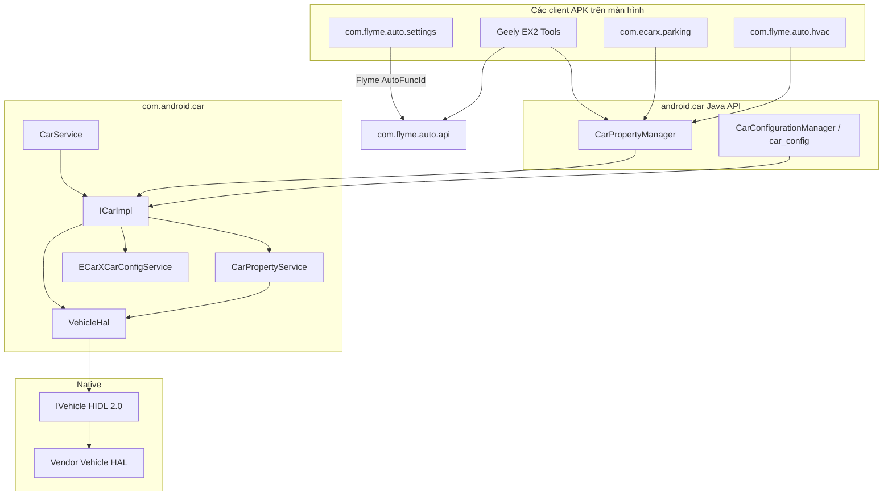
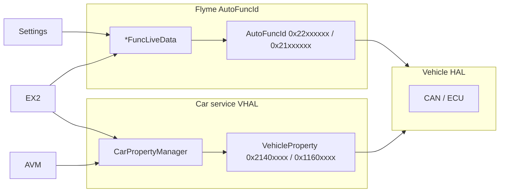

# com.android.car — Hướng dẫn phân tích APK (Car service)

Tài liệu này mô tả **Car service** của hệ thống (`com.android.car`) từ màn hình trung tâm (head unit) Geely **IHU629G**: cách nó kết nối với Vehicle HAL, các Car API services nào được khởi chạy, các VHAL property id nào được định nghĩa trong firmware, và cách nó liên quan đến Flyme Settings / Geely EX2 Tools.

**Quan trọng:** đây **không phải** là ứng dụng UI. APK là một service hệ thống của Android Automotive: cầu nối giữa `IVehicle` (HIDL VHAL) và Java API `android.car.*` (`CarPropertyManager`, `CarAudioManager`, …). Các ứng dụng Flyme mặc định (Settings, HVAC) thường giao tiếp với xe qua **`com.flyme.auto.api`** (`AutoFuncId`, `0x22xxxxxx`), nhưng **cùng một tín hiệu vật lý** thường được nhân bản thành các VHAL property id từ APK này (`VehicleProperty`, `0x2140xxxx` / `0x1160xxxx`).

---

## 0. Tổng quan ứng dụng

| Tham số | Giá trị |
|----------|----------|
| Package | `com.android.car` |
| Tên (Label) | **Car service** |
| versionCode | `28` |
| versionName | `9` |
| minSdk / targetSdk / compileSdk | 28 / 28 / 28 (Android 9) |
| sharedUserId | `android.uid.system` |
| coreApp | `true` |
| Service chính | `com.android.car.CarService` (`singleUser`) |
| Đăng ký trong hệ thống | `ServiceManager.addService("car_service", ICarImpl)` |
| DEX chứa các HAL types / property id | `classes.dex` (~1.4 MB, `VehicleProperty` + HIDL) |
| DEX chứa logic services | `classes2.dex` (~4.6 MB, `ICarImpl`, eCarX extensions) |
| Hằng số `VehicleProperty` | **1833** (vendor-extended VHAL cho Geely/eCarX) |
| Java classes (JADX) | ~1438 |

**Mục đích:** khởi chạy Vehicle HAL, đăng ký Car API, phục vụ các trạng thái property/sensor/audio/power/driving, cộng với các vendor-services của eCarX (cấu hình xe, PDC, Bluetooth, nhận diện khuôn mặt, Baidu power manager).

**Cấu trúc thực thi (theo dex/JADX):**

- `CarService.onCreate()` → `IVehicle.getService()` → `VehicleHal` → `ICarImpl.init()`
- Các client: `Car.createCar()` → `ICar.getCarService("property")` → `CarPropertyService`
- Vendor: `ICar.getCarService("car_config")` → `ECarXCarConfigService`
- Kết nối lại VHAL: `VehicleDeathRecipient` + `vehicleHalReconnected()`

**Các thành phần liên quan (không nằm trong APK, nhưng bắt buộc):**

- Native **Vehicle HAL** (`android.hardware.automotive.vehicle@2.0-service`)
- Flyme **`com.flyme.auto.api`** — lớp song song `AutoFuncId` (xem [flyme-settings-apk.md](./flyme-settings-apk.md))
- **`com.ecarx.parking`** — trình kích hoạt AVM qua VHAL (xem [ecarx-parking-apk.md](./ecarx-parking-apk.md))

---

## 1. Nguồn và artifact

| Tham số | Giá trị |
|----------|----------|
| Nền tảng (nguồn dump) | IHU629G |
| APK gốc (ADBAppControl) | `downloads/250060 IHU629G/Car service (com.android.car) [v.9].apk` |
| Bản sao cục bộ | `.tmp/android-car.apk` |
| APK đã giải nén | `.tmp/android-car-apk/` |
| JADX | `.tmp/android-car-jadx/` |

### Lấy APK từ thiết bị

```bash
adb shell pm path com.android.car
adb pull /system/priv-app/CarService/CarService.apk .tmp/android-car.apk
```

### Giải nén và tìm kiếm

```powershell
Copy-Item -LiteralPath ".tmp\android-car.apk" -Destination ".tmp\android-car.zip"
Expand-Archive -LiteralPath .tmp\android-car.zip -DestinationPath .tmp\android-car-apk -Force

$dexdump = (Get-ChildItem "$env:LOCALAPPDATA\Android\Sdk\build-tools" -Recurse -Filter "dexdump.exe" | Select-Object -First 1).FullName
& $dexdump -d .tmp\android-car-apk\classes.dex | Select-String "PERF_VEHICLE_SPEED|LIGHTINSIDE_ATMOSPHERE"
```

**JADX / jadx-gui** — công cụ chính cho `ICarImpl`, `CarPropertyService`, `ECarXCarConfigService`, `VehicleProperty`.

---

## 2. Kiến trúc



### 2.1 Vòng đời của `CarService`

1. `onCreate()` — đợi `IVehicle.getService()` (đến 10s khi kết nối lại).
2. `new ICarImpl(context, vehicle, …)` — khởi tạo toàn bộ sub-services.
3. `ICarImpl.init()` → `VehicleHal.init()` → `init()` của mỗi `CarServiceBase`.
4. `ServiceManager.addService("car_service", mICarImpl)` — điểm vào cho `Car.createCar()`.
5. `linkToDeath` vào VHAL; khi HAL bị crash — thực hiện reconnect và `vehicleHalReconnected()`.
6. Property `sys.com.android.car.PID` — phát hiện khởi động lại Car service (`CarService.sHasCrashed`).

### 2.2 Car API — tên của services (`ICarImpl.getCarService`)

| Tên | Cài đặt thực tế (Implementation) | Mục đích |
|-----|------------|------------|
| `property` | `CarPropertyService` | Đọc/ghi VHAL, đăng ký lắng nghe (subscribe) |
| `sensor` | `CarPropertyService` | (alias) |
| `hvac` / `cabin` / `info` / `vendor_extension` | `CarPropertyService` | (alias) |
| `car_config` | `ECarXCarConfigService` | Các feature flag cấu hình xe của eCarX |
| `audio` | `CarAudioService` | Định tuyến âm thanh (routing), các phân vùng (zones) |
| `power` | `CarPowerManagementService` | Quản lý năng lượng (Power policy), suspend |
| `drivingstate` | `CarDrivingStateService` | Trạng thái lái (UX restrictions input) |
| `uxrestriction` | `CarUxRestrictionsManagerService` | Hạn chế UI khi đang di chuyển |
| `package` | `CarPackageManagerService` | Chặn ứng dụng (App blocking) |
| `car_bluetooth` | `ECarxBluetoothService` | Chính sách Bluetooth (trên IHU629G nhánh MTK bị tắt) |
| `diagnostic` | `CarDiagnosticService` | OBD / diagnostic HAL |
| `configuration` | `CarConfigurationService` | JSON cấu hình xe |
| `cluster_service` | `InstrumentClusterService` | Bảng điều khiển (Instrument cluster) |
| `app_focus` | `AppFocusService` | Focus của navigation/giọng nói |
| `vehicle_map_subscriber_service` | `VmsSubscriberService` | VMS |

**Internal** (`getCarInternalService`): `internal_input`, `system_activity_monitoring`.

---

## 3. Các vendor extensions eCarX / BICV

Bên trên AOSP Car service trên IHU629G đã được bổ sung các class (package `com.android.car`, `classes2.dex`):

| Class | Vai trò |
|-------|------|
| `ECarXCarConfigService` | `car_config`: mã cấu hình xe (`CMD_*`), đăng ký theo dõi ignition/gear/night mode/atmosphere, đồng bộ `LocalConfig` |
| `EcarXUpdateLocalConfigService` | Cập nhật cấu hình cục bộ với VHAL (không dành cho nền tảng G2/HL) |
| `G2UpdateLocalConfigService` | Tương tự dành cho sản phẩm có `ro.product.name` = `BDS3928` / `BDS3930` |
| `ECarxBluetoothService` | Chính sách Bluetooth của eCarX |
| `ECarXPhoneStatusService` | Trạng thái điện thoại ↔ VHAL |
| `PDCService` | Cảm biến đỗ xe: lắng nghe property radar/PDC, gửi broadcast khi thay đổi chế độ |
| `FaceRecognitionService` | Tích hợp Face ID / VIMS |
| `BDSystemService` / `BDPowerManagerService` | Quản lý nguồn / Baidu |
| `AutoTimeService` | Đồng bộ thời gian SNTP/GPS |
| `AmbienceLampService` | Đồng bộ hóa đèn ambient light với chế độ lái / tốc độ hệ thống (**có class này, nhưng chưa được kết nối trong `ICarImpl` init**) |

### 3.1 `ECarXCarConfigService` — Các property quan trọng

Đăng ký lắng nghe khi khởi động (`REQUIRED_PROPERTIES`):

| VehicleProperty | Hex | Mục đích |
|-----------------|-----|------------|
| `IGNITION_STATE` | AOSP | Tình trạng khởi động (Ignition) |
| `DRIVE_ENGINE_STATUS` | vendor | Tình trạng động cơ |
| `VPOWERINFO_EMSSSM_STATUS` | vendor | EMS |
| `GEAR_SELECTION` | AOSP | Hộp số |
| `BODY_LIGHT_WIDTHLAMP_SW` | vendor | Đèn sương mù/đèn định vị |
| `NIGHT_MODE` | AOSP | Chế độ ngày/đêm |
| `MCU_USB_MODE_SELECT` | vendor | Chế độ USB |
| `MCU_POWER_SLEEP_MODE` | vendor | Sleep |
| `AUTO_HOLD_SWITCH_STATUS` | `0x2140a161` | Auto Hold |
| `MCU_RET_BLE_VER_INFO` | vendor | Phiên bản BLE |
| `EPTREADY` | vendor | Sẵn sàng EV |

Atmosphere / display (`POSITION_LIGHT_CTRL_PROPS`): `LIGHTINSIDE_ATMOSPHERE_LAMP_*`, `BODY_LIGHT_ATMO_*`, `MCU_ATMOSPHERE_LIGHT_*`, `SCREEN_LIGHT_AUTO`, `ATE_SCREEN_BRIGHT`.

**Các chế độ lái trong config service** (hằng số nội bộ, không phải mã Hex Flyme):

| Hằng số | Giá trị |
|-----------|----------|
| `DRIVE_NORMAL` | 0 |
| `DRIVE_CONFORT` | 1 |
| `DRIVE_SPORT` | 2 |
| `DRIVE_ECO` | 3 |
| `DRIVE_OFFROAD` | 4 |
| `DRIVE_SNOW` | 5 |

### 3.2 `PDCService`

Lắng nghe các property về radar/PDC (bao gồm `RRS_MODE_AND_BUTTON_PRESS`, `DRIVE_RADAR_OBSTACLE_DISTANCE_INFO`, `GEAR_SELECTION`). Khi PDC hoạt động — gửi broadcast `Intent` (tích hợp với launcher / overlay). Liên kết với các radar id giống hệt với APK AVM đang sử dụng.

---

## 4. Manifest — Các thành phần có UI

| Thành phần | Mục đích |
|-----------|------------|
| `CarService` | Service chính của hệ thống |
| `PerUserCarService` | Per-user car helpers |
| `ActivityBlockingActivity` | Màn hình khóa ứng dụng (UX restrictions) |
| `CarNightService$NullActivity` | Màn hình rỗng (Stub) cho chế độ ban đêm |
| `LowPowerActivity` / `LowBatteryActivity` | Overlay pin yếu / power limit |
| `UsbPowerStActivity` | Hộp thoại USB power (được gọi từ `ECarXCarConfigService`) |

APK này cũng **khai báo** tất cả `android.car.permission.*` — chúng được cấp cho các client hệ thống và priv-app.

---

## 5. VHAL / VehicleProperty id

Danh sách đầy đủ — `android.hardware.automotive.vehicle.V2_0.VehicleProperty` trong `classes.dex` (**1833** id). Dưới đây là các property liên quan đến Geely EX2 Tools và các APK lân cận.

### 5.1 Tốc độ, pin, nhiệt độ

| Tên | int | Hex | Kiểu dữ liệu | Ghi chú |
|-----|-----|-----|-----|------------|
| `PERF_VEHICLE_SPEED` | `291504647` | `0x11600207` | float | km/h (được sử dụng trong EX2 Tools) |
| `PERF_VEHICLE_SPEED_DISPLAY` | `291504648` | `0x11600208` | float | Bảng điều khiển, × 0.05625 trong AVM |
| `ED_EV_BATTERY_PERCENTAGE` | `557885165` | `0x2140a6ed` | float | OEM SOC 0–100 |
| `EV_BATTERY_LEVEL` | `291504905` | `0x11600309` | float | AOSP fallback |
| `AC_AMBIENT_TEMP` | `557884279` | `0x2140a377` | int | Decode: `(raw - 80) / 2` °C |
| `AC_INSIDE_TEMP` | `557884281` | `0x2140a379` | int | Tương tự trên |
| `ENV_OUTSIDE_TEMPERATURE` | `291505923` | `0x11600703` | float | AOSP fallback |

### 5.2 Chế độ lái (Tầng VHAL)

Flyme Settings ghi **`DM_FUNC_DRIVE_MODE_SELECT`** (`0x22010100`) thông qua `AutoFuncId` — **id này không tồn tại** trong `VehicleProperty`. Ở tầng VHAL trong Car service:

| Tên | int | Hex | Ghi chú |
|-----|-----|-----|------------|
| `AP_DRIVE_MODE_SET_STATUS` | `557854720` | `0x21403000` | Trạng thái drive mode (AP) |
| `PHEV_DRV_MODE_SET` | `557850837` | `0x214020d5` | Ghi chế độ PHEV |
| `PHEV_DRV_MODE` | `557850839` | `0x214020d7` | Chế độ hiện tại |
| `DRIVE_MODE_MEMORY_ON` | `557850658` | `0x21402022` | Ghi nhớ chế độ |
| `DRIVE_AUTO_HOLD` | `557850763` | `0x2140208b` | Auto Hold (VHAL) |
| `AUTO_HOLD_SWITCH_STATUS` | `557883745` | `0x2140a161` | Nút công tắc Auto Hold |

**Thực tế cho EX2 Tools:** ghi/đọc chính (primary) — qua Flyme API (`updateFuncValueForce`); VHAL `0x22010100` — dự phòng ghi/đọc qua `CarPropertyManager`.

### 5.3 Đèn Ambient light (Tầng VHAL)

Công tắc tổng của Flyme (master switch): **`BCM_FUNC_LIGHT_ATMOSPHERE_LAMPS`** (`0x21051000`) — trong `VehicleProperty` **không có**. Các VHAL id gần nhất:

| Tên | int | Hex |
|-----|-----|-----|
| `LIGHTINSIDE_ATMOSPHERE_LAMP_SWITCH` | `557885013` | `0x2140a655` |
| `LIGHTINSIDE_ATMOSPHERE_LAMP_MODE` | `557883544` | `0x2140a078` |
| `LIGHTINSIDE_ATMOSPHERE_LAMP_MODE_3B` | `557883539` | `0x2140a073` |
| `MCU_ATMOSPHERE_LIGHT_WELCOME` | `557885025` | `0x2140a661` |
| `MCU_ATMOSPHERE_LIGHT_DRIVE_COORDINATED` | `557885015` | `0x2140a657` |
| `MCU_ATMOSPHERE_LIGHT_SPEED_COORDINATED` | `557885016` | `0x2140a658` |
| `AL_MODE_SET` | `557885459` | `0x2140a813` |
| `AL_BRIGHTNESS_LEVEL_ADJUST` | `557885458` | `0x2140a812` |

### 5.4 AVM / camera (giao thoa với `com.ecarx.parking`)

| Tên | int | Hex | Ghi chú |
|-----|-----|-----|------------|
| `AVM_DISPLAY_SWITCH_FROM` | `557885012` | `0x2140a654` | Lệnh mở/đóng AVM |
| `AVM_DISPLAY_SWITCH` | `557862976` | `0x21405000` | |
| `AVM_CAMERA_POWER_ON` | `557862996` | `0x21405054` | Trạng thái camera |
| `AVM_OVERSPEED_WARNING` | `557863009` | `0x21405061` | |
| `PERF_VEHICLE_SIAVM_SWITCH` | xem tài liệu ecarx | `0x2140a402` | Trạng thái AVM on/off |

Bảng đầy đủ các AVM property — xem trong [ecarx-parking-apk.md §5](./ecarx-parking-apk.md).

### 5.5 ADAS / HVAC / Các mục khác (trích đoạn)

Trong `VehicleProperty` còn định nghĩa hàng trăm vendor id: `ADAS_*`, `HVAC_*`, `IPK_*`, `DVR_*`, `VENDOR_*`, `PAS_FUNC_*` (PDC), `BODY_*`, `DRIVE_*`. Tìm kiếm theo tên — qua JADX hoặc:

```powershell
Select-String -Path .tmp\android-car-jadx\sources\android\hardware\automotive\vehicle\V2_0\VehicleProperty.java -Pattern "ATMOSPHERE|DRIVE_MODE|REGENERATION"
```

---

## 6. Hai lớp (layer) truy cập hệ thống xe



| Tác vụ | Hướng đề xuất | Dự phòng (Fallback) |
|--------|-------------------|----------|
| Drive mode | Flyme `DM_FUNC_DRIVE_MODE_SELECT` | VHAL `0x22010100` / `PHEV_DRV_MODE_SET` |
| Bật/tắt Ambient light | Flyme `BCM_FUNC_LIGHT_ATMOSPHERE_LAMPS` | VHAL `LIGHTINSIDE_ATMOSPHERE_LAMP_SWITCH` |
| Tốc độ (Speed) | VHAL `PERF_VEHICLE_SPEED` | — |
| Pin (Battery SOC) | VHAL `ED_EV_BATTERY_PERCENTAGE` | `EV_BATTERY_LEVEL` |
| Nhiệt độ ngoài trời | VHAL `AC_AMBIENT_TEMP` | `ENV_OUTSIDE_TEMPERATURE` |
| Mở AVM | VHAL `AVM_DISPLAY_SWITCH_FROM` | EAS / `com.ecarx.parking` |
| Tình trạng tính năng | `car_config` / `ECarXCarConfigService` | `AutoCarConfig` trong Flyme API |

---

## 7. Sơ đồ các class trong APK (Các điểm vào - Entry points)

| Class | DEX | Mục đích |
|-------|-----|------------|
| `CarService` | 2 | Application Service, VHAL connect |
| `ICarImpl` | 2 | Facade `ICar.Stub`, danh sách sub-services |
| `VehicleHal` | 2 | Trình thu thập HAL: property, power, input, vms, diagnostic |
| `PropertyHalService` | 2 | Subscribe/set/get → `IVehicle` |
| `CarPropertyService` | 2 | `ICarProperty.Stub`, permissions, listeners |
| `PropertyHalServiceIds` | 2 | Mapping AOSP property → `android.car.permission.*` |
| `VehicleProperty` | 1 | **Sổ tay tất cả các property id** |
| `ECarXCarConfigService` | 2 | Vendor config + `car_config` API |
| `CarDrivingStateService` | 2 | Trạng thái lái cho UX |
| `CarAudioService` | 2 | Phân vùng âm thanh / routing |
| `PDCService` | 2 | Các sự kiện kiểm soát khoảng cách đỗ xe (Park distance control) |
| `CarPowerManagementService` | 2 | Shutdown / garage mode hooks |

---

## 8. Làm thế nào để tìm property id

1. **JADX** — `VehicleProperty.java`, tìm kiếm theo tiền tố (prefix) (`ADAS_`, `LIGHTINSIDE_`, …).
2. **Class tiêu thụ (consumer)** — dùng `grep` với `VehicleProperty.TÊN` trong `.tmp/android-car-jadx/sources/com/android/car/`.
3. **dexdump** — tên chuỗi trong `classes.dex`:
   ```powershell
   & $dexdump -d .tmp\android-car-apk\classes.dex | Select-String "ATMOSPHERE_LAMP"
   ```
4. **Int → hex** — property id trong Java là `int`; hex = `0x{value:X}` (trên Windows PowerShell).
5. **Runtime** — trên thiết bị:
   ```bash
   adb shell dumpsys android.car.ICar --services
   adb shell dumpsys android.car.ICar --list-properties
   ```

### Mẫu mã đọc giá trị qua CarPropertyManager (Kotlin)

```kotlin
val car = Car.createCar(context)
val mgr = car.getCarManager(Car.PROPERTY_SERVICE) as CarPropertyManager
val speed = mgr.getFloatProperty(0x11600207, 0)  // PERF_VEHICLE_SPEED
```

Yêu cầu các quyền signature/priv permissions (`android.car.permission.CAR_*`) hoặc UID của hệ thống.

---

## 9. Gỡ lỗi (Debugging)

```bash
# Car service / VHAL
adb logcat | findstr /i "CarService Property.service VehicleHal CarConfigService"

# Kiểm tra đăng ký service
adb shell service list | findstr car

# Crash VHAL
adb logcat | findstr /i "Vehicle HAL died SysProp_CarService_pid"

# Property write/read
adb logcat | findstr /i "setProperty getProperty onPropertyChange"
```

| Triệu chứng | Nguyên nhân có thể |
|---------|-------------------|
| `IllegalStateException: Vehicle HAL service is not available` | VHAL không hoạt động / không có `IVehicle` |
| Lỗi `CarPropertyManager` SecurityException | Thiếu quyền `android.car.permission.*` |
| Flyme write OK, VHAL read stale | Khác layer (`AutoFuncId` vs `VehicleProperty`) |
| Property `null` / `STATUS_UNAVAILABLE` | Không được hỗ trợ trên thiết lập hiện tại — hãy kiểm tra `car_config` |
| `CarService has crashed` | Service khởi động lại sau sự cố (`sHasCrashed=true`) |

---

## 10. Liên kết với Geely EX2 Tools

Các hằng số trong `VhalConstants.kt` đã được chuẩn hóa với `VehicleProperty` của APK này:

| EX2 Tools | Hex | VehicleProperty |
|-----------|-----|-----------------|
| `PROP_PERF_VEHICLE_SPEED` | `0x11600207` | `PERF_VEHICLE_SPEED` |
| `PROP_ED_EV_BATTERY_PERCENTAGE` | `0x2140a6ed` | `ED_EV_BATTERY_PERCENTAGE` |
| `PROP_EV_BATTERY_LEVEL` | `0x11600309` | `EV_BATTERY_LEVEL` |
| `PROP_DM_FUNC_DRIVE_MODE_SELECT` | `0x22010100` | Flyme only (không có trong Car service) |
| `PROP_BCM_FUNC_LIGHT_ATMOSPHERE_LAMPS` | `0x21051000` | Flyme only (không có trong Car service) |

Temperature reader sử dụng `AC_AMBIENT_TEMP` / `AC_INSIDE_TEMP` từ danh mục này.

---

*Tài liệu này dựa trên quá trình phân tích (dump/decompile) APK `com.android.car` v9 (versionCode 28, IHU629G). Khi đổi firmware (bản ROM), vui lòng thực hiện phân tích lại vì vendor `VehicleProperty` và tập hợp eCarX-services có thể thay đổi.*
