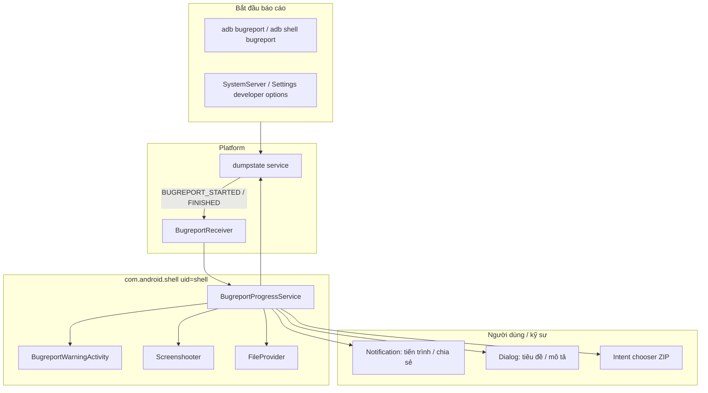

# com.android.shell — Hướng dẫn phân tích APK (Shell / Оболочка)

Tài liệu này mô tả package hệ thống **Shell** (`com.android.shell`) từ màn hình trung tâm (head unit) Geely **IHU629G**: có gì bên trong APK, cách nó liên kết với `adb shell`, và cách nó triển khai UX cho **bugreport** (báo cáo lỗi).

**Quan trọng:** đây **không phải** là Flyme/eCarX và **không phải** Car/VHAL. APK này là một thành phần tiêu chuẩn của **AOSP Android 9** với `sharedUserId="android.uid.shell"`. Trên thiết bị đầu cuối, nó chạy dưới quyền UID **shell (2000)** — tương tự như command line (shell) tương tác `adb shell`. Bản thân file thực thi `/system/bin/sh` **không** nằm trong APK; APK này chỉ chứa các thành phần Java cho bugreport và FileProvider.

---

## 0. Tổng quan ứng dụng

| Tham số | Giá trị |
|----------|----------|
| Package | `com.android.shell` |
| Tên (Label - Tiếng Nga) | **Оболочка** |
| Tên (Label - Tiếng Anh) | **Shell** |
| versionCode | `28` |
| versionName | `9` |
| minSdk / targetSdk / compileSdk | 28 / 28 / 28 (Android 9) |
| sharedUserId | `android.uid.shell` (UID **2000**) |
| coreApp | `true` |
| Application | không được khai báo (mặc định là `Application`) |
| Launcher Activity | **không có** |
| DEX | chỉ một `classes.dex` (~435 class, **19** class `com.android.shell.*`) |
| Kích thước APK | ~713 KB |

**Mục đích trên thiết bị:**

1. **Bugreport UX** — thông báo về tiến trình/hoàn tất của `dumpstate`, hộp thoại cảnh báo về dữ liệu nhạy cảm, biểu mẫu "tên / tiêu đề / mô tả", chụp ảnh màn hình, chia sẻ file ZIP.
2. **Tích hợp với dumpstate** — thông qua binder `android.os.IDumpstate` / `IDumpstateListener` (system service `dumpstate`).
3. **DocumentsProvider** (tùy chọn) — `BugreportStorageProvider` để xem các báo cáo đã lưu (mặc định **bị tắt**).
4. **FileProvider** — `content://com.android.shell/...` dùng để chia sẻ an toàn các tệp báo cáo với các ứng dụng khác.

**Những gì APK không làm:**

- Không phải là "launcher của shell" và không hiển thị trong danh sách ứng dụng.
- Không chứa các logic của xe, VHAL, Flyme API.
- Không thay thế `adb shell` — chỉ là một package hệ thống đi kèm với cùng UID.

**Cấu trúc thực thi (theo dex / manifest):**

| Lớp (Layer) | Thành phần |
|------|-----------|
| Platform | `dumpstate` (native), `ctl.start` / `ctl.stop bugreport` |
| Binder | `IDumpstate`, `IDumpstateListener`, `IDumpstateToken` |
| Service | `BugreportProgressService` |
| Receivers | `BugreportReceiver`, `RemoteBugreportReceiver` |
| UI | `BugreportWarningActivity`, notification actions, `BugreportInfoDialog` |
| Support libs | AndroidX Lifecycle, Support v4 (`FileProvider`, fragments) |

---

## 1. Nguồn và artifact

| Tham số | Giá trị |
|----------|----------|
| Nền tảng (nguồn dump) | IHU629G |
| APK gốc (ADBAppControl) | `downloads/250060 IHU629G/Оболочка (com.android.shell) [v.9].apk` |
| Bản sao cục bộ | `.tmp/android-shell.apk` |
| APK đã giải nén | `.tmp/android-shell-apk/` |
| JADX | `.tmp/android-shell-jadx/` |

> **PowerShell:** trong tên tệp có chứa `[v.9]` — hãy sử dụng cờ `-LiteralPath`, nếu không dấu ngoặc vuông sẽ bị hiểu nhầm là wildcard.

### Lấy APK từ thiết bị

```bash
adb shell pm path com.android.shell
adb pull /system/priv-app/Shell/Shell.apk .tmp/android-shell.apk
```

Đường dẫn chính xác trên firmware có thể khác nhau (`/system/app/`, `/system/priv-app/`).

### Giải nén và tìm kiếm

```powershell
Copy-Item -LiteralPath ".tmp\android-shell.apk" -Destination ".tmp\android-shell.zip"
Expand-Archive -LiteralPath .tmp\android-shell.zip -DestinationPath .tmp\android-shell-apk -Force

$aapt = (Get-ChildItem "$env:LOCALAPPDATA\Android\Sdk\build-tools" -Recurse -Filter "aapt.exe" | Select-Object -First 1).FullName
& $aapt dump badging .tmp\android-shell.apk
& $aapt dump xmltree .tmp\android-shell.apk AndroidManifest.xml

$dexdump = (Get-ChildItem "$env:LOCALAPPDATA\Android\Sdk\build-tools" -Recurse -Filter "dexdump.exe" | Select-Object -First 1).FullName
& $dexdump -d .tmp\android-shell-apk\classes.dex | Select-String "Lcom/android/shell/|IDumpstate|BUGREPORT"
```

**JADX** — dùng để đọc `BugreportProgressService`, `BugreportReceiver` (mã nguồn tương ứng với AOSP `packages/apps/Shell`, nhánh Android 9).

---

## 2. Kiến trúc của bugreport



**Kịch bản điển hình:**

1. Nền tảng (Platform) khởi chạy `dumpstate` và gửi intent `com.android.internal.intent.action.BUGREPORT_STARTED`.
2. `BugreportReceiver` sẽ khởi chạy `BugreportProgressService`.
3. Service liên kết với `IDumpstate`, hiển thị thông báo tiến trình (progress-notification), nếu cần thiết — hiển thị `BugreportWarningActivity` (chỉ hiển thị một lần, xem `BugreportPrefs`).
4. Khi hoàn thành — gửi `BUGREPORT_FINISHED`, thêm title/description vào file ZIP (`addDetailsToZipFile`), tùy chọn chụp màn hình (`Screenshooter.takeScreenshot()`).
5. Gửi thông báo có kèm nút **Share** (Chia sẻ) → Mở `application/vnd.android.bugreport` thông qua `FileProvider`.

**Hủy bỏ:** Hành động `android.intent.action.BUGREPORT_CANCEL` → gọi lệnh `setprop ctl.stop bugreport`, xóa các ảnh chụp màn hình tạm thời.

---

## 3. Các thành phần (AndroidManifest)

| Thành phần | exported | permission | Mục đích |
|-----------|----------|------------|------------|
| `android.support.v4.content.FileProvider` | `false` | — | `authorities="com.android.shell"`, paths `@xml/file_provider_paths` |
| `.BugreportStorageProvider` | `true` | `MANAGE_DOCUMENTS` | Documents UI; mặc định **`android:enabled="false"`** |
| `.BugreportWarningActivity` | `false` | — | Hộp thoại cảnh báo "báo cáo chứa thông tin nhạy cảm" + hộp kiểm "Không hiển thị lại" |
| `.BugreportReceiver` | implicit | `DUMP` | `BUGREPORT_STARTED`, `BUGREPORT_FINISHED` |
| `.RemoteBugreportReceiver` | implicit | `DUMP` | `REMOTE_BUGREPORT_FINISHED` |
| `.BugreportProgressService` | `false` | — | Logic chính về quản lý tiến trình, file ZIP, thông báo |

### 3.1 Broadcast / intent actions (từ dex)

| Action | Chiều di chuyển | Vai trò |
|--------|-------------|------|
| `com.android.internal.intent.action.BUGREPORT_STARTED` | platform → receiver | Khởi động service |
| `com.android.internal.intent.action.BUGREPORT_FINISHED` | platform → receiver | Hoàn tất dumpstate |
| `com.android.internal.intent.action.REMOTE_BUGREPORT_FINISHED` | platform → receiver | Báo cáo lỗi từ xa (enterprise) |
| `android.intent.action.BUGREPORT_SHARE` | notification → service | Mở chooser để chia sẻ |
| `android.intent.action.BUGREPORT_CANCEL` | notification → service | Hủy bỏ quá trình |
| `android.intent.action.BUGREPORT_SCREENSHOT` | notification → service | Chụp ảnh màn hình |
| `android.intent.action.BUGREPORT_INFO_LAUNCH` | notification → service | Mở hộp thoại nhập title/description |
| `android.intent.action.REMOTE_BUGREPORT_DISPATCH` | receiver → platform | Gửi mã hash báo cáo từ xa |

**Các Extra của Intent:**

| Extra | Sử dụng |
|-------|----------------|
| `android.intent.extra.BUGREPORT` | Kiểu `Parcelable` → `BugreportInfo` |
| `android.intent.extra.SCREENSHOT` | URI của ảnh chụp màn hình |
| `android.intent.extra.REMOTE_BUGREPORT_HASH` | mã băm (hash) của báo cáo từ xa |
| `android.intent.extra.INTENT` | intent lồng bên trong dùng cho warning activity |

**MIME type:** `application/vnd.android.bugreport`

---

## 4. Các class trong `com.android.shell` (19 class)

| Class | Mục đích |
|-------|------------|
| `BugreportProgressService` | Service trung tâm: lắng nghe dumpstate, notification, zip, share |
| `BugreportProgressService.BugreportInfo` | Trạng thái của một báo cáo (`Parcelable`) |
| `BugreportProgressService.DumpstateListener` | Bộ khung (stub) của `IDumpstateListener` |
| `BugreportProgressService.BugreportInfoDialog` | Hộp thoại UI title / description / save |
| `BugreportProgressService.ScreenshotHandler` | Xử lý chụp ảnh màn hình |
| `BugreportProgressService.ServiceHandler` | Message loop của service |
| `BugreportReceiver` | Nhận platform broadcast để start/stop |
| `BugreportReceiver$1` | AsyncTask / chạy nền (background work) |
| `RemoteBugreportReceiver` | Xử lý hoàn tất báo cáo từ xa |
| `BugreportWarningActivity` | Cảnh báo quyền riêng tư (Privacy warning) trước khi chia sẻ |
| `BugreportStorageProvider` | Kế thừa `FileSystemProvider` → `com.android.shell.documents` |
| `BugreportPrefs` | Lưu trữ SharedPreferences `bugreports` / khóa `warning-state` |
| `Screenshooter` | Phương thức `takeScreenshot()` → `Bitmap`, lưu PNG + rung (vibrate) |
| `-$$Lambda$...` | Các synthetic lambda sinh tự động |

### 4.1 `BugreportInfo` — các trường trạng thái

| Trường | Ý nghĩa |
|------|--------|
| `id` | ID của báo cáo (dùng cho notification tag) |
| `pid` | PID của tiến trình dumpstate |
| `progress`, `max`, `realProgress`, `realMax` | Thông tin tiến trình hiển thị trên thông báo |
| `lastUpdate`, `formattedLastUpdate` | Thời điểm cập nhật cuối cùng |
| `finished` | Đã hoàn tất lệnh dumpstate |
| `bugreportFile` | Đường dẫn đến tệp báo cáo |
| `name`, `title`, `description` | Siêu dữ liệu (Metadata) nhập bởi người dùng |
| `shareDescription` | Đoạn text truyền qua intent khi share |
| `addingDetailsToZip`, `addedDetailsToZip` | Giai đoạn thêm nội dung vào ZIP |
| `screenshotFiles`, `screenshotCounter` | Lưu tạm các ảnh màn hình (`screenshot-*.png`) |
| `context` | Biến Context |

Phương thức (Methods): `addScreenshot`, `renameScreenshots`, `getPathNextScreenshot`, `readFile` / `writeFile` (metadata phụ).

### 4.2 Lưu trữ trên thiết bị

| Đường dẫn / prefs | Nội dung |
|--------------|------------|
| `{filesDir}/bugreports/` | Thư mục làm việc chứa báo cáo (chuỗi `bugreports` trong dex) |
| `SharedPreferences` `"bugreports"` | Khóa `warning-state` — cờ xác định có hiển thị privacy dialog nữa không |
| `dumpstate.*` | Tiền tố tên tệp dumpstate |
| `screenshot-*.png` | Ảnh chụp màn hình lưu tạm |
| `com.android.shell.documents` | Authority cho DocumentsProvider (nếu được bật) |

Các flag của Application: `defaultToDeviceProtectedStorage`, `directBootAware` — hỗ trợ chạy trước khi credential storage được mở khóa.

---

## 5. Tài nguyên UI

### Bố cục (Layouts)

| Tài nguyên | Mục đích |
|----------|------------|
| `layout/confirm_repeat` | Hộp kiểm "Không hiển thị lại" |
| `layout/dialog_bugreport_info` | Các trường nhập name / title / description |
| `drawable/ic_bug_report_black_24dp` | Biểu tượng cho notification |
| `xml/file_provider_paths` | Định nghĩa path cho FileProvider |

### Chuỗi ký tự (RU, trích xuất)

| id | Tiếng Nga (RU) |
|----|-----|
| `app_label` | Оболочка |
| `bugreport_notification_channel` | Отчеты об ошибках |
| `bugreport_in_progress_title` | Создание отчета об ошибке #%d… |
| `bugreport_finished_title` | Отчет об ошибке #%d сохранен |
| `bugreport_confirm` | Предупреждение о конфиденциальных данных в логах |
| `bugreport_screenshot_action` | Сделать скриншот |
| `bugreport_info_action` | Детали |

APK có đầy đủ các locale hỗ trợ: ar, bg, de, en, es, fr, hi, ja, ko, **ru**, uk, zh-CN, zh-TW, v.v.

---

## 6. Quyền (Permissions)

Trong manifest chứa **~120** quyền `uses-permission` — đó là sự phản chiếu (mirror) quyền của UID `shell` để thực hiện các thao tác qua `adb shell` và system API. Phân nhóm:

| Nhóm | Ví dụ |
|--------|---------|
| Trình quản lý gói (Package manager) | `INSTALL_PACKAGES`, `DELETE_PACKAGES`, `CLEAR_APP_USER_DATA`, `FORCE_STOP_PACKAGES` |
| Cấu hình (Settings) | `WRITE_SETTINGS`, `WRITE_SECURE_SETTINGS`, `CHANGE_CONFIGURATION` |
| Đầu vào / hiển thị (Input / display) | `INJECT_EVENTS`, `INTERNAL_SYSTEM_WINDOW`, `READ_FRAME_BUFFER` |
| Lưu trữ (Storage) | `READ/WRITE_EXTERNAL_STORAGE`, `MOUNT_UNMOUNT_FILESYSTEMS` |
| Cuộc gọi / Danh bạ (Legacy) | `CALL_PHONE`, `READ_CONTACTS`, `SEND_SMS` |
| Gỡ lỗi / kết xuất dữ liệu (Debug / dump) | `DUMP`, `SET_DEBUG_APP`, `READ_INPUT_STATE` |
| Người dùng (Users / cross-user) | `INTERACT_ACROSS_USERS`, `CREATE_USERS` |
| Quản lý quyền (Permissions mgmt) | `GRANT_RUNTIME_PERMISSIONS`, `REVOKE_RUNTIME_PERMISSIONS` |
| Nguồn / USB (Power / USB) | `DEVICE_POWER`, `MANAGE_USB` |
| Thống kê (App ops / usage) | `PACKAGE_USAGE_STATS`, `GET_APP_OPS_STATS`, `WATCH_APPOPS` |

Trên Geely EX2 Tools các quyền này **không tự động kế thừa** cho các ứng dụng thông thường — chúng chỉ hoạt động đối với các tiến trình chạy với `android.uid.shell` / root / system.

---

## 7. Giao tiếp với ADB và Geely EX2 Tools

### 7.1 ADB

```bash
# Kiểm tra UID của package
adb shell dumpsys package com.android.shell | findstr userId

# Báo cáo lỗi (platform sẽ gọi UI của com.android.shell)
adb bugreport
adb shell bugreport /sdcard/bugreport.zip

# Kiểm tra các thành phần của ứng dụng
adb shell dumpsys activity broadcasts com.android.shell
adb shell dumpsys activity services com.android.shell
```

Các lệnh `adb shell pm`, `am`, `cmd` được thực thi dưới quyền **shell** và dựa vào các platform API tương ứng; APK `com.android.shell` cần thiết chủ yếu cho quá trình **bugreport có tính tương tác**, chứ không phải cho mọi lệnh shell thông thường.

### 7.2 Khác biệt so với các APK hệ thống khác trên IHU629G

| APK | UID | Vai trò |
|-----|-----|------|
| `com.android.shell` | `shell` (2000) | Trải nghiệm người dùng khi bugreport, FileProvider |
| `com.android.car` | `system` | Car service / VHAL (xem [android-car-apk.md](./android-car-apk.md)) |
| `com.flyme.auto.*` | `system` | UI và dịch vụ của Flyme Auto |
| `com.mediatek.thermalmanager` | `system` | Quản lý nhiệt của MTK (xem [mediatek-thermalmanager-apk.md](./mediatek-thermalmanager-apk.md)) |

### 7.3 Tóm tắt ứng dụng thực tế

- APK này là bản **AOSP Pie nguyên bản** — trên thiết bị IHU629G phiên bản được xác định là `versionName=9`, không chứa các chỉnh sửa Flyme trong manifest/dex.
- Về khía cạnh dịch ngược (reverse-engineering) hệ thống xe, APK này **không chứa** property id, CAN hay HVAC — nó chỉ cung cấp cơ sở hạ tầng gỡ lỗi chung.
- Nó hữu ích khi bạn phân tích quá trình **lấy báo cáo lỗi** từ thiết bị (head unit) và xem xét các đường dẫn lưu trữ log trên xe.
- Bạn tuyệt đối không nên xóa/tắt package này trên thiết bị cấu hình cho người dùng thực tế (user-build) nếu không hiểu rõ hệ quả: nó sẽ làm hỏng chức năng UI của báo cáo lỗi (ví dụ thông báo không chạy, hoặc chức năng chia sẻ lỗi).

---

## 8. Tìm kiếm nhanh trong dex

```powershell
$dexdump = (Get-ChildItem "$env:LOCALAPPDATA\Android\Sdk\build-tools" -Recurse -Filter "dexdump.exe" | Select-Object -First 1).FullName

# Tất cả các class của shell
& $dexdump .tmp\android-shell-apk\classes.dex | Select-String "Lcom/android/shell/"

# Các chuỗi về luồng hoạt động bugreport
& $dexdump -d .tmp\android-shell-apk\classes.dex | Select-String "ctl.stop|IDumpstate|bugreports|warning-state"

# Broadcast của hệ thống (Platform broadcasts)
& $dexdump -d .tmp\android-shell-apk\classes.dex | Select-String "BUGREPORT_STARTED|BUGREPORT_FINISHED|REMOTE_BUGREPORT"
```

---

## 9. Tham chiếu / Liên kết hữu ích

- AOSP (Android 9): `packages/apps/Shell` — mã nguồn hoàn toàn khớp về cấu trúc các class.
- Các tài liệu liên quan trong dự án: [android-car-apk.md](./android-car-apk.md), [README.md](./README.md).
