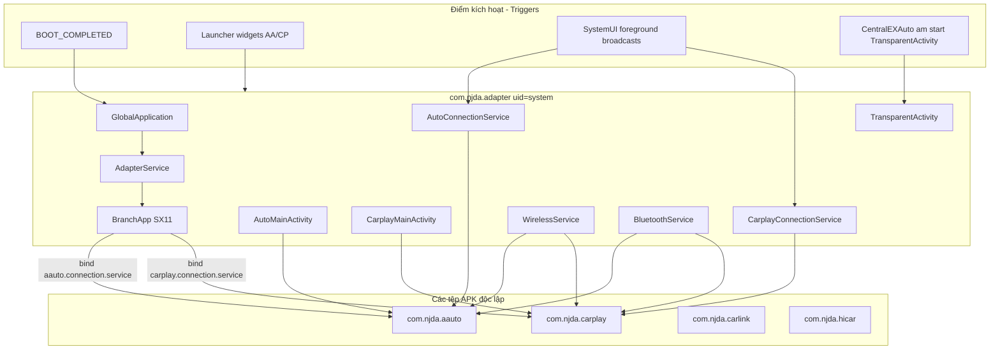

# com.njda.adapter — Hướng dẫn phân tích APK (ConnAdaptor / ca_fix)

Tài liệu này mô tả APK **`ca_fix.apk`** — một bản dựng (build) đã được vá (patched) của bộ chuyển đổi hệ thống **ConnAdaptor** (`com.njda.adapter`) dành cho màn hình trung tâm (head unit) của xe Geely/Flyme (SX11 / IHU629G và các loại tương tự).

**Quan trọng:** đây **không phải** là một ứng dụng người dùng độc lập. Đây là một bản **thay thế trực tiếp (drop-in replacement)** cho ứng dụng gốc `/system/app/ConnAdaptor/ConnAdaptor.apk`: có cùng package, sử dụng `android.uid.system`, đóng vai trò là cầu nối giữa các ngăn xếp (stacks) phản chiếu điện thoại (Android Auto / CarPlay / CarLink / HiCar) và phần mềm của màn hình xe.

Trong nhật ký (log) hệ thống có ghi thẻ **`DADAO_ADAPTOR`**, và biến thuộc tính `sys.dadao.adapter` = versionName.

Bản cài đặt được tải từ Telegram: **`ca_fix.apk`**, version **`1.4.8.260128023317`** (`versionCode=20260128`). Cùng tệp artifact này cũng được phân phối thông qua ứng dụng CentralEXAuto: [`connadaptor.json`](https://raw.githubusercontent.com/swimapps/CentralEXAuto/main/connadaptor.json).

---

## 0. Tổng quan ứng dụng

| Tham số | Giá trị |
|----------|----------|
| Package | `com.njda.adapter` |
| Label | *(để trống trong phần phân tích badging)* — ứng dụng chuyển đổi hệ thống |
| versionCode / versionName | `20260128` / `1.4.8.260128023317` |
| minSdk / targetSdk | 28 / 28 (compileSdk 34) |
| sharedUserId | `android.uid.system` |
| Application | `com.njda.adapter.core.GlobalApplication` |
| Chữ ký (Signature) | AOSP platform testkey (`android@android.com`) |
| Đường dẫn hệ thống (bản gốc) | `/system/app/ConnAdaptor/ConnAdaptor.apk` |
| Tên bản patch từ CentralEXAuto | `ca_fix.apk` |
| MD5 (Từ GitHub manifest) | `d49ab03b18a5c5e21928c59c465394d7` |

**Mục đích:**

- Khởi chạy và duy trì các dịch vụ phản chiếu (trình chiếu) điện thoại lên màn hình;
- Cung cấp AIDL API cho trình khởi chạy (launcher) / SystemUI / các ứng dụng khác trên màn hình;
- Hiển thị giao diện toàn màn hình (fullscreen surfaces) của AA/CarPlay (`AutoMainActivity` / `CarplayMainActivity`);
- Quản lý Bluetooth RFCOMM / phát điểm truy cập Wi-Fi hotspot để kết nối wireless AA/CP;
- Hiển thị các hộp thoại kết nối thông qua lớp `TransparentActivity`.

**Cấu trúc thực thi:** `com.njda.adapter` (là APK này) đóng vai trò làm **client** tương tác với các package độc lập khác:

| Package | Vai trò |
|-------|------|
| `com.njda.aauto` | Ngăn xếp gốc (Native stack) của Android Auto |
| `com.njda.carplay` | Ngăn xếp gốc (Native stack) của CarPlay |
| `com.njda.carlink` | CarLink |
| `com.njda.hicar` | Huawei HiCar |

Nếu không có các file APK bên trên, ConnAdaptor không thể khởi chạy được phiên phản chiếu nào.

---

## 1. Nguồn và artifact

| Tham số | Giá trị |
|----------|----------|
| APK gốc | `ca_fix.apk` (Tải từ Telegram / Downloads) |
| Bản sao cục bộ | `.tmp/ca_fix.apk` |
| APK đã giải nén | `.tmp/ca-fix/apk/` |
| aapt badging / manifest | `.tmp/ca-fix/badging.txt`, `manifest.txt` |
| JADX | `.tmp/ca-fix-jadx/` |
| CentralEXAuto manifest | `https://raw.githubusercontent.com/swimapps/CentralEXAuto/main/connadaptor.json` |

### Quá trình giải nén

```powershell
$apk = "path\to\ca_fix.apk"
Copy-Item -LiteralPath $apk -Destination ".tmp\ca_fix.zip"
Expand-Archive -Path .tmp\ca_fix.zip -DestinationPath .tmp\ca-fix\apk -Force

$aapt = (Get-ChildItem "$env:LOCALAPPDATA\Android\Sdk\build-tools" -Recurse -Filter "aapt.exe" | Select-Object -First 1).FullName
& $aapt dump badging $apk
& $aapt dump xmltree $apk AndroidManifest.xml
```

---

## 2. Kiến trúc



| Tầng (Layer) | Vai trò |
|------|------|
| **ConnAdaptor** | Chịu trách nhiệm tích hợp, kết nối AIDL, vẽ giao diện, kết nối BT/Wi-Fi, hiển thị hội thoại |
| **aauto / carplay / …** | Đảm trách phần giao thức kết nối chiếu màn hình |
| **Flyme launcher / SystemUI** | Hiện widget, đưa app lên foreground (chạy nổi), nhận lệnh từ user |

---

## 3. Các thành phần trong Manifest

### Màn hình (Activities)

| Class | Mục đích |
|-------|------------|
| `view.CarplayMainActivity` | Giao diện Fullscreen cho Surface CarPlay + các thao tác chạm (touch) |
| `view.AutoMainActivity` | Giao diện Fullscreen cho Surface Android Auto + các thao tác chạm (touch) |
| `view.AutoFrxActivity` | Hiển thị phụ Auxiliary/FRX (`com.intent.action.frx`) |
| `view.TransparentActivity` | Activity kích thước 1×1 "vô hình" dùng để gọi hộp thoại Flyme kết nối; Đồng thời đóng vai trò làm công cụ đánh thức từ CentralEXAuto |
| `view.PermissionActivity` | Cửa sổ xin cấp quyền Runtime (như vị trí/mic) |

### Dịch vụ chính (Services)

| Service | Lệnh Intent action | Mục đích |
|---------|---------------|------------|
| `core.AdapterService` | `com.njda.adapter.service` | Đóng vai trò lõi (Core): `BranchApp.init()` |
| `…AutoConnectionService` | `androidauto.connection.service` | Cung cấp AA session API |
| `…AutoDeviceService` | `androidauto.device.service` | Danh sách thiết bị kết nối AA |
| `…CarplayConnectionService` | `carplay.connection.service` | Cung cấp CP session API |
| `…CarplayDeviceService` | `carplay.device.service` | Danh sách thiết bị kết nối CP |
| `…WirelessService` | `common.wireless.service` | Kết nối Wi-Fi AP / STA |
| `…BluetoothService` | `common.bluetooth.service` | Ghép nối / kết nối BT RFCOMM |
| `…ResourceService` | `common.resource.service` | Trạng thái ứng dụng chạy nổi Foreground, audio, navi |
| `…AudioStreamService` | `common.audio.service` | Xử lý các luồng âm thanh |
| `…InputService` | `adapter.input.service` | Xử lý các nút nhấn Media / điều khiển vô lăng (steering) |
| `…PowerStateService` | `common.power.service` | Tắt/mở màn hình hiển thị |
| `…SensorService` | `common.sensors.service` | Chế độ đêm / Giao diện UI |
| `…Carlink*` / `…HiCar*` | `carlink.*` / `hicar.*` | CarLink / HiCar |
| `…AdapterMediaBrowserService` | `MediaBrowserService` | Trình duyệt đa phương tiện (Media browser) |
| `…SX11RecoveryMediaService` | `com.njda.adapter.music.recovery` | Khôi phục luồng Media sau khi dùng CarPlay |

### Bộ thu (Receivers)

| Class | Hành động (Actions) |
|-------|---------|
| `core.BootReceiver` | Nhận `BOOT_COMPLETED` (ưu tiên mức độ 1000) → tiến hành khởi chạy `GlobalApplication.startCoreService` |
| `view.AutoWidget` | AppWidget + `com.njda.aauto.widget.broadcast` / theo dõi click |
| `view.CarplayWidget` | AppWidget + `com.njda.carplay.widget.broadcast` / theo dõi click |

---

## 4. Trình tự Boot / Gọi các lớp

```text
BOOT_COMPLETED
  └─ BootReceiver.onReceive
       └─ GlobalApplication.startCoreService
            └─ startService(action=com.njda.adapter.service)
                 └─ AdapterService.onCreate
                      └─ BranchApp.init(context)
                           ├─ check persist.cpaa.enable
                           ├─ AAutoAdapter.init → bind com.njda.aauto
                           ├─ CarplayAdapter.init → bind com.njda.carplay
                           └─ Các module quản lý trên SX11 (BT, wireless, media, resource…)

GlobalApplication.onCreate (lệnh dự phòng lặp lại start):
  LogPrint TAG = DADAO_ADAPTOR
  setprop sys.dadao.adapter = versionName
  startCoreService
```

Mã nguồn trong `BootReceiver`:

```java
public void onReceive(Context context, Intent intent) {
    GlobalApplication.startCoreService(context);
}
```

Mã khởi động phần lõi ứng dụng:

```java
public static void startCoreService(Context context) {
    if (isServiceRunning) return;
    Intent intent = new Intent("com.njda.adapter.service");
    intent.setPackage(context.getPackageName());
    context.startService(intent);
}
```

Các thuộc tính quyết định hành vi ứng dụng (lấy từ cấu hình BranchConfig / code):

| Property (Thuộc tính) | Ý nghĩa |
|----------|-------|
| `persist.cpaa.enable` | Cho phép chạy Android Auto + CarPlay |
| `persist.cpaa.enAuthentication` | Chế độ sử dụng chứng chỉ (Certificate) |
| `persist.aauto.vehicle.id` | Mã Vehicle id dành cho kết nối AA |
| `sys.dadao.adapter` | version của ứng dụng adapter (tự ghi bởi Application) |
| `ro.product.brand` / name | Các nhánh thiết lập cấu hình riêng (vd: bản BELGEE sẽ bị vô hiệu AA) |

---

## 5. Hoạt động của Android Auto / CarPlay (Góc nhìn tổng thể)

### Android Auto

1. Module `AAutoAdapter` bind (kết nối) vào app `com.njda.aauto` qua kênh (`aauto.connection.service`).
2. Nếu có yêu cầu hiển thị (display request) → chuyển qua `SX11ResourceManager` → Mở lớp **`AutoMainActivity`** (tạo Surface + bật cảm ứng touch → liên kết qua `AutoSessionProxy`).
3. Khởi tạo Wireless không dây: phát hotspot thông qua module `WirelessService` / `WirelessDefaultManager`.
4. Khi kết nối lần đầu: bung hộp thoại kết nối qua lớp **`TransparentActivity`**.

### CarPlay

1. Module `CarplayAdapter` kết nối với app `com.njda.carplay`.
2. Lệnh hiển thị màn hình (Display) → Mở lớp **`CarplayMainActivity`**.
3. Quản lý Bluetooth qua chuẩn BT OOB / RFCOMM + tính năng phát sóng AP wireless tự chọn.
4. Mọi hộp thoại và thanh tải / loading — cũng mượn lớp `TransparentActivity`.

### Lớp TransparentActivity

- Bản thân nó không phải là màn hình chiếu AA, mà chỉ là lớp màng bọc cho các khung cửa sổ nhỏ AlertDialog / thanh loading của Flyme.
- Trong ứng dụng CentralEXAuto, để sử dụng: `am start com.njda.adapter/.view.TransparentActivity` — nó có vai trò làm **chất xúc tác đánh thức (wake/activate)** tiến trình ứng dụng ConnAdaptor (nhiều lúc nó chỉ gọi mà không đẩy tham số extras → do đó thoát nhanh exit), chứ không phải để triệu hồi bản đồ màn hình chính của AA.
- Biến Widget của AA sẽ phát ra lệnh: `com.bd.systemui.aa.foreground`; đối với CP là — `com.bd.systemui.cp.foreground`.

---

## 6. Cơ chế cài đặt của CentralEXAuto

| Bước | Hành động |
|-----|----------|
| 1 | Tải tệp `ca_fix.apk` thông qua mô tả trong tệp `connadaptor.json` |
| 2 | Chuyển file nằm ở thư mục `/data/local/tmp/fixes/` (hoặc vùng chờ cài staging) |
| 3 | Thực thi tắt SELinux tạm `setenforce 0` (thường thấy) |
| 4 | Dùng lệnh tạo liên kết mount ảo `mount --bind …/ca_fix.apk /system/app/ConnAdaptor/ConnAdaptor.apk` |
| 5 | Reset lại tiến trình / hoặc khởi động máy reboot — thiết bị sẽ chạy trên bản ứng dụng đã được gắn patch |

Điều này **khác hoàn toàn** thao tác cài đặt qua `pm install` (vào khu vực cài ứng dụng người dùng `/data/app`). Theo mô hình này, package sau cài vẫn được tính là ứng dụng hệ thống nguyên bản thuộc về `com.njda.adapter`.

Vui lòng tham khảo thêm tài liệu liên đới: [centralexauto-apk.md](./centralexauto-apk.md).

---

## 7. Danh sách tóm tắt các Class quan trọng

| Class | Vai trò |
|-------|------|
| `GlobalApplication` | Biến thể của Application, thực hiện ghi biến `sys.dadao.adapter`, và gọi lõi khởi động |
| `BootReceiver` | Bắt luồng Boot → gọi lệnh `startCoreService` |
| `AdapterService` | Kích hoạt `BranchApp.init()`, gặp lỗi crash → báo dừng bằng `System.exit` |
| `BranchApp` / `DefaultBranchApp` | Đóng vai trò dàn nhạc trưởng quản lý các thành phần trên nền SX11 |
| `BranchConfig` | Tùy chỉnh các feature flags theo tham số phương tiện vehicle props |
| `AAutoAdapter` / `CarplayAdapter` | Khởi tạo phần giao diện Proxy + thiết lập listeners (bắt sự kiện) |
| `AutoConnectionListener` / `CarplayConnectionListener` | Kênh liên lạc giữa stack ↔ adapter |
| `SX11ResourceManager` | Chứa luồng chính MainActivity, phủ fullscreen, chạy media |
| `SX11AdapterManager` | Dẫn tới các lệnh gọi hộp thoại → chạy bằng `TransparentActivity` |
| `SX11BluetoothManager` / `WirelessDefaultManager` | Trình quản lý tín hiệu BT / Wi-Fi AP |
| `SX11MediaManager` | Dùng quản lý âm thanh của eCarX MediaCenter |
| `AutoMainActivity` / `CarplayMainActivity` | Các tính năng liên quan đến chiếu màn hình (video projection) |
| `TransparentActivity` | Đảm bảo tính thân thiện lúc nối mạng Connect UX / đánh thức wake |
| `AutoWidget` / `CarplayWidget` | Các khối Launcher widgets |
| `AutoConnectionProxy` / `CarplayConnectionProxy` | Tạo liên kết Client gọi hàm của ứng dụng ngoài `com.njda.aauto` / `carplay` |

---

## 8. Tại sao cần các Permissions này?

| Nhóm cấp quyền | Chi tiết các tham số | Lý do |
|--------|---------|-------|
| Quyền tương tác Xe (Car) | `CAR_VENDOR_EXTENSION`, `CONTROL_CAR_CLIMATE`, kết nối cụm thiết bị cluster, âm thanh audio volume | Dùng để tích hợp với màn hình hiển thị trung tâm (HU) / đồng hồ xe (cluster) |
| Quyền riêng đặc biệt BT privileged | `BLUETOOTH_*`, `BLUETOOTH_PRIVILEGED` | Kết nối dạng chuỗi nối tiếp RFCOMM / công nghệ OOB / hồ sơ thoại rảnh tay HFP |
| Quyền mạng/Wifi (Wi-Fi / network) | `OVERRIDE_WIFI_CONFIG`, `NETWORK_STACK`, đặt mã code vùng mạng country code | Mở điểm phát Hotspot hỗ trợ wireless đối với mạng AA/CP |
| Gọi thoại, ghi âm, GPS (Phone/mic/location) | `RECORD_AUDIO`, `READ_PHONE_STATE`, thông số vị trí location | Nhận các cuộc gọi, nhận lệnh nói (giọng nói giọng người), và tuân theo yêu cầu của ứng dụng AA |
| Quyền quản lý máy (System) | `INTERACT_ACROSS_USERS`, `SYSTEM_ALERT_WINDOW`, `STOP_APP_SWITCHES` | Tạo tính năng màn xe chung hỗ trợ nhiều hồ sơ Multi-user HU, vẽ bề mặt overlays |

Tất cả cộng thêm cấu hình đăng nhập đặc biệt: `sharedUserId=android.uid.system`.

Tuy nhiên, có một lỗi đánh máy trong tệp manifest (lỗi chính tả): `android.permissiOn.BLUETOOTH_ADVERTISE` (chữ `O` viết hoa) — quyền này có khả năng sẽ không được cấp theo đúng dự định.

---

## 9. Cài đặt và những lưu ý/hạn chế

1. Bắt buộc có **chữ ký từ nền tảng platform** (ở bản này đang là chữ ký dạng kiểm thử AOSP testkey) và ứng dụng phải được cài theo dạng một **ứng dụng thuộc về hệ thống (system app)**.
2. Các cú pháp `adb install` dạng user-APK thông thường **sẽ không cung cấp** đủ mọi đặc quyền chức năng / có thể báo thất bại không thể cài khi ứng dụng được khóa UID `sharedUserId`.
3. Phụ thuộc lớn (Dependencies): Các ứng dụng nền tảng `com.njda.aauto`, `com.njda.carplay` (± có thể có carlink/hicar) bắt buộc phải nằm trong bộ nhớ hệ thống có sẵn.
4. Quá trình dùng công cụ patch từ app CentralEXAuto — về bản chất chỉ là tạo đường dẫn ánh xạ (bind-mount) đè lên, công dụng tạm thời cho đến khi ta tháo liên kết đó (umount/reboot) (nghĩa là nó sống bao lâu mount tồn tại bấy lâu).
5. Tuyệt đối không lẫn lộn với sản phẩm `geely_ex2_tools` — đây là một giải pháp sản phẩm tách biệt; bộ công cụ EX2 Tools chỉ đóng chức năng *chạy (launch)* lên `TransparentActivity`, với điều kiện đã cài sẵn ứng dụng ConnAdaptor.

---

## 10. Mối liên kết với ConnAdaptor nguyên bản (stock)

| Yếu tố | Nguyên bản (Stock) | Công cụ ca_fix |
|--|-------|---------|
| Tên Package | `com.njda.adapter` | dùng chung cùng package |
| Vị trí Path | `/system/app/ConnAdaptor/ConnAdaptor.apk` | được đè tệp bind mount |
| Cấp bậc UID | thuộc nhóm system | thuộc nhóm system |
| Vai trò | Phụ trách làm bridge cho các ứng dụng kết nối phone (OEM phone projection adapter) | Một phiên bản dựng có chứa code patch nhưng có chung vai trò |

**Tổng kết:** `ca_fix.apk` — đóng vai trò **là một bản sửa lỗi vá (patch) vào file nhị phân của trình ConnAdaptor cũ**, đây không được coi là một ứng dụng lập trình độc lập mới xuất hiện. Trình Launcher, ứng dụng SystemUI, hay các AIDL-clients ngoài khác vẫn hoàn toàn hoạt động và nhận diện cùng một gói tin nguyên thủy mà chúng quen thuộc.
