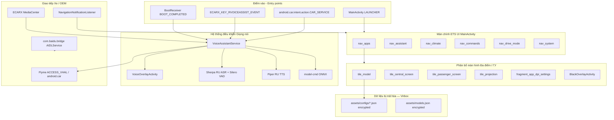

# com.baidu.che.codriver — Hướng dẫn phân tích APK (CarAssistant-ETS)

Tài liệu này mô tả APK **CarAssistant-ETS** (`com.baidu.che.codriver`) — một bộ công cụ (toolkit) hệ thống / trợ lý giọng nói dành cho màn hình trung tâm (head unit - ГУ) của Geely chạy hệ điều hành Flyme Auto / ECARX (bản build **kx11a5**). Ngoài chức năng ASR/TTS tiếng Nga ngay trên thiết bị, ứng dụng này đóng vai trò là **bảng cài đặt ETS**: cung cấp tùy chọn chọn mẫu xe, thiết lập đa màn hình (màn trung tâm / màn hành khách / máy chiếu), cài đặt DPI cho từng ứng dụng, điều khiển hệ thống khí hậu/ghế ngồi, chế độ lái xe (drive mode) và các công tắc hệ thống khác.

**Quan trọng:**

- Ứng dụng này **không phải** là `geely_ex2_tools` (`com.geely.ex2.tools`) và cũng **không phải** bản đồ Baidu Maps mặc định.
- Tên Package (gói) — là tàn dư kế thừa từ **Baidu CoDriver**; trong khi nhãn giao diện (UI-label) tiếng Nga/Trung Quốc lại ghi: **CarAssistant-ETS**.
- Mã nguồn và các cấu hình (vehicle-configs) được bảo vệ bằng lớp giáp **Virbox**: file `classes.dex` là bản mã stub, toàn bộ tệp trong `assets/configs/*.json` và `models.json` đều là khối mã hóa (encrypted blob). Các công cụ phân tích tĩnh chỉ có thể đọc được file manifest, tên các tài nguyên và một số asset không bị mã hóa (như README của module ASR/TTS), nhưng **không thể** đọc được nội dung thực tế của hồ sơ thiết lập `ex2`.

Bản cài đặt lấy từ Telegram: `CarAssistantETS_com_baidu_che_codriver_v_7_0_2026_0124_1137_kx11a5.apk`.

---

## 0. Tổng quan ứng dụng

| Tham số | Giá trị |
|----------|----------|
| Tên Package | `com.baidu.che.codriver` |
| Nhãn (Label) | **Car Assistant** / RU·zh-CN: **CarAssistant-ETS** |
| versionCode / versionName | `74` / `7.0.2026_0124_1137-kx11a5` |
| minSdk / targetSdk / compileSdk | 28 / 33 / 33 (Android 13) |
| sharedUserId | `android.uid.system` |
| Ứng dụng (Application) | `v4034ead1.l4034ead1` (Lớp bảo vệ Virbox stub) |
| Trình khởi chạy (Launcher) | `com.baidu.che.codriver.MainActivity` |
| ABI | chỉ hỗ trợ `arm64-v8a` |
| Kích thước APK | ~262.9 MB |
| Chữ ký (Signature) | cấp nền tảng (platform) (`META-INF/PLATFORM.*`) |
| uses-feature | yêu cầu `android.hardware.type.automotive` (bắt buộc) |
| uses-library | `android.car` (không bắt buộc - optional) |

**Mục đích (dựa vào manifest + sơ đồ tài nguyên giao diện):**

1. **ETS đa màn hình (multi-display)** — xử lý màn hình trung tâm (central) / hành khách (passenger) / máy chiếu (projection), công tắc chuyển đổi màn hình (screen switch), thiết lập DPI riêng theo từng ứng dụng (per-app DPI), bộ chọn ứng dụng cho mỗi màn hình, làm mờ màn hình (black overlay) và cấu hình tự khởi động (autostart).
2. **Cấu hình xe (Vehicle profile)** — cho phép chọn mẫu thiết bị (`ex2`, `monjaro`, …) tải từ `assets/configs/<key>.json` (đang bị mã hóa).
3. **Giọng nói trên máy (On-device voice)** — công cụ nhận diện Sherpa-ONNX RU ASR, Silero VAD, công cụ phát giọng nói Piper-style RU TTS (`ru_RU-dmitri-medium`), và module nhận dạng lệnh dạng ONNX.
4. **Điều khiển xe** — tính năng điều khiển khí hậu/cửa sổ/cửa ra vào/âm lượng thông qua `android.car` kết hợp Flyme VHAL / Meizu FlymeAuto / ECARX MediaCenter.
5. **Đọc thông báo dẫn đường HUD (Navi HUD)** — dùng `NotificationListenerService` đọc thông tin điều hướng chỉ đường (navigation).
6. **Kênh cầu nối AIDL bridge** — module `com.baidu.bridge.server.AIDLService` (hoạt động qua `com.bridge.server.AIDLService`).

**Cấu trúc lớp nền (những thành phần thấy được):**

| Tầng (Layer) | API / thành phần |
|------|-----------------|
| Bảo mật | Virbox (DEX giả stub, tệp tin assets mã hóa, `l4034ead1_*.so`, `kqkticwjgzy.dat` magic `SENS`) |
| Phân tích ASR | Sherpa-ONNX + ONNX Runtime (`libsherpa-onnx-*.so`, `libonnxruntime*.so`) |
| Phát âm TTS / VAD | Công nghệ Piper ONNX + dữ liệu espeak-ng; `silero_vad.onnx` |
| Giao diện UI | AndroidX / Material / Lottie; các fragments + các khung hiển thị màn hình (tiles) tùy chỉnh riêng (không dùng PreferenceScreen mặc định) |
| Mạng (Network) | Thư viện OkHttp, quyền `INTERNET` |
| Tương tác nền tảng | `android.car`, hệ sinh thái Flyme Auto, hệ sinh thái ECARX |

---

## 1. Nguồn và artifact

| Tham số | Giá trị |
|----------|----------|
| APK gốc | Lấy từ Telegram Desktop `CarAssistantETS_com_baidu_che_codriver_v_7_0_2026_0124_1137_kx11a5.apk` |
| Bản sao cục bộ | `.tmp/carassistant-ets/CarAssistantETS.apk` |
| APK đã giải nén | `.tmp/carassistant-ets/apk/` |
| badging / manifest từ aapt | `.tmp/carassistant-ets/badging.txt`, `manifest.txt` |
| Resource IDs (bản lọc dump) | `.tmp/carassistant-ets/resources-ids.txt` |
| Danh sách cấu hình (configs) | `.tmp/carassistant-ets/configs-list.txt` |
| Định dạng Header file `ex2.json` | `.tmp/carassistant-ets/ex2-header.hex` |

(Thư mục `.tmp/` nằm trong danh sách `.gitignore`).

### Quá trình giải nén

```powershell
$apk = "path\to\CarAssistantETS_com_baidu_che_codriver_v_7_0_2026_0124_1137_kx11a5.apk"
$base = ".tmp\carassistant-ets"
New-Item -ItemType Directory -Force -Path $base\apk | Out-Null
Copy-Item -LiteralPath $apk -Destination "$base\CarAssistantETS.apk"
Copy-Item "$base\CarAssistantETS.apk" "$base\CarAssistantETS.zip"
Expand-Archive -Path "$base\CarAssistantETS.zip" -DestinationPath "$base\apk" -Force

$aapt = (Get-ChildItem "$env:LOCALAPPDATA\Android\Sdk\build-tools" -Directory |
  Sort-Object Name -Descending | Select-Object -First 1 |
  ForEach-Object { Join-Path $_.FullName "aapt.exe" })
& $aapt dump badging $apk | Set-Content "$base\badging.txt"
& $aapt dump xmltree $apk AndroidManifest.xml | Set-Content "$base\manifest.txt"
```

Công cụ **JADX** không có tác dụng với tệp DEX giả (stub): vì phần lớn logic ứng dụng bị giấu đi qua Virbox. Khuyến cáo tập trung khảo sát qua các file tài nguyên/manifest/`assets`, hơn là cố gắng phân tích mã máy (decompilation).

---

## 2. Kiến trúc



### Giới hạn rào cản từ phân tích tĩnh (Static analysis limitation)

| Tầng / Khu vực | Trạng thái (đọc được không) |
|------|--------|
| AndroidManifest / badging | ✅ đọc được |
| Resource **names** (`tile_*`, `nav_*`, `fragment_*`) | ✅ đọc được |
| Giá trị chuỗi (Resource **string values**) của trình cài đặt (tiếng Nga/Anh) | ❌ hầu như không nằm trong arsc — bị giấu ở DEX |
| Nội dung tệp `assets/configs/*.json`, `models.json`, `model-cmd/vocab.txt` | ❌ bị mã hóa bởi Virbox (định dạng file là `4B 11 02…`) |
| Logic code chọn dòng xe / cấu hình DPI / SharedPreferences | ❌ được giấu trong payload mã hóa |

Phần chữ ký mở đầu file (header) của tất cả các file cấu hình không rỗng (bao gồm tệp `ex2.json`):

```text
4b 11 02 d4 c0 ee d5 cb f4 19 04 0b 23 43 7c 61 d2 e6 e8 ef 82 …
```

---

## 3. Giao diện (UI): các chuyên mục và thiết lập "bố trí Màn hình trung tâm (ГУ)"

Dựa theo thanh điều hướng menu dưới (`activity_main` → `navigation_panel`):

| Id định danh (nav id) | ID nguồn (RID) | Tên mục |
|--------|-----|--------|
| `nav_apps` | `0x7f080169` | Mục Ứng dụng / Màn hình / DPI / Đời Xe (model) |
| `nav_assistant` | `0x7f08016a` | Mục Trợ lý giọng nói |
| `nav_climate` | `0x7f08016b` | Mục Điều hòa / Ghế ngồi / Vô lăng |
| `nav_commands` | `0x7f08016c` | Mục Câu lệnh ngôn ngữ |
| `nav_drive_mode` | `0x7f08016d` | Chế độ lái xe / Ngữ cảnh |
| `nav_system` | `0x7f08016e` | Mục Hệ thống (Wi-Fi, ngày giờ, ADAS, trạng thái chung) |

### 3.1 `nav_apps` — Trung tâm bộ lõi xử lý Đa màn hình (multi-display)

| Định dạng UI / Layout | Giải nghĩa tính năng |
|-------------|-------|
| `tile_model` | Thiết lập vehicle profile để gọi tệp cấu hình → `assets/configs/<key>.json` |
| `tile_central_screen` + `fragment_central_screen_settings` | Thiết lập Màn hình trung tâm (màn chính) |
| `tile_passenger_screen` + `fragment_passenger_screen_settings` | Thiết lập Màn hình của hành khách (ghế phụ) |
| `tile_projection` + `fragment_projection_settings` | Kênh máy chiếu - Projection (`projection_surface_view`, bộ khung presentation layouts) |
| `screen_switch` / `screens_container` | Nút công tắc để hoán đổi điều khiển các màn hình |
| `fragment_app_dpi_settings` (`dpi_slider`, `apps_dpi_list`) | Điều chỉnh DPI đơn lẻ của mỗi app |
| `fragment_app_selection` | Tùy chọn xem ứng dụng nào được hiện ở màn hình nào |
| `tile_black_screen` / `BlackOverlayActivity` | Tạo lớp Overlay che làm tối màn hình (Black overlay) |
| `tile_autostart` / `fragment_autostart_settings` | Thiết lập Tính năng tự động bật app lúc khởi động máy |

Lưu ý rằng: Các khai báo qua thẻ XML / đường dẫn `res/xml/*preference*` / hay thư mục `menu/` **đều không tồn tại** — toàn bộ logic setting đều tự thiết kế bằng fragments và các ô home tiles nội bộ.

### 3.2 Khung lưới giao diện Trang chủ (Home tiles) (`id/tile_*`)

| Khóa id | RID (Resource ID) |
|----|-----|
| `tile_autostart` | `0x7f08023f` |
| `tile_black_screen` | `0x7f080240` |
| `tile_central_screen` | `0x7f080241` |
| `tile_drive_mode` | `0x7f080242` |
| `tile_model` | `0x7f080246` |
| `tile_passenger_screen` | `0x7f080247` |
| `tile_projection` | `0x7f08024b` |
| `tile_seat_heat` / `_vent` / `_massage` | `0x7f08024c`–`24e` |
| `tile_status` | `0x7f08024f` |
| `tile_time` | `0x7f080250` |
| `tile_wheel_heat` | `0x7f080253` |
| `tile_wifi` | `0x7f080254` |

### 3.3 Các phân vùng chức năng khác (điểm nhanh)

| Nhóm chức năng | Tài nguyên nổi bật |
|--------|------------------------|
| `nav_assistant` | Có thẻ `fragment_assistant`, `switch_show_voice_overlay`, cấu trúc lưới dạng grid cho bảng điều khiển |
| `nav_climate` | Sưởi ghế (seat heat) / quạt gió ghế (vent) / chức năng massage, sưởi vô lăng (wheel heat) |
| `nav_commands` | Khung `fragment_commands`, từng ô `item_command` |
| `nav_drive_mode` | Các kịch bản ngữ cảnh (scenarios): điều phối lực phanh (brake) / chế độ chạy (drive_mode) / tính năng thu hồi phanh (recuperation) / hệ thống lái (steering) / hệ thống treo giảm xóc (suspension) |
| `nav_system` | Nút Wi-Fi, time, status chung, hệ thống an toàn ADAS (như thẻ `switch_aeb`, `switch_lka`) |

Hỗ trợ các theme giao diện tùy chỉnh UI (theo kiểu radio): băng giá (`arctic`) / ngọc lục bảo (`emerald`) / vàng kim (`gold`) / đá vỏ chai hắc diện thạch (`obsidian`).

---

## 4. Hồ sơ cấu hình theo xe (Vehicle profiles - trong `assets/configs`)

| Tên tệp | Kích thước | Ghi chú Trạng thái |
|------|-------:|--------|
| `ex2.json` | 6275 | Bị mã hóa encrypted — Đây chính là mục tiêu profile gốc EX2 |
| `monjaro.json` | 9707 | Bị mã hóa encrypted — Tệp có cấu trúc phình to nhất |
| `preface.json` | 4784 | Bị mã hóa encrypted |
| `boyue.json` | 4329 | Bị mã hóa encrypted |
| `default_template.json` | 4326 | Bị mã hóa encrypted — Đóng vai trò là cái khung mẫu chuẩn (template gốc) |
| `e5.json` | 4242 | Bị mã hóa encrypted |
| `starship.json` | 4137 | Bị mã hóa encrypted |
| `coolray.json` | 3678 | Bị mã hóa encrypted |
| `starshine_6.json` | 2333 | Bị mã hóa encrypted |
| `boyue_l_lite.json` | 0 | Không có nội dung |
| `boyue_l_max.json` | 0 | Không có nội dung |

Đồng thời còn có một file `assets/models.json` (nặng khoảng 1113 B) — chung cơ chế mã hóa.

Dựa vào việc phán đoán, kiến trúc cấu hình có thể hoạt động như sau: **`default_template` + cài ghi đè (override) dựa theo mẫu xe** (ví dụ `ex2`, …). Hậu tố phiên bản đính đuôi `kx11a5` — là ký hiệu đánh dấu hệ nền tảng của bản KX11/SX11.

---

## 5. Cấu trúc AndroidManifest

| Kiểu (Type) | Tên class | Exported | Nhiệm vụ |
|-----|-----|----------|------------|
| Activity | `MainActivity` | true | Đóng vai trò khởi chạy (LAUNCHER) / giao diện ETS UI |
| Activity | `VoiceOverlayActivity` | false | Chạy một phiên duy nhất `singleInstance`, không ghi lịch sử `noHistory`, có overlay nền trong để báo voice |
| Activity | `BlackOverlayActivity` | false | Tạo tấm rèm đen màn hình |
| Service | `VoiceAssistantService` | true | Bắt kênh thoại `BIND_VOICE_INTERACTION`; kết nối chính sách Flyme; liên kết xe `CAR_SERVICE`; Nút bấm lệnh nói từ phần cứng ECARX |
| Service | `com.baidu.bridge.server.AIDLService` | true | Mở hành động `com.bridge.server.AIDLService` |
| Service | `navi.NavigationNotificationListener` | true | Đọc dẫn đường vào HUD (`NotificationListenerService`) |
| Receiver | `BootReceiver` | true | Nghe máy khởi động `BOOT_COMPLETED`, hoặc quá trình bật nhanh máy `QUICKBOOT_POWERON` |
| Receiver | `media.MediaButtonReceiver` | true | Thu nhận tín hiệu nút vật lý từ phương tiện `MEDIA_BUTTON` |
| Provider | `media.ArtworkProvider` | true | Cung cấp tài nguyên hình đồ họa theo mã `com.baidu.che.codriver.artwork` |
| Provider | FileProvider / nền tải app (androidx-startup) | false | Cấu trúc chuẩn thường gặp |

### Các điểm hứng sự kiện (Intent actions) của dịch vụ `VoiceAssistantService`

- `com.flyme.auto.settings.action.privacy_policy`
- `com.flyme.auto.settings.action.user_policy`
- `com.flyme.auto.settings.action.user_improve_policy`
- `android.car.intent.action.CAR_SERVICE`
- `com.baidu.che.codriver.VoiceAssistantService`
- `ecarx.intent.action.ECARX_KEY_RVOICEASSIST_EVENT` (ưu tiên cao với mức priority 999)

---

## 6. Các lệnh phân quyền (Permissions)

| Phân vùng | Phân quyền permissions | Tác dụng |
|--------|-------------|-------|
| Giọng nói | `RECORD_AUDIO`, `CAPTURE_AUDIO_HOTWORD`, `CAPTURE_AUDIO_OUTPUT`, `FOREGROUND_SERVICE_MICROPHONE`, `BIND_VOICE_INTERACTION`, `MODIFY_AUDIO_SETTINGS` | Sử dụng phân tích nhận dạng tiếng nói ASR / lệnh từ khóa hotword / giữ chạy nền FGS microphone |
| Phương tiện/xe ô tô | `CONTROL_CAR_*`, `CAR_PROPERTY_*`, `CAR_PRIVILEGED`, `CAR_SPEED`, … | Giao tiếp lớp VHAL / hệ thống làm mát/sưởi (climate) / cửa sổ kính / cửa lề / âm thanh loa |
| Hệ thống của Flyme/Meizu | Cấp đặc quyền hệ thống: `com.flyme.auto.permission.ACCESS_VHAL`, quạt HVAC, hệ thống USER; kèm quyền `com.meizu.flymeauto.permission.*` | Kết nối mở rộng vào phần OEM car API riêng |
| Hệ thống của ECARX | `ecarx.oem.permission.OPENAPI_MEDIACENTER_PERMISSION` | Dành cho việc dùng trung tâm trình phát media đa phương tiện |
| Lớp System (Hệ điều hành Android) | `WRITE_SECURE_SETTINGS`, `INJECT_EVENTS`, `SYSTEM_ALERT_WINDOW`, `INTERACT_ACROSS_USERS(_FULL)`, sự kiện boot | Thay đổi DPI/cấu hình máy, đắp hình vẽ (overlay màn), tương tác hệ phân chia tài khoản người dùng nhiều màn xe |
| Phần nghe nhìn (Media) | `MEDIA_CONTENT_CONTROL`, `RECEIVE_MEDIA_BUTTONS` | Dùng điều khiển media bằng phím bấm cứng / tài nguyên artwork |

Lưu ý: Sự kết hợp giữa cấp ID chia sẻ `sharedUserId=android.uid.system` + chứng thực cấp hệ thống (platform signature) — là chìa khóa để nó bung 100% tính năng lên màn hình thiết bị (ГУ).

---

## 7. Các công cụ học máy / dữ liệu chạy offline trên máy (On-device ML assets - không thuộc config xe)

| Đường dẫn (Path) | Tác dụng |
|------|------|
| Thư mục `assets/sherpa-onnx-streaming-zipformer-small-ru-vosk-2025-08-16/` | Công cụ nhận diện chữ theo đường truyền trực tiếp (Streaming RU ASR) (phần encoder chiếm dung lượng cỡ vài chục MB) |
| Bộ file `assets/tts-ru/ru_RU-dmitri-medium.onnx` + espeak-ng-data | Bộ công cụ phát âm giả thanh giọng tiếng Nga (Piper-style) |
| File `assets/silero_vad.onnx` | Bộ kích hoạt VAD (phát hiện khi nào con người cất tiếng) |
| Cấu trúc thư mục `assets/model-cmd/` | Bộ xác định hành vi lệnh ngầm định (intent ONNX) (~117 MB) + hệ thống từ vựng (vocab) đã bị che giấu mã hóa |
| File `.so` tại `lib/arm64-v8a/libonnxruntime*.so`, `libsherpa-onnx-*.so` | Môi trường hệ thống để có thể biên dịch chạy mô hình Rantime (Runtime) |

Tài liệu Plaintext đọc được bình thường gồm có: `assets/sherpa-…/README.md`, `assets/tts-ru/MODEL_CARD`.  
Các tệp có kiểu là Lottie chứa ở `res/*.json` — là file mô tả cử động chạy animation trên giao diện app UI, không liên quan tới profile của chiếc xe.

---

## 8. Những chức năng nên kế thừa vào dự án `geely_ex2_tools`

| # | Hạng mục cần tham khảo | Tại sao (Công dụng) | Độ hiệu quả/sáng giá |
|---|-----------|-------|------------|
| 1 | Cấu trúc phân mảng Màn hình đa chiều: màn central / màn cho passenger + `screen_switch` | Là cốt tủy logic giúp "chia sẻ tín hiệu qua nhiều màn xe ГУ" | ★★★★★ |
| 2 | Cấu trúc chỉnh DPI cá thể Per-app (`apps_dpi_list` + cần gạt chỉnh bằng thanh slider) | Giải quyết vấn đề hình UI bị lệch scale tỉ lệ sau khi nhảy màn hình | ★★★★★ |
| 3 | Bộ khóa dòng xe (Model keys) + phương thức ánh xạ `default_template` → cài đè lên `ex2` | Tạo luồng xử lý riêng (branching); Với dự án bản thân — nên vận hành thông qua tài liệu mở JSON/hoặc DataStore | ★★★★☆ |
| 4 | Cơ chế chia sẻ màn máy chiếu (Projection - dùng `Presentation` / surface) | Áp dụng để chia tới một màn hình thứ hai / màn ngoài hỗ trợ | ★★★★☆ |
| 5 | Bộ kết nối phần mềm hãng (Flyme VHAL + `android.car` + gọi hàm ECARX permissions / intents) | Khai thác lớp car APIs thực tế của máy ГУ (trước đó ta đã có khai phá mảng `com.flyme.auto.api` một phần) | ★★★★☆ |
| 6 | Đắp thêm layout che màn (Black / voice overlay pattern) | Tăng cường UX mượt mà khi phủ trên phần mềm mặc định của nhà sản xuất | ★★★☆☆ |
| 7 | Cú phát lệnh phần cứng `ECARX_KEY_RVOICEASSIST_EVENT` | Quản lý được nút bấm vật lý trên xe (nút trợ lý) | ★★★☆☆ |
| 8 | Bảng lưới thẻ cho mục chế độ chạy xe (Drive-mode / climate tiles) | Dùng để tạo cân bằng thông số hiển thị với app ETS; thực tế thì nên bám sát xem code ở app gốc HVAC sẽ dễ hơn [flyme-hvac](./flyme-hvac-apk.md), hoặc app settings [flyme-settings](./flyme-settings-apk.md), năng lượng [flyme-energy](./flyme-energy-apk.md) | ★★☆☆☆ |
| 9 | Khai báo cơ chế liên kết kênh giao tiếp AIDL `com.bridge.server.AIDLService` | Chỉ áp dụng trừ phi bạn muốn tạo liên kết tương thích tương đồng cho app nào có sẵn của CoDriver | ★★☆☆☆ |

### Các thành phần không có ý nghĩa khi đem qua

- Toàn bộ nội dung liên quan tới `ex2.json` / các tập lệnh mã hóa config / và `models.json` (do đã bị Virbox mã hóa, rất khó dùng).
- Chặn phân tích Stub DEX / các shell `.so` / hay file nhạy cảm `kqkticwjgzy.dat`.
- Hành động rập khuôn bê nguyên xi (drop-in) tệp asset mã hóa copy đắp vào code mà lại không có luồng dịch ngược ra.
- Trọn bộ công cụ (Full stack) của ASR/TTS (bởi nó nặng đến hàng trăm MB) — khối tính năng này nên đứng ở một ứng dụng chuyên rẽ ngang độc lập, chứ bộ phần mềm EX2 Tools nhỏ gọn không nên tham ôm vào làm gì.

### Đúc kết kinh nghiệm

Thông qua bộ APK này, mỏ vàng có ích nhất nằm ở **Cấu trúc kiến trúc luồng thông tin của thiết lập màn ETS-panel**, chứ hoàn toàn không phải phần mềm tính năng giọng nói do Baidu biên tập. Gồm:

1. Thiết lập chọn dòng xe/model (`ex2`);
2. Các bước cấu hình tinh giản màn hình **chính-trung tâm / màn phụ ở ghế phụ (passenger)**;
3. Bảng tùy chỉnh tỷ lệ **per-app DPI**;
4. Chế độ hắt hình **projection**;
5. Các kịch bản tạo lớp màn đen mờ (black overlay) hay tự động kích hoạt autostart;
6. Phương thức tương tác bằng quyền cao nhất system-uid + tích hợp sâu (hooks) bộ sinh thái Flyme/ECARX.

---

## 9. Khảo sát liên quan đến các Tài liệu phân tích khác

| Bộ tài liệu | Liên kết ý nghĩa |
|----------|-------|
| [flyme-settings-apk.md](./flyme-settings-apk.md) | Về `com.flyme.auto.api` / liên kết cơ sở VHAL cấp cứu cấu hình máy tính xe ô tô |
| [flyme-hvac-apk.md](./flyme-hvac-apk.md) | Điều hòa không khí (Climate) — tồn tại độc lập như 1 app APK mặc định |
| [flyme-auto-service-apk.md](./flyme-auto-service-apk.md) | Mảnh ghép CoreService / giới hạn bảo vệ; cùng các hệ cấp quyền riêng `com.flyme.auto.*` |
| [android-car-apk.md](./android-car-apk.md) | Dịch vụ của Car service / lớp màng phần cứng xe hơi (Vehicle HAL) |
| [centralexauto-apk.md](./centralexauto-apk.md) | Nhóm công cụ đa năng system toolkit (cho AA/CarPlay, biểu tượng nổi floaters); có chung môi trường bảo mật `sharedUserId` |
| [ca-fix-apk.md](./ca-fix-apk.md) | Phân mảng riêng dành riêng cho xử lý trình chiếu kết nối phone projection (hoàn toàn khác ETS UI ở đây) |

| So sánh | Ứng dụng CarAssistant-ETS | Ứng dụng geely_ex2_tools |
|--|------------------|-----------------|
| Tên gói app | `com.baidu.che.codriver` | `com.geely.ex2.tools` |
| Chữ ký UID | bắt buộc có `android.uid.system` | tự thân tùy theo trạng thái root máy/kiểu cài (chạy ở user / system) |
| Đặc thù (Fokus) | Đa màn hình hệ ETS (multi-display) + giọng máy tính tích hợp phần cứng + quản trị cơ học xe | Tập trung vào việc thay thế quan sát Pin / giới hạn chạy xe (speed) / wifi / trang trí đèn nội thất (ambient) / và công cụ hỗ trợ người điều khiển |
| Bảng hồ sơ xe (configs) | Bọc khóa ngầm (encrypted) kiểu Virbox | Sử dụng các thư mục preferences phổ thông / hay dùng thư viện DataStore dễ đọc sửa |
| Mối quan hệ học tập | Hệ chia sẻ quản lý luồng hiển thị xe ГУ, cách config DPI, sử dụng các intents Flyme/ECARX, và đặc quyền hồ sơ mã `ex2` | Các dev có thể tham chiếu tái tạo luồng tư duy và UI, chú ý là đừng lấy cắp blob configs (do khóa rồi) |

---

## 10. Ghi chú quan trọng trong cài đặt / bảo mật

1. Cần sở hữu đầy đủ **Chữ ký chứng thực hệ thống (platform signature)** kết hợp cùng gán tag cấp cao `sharedUserId=android.uid.system` — nếu không có chữ ký này, hệ thống sẽ giới hạn và không chạy hết khả năng.
2. Ứng dụng được xin hàng loạt quyền xâm lấn sâu privileges: như là gửi lệnh trực tiếp `INJECT_EVENTS`, thao tác lưu file `WRITE_SECURE_SETTINGS`, đón tín hiệu từ âm thanh (hotword / capture audio output), và chia sẻ thông tin chéo across-users.
3. Việc nhúng trình chống mã độc Virbox tạo ra trở ngại cực kỳ khó khăn cho quá trình thanh tra (audit): toàn bộ code thật đã bị che dấu trước mắt phân tích tĩnh.
4. Dung lượng APK khủng lên tới ~263 MB — do khối lượng này dành trọn cho tài nguyên của bộ công cụ Machine Learning ML-model. Vậy nên nếu ý định của bạn là tham khảo làm riêng "khung màn hình/DPI" thì bứng cả cục app sang tool là lãng phí tài nguyên và vô tác dụng.
5. Khi nhà sản xuất cập nhật đổi phiên bản hệ thống firmwares/platform nền tảng (nếu không phải là mẫu `kx11a5`), chắc chắn bộ mã key (model keys) hoặc luồng intents sẽ bị biến tấu đổi khác — cần thiết phải lặp lại công đoạn phân tích ban đầu (badging) + in ra danh sách cấu trúc cây `assets/configs`.

---

*Tài liệu này được biên soạn dựa vào phân tích trích xuất APK `com.baidu.che.codriver` phiên bản v74 (`7.0.2026_0124_1137-kx11a5`). Do trở ngại khóa mã bảo vệ từ hãng (bởi Virbox) nên toàn bộ các thông tin dạng chữ nội dung trong những bảng file profiles như (hồ sơ `ex2.json` và tương tự) đều không thể đọc tĩnh được.*
