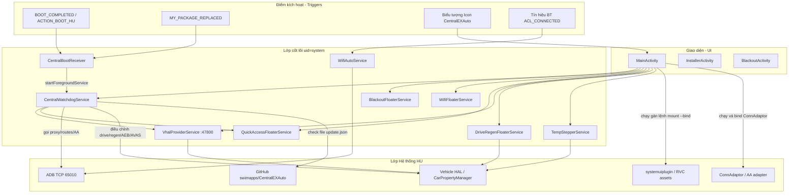

# com.ex.auto — Hướng dẫn phân tích APK (CentralEXAuto)

Tài liệu này mô tả một ứng dụng bên thứ ba mang tên **CentralEXAuto** (`com.ex.auto`) — một bộ công cụ (toolkit) hệ thống dành cho thiết bị màn hình trung tâm (head unit) của Geely/Flyme (bao gồm cả dòng EX2 / IHU). Ứng dụng cung cấp các tính năng hỗ trợ Android Auto / CarPlay, giao diện đè (VHAL-overlays), Wi-Fi, điều hòa không khí (HVAC), bản vá hệ thống ConnAdaptor và khả năng cập nhật tự động (remote-update).

**Quan trọng:** đây **không phải** là ứng dụng chính thức do Geely phát triển, cũng **không phải** `geely_ex2_tools` (`com.geely.ex2.tools`). Mã nguồn của dự án này đang được chia sẻ công khai tại [swimapps/CentralEXAuto](https://github.com/swimapps/CentralEXAuto). Giao diện người dùng (UI) được viết bằng tiếng Bồ Đào Nha (chẳng hạn như "Visão Geral", "Ferramentas", …).

Bản phân tích được thực hiện trên file APK **`CentralEXAuto-geely-platform-signed.apk`**, version **2.10.8** (`versionCode=166`). Xin lưu ý rằng tại thời điểm dịch ngược, trên GitHub đã có manifest khai báo bản cập nhật lên **2.11.2** (`versionCode=170`).

---

## 0. Tổng quan ứng dụng

| Tham số | Giá trị |
|----------|----------|
| Tên Package | `com.ex.auto` |
| Nhãn (Label) | **CentralEXAuto** |
| versionCode / versionName | `166` / `2.10.8` |
| minSdk / targetSdk | 28 / 29 (compileSdk 33) |
| sharedUserId | `android.uid.system` |
| Launcher Activity | `com.ex.auto.MainActivity` |
| Dịch vụ cốt lõi | `com.ex.auto.CentralWatchdogService` (chạy nổi foreground) |
| Prefs (Chỉ mục cấu hình) | `tela_preta_prefs` (trong code là `AppConstants.PREFS_NAME`) |
| Cổng mạng ADB TCP | `127.0.0.1:65010` (trước đây là cổng legacy `5555`) |
| Cổng đo từ xa (Telemetry TCP) | `VhalProviderService` cổng **47800** |
| File server | `PhoneFileServer` cổng **8765** |
| Updates | Truy vấn tải từ `https://raw.githubusercontent.com/swimapps/CentralEXAuto/main/update.json` |

**Mục đích:** Mở rộng và nâng cấp tính năng của màn hình thiết bị HU mà không cần nhận hỗ trợ nâng cấp phần mềm qua kênh chính hãng:

- Tự động hóa trải nghiệm Android Auto / CarPlay (tạo proxy, điều hướng (route) các AP0, tạo bản vá ngàm (bind-patch) cho hệ điều khiển ConnAdaptor / CarplayMonitor);
- Cung cấp giao diện lớp phủ (overlays) (làm mờ toàn màn hình blackout, theo dõi trạng thái drive/regen, thay đổi nấc quạt HVAC stepper, Wi-Fi, hoặc thiết lập khung điều khiển nhanh quick access);
- Theo dõi đọc/ghi VHAL (Hệ thống máy lạnh AC, hệ thống phanh tự động AEB, nhiệt độ, phần trăm pin SOC, thay đổi chế độ lái xe/tái sinh năng lượng);
- Cài đặt thêm các gói ứng dụng (APK) bên ngoài và cơ chế tự động cài bản vá cập nhật trực tiếp từ GitHub;
- Thu thập đo lường số liệu Telemetry truyền qua TCP và gửi báo cáo về trạng thái thiết bị.

**Kiến trúc Stack (căn cứ theo dex/JADX):** Ngôn ngữ Kotlin → Java (từ bản dịch ngược), nền tảng AndroidX + Material, `android.car` (tận dụng `CarPropertyManager`, `CarAudioManager`), dùng Local ADB shell, lệnh gán mount ảo `mount --bind`, giao thức HTTP để gọi file GitHub.

---

## 1. Nguồn và artifact

| Tham số | Giá trị |
|----------|----------|
| APK gốc | `CentralEXAuto-geely-platform-signed.apk` (Tải từ Telegram / Downloads) |
| Bản sao cục bộ | `.tmp/centralexauto.apk` |
| APK đã giải nén | `.tmp/centralexauto/apk/` |
| badging / manifest từ aapt | `.tmp/centralexauto/badging.txt`, `manifest.txt` |
| JADX | `.tmp/centralexauto-jadx/` |

### Quá trình giải nén và tìm kiếm

```powershell
$apk = "path\to\CentralEXAuto-geely-platform-signed.apk"
Copy-Item -LiteralPath $apk -Destination ".tmp\centralexauto.zip"
Expand-Archive -Path .tmp\centralexauto.zip -DestinationPath .tmp\centralexauto\apk -Force

$aapt = (Get-ChildItem "$env:LOCALAPPDATA\Android\Sdk\build-tools" -Recurse -Filter "aapt.exe" | Select-Object -First 1).FullName
& $aapt dump badging $apk
& $aapt dump xmltree $apk AndroidManifest.xml

# Chạy JADX
.\.tmp\jadx\bin\jadx.bat -d .tmp\centralexauto-jadx --show-bad-code --no-res $apk
```

Các thành phần package đáng chú ý trong JADX:

- `com.ex.auto` — Khung giao diện UI, công cụ watchdog, floaters (cửa sổ nổi), ADB, cập nhật updates
- `com.ex.auto.wifimanager` — Xử lý kết nối mồi bằng BT → Wi-Fi tự động
- `com.geely.driveregenfloater` — Cửa sổ nổi chỉnh trạng thái drive/regen
- `com.geely.hvacstepperv2` — Cửa sổ nổi chỉnh nấc điều hòa HVAC

---

## 2. Kiến trúc



| Tầng (Layer) | Vai trò |
|------|------|
| **MainActivity** | Xử lý phần tùy chỉnh thiết lập cài đặt (Settings), các hành vi ấn bằng tay, cài đặt file APK, các phím gán VHAL |
| **CentralWatchdogService** | Dịch vụ Foreground chạy túc trực (chỉ huy các dịch vụ nổi) sau khởi động boot |
| **Floaters** | Các khung phím bấm dạng Overlay nổi lơ lửng đè lên launcher |
| **ADB / bind-mount** | Chạy Shell, cài app kiểu `pm install`, đè bản vá lên hệ thống system/vendor file |
| **GitHub** | Quản lý khai báo danh sách cập nhật bản mới và app tích hợp |

---

## 3. Các thành phần trong Manifest

### Màn hình (Activities)

| Tên Class | exported | Lúc nào bị gọi | Chức năng |
|-------|----------|------------------|------------|
| `MainActivity` | có (LAUNCHER) | Khi ấn vào Icon ngoài launcher | Giao diện điều hướng chính UI (gồm 9 chuyên mục) |
| `InstallerActivity` | có | Lệnh `VIEW` / `INSTALL_PACKAGE` + có MIME định dạng `application/vnd.android.package-archive` | Cài đặt ứng dụng ngoài sideload: thực thi lệnh `pm install -r -g` thông qua shell nền |
| `BlackoutActivity` | không | Khi bấm từ floater / Quick Access | Bật toàn màn hình màu đen; hễ chạm ngón tay (touch) → tự động `finish()` |

### Dịch vụ (Services)

| Tên Class | Nhiệm vụ |
|-------|------------|
| `CentralWatchdogService` | Công cụ tự động Watchdog: phát tín hiệu AA trigger, bật cấu hình proxy/tạo tuyến mạng cho AP0, tái cài đặt lại thông số AEB/AVAS, lưu cấu hình drive/regen, gọi module theo dõi nhiệt độ (status-temp), tải update, xử lý gửi messages |
| `BlackoutFloaterService` | Hiển thị nút ảo nổi: kích hoạt để tắt đèn hắt sáng bằng sysfs (backlight → 0) |
| `WifiFloaterService` | Tạo thẻ Overlay nổi hỗ trợ toggle (nhấp nhả) bật tắt chức năng mạng Wi-Fi |
| `QuickAccessFloaterService` | Quản lý một Bảng điều khiển công cụ (Bên mép hông màn hình) hỗ trợ nhiều hành động thao tác (Quick Access) |
| `VhalProviderService` | Thiết lập bộ truyền file TCP JSON ghi lại lịch sử trạng thái tele trên cổng **:47800** |
| `wifimanager.WifiAutoService` | Khi có Tín hiệu BT thiết bị → Tự động cấu hình mở khóa thẻ Wi-Fi đồng thời join vô một SSID nào đó |
| `driveregenfloater.DriveRegenFloaterService` | Thẻ nút Overlay điều khiển lái / năng lượng (drive mode + regen) |
| `hvacstepperv2.TempStepperService` | Thẻ điều khiển nổi HVAC đổi từng nấc gió fan / tăng giảm nhiệt độ |

### Bộ thu (Receivers)

| Tên Class | Hành động (Actions) | Nhiệm vụ |
|-------|---------|----------|
| `CentralBootReceiver` | Nghe boot `BOOT_COMPLETED`, hoặc `ACTION_BOOT_HU`, ứng dụng bị thay thế `MY_PACKAGE_REPLACED` | Tiến hành khởi động gọi còi báo `startForegroundService(CentralWatchdogService)` |
| `wifimanager.BootReceiver` | Nghe boot `BOOT_COMPLETED` | Kích hoạt `WifiAutoService` |
| `driveregenfloater.BootReceiver` | Bắt lệnh khởi động `BOOT_COMPLETED`, lúc máy bị lock khóa `LOCKED_BOOT_COMPLETED`, hiệu lệnh reboot màn máy `ACTION_BOOT_HU`, hiệu lệnh ngắt nguồn `ACTION_SHUTDOWN_HU` | Chỉ thị Start/stop kích hoạt `DriveRegenFloaterService` tuân thủ prefs |
| `hvacstepperv2.BootReceiver` | Bắt lệnh khởi động `BOOT_COMPLETED`, lúc máy bị lock khóa `LOCKED_BOOT_COMPLETED` | Bật module Start `TempStepperService` chỉ khi tùy chọn đã thiết lập `hvac_stepper_enabled` |

---

## 4. Trình tự Boot / Gọi luồng hoạt động (Điểm kích hoạt)

### 4.1. Chế độ Khởi động màn hình lạnh (Cold start HU)

```text
BOOT_COMPLETED | ACTION_BOOT_HU | MY_PACKAGE_REPLACED
  └─ CentralBootReceiver.onReceive
       └─ gọi lệnh chạy nền startForegroundService(CentralWatchdogService)

Chạy song song ở các bộ thu khác (receivers):
  wifimanager.BootReceiver          → Kích hoạt WifiAutoService
  driveregenfloater.BootReceiver    → Kích hoạt DriveRegenFloaterService  (chỉ xảy ra nếu cờ drive_regen_enabled tồn tại)
  hvacstepperv2.BootReceiver        → Kích hoạt TempStepperService        (chỉ xảy ra nếu cờ hvac_stepper_enabled tồn tại)
```

### 4.2. Khởi tạo Orchestration (Trong module `CentralWatchdogService.onCreate`)

Phân tích theo mã lệnh service (dựa trên chuỗi thứ tự đặt đồng hồ trễ Handler):

```text
Giây t≈0
  Bắt đầu hiện Foreground (thông báo notif)
  Tạo thêm 1 overlay vô hình addInvisibleOverlay()                  # Mục đích để hệ thống không cho tắt app
  Đăng ký bộ phát registerReceiver(SCREEN_ON)            # Theo dõi wakeupReceiver
  Hàm checkCrashFromPreviousBoot()           # Đọc lại cờ KEY_BOOT_STABLE / KEY_CRASH_DETECTED xem boot trước có bị crash hay không
  Mở cổng DeviceReporter.ensureIbanesAdbPort()
  Mở đăng ký lệnh nhận registerAaBtReceiver()                 # Nhận biết nếu có mạch thiết bị BT ACL → Bật kích AA trigger
  Mở lệnh registerMessageNetworkCallback()
  Đặt chu kỳ mạng scheduleAp0Poll()                      # chu kỳ lặp ~6 giây: Hỏi thăm IP thiết bị điện thoại đang nối vô mạng hotspot AP0
  Mở khôi phục tham số lịch sử scheduleAvasRestore() / scheduleAebRestore()
  Hẹn giờ tự gọi scheduleApplyDriveRegenOnBoot(+chờ ~20s)
  Nếu có cờ KEY_QUICK_ACCESS_ENABLED → khởi động service startService(QuickAccessFloaterService)

Giây t≈15s   Nếu cờ KEY_TELEMETRY_AUTOSTART → Bật VhalProviderService.setEnabled(true)
Giây t≈18s   Tạo vòng lặp theo dõi startStatusTempLoop → StatusTempIcon (xem thông số t° ngoài / SOC)
Giây t≈20s   Check kho message thông báo (messages.json)
Giây t≈25s   Nếu chọn làm mờ phông RVC KEY_RVC_BLACK_BG → Áp dụng RvcBlackBg.apply
         Nếu chọn đổi bộ điều hòa sang điện tử KEY_HVAC_DIGITAL → Áp dụng HvacDigital.apply
Giây t≈60s   Gọi tác vụ cập nhật định kỳ autoUpdateRunnable (Soi nội dung update.json → Tải về → Lắp vào bằng lệnh pm install)
         Thiết lập ghi cờ trạng thái ổn định KEY_BOOT_STABLE = true
```

**Bảo vệ hệ thống báo lỗi vòng lặp (Crash guard):** Dựa vào biến cờ, nếu chu kỳ khởi động hệ thống chưa hoàn thành quá trình kịp để đánh dấu `KEY_BOOT_STABLE` là true, thì sẽ được gắn nhãn bị lỗi với biến `KEY_CRASH_DETECTED` + `KEY_AUTO_APPLY_PAUSED`; Hệ thống sẽ gọi phục hồi khẩn bằng extra `crash_action=resume` qua hàm `onStartCommand`.

### 4.3. Các chuỗi gọi lệnh điển hình xuất phát từ giao diện UI

```text
MainActivity.swAutoProxy
  → Báo hiệu hàm notifyWatchdog (đưa cờ qua extra auto_proxy_changed)
    → Module CentralWatchdogService.ap0PollRunnable sẽ đánh thức
      → check chạy hàm detectPhoneIpOnAp0()
      → Set áp thiết lập (applyProxyToCentral) Proxy (giữ ip)     # lưu vào settings global thông qua cổng http_proxy :8080
      → Set áp thiết lập applyRoutesSilent(phoneIp)  # Chạy tuyến chỉ định ip rule/route table 200 băng qua cơ chế ADB

MainActivity.swBlackout / Hoặc gọi qua thẻ nổi QuickAccess (screen_off)
  → Bộ BlackoutFloaterService.enableScreenOff sẽ báo trạng thái enable
      → Chạy lệnh disable SELinux (setenforce 0)
      → Ép bóng đèn về không bằng lệnh: echo 0 > /sys/class/leds/lcd-backlight/brightness

DriveRegenFloaterService / Công cụ watchdog lắng nghe bánh răng số (gear callback)
  → Lắng nghe bộ đo onChangeEvent(Nhận biết chỉ số GEAR_SELECTION=289408000 | CURRENT_GEAR=289408001)
  → Gọi scheduleGearApply → áp dụng lại chế độ applyDriveRegenSavedModes
      → Ghi vào xe setIntProperty(PROP_DRIVE_MODE=570491136)
      → Ghi vào xe setIntProperty(PROP_ENERGY_REGEN=537003264)

QuickAccess / chỉnh lại cài đặt tùy chọn prefs phanh tự động AEB
  → Điều hướng CarPropertyManager.setProperty(Dạng biến Boolean, gọi AEB_PROP_ID=557858874, tại vùng zone=0)

VhalProviderService.setEnabled(đánh giá là true)
  → Kích hoạt Foreground Service (startForegroundService)
  → Sử dụng Car.createCar → bật thu TelemetryReader
  → Bật kết nối ServerSocket.bind(:47800) → chu kỳ cứ ~500 ms sẽ tạo bản chụp snapshotJson() lưu phát lại cho các thiết bị clients
```

### 4.4. Cách hệ thống hoạt động nếu chạm bằng tay (Manual Launch)

```text
LAUNCHER → MainActivity.onCreate
  → Gửi report qua bộ kiểm DeviceReporter.checkAndReport*
  → Sắp xếp menu điều hướng buildNavSections / Trở về vùng menu số (switchNavSection(0))
  → Tái dựng lại lớp phủ chức năng restoreFloaterStates, mở theo dõi initCarTelemetry, tìm bản vá qua checkForUpdates
  → Cân nhắc xem có phải bật dịch vụ Foreground không rồi gọi lệnh startForegroundService(CentralWatchdogService)
```

---

## 5. Các phân mục cấu hình của `MainActivity` UI (sections)

Danh sách điều hướng cột bên trái (chức năng `buildNavSections` / `ViewFlipper`):

| Cột Menu # | Tên Chuyên Mục (Theo Tiếng Bồ Đào Nha PT) | Tóm lược Chức năng Chứa trong Nó |
|---|----------------|------------|
| 0 | **Visão Geral** | Hiện tên phiên bản version, báo thông số đo đạc từ máy móc, bộ nút chỉnh lái xe drive/regen, thao tác bật quạt (fan), bật AC, hiển thị bản ghi log phiên chạy máy |
| 1 | **Ferramentas** | Đen hình hiển thị Blackout, Tắt giao diện lùi RVC bằng bg tối, Bật bộ lạnh điện tử (HVAC digital), Cấp quyền ADB GPIO, phím Reboot, các loại phím gạt (switches) liên quan đến tính năng ghi nhận số liệu Telemetry |
| 2 | **Rede & Conexão** | Thông tin Wi-Fi, Nút floater tắt mở Wi-Fi nổi, Cấu trúc nối phone (connect), Cấu trúc mạng tạo Server máy chủ file (port :8765), Mạng đường hầm HTTP proxy |
| 3 | **Android Auto** | Cơ chế gán liên kết (Bind) / nút khởi động lại kết nối AA–CarPlay, tự động route với AA, cập nhật trực tiếp hai phiên bản vá cho thiết bị (ConnAdaptor / CarplayMonitor) |
| 4 | **Áudio** | Thay mới tiếng gõ thông báo đóng cửa (Bind WAV carlock) thành tệp → `/vendor/etc/carlock/yuedongyinghe.wav`, tinh chỉnh nhiều nhóm audio (audio groups) |
| 5 | **AVAS** | Bật tắt tắt âm Mute / thanh đo độ ẩm level / tùy chỉnh volume mượn bộ thư viện hệ thống `CarAudioManager` (dùng phương pháp reflection lấy ra) |
| 6 | **Aplicativos** | Dùng làm hub cài thêm Chromium, bộ cân chỉnh nhạc Equalizer, ES File Explorer, app lưu cam đôi (DualDashcam), bộ máy thu tin (ConnLogger); Cài mọi bản nội địa APK (local APK) |
| 7 | **Configurações** | Nút thủ công báo check updates, thiết lập phân vùng cấp quyền app hiện nổi overlay permission, tăng/giảm cường độ mờ (alpha floaters) cho app nổi, tắt mở chức năng truy cập nhanh của bảng quick access |
| 8 | **Acesso Rápido** | Chỉnh thiết kế Quick Access dạng icon cho thân thiện dễ dùng (Đổi số thứ tự vị trí, và cấu hình khả năng hiện diện visibility) |

---

## 6. Phân vùng Các Tùy chỉnh (Feature Inventory)

| Feature (Tên tính năng) | Đóng tại class/nơi nào | Cơ chế thực thi (Cách chạy) |
|---------|-----------------|--------------|
| Làm đèn hình tối tắt (Blackout) | `BlackoutFloaterService`, `BlackoutActivity` | Đẩy giá trị của sysfs backlight = 0 hay ép màn phải mờ đi toàn diện |
| Lái xe (Drive) / Tái tạo năng lượng (Regen) | `DriveRegenFloaterService` + liên kết cục watchdog | Truyền/Viết cài đặt trực tiếp tới VHAL; tính toán cài đè (re-apply) ngay mỗi khi hệ thống có tác động chuyển cấp số xe |
| Chỉnh từng nấc HVAC stepper | `TempStepperService` | Chỉnh nhảy ±0.5°C, mức quạt (fan ramp), và gọi cấu hình định sẵn từ file lưu (`FanPresetStore`) |
| Hình thù bộ hiện thị lạnh UI điện tử HVAC | `HvacDigital` | Down file APK chứa ảnh → gọi `mount --bind` chạy cắm đè tệp gốc ở app của xe `com.flyme.auto.systemuiplugin` |
| RVC vẽ thêm background viền tối | `RvcBlackBg` | Gán đè ảnh mới tạo PNG nằm lên cấu hình cũ `/system/etc/automotive/evsapp/rvc/rvc_left_bg.png` |
| Ô Floater gọi tắt cho Wi-Fi | `WifiFloaterService` | Thẻ cửa sổ nổi công tắc Overlay toggle |
| Wi-Fi kích hoạt từ Bluetooth BT | `WifiAutoService` | Khi biến cố ACL_CONNECTED của thiết bị nhận diện đúng thiết bị BT mục tiêu → Khởi động kết nối vào chung một tên cấu trúc mạng Wi-Fi (SSID) |
| Hàng phím truy cập nhanh Quick Access | `QuickAccessFloaterService` | Tạo bảng phụ thanh lề (side-bar) bao gồm tiện ích điều hướng gồm các cụm bấm: mạng wifi, chế độ drive_regen, nút aa_activate/bấm khởi động lại reset, khóa âm avas, tối màn screen_off, phanh hỗ trợ aeb, nhật ký lỗi telemetry |
| Dịch vụ Android Auto | Hoạt động cùng Watchdog + class chính MainActivity | Dùng Intent gọi `am start com.njda.adapter/.view.TransparentActivity`; làm công việc điều phối mạng proxy/tuyến route internet |
| Gắn miếng vá vào ConnAdaptor | Thuộc MainActivity / quy trình cập nhật update flow | Nối file APK tải về `ca_fix.apk` nằm đè thành file → `/system/app/ConnAdaptor/ConnAdaptor.apk` |
| CarplayMonitor | Thuộc MainActivity / quy trình cập nhật update | Nối nhị phân binary → thành `/system/bin/CarplayMonitor` |
| Chống đụng chạm từ AEB | Làm việc ở Watchdog + QuickAccess | Ghi thuộc tính giá trị boolean vào VHAL mang mã hiệu `557858874` |
| Tắt khóa âm điện AVAS mute | Chạy qua Watchdog + UI chỉnh tay | Sử dụng API `CarAudioManager.setAVASMode(0)` (+ có rà kiểm tra verify). Khởi phục Mute (Unmute) → trả nó trạng thái cuối. Ghi giá trị lưu trên hệ thống tại pref tên `avas_muted_saved`. So sánh bộ EX2 Tools: cũng gọi phương thức API này nhưng **chỉ giới hạn** hoạt động khi máy root / gỡ bỏ ngăn chặn system flavor (`sharedUserId` + được xác nhận cấp testkey platform) — tham khảo bài hướng dẫn chi tiết file `docs/system-install.md` |
| Lưu và đo Telemetry | Phục vụ bằng `VhalProviderService` + bộ lọc thu qua `TelemetryReader` | Quăng báo cáo dữ liệu định dạng JSON truyền online theo dòng (stream) qua luồng mạng :47800 |
| Theo dõi Nhiệt độ trong xe / ngoài xe (Status temp) | Biểu tượng `StatusTempIcon` | Biểu tượng góc trên thanh status bar hiển thị kết quả đo cho: Môi trường (ambient) + Tình trạng pin điện (SOC) |
| Hệ thống tự làm mới (Self-update) | Cục xử lý Watchdog hàm `autoUpdateRunnable` | Lấy tên tệp bản vá từ file `update.json` → Sau đó dowload ứng dụng đuôi APK → Chạy lệnh ngầm ép cài qua shell command `pm install` |
| Tải theo dạng ép sườn bên (Side-load) | Chạy thông qua module `InstallerActivity`, cộng với cấu trúc định dạng JSON manifests | Rút JSON file do GitHub truyền tải qua mạng + thực thi `pm install` |
| Làm máy chủ trung gian qua điện thoại máy chủ file | Nằm tại hàm `PhoneFileServer` | Mở HTTP IP theo dạng port :8765 → Mọi tệp đẩy qua sẽ chạy vô thư mục `/data/local/tmp/apks` hoặc khu vực chứa âm thanh `sons` |
| Trình cấu hình gửi thông báo giao diện web (Remote messages) | Ở cục quản lý `MessageManager` | Thông báo cấu hình được kéo từ web lên `messages.json` nhằm hiện bảng báo overlay (+ kèm luôn mã hóa qua module `SimpleCrypto` dành cho dữ liệu ghi định dạng `enc`) |
| Bộ xuất bản thông số trình báo máy móc thiết bị Device report | Thiết kế bởi cụm lệnh class `DeviceReporter` | Phát mail hoặc gói tin SMTP-báo cáo định kỳ (ghi chép chi tiết từ số series (serial) máy / nhận dạng xdsn / các mã đánh tên version) xảy ra tức khắc lúc ứng dụng chạy đầu tiên khi mở lần đầu (first-run) |

---

## 7. Các Mã Định danh (ID) cấu hình cho chức năng liên kết xe (VHAL property IDs được trích xuất từ lõi code)

| Mã ID | Cục phân bổ ngữ cảnh | Mục đích & Chi Tiết (Sắp Xếp Dịch Dụng) |
|----|----------|-------|
| `289408000` | Số lùi / bộ truyền động trả callback (gear) | Báo biến `GEAR_SELECTION` (Đang nằm vị trí nào) |
| `289408001` | Số lùi / bộ truyền động (gear callback) | Biến nhận diện hiện số máy xe nằm ở `CURRENT_GEAR` |
| `570491136` | Khu vực thiết lập lái drive | Quy định lựa chọn hành vi xe (chế độ lái xe) |
| `570491137` / `138` / `139` | Khu vực thiết lập lái drive | Phân mảng 3 loại chế độ (Eco (tiết kiệm) / Comfort (dễ chịu êm ái) / Dynamic (tăng tốc cao/động lực học)) |
| `537003264` | Module hấp thụ năng lượng dư thừa (regen) | Xác định cường độ phục hồi (regen level base gốc) |
| `537003265` / `266` / `267` | Module hấp thụ năng lượng dư thừa regen | Phân 3 lớp (Thấp Low / Thường Mid / Mạnh High) |
| `557858874` | Phanh AEB | Tham số cờ bật / tắt công tắc hệ thống (mã `AEB_PROP_ID`) |
| `358613145` | Làm lạnh HVAC | Biến thiết lập báo cho xe: hệ thống lạnh AC đang mở (`PROP_HVAC_AC_ON`) |
| `358614275` | Nấc thổi TempStepper | Cài đặt cho mốc chỉ định nhiệt mong muốn |
| `358614274` | Nấc thổi TempStepper | Hiện cho biết nhiệt độ của môi trường cabin |
| `356517120` | Nấc thổi TempStepper | Chỉ cho xe thiết lập chạy phần quạt vù vù (tốc độ quạt thổi) |
| `291505923` | Cục theo dõi temp | Đọc thông số nhiệt độ bên ngoại (cảm biến phụ alt) |
| `557884279` | Quản trị màn StatusTemp | Phân bổ hiển thị Nhiệt độ ngoài môi trường (ambient): qua công thức `(raw-80)/2` |
| `557884281` | Quản trị telemetry | Phân bổ thông tin nhiệt độ phòng trong khoang (inside temp) |
| `557885165` | Cảm biến % pin dòng điện (SOC) | Biến xe mã hiệu `V_ED_EV_BATTERY_PERCENTAGE` |
| `559982316` | Thuộc kênh mở rộng aux | Biến đọc hiện trạng pin dự phòng (điện thế dòng 12V voltage) |
| `559982313` / `559982315` | Cảm biến luồng năng lượng điện (energy flow) | Tình trạng lúc đi / xả vào hệ bình (driving / battery) |
| `291504647` / `648` | Ghi nhận Vận Tốc (speed) | Tốc độ báo gốc của AOSP / Mức đưa ra màn hình hiển thị display |
| `291504644` | Đồng Hồ (odo) | Bộ tổng đo thông số đã đi odometer |
| `289407752` | Cự ly khả dụng (range) | Cảm biến cho biết xe còn đủ nguyên liệu chạy được cho khoảng (remaining) |
| `557885103`, `098`, `105`, `120`, `121` | ~~Bộ đo cảm biến nhiệt pin điện (battery temp)~~ | **Sự cố báo cáo nhầm lẫn từ cấu trúc bên trong ứng dụng CentralEXAuto:** những mã này thực tế trả về báo các thông số của bộ sạc/dòng sạc (`CHARGING_RATE_SET` / `IPK_AVERAGE_POWER_CONSUMPTION` / `CHANGING_VCU_StsChg` / `DISCHARGING_*`), hoàn toàn sai lệch bởi đó không phải mức nhiệt năng bình cao áp HV. Chú ý rằng ở cấu hình trên EX2 chuẩn thì luồng báo nhiệt thông minh HV temp không bao giờ gửi phát trực tiếp public về Car API cả — thế nên gói sản phẩm nhà làm EX2 Tools không có khai thác lấy dữ liệu sai này. |

Chỉ số khoanh vùng vị trí: `PROPERTY_AREAS = {0, 1, 16777216}`, `HVAC_AC_AREAS = {1, 5, 49, 0}`.

Cách để tạo được liên lạc (Kết nối Connection):

```text
Từ Car.createCar(context) → gọi getCarManager("property") → Trả đối tượng về cho CarPropertyManager
```

---

## 8. Nguồn Gói tải liên kết Ngoại & Tệp (Khai thác thư viện từ GitHub)

Tất cả dựa vào máy chủ kho mã: `https://raw.githubusercontent.com/swimapps/CentralEXAuto/main/`

| Đường link (Manifest JSON / URL) | Định hình kiểu tải về (Tên / Loại File) | Công dụng sử dụng |
|----------------|--------------|------------|
| File `update.json` | Cho chính phần mềm CentralEXAuto | Giúp cơ chế ứng dụng tự cài thêm phiên bản Self-update |
| File `connadaptor.json` | App apk định dạng `ca_fix.apk` | Tạo lớp patch đè vá cho chương trình ConnAdaptor |
| File `carplaymonitor.json` | Ngôn ngữ dịch hệ nhị phân `CarplayMonitor` binary | Đặt làm biến đổi tại vị trí `/system/bin/CarplayMonitor` |
| File `carplayfelipe.json` | Lấy ứng dụng `com.swimapps.ativadorcarplay` | Mở chức năng bắt sóng bật luồng CarPlay (CarPlay activator) |
| File `hvacdigital.json` + (đi kèm một file link tải tải đường dẫn APK URL) | Dạng Plugin hỗ trợ vẽ đè trên SystemUI | Trả lại khung ảnh Bộ lạnh cho chức năng làm mát (Digital HVAC UI) |
| File `chromium.json` | Ứng dụng lướt web `org.bromite.chromium` | Phần mềm truy cập mạng (Brazor Web) |
| File `equalizer.json` | Gói ứng dụng `com.jazibkhan.equalizer` | Bộ tạo tinh chỉnh sóng nhạc tần số thanh âm (Equalizer) |
| File `filemanager.json` | Phân phối phần mềm tiện ích explorer `com.estrongs.android.pop` | Quản trị thiết bị ES File Explorer |
| File `dualdashcam.json` | Kéo về ứng dụng phân vùng quản lý cam cho `br.com.central.dualdashcam` | Trình lưu và hiển thị Dashcam hai mắt quay (Camera hành trình kép) |
| File `connadaptorlogger.json` | Cấp ứng dụng đo chỉ số `com.geely.connadaptorlogger` | Dành cho việc ghi log báo phân tích Logger lỗi ứng dụng |
| File `messages.json` | — | Khung khai báo chữ viết tải về để báo tin nổi lên màn giao diện Remote UI messages |

Những vị trí địa phương hỗ trợ sao chép chờ cập nhật trên máy tính (staging): `/data/local/tmp/`, `/data/local/tmp/fixes/`, `/data/local/tmp/apks/`, `/sdcard/Download`.

Xem qua cấu trúc khuôn mẫu `update.json` mới tính tại lúc ghi chép tài liệu:

```json
{
  "versionCode": 170,
  "versionName": "2.11.2",
  "apkUrl": "https://raw.githubusercontent.com/swimapps/CentralEXAuto/main/CentralEXAuto-geely-platform-signed.apk",
  "sha256": "331bf64e4fa520a6a4de3f98ab8f4e98a077d0fdbc627b6dcf63f1678de87948"
}
```

---

## 9. Phân loại cấu trúc chuyên mục các Lớp (Class) bên trong

### Thuộc gói thư viện `com.ex.auto`

| Khai báo Tên Class | Đảm Nhận Vai trò |
|-------|------|
| `AppConstants` | Kênh thông tin lưu định danh hằng (Đường URL, tên vị trí paths, ID thiết lập prefs keys, các kênh biến mã VHAL IDs) |
| `MainActivity` | Cơ sở cấu hình tạo hình giao diện đồ họa chính UI và điều độ orchestration toàn cục |
| `CentralWatchdogService` | Bộ phận nhạc trưởng (orchestrator) hoạt động ẩn mình trên màn (phục vụ từ xa) |
| `CentralBootReceiver` | Nhận kết thúc luồng khởi động Boot → đá truyền cho watchdog |
| `InstallerActivity` | Bố trí thiết lập tự động cài File ứng dụng phụ APK tuân theo cơ cấu Intent |
| `BlackoutActivity` / `BlackoutFloaterService` | Tạo bộ màu đen phủ (Z-index lớn) cản tầm nhìn ánh sáng màn (làm tối nhòe màn hình) |
| `QuickAccessFloaterService` | Hiển thị bảng thanh điều khiển trượt thao tác đa năng siêu tốc (Side panel panel thao tác chớp nhoáng) |
| `WifiFloaterService` | Nhét bảng tính năng truy cập không gian wifi trên màn overlay |
| `VhalProviderService` | Máy chủ hỗ trợ luồng truyền gửi Telemetry TCP Server |
| `TelemetryReader` | Kịch bản lặp lại các quá trình đóng gói thông tin VHAL tạo gói chụp Snapshot |
| `StatusTempIcon` | Biểu tượng icon hiển thị nhỏ phần % SOC (điện) + đo lường nhiệt cảm ứng |
| `AdbLocal` / `LocalAdbClient` | Phát pháo gửi mã hóa Shell code lệnh chạy ADB trên dây máy wire protocol |
| `HvacDigital` | Nối (Bind) để kích hoạt tiện ích UI thay thế cài thêm từ digital SystemUI plugin |
| `RvcBlackBg` | Nối (Bind) ép khung màu nền che đen kịt chức năng báo cam lùi RVC background |
| `PhoneFileServer` | Mở HTTP đường tải file (upload) mở tại :8765 |
| `MessageManager` / `SimpleCrypto` | Truy thu tải file bản tin Remote messages |
| `DeviceReporter` | Công cụ soạn thảo thư điện tử theo giao thức SMTP device report định kỳ |
| `OverlayPositionStore` / `FloaterSupportKt` | Đo đạc cấp tọa độ Vị trí (Positions) thiết lập mốc notifications floaters |

### Gói hỗ trợ Wi-Fi `com.ex.auto.wifimanager`

| Tên Class | Đảm Nhận Vai trò |
|-------|------|
| `WifiAutoService` | Xác minh thông số BT → tự đâm Wi-Fi vào kết nối (connect) |
| `BootReceiver` | Ngay lúc nạp năng lượng lên nguồn (Boot), tự gọi (Autostart) |
| `MainActivity` | Cho người điều chỉnh UI thiết lập danh tính BT/chữ mạng SSID |
| `Constants` / `BluetoothCompat` / `WifiApHelper` | Kho định dạng Prefs, bộ công cụ cấu hình nhận biết BT, quản lý trạm phát sóng Wi-Fi từ điện thoại (AP0) |

### Gói công cụ trôi nổi `com.geely.driveregenfloater` / `com.geely.hvacstepperv2`

| Tên Class | Đảm Nhận Vai trò |
|-------|------|
| Khối kết hợp `DriveRegenFloaterService` + `BootReceiver` | Gắn panel lớp (Overlay) thiết đặt Drive Mode/cảm biến Regen |
| Khối kết hợp `TempStepperService` + `BootReceiver` | Gắn panel lớp (Overlay) chỉnh điều hòa không khí HVAC |
| Khối tham số `FanPreset` / `FanPresetStore` | Kho dữ liệu định kỳ, cấu hình lưu (presets) trước đó cho tốc độ quạt thổi/bộ tạo hơi nhiệt (nhiệt độ) |

---

## 10. Tóm tắt tại sao đòi các lệnh Cấp Quyền (Permissions)

| Danh sách Quyền Permission được lấy | Tác dụng trong Ứng dụng APK này |
|------------|------------------|
| Lớp che kính `SYSTEM_ALERT_WINDOW` | Cấp phép hiện cửa sổ đắp nổi Floaters / overlays trên nền khác |
| Yêu cầu giữ nền nổi bật `FOREGROUND_SERVICE` | Cần có để duy trì bộ nghe Watchdog, thao tác truy mạng (Wi-Fi auto), báo truyền Telemetry online |
| Bắt tin mở máy `RECEIVE_BOOT_COMPLETED` | Phục vụ tự kích hoạt ngay mở xe (Autostart) |
| Thay đổi nguồn `DEVICE_POWER` / `WAKE_LOCK` | Hỗ trợ cản tắt màn (Blackout) / đánh gọi màn sáng (wake) |
| Gói thiết lập bộ mạng và điều hướng: Wi-Fi / liên kết trạm phát thether / lệnh override `OVERRIDE_WIFI_CONFIG` | Bộ phận Auto Wi-Fi, khai thác cổng AP0, tạo ủy nhiệm proxy |
| Thông số định vị (Location) | Đặc tính bắt buộc phải đi chung lúc tiến hành quét dò tần số mạng Wi-Fi (scan) |
| Sóng Bluetooth Bluetooth* | Thu nhận thông báo khi có đt Trigger vào xe (với AA) / từ đấy mở chức năng Wi-Fi auto |
| Kênh giao tiếp Xe Cơ Sở (Car Data): `CAR_ENERGY` / cơ động `POWERTRAIN` / cảm ứng nhiệt `HVAC` / đo lường môi trường ngoài `EXTERIOR_ENVIRONMENT` | Thu phát nhận biết giá trị VHAL tương ứng: % pin năng lượng/thống số mode lái (drive)/thông số điều hòa HVAC/báo mức nhiệt temp |
| Quyền cấp quyền âm lượng phần hệ thống thiết bị `CAR_CONTROL_AUDIO_*` | Đóng/mở kiểm soát dòng liên quan còi tín hiệu nguy hiểm (AVAS) / cũng như luồng âm của loa audio |

Ghi chú khác: Thông qua việc kế thừa thêm hàm `sharedUserId=android.uid.system` thì ứng dụng có đủ tư cách can thiệp toàn bộ biến vào kho (sâu hơn với `settings`, cho quyền điều chỉnh đè vùng gắn ổ cứng `mount`, tham chiến sửa giá trị mức phát sáng màn hệ thống sysfs backlight, điều tiết đóng cài gói với quyền cấp cao privileged `pm`).

---

## 11. Đánh giá Mức độ Rủi ro (Nhận xét vấn đề An toàn / Bảo mật lúc dùng)

1. Tệp file cài đặt (APK) này đã được đúc thiết kế chạy riêng thông qua khóa cơ chế **bảo an hệ thống (system signature)** (lấy cấp `android.uid.system`) — do vậy bất cứ thể loại cài thông qua user-debug bình dân nào mà lại đi thiếu con mộc cờ khóa của nền tảng platform kia thì chẳng phát huy đủ hết quyền điều hành tính năng xe (functional) được đâu.
2. Tại rất đa số các cụm lệnh, ứng dụng mạnh tay lợi dụng triệt để nền móng tương tác kiểu **hệ điều khiển nhúng tại cục bộ local (ADB shell)** đồng thời chạy lách với chiêu thức hạ cờ chặn (Security-Enhanced Linux) với `setenforce 0` trước mọi phiên gọi tráo thay file (bind-mount).
3. Kho bản sửa lỗi cũng như đống các tải gói hỗ trợ Apk thêm cài rời ra thì được hất thẳng từ kho online lưu tự do **dạng mở GitHub raw** (tại địa chỉ Github `swimapps/CentralEXAuto`); trong đó số ít những file phần mềm tải về lại có khai báo sử dụng cơ chế bảo hiểm tính vẹn toàn qua việc kiểm tra mã băm SHA256-hash.
4. Thông qua module class `DeviceReporter`, khi kích hoạt chạy khởi đầu ứng dụng có đi thu và sẽ báo gửi những thông số danh tính máy tính xe ra qua địa chỉ e-mail bằng giao thức SMTP (với biến cung cấp tài khoản mật khẩu account log in bị nhồi code lộ ở bên trong source APK).
5. Ứng dụng để lộ trạng thái hoạt động nghe cổng với mô đun tải file vào máy `PhoneFileServer` (kênh Port :8765) kèm theo máy chủ đo đạc `VhalProviderService` (kênh Port :47800) không qua lớp màng an ninh auth nào cả đối với tất cả những ai kết nối chung ở hạ tầng mạng LAN/WiFi của xe (HU network).
6. Ứng dụng chơi trò thao tác ảo (Bind-mount), nó lừa thiết bị và ngụy trang thay đổi đường dẫn của phân vùng gốc (system/vendor) một cách tinh vi - mãi đến khi thực thi rũ lớp ảo umount/hay lúc tắt mở xe (reboot) thì mọi thứ mới trở lại hình hài bình thường ban sơ (đối với ConnAdaptor, tệp đắp SystemUI plugin, cái phông ảnh RVC PNG, module nhị phân CarplayMonitor, với cả âm đóng cửa xe carlock WAV).

---

## 12. So sánh và sự khác biệt giữa CentralEXAuto với dự án `geely_ex2_tools`

| Yếu Tố So Sánh | Dự án phần mềm CentralEXAuto | Dự án geely_ex2_tools (Của Nhóm) |
|--|---------------|-----------------|
| Tên hiệu Packet | `com.ex.auto` | `com.geely.ex2.tools` |
| Bậc UID | Cấp siêu cao system (qua chia sẻ ID user system) | Bình thường như ứng dụng dân sinh (app), chỉ nhận quyền nếu ta dùng tool chỉnh ký lại chữ ký cấp hãng (re-sign) |
| Cấu trúc GUI (Giao diện) | Dùng cấu trúc mảng tệp cổ điển XML/View + Bộ khung Material Design, ngôn ngữ chữ theo bộ chữ Bồ Đào Nha PT | Giao thức xịn mới chạy trên (Jetpack Compose) |
| Đường lối phát triển cốt lõi | Tập trung xử cho kết nối điện thoại: (AA/CarPlay), hay thả nổi nút chức năng floaters trên màn hình, chạy đắp tạo phôi đè bind-patch, hỗ trợ bản update kéo tải tải trực tuyến | Đi sâu phân tích tinh vi theo dõi và khai thác nguồn (về điện năng Battery/về số liệu chạy speed/mạng lưới wifi/trang trí nội thất ambient/ cùng gói hành trang công cụ điều khiển driving tools) trên hệ sinh thái nguyên thủ của EX2 |
| Chỗ có thể giao thoa trao đổi tri thức | Những thuộc tính truy ra từ Car Property IDs / VHAL property, đọc cách người khác viết về tính năng của bộ máy nóng lạnh (HVAC), quản lý tái sinh xe điện (drive/regen), xử lý đánh thức mô đun bắt sóng Wifi | Các bạn dev từ `geely_ex2_tools` có quyền đọc và kiểm nghiệm chứng minh lại ID với các đoạn hướng dẫn ở trong tài liệu của CentralEXAuto để tăng kiến thức |

Tuy hai bộ phần mềm đều có mục đích nhắm tới việc truy cập làm chủ phần cứng thông qua (Car Property / VHAL trên thiết bị màn Geely HU), thế nhưng rõ ràng là hai sản phẩm **rất đối nghịch tách bạch (razny products)** do bởi cả tư tưởng nền móng kiến trúc hệ thống và đích đến tương lai của mỗi bên (architectures and goals) là không đồng nhất.
