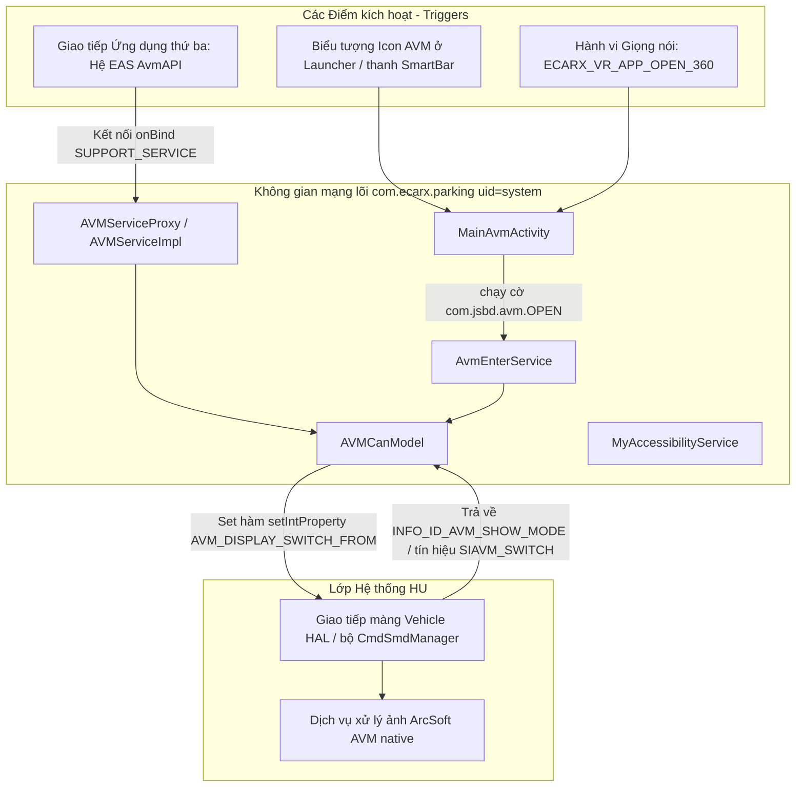

# com.ecarx.parking — Hướng dẫn phân tích APK (AVM)

Tài liệu này mô tả ứng dụng hệ thống mặc định **AVM** (`com.ecarx.parking`) được lấy từ màn hình điều khiển trung tâm (head unit) **IHU629G** của hãng xe Geely: cách phần mềm này gọi mở chức năng camera 360 độ (круговой обзор - vòng quanh xe), sử dụng những mã thuộc tính VHAL nào, và phương pháp để tích hợp tương tác từ một ứng dụng (APK) bên thứ ba.

**Quan trọng:** Ứng dụng này **không phải** là nơi chứa trình vẽ hiển thị hình ảnh camera. File APK này thuần túy đóng vai trò như một **bộ kiểm soát (controller) của hệ thống**: nó tiến hành kiểm tra các điều kiện an toàn (trạng thái nguồn ACC, tốc độ chạy của xe, tín hiệu từ camera) rồi ghi một lệnh "yêu cầu hiện màn AVM" vào hệ VHAL. Khâu xuất hình vẽ đồ họa thực tế (luồng video 4 camera, mô hình xe 3D, báo sóng radar) do một dịch vụ native chuyên biệt mang tên **ArcSoft AVM** đảm trách ở tầng sâu hệ điều hành.

Bản build lấy từ dex là: **`OneOSAvmApp_E22H-G_20250903`**.

---

## 0. Tổng quan ứng dụng

| Tham số | Giá trị |
|----------|----------|
| Tên Package | `com.ecarx.parking` |
| Nhãn hiển thị (Label) | **AVM** |
| versionCode | `100000000` |
| versionName | `1` |
| minSdk / targetSdk | 28 / 34 |
| sharedUserId | `android.uid.system` |
| Application | Khai báo `com.ecarx.parking.AvmApp` (có thêm thuộc tính `android:persistent=true`) |
| Tác vụ Launcher Activity | `com.ecarx.parking.MainAvmActivity` (chỉ đóng vai mồi nhử stub, gọi lên cái là lập tức tự sát `finish()`) |
| Dịch vụ chính (Main service) | `com.ecarx.parking.AvmEnterService` (Chạy hiển thị Foreground) |
| DEX chứa logic xử lý | File `classes3.dex` (gồm khoảng ~20 class thuộc phân vùng `com.ecarx.parking.*`) |

**Mục đích cốt lõi:** Làm công cụ kích hoạt (trigger) và cung cấp bộ API để mở/đóng hệ thống AVM bằng nhiều cách: chạm từ launcher, ra lệnh trợ lý giọng nói (voice), và gọi qua các app khác thông qua hệ eCarX EAS. Tính năng phụ trợ đi kèm — Vẽ bảng đồ họa hiển thị cảm biến lùi PDC (Mã nguồn đã có, tuy nhiên không phát hiện được sự liên kết trong bản build E22H-G) cùng với AccessibilityService dùng để theo dõi trạng thái bản đồ.

**Kiến trúc Stack (căn cứ theo dex/JADX):**

- Từ `MainAvmActivity` → gọi `startForegroundService(com.jsbd.avm.OPEN)` → lập tức kết thúc `finish()`
- Từ `AvmEnterService` → chọc vào `AVMCanModel` → truy cập `CarPropertyManager`
- Hệ thống EAS: Bắt nhịp `AvmEnterService.onBind` → chuyển sang `AVMServiceProxy` → tới `AVMServiceImpl`
- Báo cáo Log: In ra `Logcat` với tag là `OneOSAvmApp_E22H-G_20250903`
- Thu thập phân tích (Analytics): Dùng hệ thống SensorsData v0.0.9

**Các module hệ thống liên quan (Dù không nằm chung gói APK, nhưng kết hợp vận hành):**

- Tiến trình ArcSoft AVM native (nằm ở mã pid ~289 lúc soi log, dùng gói `ArcSoftAVM_sdk`, xuất màn tỉ lệ 5120×800, xử lý luồng 4 camera)
- Trình Vehicle HAL / `CmdSmdManager` (ghi vào thuộc tính `AVM_DISPLAY_SWITCH_FROM`)
- Kênh giao tiếp AIDL `com.geely.sdk.avm` / `ecarx.avmservice` (khai báo dưới dạng thư viện phụ thuộc trong dex)

---

## 1. Nguồn và artifact

| Tham số | Giá trị |
|----------|----------|
| Nền tảng (Thiết bị trích xuất dump) | Model IHU629G |
| APK gốc (dùng lệnh qua ADBAppControl) | Lưu thành file `downloads/250060 IHU629G/AVM (com.ecarx.parking) [v.1].apk` |
| Bản sao cục bộ | `.tmp/ecarx-parking.zip` |
| APK đã giải nén | `.tmp/ecarx-parking-apk/` |
| Xem bằng JADX | Thư mục `.tmp/ecarx-parking-src/` |

### Thao tác lấy APK từ thiết bị

```bash
adb shell pm path com.ecarx.parking
adb pull /system/app/.../AVM.apk .tmp/ecarx-parking.apk
```

### Giải nén và khám phá

```powershell
Copy-Item -LiteralPath ".tmp\ecarx-parking.apk" -Destination ".tmp\ecarx-parking.zip"
Expand-Archive -Path .tmp\ecarx-parking.zip -DestinationPath .tmp\ecarx-parking-apk -Force

$dexdump = (Get-ChildItem "$env:LOCALAPPDATA\Android\Sdk\build-tools" -Recurse -Filter "dexdump.exe" | Select-Object -First 1).FullName
& $dexdump -d .tmp\ecarx-parking-apk\classes3.dex | Select-String "AVM_DISPLAY_SWITCH_FROM|PERF_VEHICLE_SIAVM|PdcCover"
```

Công cụ **JADX / jadx-gui** — là quân bài chủ lực để phân tích trực diện vào các lớp như `AvmEnterService`, `AVMCanModel`, và `AVMServiceImpl`.

---

## 2. Kiến trúc



| Tầng (Layer) | Vai trò |
|------|------|
| **Tầng Java APK** | Chịu trách nhiệm thực hiện các thủ tục kiểm tra an toàn, ghi gửi yêu cầu lên VHAL, quản lý kênh giao tiếp EAS API, phủ giao diện hỗ trợ PDC (đang bị khóa không hoạt động) |
| **Lớp mạng VHAL** | Đón tiếp hiệu lệnh mở/tắt chức năng, phản hồi báo lại cho biết hệ thống màn AVM hiện đang diễn biến thế nào |
| **Hệ thống ArcSoft** | Tập trung render xây dựng 3D, ghép 4 camera 360°, dựng hình icon xe khối 3D, đắp số liệu cự ly cảm biến lùi radar vào hình vẽ |

Cấu trúc giao tiếp nối kết xe nằm bên trong file APK:

```text
Car.createCar(context) → gọi connect() → lấy ra getCarManager("property") → Trả về CarPropertyManager
Phân khu vực areaId = 0
```

---

## 3. Lối gọi chức năng: Phân tích 4 cách để mở màn AVM

### 3.1 Bấm biểu tượng trên màn (Launcher)

Trình `MainAvmActivity` — đóng vai kẻ trung chuyển (proxy): khởi động service rồi lập tức biến mất (trong vỏn vẹn ~20–30 ms).

```bash
adb shell am start -n com.ecarx.parking/.MainAvmActivity
```

Phân tích cách gọi ngầm:

```text
Chạy action = com.jsbd.avm.OPEN
Khởi tạo component = com.ecarx.parking/.AvmEnterService
Tham số phụ extra START_SOURCE = 1  (xác nhận nguồn bấm từ launcher)
```

### 3.2 Kích hoạt chủ đích (Direct Intent) nhắm vào service

```bash
adb shell am start-foreground-service \
  -a com.jsbd.avm.OPEN \
  -n com.ecarx.parking/.AvmEnterService \
  --ei START_SOURCE 1
```

Thao tác tắt (dù có hỗ trợ hàm action, nhưng bộ bắt lệnh `onStartCommand` viết khá ẩu — tốt nhất là nên ép ghi lệnh đóng qua VHAL hay EAS thì chắc ăn hơn):

```bash
adb shell am start-foreground-service \
  -a com.jsbd.avm.CLOSE \
  -n com.ecarx.parking/.AvmEnterService
```

### 3.3 Yêu cầu qua công nghệ Giọng nói VR (ECARX)

| Tham số | Giá trị |
|----------|----------|
| Báo Action | `ecarx.intent.action.ECARX_VR_APP_OPEN` |
| Nằm ở Category | `ecarx.intent.category.ECARX_VR_APP_OPEN_360` |
| Bật Activity | Nhắm vào `MainAvmActivity` |

```bash
adb shell am start \
  -a ecarx.intent.action.ECARX_VR_APP_OPEN \
  -c ecarx.intent.category.ECARX_VR_APP_OPEN_360 \
  -n com.ecarx.parking/.MainAvmActivity
```

### 3.4 Kênh giao tiếp EAS API (Cánh cổng dành cho phần mềm hệ thống khác móc vào)

Dịch vụ `AvmEnterService` sẽ tự đăng ký khai báo mình làm người cung cấp tính năng EAS (EAS provider):

| Tham số | Giá trị |
|----------|----------|
| Nối Action bind | Bắt nhịp `com.ecarx.eas.core.intent.action.SUPPORT_SERVICE` |
| Xác nhận meta-data provider | Lấy nhãn là `avm` |
| Thuộc về Module | Kênh `AvmAPI` |

Các hàm API được lộ diện từ `AVMServiceProxy` → đến `AVMServiceImpl`:

| Tên Phương Thức (Method) | Tạo Ra Hành Động (Action) |
|-------|----------|
| `openAvm` | Đẩy biến `AVM_DISPLAY_SWITCH_FROM = 3` (Chỉ cho phép nếu xe thỏa mãn điều kiện chạy ≤ 30 km/h) |
| `closeAvm` | Đẩy lệnh `AVM_DISPLAY_SWITCH_FROM = 4` |
| `getAvmCurrentStatus` | Truy vấn `SystemProperties.get("VIDEO_REQUEST_AVM")` |
| Những phương thức hỗ trợ khác APA / HPA / tính năng đổi góc cam (switch view) | Đều nhận thông báo lỗi mã **402** — tức hệ thống không hề hỗ trợ làm việc này |

### 3.5 Bắn lệnh thẳng qua màng VHAL (Đây là giải pháp ưu việt cho dev từ `geely_ex2_tools`)

Lộ trình ngắn, nhanh, dứt khoát không cần gọi mồi Activity:

```kotlin
carPropertyManager.setIntProperty(0x2140a654, 0, 1)  // Tương đương bấm từ màn launcher
carPropertyManager.setIntProperty(0x2140a654, 0, 3)  // Tương đương nhận lệnh từ thiết bị ngoài EAS
carPropertyManager.setIntProperty(0x2140a654, 0, 4)  // Gửi chỉ thị Tắt/Đóng
```

Cách lấy báo cáo xem xe có đang hiện AVM không — Bắt mạch cảm biến `PERF_VEHICLE_SIAVM_SWITCH` (mã `557842882`): số **1** tức là đang mở, số **3** tức là đang đóng.

---

## 4. Quá trình kiểm soát rào cản bật cam (`AvmEnterService.openAvm`)

Trước khi chính thức phóng tín hiệu yêu cầu vô màng xe (VHAL), app sẽ lọc bảo vệ bằng loạt điều kiện:

| # | Khâu Check | Mã Property / Kênh Method | Bị Cấm Phát Lệnh Nếu (Uslóvie blockirovki) | Tên Chuỗi Hiển Thị UI báo lỗi |
|---|----------|------------------|--------------------|-----------|
| 1 | Chống ấn spam (Debounce) | Check `isClickable()` | Ấn liên hoàn < 1 giây | — |
| 2 | Hiện trạng điện | Gọi `getPowerStatus()` → đo mã `PEPS_POWER_MODE` `0x2140a331` | `== 0` | Báo `open_error_acc_off` |
| 3 | Tình hình mắt Camera | Gọi `getCameraStatus()` → đo mã `0x21405054` | `== 1` | Báo `open_error_avm_error` |
| 4 | Xét Vận Tốc hiện tại | Gọi `getVehicleSpeed()` → đo mã `0x2140a258` nhân cho `0.05625` | Nếu xe chạy `> 30` km/h | Báo lỗi `open_error_over_speed` |

Vượt hết các ải → Phóng lệnh `setIntProperty(VehicleProperty.AVM_DISPLAY_SWITCH_FROM, 1)`.

Tính năng bonus thêm: Lỡ như lúc đang bật mà `onAVMShowModeChanged == 6` kết hợp vận tốc lúc đó phóng > 30 thì hệ thống cũng tự đập một dòng chữ toast "over speed" (do hệ thống phản hồi phàn nàn chửi ngược lại).

### Minh họa chu trình trơn tru ghi trong bảng logcat

```text
Mở MainAvmActivity.onCreate
  → Khởi động startForegroundService(truyền action=com.jsbd.avm.OPEN, source=1)
  → Tự tắt finish()

Vô phần AvmEnterService.onStartCommand
  → Kéo thông số getIntProperty(0x2140a331)   # Điện PEPS_POWER_MODE
  → Kéo thông số getIntProperty(0x21405054)   # Khỏe/hư camera status
  → Kéo thông số getFloatProperty(0x2140a258) # Tốc độ chưa qua scale raw speed
  → Bắn tin setIntProperty(0x2140a654, 1) # Bật AVM_DISPLAY_SWITCH_FROM

Kênh nội hàm VHAL thu lệnh: Nhận được AVM_DISPLAY_SWITCH_FROM = 1
  → Tự báo trạng thái mới INFO_ID_AVM_SHOW_MODE = 1
  → Tự phát loa còi báo PERF_VEHICLE_SIAVM_SWITCH = 1

Mạng nhân đồ họa ArcSoft AVM (xử lý trên process độc lập): gọi avm_sdk_process / avm_sdk_draw (cán mức vẽ ~7 ms/khung hình)
```

---

## 5. Bảng thông số thuộc tính VHAL / Mã property id

### 5.1 Hành vi Viết đè (Chỉ thị Lệnh - Commands)

| Tên định danh (Logic Name) | Hệ thập phân int | Hệ Hex | Cấu trúc Giá trị gán |
|------------------|-----|-----|----------|
| `AVM_DISPLAY_SWITCH_FROM` | `557885012` | `0x2140a654` | số `1` khai báo từ màn launcher, `3` mở ngầm từ EAS open, `4` yêu cầu cúp đóng |

### 5.2 Khối Đọc kiểm tra (Check trạng thái và status)

| Tên định danh (Logic Name) | Hệ thập phân int | Hệ Hex | Ghi Chú |
|------------------|-----|-----|------------|
| `PEPS_POWER_MODE` | `557884209` | `0x2140a331` | `0` = Hệ thống ACC chưa bật (off) |
| Camera / Hỏng hoặc lỗi AVM error | `557862996` | `0x21405054` | `1` = Đang hỏng camera |
| Vận tốc chưa scale (Vehicle speed raw) | `557883992` | `0x2140a258` | Lấy giá trị này nhân cho × `0.05625` → tính ra được km/h |
| Công tắc hệ thống `PERF_VEHICLE_SIAVM_SWITCH` | `557842882` | `0x2140a402` | `1` đang chạy on, `3` đang dừng off |
| Kiểu màn AVM báo lại `INFO_ID_AVM_SHOW_MODE` | `557885032` | `0x2140a668` | Báo ngược (feedback) cho biết màn hình hiện đang chạy hiển thị ra sao |
| Cảm biến vị trí hộp số truyền động Gear | `557884933` | `0x2140a385` | `1` = đang Đỗ P, `2` = đang Lùi R (phục vụ chức năng hiện PdcCover) |

### 5.3 Tính năng báo khoảng cách PDC / và sóng cảm biến radar (Kích hoạt khi nhận tín hiệu `persist.radar.type=1`)

Thường quy trình này mở đăng ký (register) khi hàm `AVMCanModel.onServiceConnected` chạy:

| Nhóm chức năng | Tên Cờ Property / Hằng số Constant |
|--------|----------------------|
| Độ dài phát hiện PDC | Đọc biến `PDC_NEAREST_DISTANCE`, check `PDC_STOP_DISPLAY_REQUEST` |
| Âm độ còi cảnh báo radar | `ID_SOC_WARN_VOLUME` |
| Xác định độ đo 8 mắt cảm biến quanh xe PAS | Gồm chuỗi `PAS_FUNC_PAS_RADAR_FRONT_*`, `PAS_FUNC_PAS_RADAR_REAR_*` |
| Theo dõi Radar còn hoạt động hay không | `PAS_FUNC_PAS_RADAR_WORK_STATUS` |
| Trích xuất số chạy ở đồng hồ taplo | Dùng `PERF_VEHICLE_SPEED_DISPLAY` (`291504648`, rồi nhân với tỷ lệ × 0.05625) |
| Thông số nền giao diện (Theme) | Đổi hình thái với `NIGHT_MODE` (`538247424`) |

---

## 6. Sơ đồ Cây thư mục Class của mã APK

| Khai báo Tên Class | Đảm Nhận Vai trò |
|-------|------------|
| `AvmApp` | Giữ cốt móng Application duy nhất singleton, khai thông gọi bằng `getInstance()` |
| `MainAvmActivity` | Đóng vai làm Launcher stub giả mạo → để móc nối đánh thức service → rồi tự thiêu `finish()` |
| `AvmEnterService` | Khối chạy nổi Foreground service phụ trách: lệnh open/close, nối kết kênh ngoại vi EAS bind, thiết lập bộ quản lý màng nhìn accessibility setup |
| `AVMCanModel` | Khối thiết lập duy nhất Singleton: vận dụng `CarPropertyManager`, quản trị quá trình đọc/ghi read/write, và nghe ngóng thay đổi listeners |
| `AVMCanModelAdapter` | Giao diện cấu hình định nghĩa để gom tín hiệu gọi lại qua Callback chuyên trị sự kiện (property events) |
| `AVMServiceProxy` | Bộ proxy xử lý yêu cầu kết xuất cho EAS `IEASFrameworkSuppportService.Stub`, phân luồng điều hướng đường vòng `AvmAPI` |
| `AVMServiceImpl` | Triển khai các nút bấm chức năng `openAvm` / `closeAvm` / lệnh hạch toán `getAvmCurrentStatus` |
| `PdcCover` | Khu vực thiết lập khung đồ họa đè lớp lùi báo cảm biến System overlay PDC (Hiện hình báo 8 con mắt cảm biến, vuốt cọ sвайпы, tính thời gian tự ẩn trong 4 giây) |
| `MyAccessibilityService` | Ghi đè vào biến theo dõi `map.window.status` bất cứ khi nào xe tráo app chạy ở foreground (thực thi trên mặt) |
| `AvmBootBroadcaset` | 1 cái trạm bộ thu vắng vẻ trống trơn (trong file kê khai ứng dụng manifest thậm chí chả buồn gán cho nó) |
| `ToastManager` | Gánh trọng trách hiển thị thông báo toast khi xảy ra vấp ngã lúc bấm mở cam không thành |
| `Logcat` | Gói chức năng tạo file viết log có ghi nguồn file:dòng |

### Chú thích từ Manifest (những điểm cốt tử)

| Hạng mục Tên Component | Cấu hình thuộc tính (Attributes) |
|-----------|----------|
| `application` | Đặt quyền nằm lỳ `persistent`, giữ thẻ user xe `sharedUserId=system`, chạy thông qua `AvmApp` |
| `MainAvmActivity` | Khai ra hệ thống `exported`, ép chỉ tạo một `launchMode=singleInstance`, giao diện ngang landscape |
| `AvmEnterService` | Khai ra hệ thống `exported`, báo làm EAS provider tên mã `avm` |
| `MyAccessibilityService` | Báo lệnh `BIND_ACCESSIBILITY_SERVICE`, mở luồng `exported` |

---

## 7. Phân mảng PdcCover (Tạo lớp đồ họa cảnh báo lùi PDC overlay)

Lớp quản lý `PdcCover` chịu trách nhiệm duy trì tạo khung hình bóng mờ nổi lอย trên cùng (`WindowManager`, ở tầng nguy hiểm `TYPE_SYSTEM_ERROR`):

| Cách Hoạt Động | Chi tiết kỹ thuật |
|-----------|--------|
| Bật hiển thị Show | Phát hiện có chướng ngại ở radar radar (`hasObstacle`) |
| Biến mất khỏi màn Hide | Đường thông thoáng hơn 4 giây; Tốc vút chạy nhanh > 15 km/h; Về số lùi R; tắt nút nguồn ACC off; ấn vô nút đóng exit |
| Hành vi miết tay sang Phải | Truyền `AVM_DISPLAY_SWITCH_FROM = 1` (Bật bung lên màn 360 AVM) |
| Hành vi miết tay sang Trái | Vuốt sang che mất hình overlay |
| Cấm không hiện lên | Đang Đỗ xe hệ P (`gear == 1`), đang vô số Lùi hệ R (`gear == 2`) |
| Độ to tiếng cảnh báo | Nhấp nhả toggle chức năng còi `ID_SOC_WARN_VOLUME` mức độ 0/1 |

**Sự kiện trớ trêu xảy ra trong APK phiên bản v1 (E22H-G):** Ở nguyên bản dịch ngược, code `PdcCover.getInstance()` **biến mất và hoàn toàn không bao giờ được gọi kích hoạt** dù tìm mỏi mắt khắp file dex — tuy các tệp thiết kế giao diện (layout) đồ họa (drawable) như kiểu (`pdc_layout_copy`, `pdc_*`) rành rành nằm đó, nhưng không hề phát hiện ra dây cáp code nối kết (wiring). Có nhiều suy đoán cho rằng phần này là tàn dư (legacy) mã nguồn thừa vứt xó hoặc cố tình khóa đi để không xài trên loại xe sử dụng nền tảng này.

---

## 8. Chức năng MyAccessibilityService (Phụ tá đọc màn hình)

Cơ quan này tập trung soi và chờ đợi nếu nổ ra biến cố loại `TYPE_WINDOW_STATE_CHANGED` (mã event là 32):

| Gói app nào đang nằm chễm chệ (Foreground package) | Cư xử (Hành Động - Deytsviye) |
|--------------------|----------|
| Đụng phần mềm `com.geely.map` | Viết dòng số `SystemProperties.set("map.window.status", "1")` |
| Toàn bộ danh sách lạ hoắc ngoài sổ (Trừ sổ whitelist) | Xóa sổ, ép cờ `map.window.status` → trả về `0` |

Danh sách loại trừ whitelist (Sẽ lướt qua luôn không the bận tâm ghi đè): `com.android.systemui`, chương trình trợ lý `com.baidu.che.codriver`, phần gọi điện `com.android.dialer`, hệ Media `com.flyme.auto.mediacontrol`, hồ sơ user `com.flyme.auto.user`, ứng dụng tải installer `com.android.packageinstaller`, gõ bàn phím `com.sohu.inputmethod.sogou.oem`, và ưu tiên nhắm mắt làm ngơ cho chính cái ứng dụng gốc `com.ecarx.parking`.

Service này **bị ép bắt buộc phải khởi tạo (force enable)** ngay khi `AvmEnterService.onCreate()` thi hành, dựa vào thủ đoạn ghi thẳng cờ vào thư mục hệ thống bảo mật ở `Settings.Secure.ENABLED_ACCESSIBILITY_SERVICES` (với đặc quyền khủng uid=system).

---

## 9. Hướng dẫn Tích hợp dành riêng cho lập trình viên dự án `geely_ex2_tools`

### Cách thứ nhất A — Lợi dụng cơ chế Intent truyền thống (Giả vờ nhái launcher)

```kotlin
val intent = Intent("com.jsbd.avm.OPEN").apply {
    component = ComponentName("com.ecarx.parking", "com.ecarx.parking.AvmEnterService")
    putExtra("START_SOURCE", 1)
}
context.startForegroundService(intent)
```

Ưu điểm (Plus): Tự động cho mượn hệ thống rào kiểm tra an ninh gốc của xe (để check các thông số báo an toàn ACC, tốc độ, hỏng camera). 
Hạn chế (Minus): Gặp hệ thống củ chuối (ở vài mã bản build khác), đôi khi nó bắt lỗi yêu cầu đòi hỏi cái biến cục bộ context của người truyền gọi phải có uy quyền (system/chữ ký) thì mới dám thi hành cho cái lệnh `startForegroundService` này.

### Cách thứ hai B — Cắm vòi lệnh đẩy thẳng vào VHAL (Khuyên dùng)

```kotlin
carPropertyManager.setIntProperty(0x2140a654, 0, 1)
```

Ưu điểm (Plus): Nhanh xé gió với mức độ trễ delay gần như không có. 
Hạn chế (Minus): Bạn làm việc này, thì bạn phải tự xử viết lại đống thuật toán kiểm tra an toàn, bảo vệ chống chạm (ACC, limit vận tốc, v..v); đồng thời yêu cầu dự án của bạn cần trang bị sẵn đặc quyền giao tiếp car permissions.

### Cách thứ ba C — Cơ chế thu hoạch quan sát báo cáo

```kotlin
val isOpen = carPropertyManager.getIntProperty(557842882, 0) == 1
// Hoặc phương án dò cờ thuộc tính SystemProperties.get("VIDEO_REQUEST_AVM", "0")
```

---

## 10. Bí kíp mót tìm mò mẫm tham số property ẩn tàng trong APK (Nếu gặp bản khác)

1. **Với JADX** — Lôi ra lục soát 2 chỗ `AVMCanModel.onChangeEvent` và rà soát mọi đoạn lệnh `getIntProperty` / `setIntProperty`.
2. **Với dexdump** — Tìm bên trong mảng file `classes3.dex`, nhắm kỹ vào họ các class thuộc `com/ecarx/parking/can/AVMCanModel`.
3. **Mở bộ logcat** soi từ hệ thống HU — Gắn màng bộ lọc filter từ hóa `OneOSAvmApp_E22H-G_20250903`, truy từ khóa `CarPropertyManager`, và phần `CmdSmdManager`.
4. Tìm cách gắn kết ID hệ số thường qua số hex ngầm: hãy nhớ là hệ thống APK có cái tật in thừa thãi luôn cả chỉ số định danh đó ra bảng báo lỗi log theo format là `propertyId = N (0x........)`.

### Viết khuôn code đánh cắp đăng ký theo dõi (Đú theo mẫu chuẩn của file APK)

```kotlin
carPropertyManager.registerListener(listener, 557842882, 0f) // Gọi lắng nghe sự thay đổi của công tắc PERF_VEHICLE_SIAVM_SWITCH
```

---

## 11. Bảng chẩn đoán Gỡ lỗi (Debugging / Troubleshooting)

```bash
# Soi bộ logcat bắt bệnh trực diện của AVM-app
adb logcat | findstr /i "OneOSAvmApp MainAvmActivity AvmEnterService AVMCanModel"

# Bộ Soi luồng thông tin giao tiếp từ VHAL / property
adb logcat | findstr /i "AVM_DISPLAY_SWITCH_FROM INFO_ID_AVM_SHOW_MODE SIAVM"

# Theo dõi luồng vẽ ảnh Native render (Chạy một tiến trình độc lập không dính gì APK này)
adb logcat | findstr /i "ArcSoftAVM"
```

| Triệu Chứng (Symptom) | Nguyên nhân khả dĩ |
|---------|-------------------|
| Hiện tượng màn hình Activity chợt lóe lên rồi tịt | Chuyện thường ngày ở huyện: vì `MainAvmActivity` sinh ra chỉ làm kiểng mồi nhử (stub) rồi rút |
| Vọt lên mẩu tin báo lỗi (Toast) báo là "ACC off" | Vì xe chưa nổ, biến đo `PEPS_POWER_MODE == 0` |
| Vọt lên mẩu tin Toast báo chữ "over speed" | Đang chạy với Vận tốc > 30 km/h |
| Vọt lên mẩu tin Toast kêu lỗi "AVM error" | Bị mất tính hiệu camera `0x21405054 == 1` |
| Gõ lệnh ép thành công `setProperty` nhưng lại không có miếng ảnh tĩnh nào lên màn | Rất có thể cục Engine vẽ hình (ArcSoft-service) sập, chưa chạy / hay hệ camera không được nhận diện |
| Thông số tại mã `PERF_VEHICLE_SIAVM_SWITCH` hoàn toàn im lìm đứng hình | Do VHAL chặn họng đá ra không thèm nghe lệnh hoặc điều kiện đầu vào của xe chưa đáp ứng hoàn thành |
| Cấu trúc báo lùi (PDC overlay) lặn mất tăm không xuất hiện | Bộ module `PdcCover` không được khởi tạo kích hoạt nhúng code trong bản cài ở bản build xe này |

### Ghi hình lại bộ mổ logcat cho một lần thao tác kích mở 360 ngon lành (thành công)

```text
D MainAvmActivity: onCreate:
D OneOSAvmApp: AvmEnterService.onStartCommand: báo lệnh mở source=1 bằng kênh action=com.jsbd.avm.OPEN
D CarPropertyManager: ép lệnh vô setProperty, mã propId: 0x2140a654, đẩy giá trị bật val: 1
E Property.service: phản hồi setProperty: propId nhận dạng là AVM_DISPLAY_SWITCH_FROM = 0x2140a654
D OneOSAvmApp: onAVMShowModeChanged = 1
D OneOSAvmApp: báo lại cờ pro Id PERF_VEHICLE_SIAVM_SWITCH ,được set value =1
```

---

*Hồ sơ tra cứu này được tổng hợp đúc kết từ việc phân tách mổ xẻ phần mềm APK `com.ecarx.parking` v1 (Trích trong thiết bị IHU629G, mang mã bản build nội bộ `OneOSAvmApp_E22H-G_20250903`). Hãy lưu ý khi chiếc xe của bạn nhận bản cập nhật hệ điều hành (firmware) mới, việc rà soát và mổ lại APK là điều bắt buộc — vì hệ thống số cấp định danh (property id), hay thứ tự giá trị cài đặt `AVM_DISPLAY_SWITCH_FROM` thậm chí phần mạch xử lý code cho PdcCover hoàn toàn có cơ địa thay đổi và không còn như trước.*
