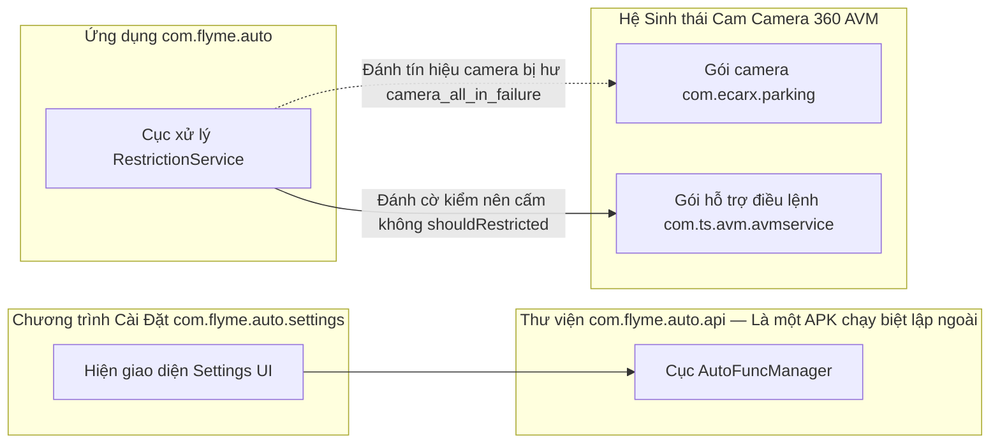

# com.flyme.auto — Hướng dẫn phân tích APK (FlymeAutoService)

Tài liệu này mô tả một ứng dụng thuộc cấp hệ thống có tên **FlymeAutoService** (`com.flyme.auto`) trích xuất từ màn hình điều khiển trung tâm Geely **IHU629G**: nội dung bên trong APK, cách nó đăng ký lõi core-service lên hệ thống thiết bị (ГУ), và cơ chế thực thi các **biện pháp hạn chế/khóa ứng dụng lúc xe đang chạy** (driving restrictions).

**Lưu ý quan trọng:** Đây **không phải** là file thư viện API `com.flyme.auto.api` (Một công cụ AutoFunc / VHAL-bọc ngoài dùng để điều chỉnh cài đặt xe). Thực tế, `com.flyme.auto.api` là một APK hệ thống độc lập hoàn toàn; cả ứng dụng Cài đặt (Settings) lẫn ứng dụng Geely EX2 Tools đều kết nối trực tiếp đến nó (hãy tham khảo tại bài [flyme-settings-apk.md](./flyme-settings-apk.md)).  
Trong khi đó, `com.flyme.auto` đóng vai trò là **tiến trình máy chủ (host-process)** chứa module `CoreService`. Module này sẽ tự khai báo mình trên trung tâm `ServiceManager` rồi cung cấp lại một hệ thống dịch vụ con tên `RestrictionService` cho các app khác (client) xài.

---

## 0. Tổng quan ứng dụng

| Tham số | Giá trị |
|----------|----------|
| Tên Package | `com.flyme.auto` |
| Nhãn hiển thị (Label) | **FlymeAutoService** |
| Mã phiên bản versionCode | `26012722` |
| Tên phiên bản versionName | `flyme.beta.(FlymeAutoService)(null)(26012722)(1b5f169)` |
| Dòng biến thể product flavor (từ BuildConfig) | `e02` |
| minSdk / targetSdk | Yêu cầu 28 / 31 |
| Nền tảng biên dịch compileSdk | 31 (chuẩn Android 12) |
| sharedUserId | `android.uid.system` |
| Cơ sở Application | Gắn class `com.flyme.auto.MainApplication` (kèm cờ `android:persistent=true`, và `directBootAware=true`) |
| Có Launcher Activity (Nút mở app ngoài màn hình) không? | **Không có** (Trong tệp manifest chỉ khai báo thuần túy thẻ `<application>`) |
| Nền tảng cấu trúc DEX | Gồm một file duy nhất `classes.dex` (nặng ~7.4 MB, chứa khoảng ~5155 class) |
| Tổng Kích thước APK | Nặng tầm ~10.5 MB |

**Chức năng chính:** Đây là loại ứng dụng hệ thống lỳ lợm không thể tắt (persistent system-app) và nó đảm đương các việc sau ngay khi khởi động máy:

1. Ghi danh một hệ thống giao tiếp binder tên `flyme_auto_coreservice` (chính là module `CoreService`) vào danh bạ `ServiceManager`.
2. Tạo kết nối tới `android.car.Car` / thông qua bộ `CarPropertyManager`.
3. Kiểm soát luồng logic của tính năng **car restrictions** — nhiệm vụ khóa bớt các app bên thứ 3 lại không cho người dùng xài khi xe đang vô số D/R/N và nút "chế độ hạn chế" đang bật, có quy luật luật phong tỏa riêng biệt dành cho bộ camera vòng 360 AVM cũng như hệ các tiện ích nhỏ Alipay-miniapps.
4. Cấp phát công cụ SDK `com.flyme.auto.sdk` dành riêng cho hệ thống các ứng dụng con client (tên class `RestrictionManager`).

**Nhìn lướt các thành phần còn lại nhúng kèm trong APK (Không tính phần logic chính của service):**

| Khai báo Package trong dex | Lượng lớp Class (Khoảng ≈) | Nhiệm vụ |
|-------------|-------------|------------|
| Các class `androidx.*` | 2428 | Vẽ khung giao diện Material / AppCompat |
| Các class `com.google.*` | 800 | Phục vụ thư viện thiết kế Material Components |
| Các class `com.flyme.auto.design.*` | 490 | Định hình chuẩn giao diện riêng Flyme Auto Design (chứa các công cụ widgets, tạo bảng hộp thoại dialogs, thông báo toasts) |
| Các class `android.car.*` | 458 | Khối mã liên kết xe Android Car API (được nhúng cứng luôn vào bên trong APK) |
| Các class `com.flyme.auto.sdk.*` | 26 | Bộ Client SDK + tích hợp cầu nối giao tiếp AIDL |
| Các class `com.flyme.auto.restriction.*` | 9 | Trạm máy chủ kiểm soát phong tỏa Server |
| Nhóm hạt nhân `com.flyme.auto` (lõi cốt) | 27 | Nơi chứa `MainApplication`, `CoreService`, `Utils` |

Xin chú ý: File thư viện phụ thuộc tên **`com.ecarx.xui.adaptapi`** thực chất **không được nhét vào** file dex này — mà nó sẽ được gọi kết nối rời rạc ở bên ngoài ngay trên máy tính xe (ví dụ qua lệnh `Car.createWrapper()` nhằm mượn property id tắt mở nút joy-limit).

---

## 1. Nguồn và artifact

| Tham số | Giá trị |
|----------|----------|
| Nền tảng (Thiết bị trích xuất dump) | Model IHU629G |
| APK gốc (dùng lệnh qua ADBAppControl) | Lưu thành file `downloads/250060 IHU629G/FlymeAutoService (com.flyme.auto) [v.flyme.beta.(FlymeAutoService)(null)(26012722)(1b5f169)].apk` |
| Bản sao cục bộ | `.tmp/flyme-auto-service.apk` |
| APK đã giải nén | `.tmp/flyme-auto-service-apk/` |
| Xem bằng JADX | Thư mục `.tmp/flyme-auto-service-jadx/` |

### Thao tác lấy APK từ thiết bị

```bash
adb shell pm path com.flyme.auto
adb pull /system/app/.../FlymeAutoService.apk .tmp/flyme-auto-service.apk
```

### Giải nén và khám phá

```powershell
Copy-Item -LiteralPath ".tmp\flyme-auto-service.apk" -Destination ".tmp\flyme-auto-service.zip"
Expand-Archive -Path .tmp\flyme-auto-service.zip -DestinationPath .tmp\flyme-auto-service-apk -Force

$aapt = (Get-ChildItem "$env:LOCALAPPDATA\Android\Sdk\build-tools" -Recurse -Filter "aapt.exe" | Select-Object -First 1).FullName
& $aapt dump badging .tmp\flyme-auto-service.apk

$dexdump = (Get-ChildItem "$env:LOCALAPPDATA\Android\Sdk\build-tools" -Recurse -Filter "dexdump.exe" | Select-Object -First 1).FullName
& $dexdump -d .tmp\flyme-auto-service-apk\classes.dex | Select-String "RestrictionService|flyme_auto_coreservice|PERF_VEHICLE_SPEED"
```

Công cụ **JADX** — dùng cho mục đích đọc ngược xem mã code ở các lớp `CoreService`, module `RestrictionService`, bảng `RestrictionManager`, và kênh liên kết AIDL-interfaces.

---

## 2. Kiến trúc

```mermaid
flowchart TB
    subgraph boot [Chu trình Start khởi động xe]
        MA[MainApplication.onCreate]
        SM[ServiceManager.addService]
        MA --> SM
    end

    subgraph host [Nơi đóng quân com.flyme.auto uid=system]
        CS[Máy chủ CoreService kế thừa ICore.Stub]
        RS[Trạm quản chế RestrictionService kế thừa IRestrictionService.Stub]
        BL[Sổ đen cấm ứng dụng BlackListHandle]
        CS --> RS
        BL --> RS
    end

    subgraph car [Lõi xe Android Car / VHAL]
        CarAPI[Khởi tạo Car.createCar]
        CPM[Trình CarPropertyManager]
        CarAPI --> CPM
    end

    subgraph clients [Ứng dụng khách thụ hưởng (Systems Clients)]
        RM[Lấy RestrictionManager đi qua Core.getInstance]
        SysUI[Các app như SystemUI / Launcher / và nhiều thứ khác.]
    end

    SM -->|Tạo kênh "flyme_auto_coreservice"| CS
    CS --> CarAPI
    CPM --> RS
    RM -->|Gọi xin kết nối "getCoreService(restriction_service)"| RS
    SysUI --> RM
    RS -->|Kiểm tra cấm shouldRestricted / Tình trạng phong tỏa getRestrictionState| SysUI
```

### 2.1 Quá trình đăng ký Core-service

Ngay tại giai đoạn khởi tạo `Application.onCreate()` thì service lúc này **hoàn toàn chưa được** báo công khai trong thẻ khai báo cấu hình XML `AndroidManifest.xml` (dưới thẻ `<service>`). Thay vào đó, cái kênh giao tiếp (binder) mới được âm thầm đưa vào thư mục chung `ServiceManager`:

```java
// Logic bên trong MainApplication.onCreate()
Class.forName("android.os.ServiceManager")
    .getMethod("addService", String.class, IBinder.class)
    .invoke(null, Core.CORE_SERVICE_NAME, new CoreService(this));
```

| Cấu trúc Tên hằng biến | Mang nội dung |
|-----------|----------|
| Biến `Core.CORE_SERVICE_NAME` | Kênh liên lạc `flyme_auto_coreservice` |
| Quá trình Hiện thực (Implementation) | Tích hợp lớp `com.flyme.auto.CoreService` có chức năng kế thừa extends từ `ICore.Stub` |

Module `CoreService` ngay sau lúc sinh ra sẽ làm những việc sau:

- Gọi khởi động trạm `RestrictionService`.
- Bắn lệnh gọi `Car.createCar(context, …, CarServiceLifecycleListener)`.
- Khi thiết lập được với hệ thống xe thành công thì sẽ đánh tiếng thông báo cho các bên thu tín hiệu (Tức là `RestrictionService` sẽ bắt đầu lắng nghe tín hiệu ở VHAL).

### 2.2 Về Bộ Client SDK (tên package `com.flyme.auto.sdk`)

Các chương trình **thuộc dạng hệ thống (system app)** từ bên ngoài sẽ xin lấy các module điều hành nhờ đi qua kênh độc quyền singleton:

```java
Core.getInstance().getManager(ServiceName.RESTRICTION_SERVICE);
// → Kết quả xin được RestrictionManager
```

Thành phần `Core` sẽ gọi truy vấn tới `ServiceManager.getService("flyme_auto_coreservice")`, quá trình này nó kiên nhẫn thử lại cho bằng được lên đến tận **50 lần** (với độ delay là **500 ms**), đồng thời bật tính năng theo dõi chống chết kết nối (`linkToDeath`) và nếu sập sẽ ép tái kết nối lại.

| Khai Báo `ServiceName` | Ứng với Dịch vụ phụ Subservice |
|---------------|-----------|
| Khóa lệnh `restriction_service` | Tức là cần xin gọi `RestrictionService` (Đây cũng là dịch vụ con duy nhất hiện hữu trong cấu trúc bản build này) |

---

## 3. Cỗ Máy Quản Chế RestrictionService — Các luật cấm và giới hạn

Lớp chính giữ trọng trách: `com.flyme.auto.restriction.RestrictionService` (AIDL mang mã `IRestrictionService`).

### 3.1 Bảng Trạng Thái (Status States - tại `RestrictionManager`)

| Tên biến hằng | Mã số int | Giải thích ý nghĩa |
|-----------|-----|-------|
| Biến `UNKNOWN` | -1 | Tín hiệu lỗi: Service hiện mất kết nối không rõ lý do |
| Biến `FUNC_OFF` | 0 | Chức năng phong tỏa ứng dụng đã bị người lái tắt (`mLastLimitState == false`) |
| Biến `NO_RESTRICTED` | 1 | Cơ chế phong tỏa ứng dụng Đang Mở, thế nhưng số xe lúc này **lại không nằm ở** các mốc D/R/N (ví dụ người lái đang đậu P) thì chả ai bị cấm dùng app. |
| Biến `RESTRICTED_START` | 2 | Cơ chế phong tỏa Đang Mở, đồng thời lúc này người lái đã vô số **D, R hoặc là số N** — Bắt đầu hành động khóa họng toàn bộ các ứng dụng app nằm trong cuốn sổ đen (blacklist) |
| Biến `RESTRICTED_RUNNING` | 3 | Cái mã này có khai ra trong bộ SDK, nhưng trong mã code thực thi `RestrictionService` chả thấy mặt mũi xuất hiện xài ở đâu bao giờ |

Trạng thái hệ thống đang chạy ở cấp nào sẽ được ghi báo ngầm lên khu lưu trữ cấu hình Global ở `Settings.Global`:

```text
Biến car_restriction_state có thể là = 0 | 1 | 2
```

### 3.2 Bộ Luật (Quy ước) "tiến hành cấm chặn ngay bây giờ"

```text
Hàm kiểm tra shouldRestricted(Nhận tên gói packageName):
  Giả định gói phần mềm package truyền vào là == com.ts.avm.avmservice (Thằng quản lý Camera 360 AVM):
    Trường hợp camera_all_in_failure báo bằng 1 → Lập tức chặn restrict + ném mẩu tin toast báo lỗi lên (Báo lỗi cam AVM fault)
    Trường hợp nhận thấy tốc độ speed > 30 km/h → Lập tức chặn restrict + ném mẩu tin toast báo lỗi lên (Báo chạy quá tốc độ speed)
    Còn lại các trường hợp khác → cho xài không ngăn cấm
  Giả định gói truyền vô là Các Phần mềm khác (Ngoài cái camera 360 ở trên):
    Nếu tên của cái package này nằm ở trong sổ đen blacklist ĐỒNG THỜI trạng thái máy xe lúc đó state == RESTRICTED_START (tức mã số 2) → Chặn đứng (restrict) + Ném mẩu tin toast cảnh cáo
    Còn lại các trường hợp khác → cho xài bình thường
```

Kho phương thức chung Public API:

| Kênh phương thức AIDL | Tác Dụng |
|------------|------------|
| Hàm `getRestrictionState()` | Trả về xem tình hình hiện tại đang nằm mã nào ở ba mốc 0/1/2 |
| Hàm `isPermittedPkg(pkg)` | Trả giá trị `false`, lỡ như cái gói app/hoặc app rác nhỏ (miniapp) đó nằm trong danh sách đen chặn lại (blacklist) |
| Hàm `shouldRestricted(pkg)` | Phát lệnh xem cuối cùng có cần phải chặn đứng không cho bật lên/sử dụng tiếp hay không |
| Hàm `registerListener` / `unregisterListener` | Dùng để ghi đanh và hủy đăng ký nghe ngóng để gọi trả biến `onRestrictionStateChange` |
| Hàm `showToast(msg)` | Ném tin báo kiểu hệ thống lên màn hình `FlymeToast` (nó được đóng cờ dùng nội bộ private flag) |

### 3.3 Tài sản VHAL-của xe

| Tên Hằng Số đặt trong code | Mã Property ID (theo hệ thập phân dec) | Mã Property ID (theo hệ lục phân hex) | Tác Dụng Đem Lại |
|------------------|-------------------|-------------------|---------------|
| Lệnh `CURRENT_GEAR` | số 289408001 | mã `0x11400401` | Trỏ vào `GEAR_SELECTION` — Hiện đang cài số gì |
| Lệnh `PARKING_BRAKE_ON` | số 287310850 | mã `0x11200402` | Trạng thái kéo Phanh Tay/Phanh Đỗ (Biến này chỉ lấy để đọc chơi thôi, trong hệ tính toán công thức state chả đụng tới) |
| Lệnh `PERF_VEHICLE_SPEED` | số 291504647 | mã `0x11600207` | Lấy ra chỉ số Vận tốc; mức độ làm mới rate là 5.0 khi đăng ký hóng tin |
| Lệnh `TYPE_JOY_LIMIT_SWITCH` | Mã ẩn tùy dòng máy runtime | mã `0x21200032` (Ánh xạ tầm số ≈555775090 cho firmware máy này) | Kiểu gán Boolean có ý là "bật chế độ cấm dùng đt/app khi lái xe"; Tách đọc id qua lớp bọc `com.ecarx.xui.adaptapi.car.Car.createWrapper(ctx).getWrappedPropertyId(3, 4215296)` |

**Nhận diện các kiểu vào Số (gear) để nổ cờ `RESTRICTED_START`:** Số Chạy `GEAR_DRIVE (số 8)`, Số Lùi `GEAR_REVERSE (số 2)`, Số Mo `GEAR_NEUTRAL (số 1)` — Có thể tra cứu thông qua bảng danh mục của hệ thống `android.car.VehicleGear`.

**Ngưỡng ranh giới đo vận tốc:**

| Ngưỡng | Khai báo | Hậu quả (Hành vi) |
|-------|----------|-----------|
| Quá mốc `OVER_SPEED_THRESHOLD_15` | Nếu xe lăn bánh > 15 km/h | Kích hoạt liền đồng hồ bấm giờ timer đếm 5 giây → nổ biến `mIsOverSpeed` (Mục đích để báo cho cụm code hệ thống chung biết) |
| Quá mốc `OVER_SPEED_THRESHOLD_30` | Nếu xe vọt lẹ > 30 km/h | Tịch thu ngay chức năng bật Cam xem quanh xe AVM (Gói app `com.ts.avm.avmservice`) |

### 3.4 Biến hệ thống Settings.Global (Giành cho mấy tay theo dõi observers)

| Khóa Biến Tên Cờ | Thuộc Nhóm (Type) | Mục đích |
|------|-----|------------|
| Cờ `car_restriction_state` | số kiểu int | Dùng làm hầm chứa bộ đệm ghi nhớ xem state đang là gì (Bên trong service sẽ có trách nhiệm ghi vào) |
| Cờ `car_restriction_switch` | số nhị phân int 0/1 | Cho phép nắn lệnh thủ công override gạt bật tắt cái chốt kiểm soát |
| Cờ `camera_all_in_failure` | số nhị phân int 0/1 | Công tắc báo hiệu lỡ như hệ thống mắt thần camera 360 AVM bị lỗi |
| Cờ `running_mini_appid` | kiểu chữ string | Chứa chuỗi mã ID của 1 cái app rác/mini-app Alipay nào đó đang hiện diện lộng hành chạy ngầm |

Nói thêm về một loại ứng dụng nhỏ lọt khe: `com.alipay.arome.app` — trong khi xét sổ đen (blacklist) thì nó không hề bị dò tên ứng dụng, mà dò thông qua kiểm tra cờ `running_mini_appid`.

### 3.5 Báo hiệu Broadcast (Liên quan kết nối EasyConnect / chế độ lái xe drive mode)

| Cú gọi Action | Cấu hình chiều phát | Lúc Nào Chạy |
|--------|-------------|-------|
| Báo `net.easyconn.drivemode.checkstatus` | Bắn **vào (in)** (người nhận receiver) | Gửi câu hỏi yêu cầu khai báo rõ tình hình (status) hiện giờ ra sao |
| Báo `net.easyconn.drivemode.opened` | Xuất **ra ngoài (out)** | Lúc mà State ≠ `NO_RESTRICTED` (Có nghĩa: Máy chém hạn chế app đang sẵn sàng vung lên) |
| Báo `net.easyconn.drivemode.closed` | Xuất **ra ngoài (out)** | Lúc mà State == `NO_RESTRICTED` |

Một khi State thay đổi, thì module service này ngay lập tức bắn pháo sáng ra hiệu `opened` hay là `closed` và la lên thông báo cho toàn bộ các thiết bị đang hóng qua cổng AIDL-listeners.

### 3.6 Sổ Nam Tào Tử Hình (Chứa danh sách ứng dụng cấm dùng)

Luồng kiểm tra thông qua cục `BlackListHandle.readBlackListFromXml()`:

1. Ưu tiên xem trước ổ lấy từ đường truyền máy chủ mạng `/data/misc/security_data/restriction/restriction_black_list.xml`
2. Nếu xui xẻo không tải được thì mượn đỡ (Fallback) file đóng chai cục bộ: `/system/etc/restriction_black_list.xml`

Định dạng kiểu cấu trúc XML:

```xml
<restricted-modules>
  <package name="com.example.app"/>
  <applet id="mini_app_id"/>
</restricted-modules>
```

### 3.7 Cục thông tin chữ chuỗi ném lên màn hình (R.string)

| Mã ID | Bản tiếng Anh EN (Bản lót mặc định) |
|----|--------------|
| Báo `car_restriction_gear_notification` | "Please use this function in P gear" (Làm ơn đậu xe số P rồi hẵng bấm cái này) |
| Báo `car_restriction_notification` | "The app cannot be used while driving" (Đang ôm vô lăng lái xe đừng có đòi xài ứng dụng này) |
| Báo `avm_restriction_notification` | "Vehicle speed too high, function disabled" (Chạy lẹ quá rồi cha nội, chức năng này tắt để bảo toàn tính mạng) |
| Báo `avm_err_restriction_notification` | "AVM is abnormal" (Hệ thống camera quanh xe nay đã hỏng) |

---

## 4. Bảng liên lạc nối kết giữa các APK chạy trên Máy Xe (ГУ)



| Tên Khối Component | Đặc điểm Liên lụy đến FlymeAutoService thế nào |
|-----------|--------------------------|
| Gói `com.flyme.auto.api` | APK **Không hề dính líu (Độc Lập)**; AutoFunc/VHAL này có nghĩa vụ gánh mảng tùy chỉnh xe (settings) |
| Gói `com.flyme.auto.settings` | Nó chỉ dùng mượn súng từ `com.flyme.auto.api`, không đi ngỏ trực tiếp nào với `RestrictionManager` cả |
| Gói `com.ecarx.parking` | Trạm kiểm soát AVM-controller; Phép kiểm duyệt cấm đoán này nọ restriction nó chỉ đè soi thằng `com.ts.avm.avmservice`, không thèm ngó ngàng bóp cổ `com.ecarx.parking` |
| Gói `com.ts.avm.avmservice` | Ứng dụng chốt mục tiêu nhắm tới của thiết chế khóa ngàm quá tốc độ speed/hư camera |
| Bộ SystemUI / cùng Launcher | Là tệp khách hàng quen thuộc ưa bấu víu xài API hàm `RestrictionManager.shouldRestricted()` để hỏi thăm tin tức |

---

## 5. Danh Sách Phân Quyền Bảo Mật xin cấp (Từ manifest)

| Cờ Quyền Permission | Có nó để làm gì |
|------------|-------|
| Cờ `android.car.permission.CAR_SPEED` | Bắt đo tốc độ chạy |
| Cờ `android.permission.MANAGE_USERS` | Để xưng danh System app |
| Cờ `android.permission.ACCESS_CACHE_FILESYSTEM` | Quyền cấp System |
| Cờ `INTERNET`, cờ `ACCESS_NETWORK_STATE` | Mở mạng Net (Nghi vấn là để kéo cập nhật sổ tử blacklist offline lên onl?) |
| Cờ `FOREGROUND_SERVICE`, cờ `WAKE_LOCK` | Hỗ trợ cho bộ hoạt động giấu mặt sau lưng (Foward background logic) |

---

## 6. Chỉ đạo Vọc Vạch Gỡ Lỗi Trực Tiếp Trên Máy

### Xét kiểm thử xem Service có khai báo đăng ký thành công hay chưa

```bash
adb shell service list | findstr flyme_auto
# Hi vọng rớt ra kết quả: flyme_auto_coreservice
```

### Soi rọi file log lỗi Logcat

```bash
adb logcat | findstr /i "FlymeAuto.CoreService FlymeAutoRestrictionService FlymeAutoSDK.Core MainApplication"
```

### Xem nhanh thông số Tình trạng hạn chế app tính đến lúc này (Bằng lệnh command)

```bash
adb shell settings get global car_restriction_state
adb shell settings get global car_restriction_switch
adb shell settings get global camera_all_in_failure
adb shell settings get global running_mini_appid
```

### Chẩn Bệnh Các Kiểu Vấp Ngã (Bệnh Lý Khó Chữa Điển Hình)

| Biểu hiện lâm sàng (Symptom) | Thủ Phạm gây án nghi vấn cao (Lý do) |
|---------|-------------------|
| Gọi hàm `RestrictionManager.getRestrictionState()` mà chả lần nào báo ngoài biến -1 | Phần mềm chính `com.flyme.auto` bị chết hụt ngâm giấm không chịu kích nổ / chưa khai sinh cờ đăng ký `flyme_auto_coreservice` |
| Ném báo lỗi Exception `ClassNotFoundException: com.flyme.auto.sdk.*` | Mã code xây dựng khách Client không ôm theo bộ system SDK vào lò build; nên nhớ bên trong đầu máy xe ГУ đống mớ class này nằm tít bên trong cái bụng file APK của `com.flyme.auto` |
| App Cam 360 AVM mãi không thấy bị phong ấn (Bị cấm khi đi nhanh) | Cần nhớ là thằng bắt lỗi cấm nó dò vào package `com.ts.avm.avmservice`, chứ không phải là nhắm vào thằng `com.ecarx.parking` nha |
| Soi bảng log thấy báo chửi rủa exception ngay chỗ `TYPE_JOY_LIMIT_SWITCH` | Bản Firmware máy ô tô này không được nạp gói code `com.ecarx.xui.adaptapi` đi theo |

---

## 7. Khai Thác Ứng Dụng dành cho Tool Hữu Ích Geely EX2

Đối với mục đích **chi phối tinh chỉnh hệ thống cài đặt máy xe** (giả dụ điều lệnh về chế độ lái drive mode, hiệu ứng đèn ambient led, v..v) Bạn hãy ứng dụng kỹ thuật ngầm reflection đánh thẳng hướng đích vào API **`com.flyme.auto.api`** — bắt chước tương tự kiểu khai báo `FlymeDrivingModeApi`, `FlymeAmbientLightApi` (tham chiếu học lỏm từ tài liệu [flyme-settings-apk.md](./flyme-settings-apk.md)).

Còn nói về gói mã code **`com.flyme.auto`** hay cục máy **`RestrictionManager`** này, bạn **CHỈ** cần móc vào xài nếu bị bắt buộc phải gánh vác các hệ quả như:

- Có nhu cầu hóng hớt lén tìm hiểu trạng thái / đăng ký ngầm đón sự kiện hạn chế tắt app của xe (driving restriction state);
- Bạn định dùng hàm nhái `shouldRestricted()` để cho phần mềm ứng dụng của chính bạn tự ra vẻ nguy hiểm kiểm lỗi theo;
- Định cấu trúc hòa nhập bắt chước sóng bắn broadcast qua kênh tín hiệu `net.easyconn.drivemode.*`.

Kiểu code làm mẫu để mô phỏng (Yêu cầu ngặt nghèo là máy bạn phải được chứng chỉ root cấp system-privileged / hoặc được nhượng đặc quyền shared UID, **tuyệt đối không áp dụng** với loại app ghẻ tải cài thường từ kho Play-store mà chẳng có bùa chữ ký platform):

```java
// Ép buộc bắt buộc file build máy xe phải nạp nhét cái com.flyme.auto.sdk vào bên trong luồng classpath
RestrictionManager rm = RestrictionManager.getInstance();
int state = rm.getRestrictionState(); // Lấy biến tình hình quản chế coi sao
boolean blocked = rm.shouldRestricted("com.example.app"); // Lên kiểm chứng thử mộc cấm xài lướt app com.example.app có bị án không
```

---

*Hồ sơ tài liệu này được giải phẫu phân mảnh đúc kết qua bản build gốc của APK `com.flyme.auto` version v26012722 (Máy IHU629G, mã build nội khoa là 1b5f169, thuộc giống nòi flavor e02). Sẽ có nguy cơ bạn phải mổ lại app nếu nâng cấp phiên bản rom khác (vì các thông số nhạy cảm như property id khóa chốt niềm vui joy-limit switch, cấu hình danh bạ đen blacklist và hạn định giới hạn chạy quá tốc độ (speed thresholds) rất dễ bị biến tấu tùy theo ngẫu hứng của hãng xe).*
