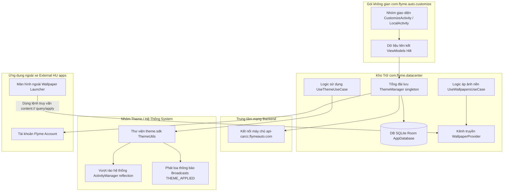

# com.flyme.auto.customize — Hướng dẫn phân tích APK

Tài liệu này mô tả ứng dụng hệ thống mặc định **Оформление темы** / **Themes** (Tùy chỉnh giao diện/Chủ đề) (`com.flyme.auto.customize`) được lấy từ màn hình điều khiển trung tâm Geely **IHU629G**: bao gồm các chủ đề/hình nền cục bộ và trực tuyến, tính năng tạo hình nền bằng AI (Geely GPT), cửa hàng chủ đề Flyme Auto, việc áp dụng chủ đề qua Theme SDK và `ContentProvider` công khai để cấp hình nền cho ứng dụng launcher.

Các module hệ thống phụ thuộc **không được nhúng kèm trong APK**, nhưng được ứng dụng gọi dùng liên tục:

- Gói `com.ecarx.eas.sdk` — Dùng API thiết bị (DeviceAPI), OpenAPI (Lấy UAID, mã dự án project code, giới hạn lái xe driving joy limit)
- Gói `com.flyme.auto.account` — Xử lý Flyme Account / xác thực thanh toán giao dịch mua
- Gói `com.flyme.auto.openidsdk` — Quản lý OpenID / lấy device id
- Gói `com.flyme.auto.coreservice` — Quản lý xác thực FlymeAuthManager
- Lớp `com.android.server.ThemeManager` (Qua kỹ thuật reflection) — Ép đổi chủ đề ở tầng hệ thống ActivityManager

Ứng dụng liên đới trên màn hình xe: **Wallpaper Launcher** (`com.flyme.auto.wallpaperlauncher`) — chính là "khách hàng" tiêu thụ dữ liệu từ `WallpaperProvider`; vui lòng xem thêm tài liệu ở `.tmp/flyme-wallpaperlauncher-*`.

---

## 0. Tổng quan ứng dụng

| Tham số | Giá trị |
|----------|----------|
| Tên Package | `com.flyme.auto.customize` |
| Nhãn hiển thị (Label - Tiếng Nga) | **Оформление темы** |
| Nhãn hiển thị (Label - Tiếng Anh) | **Themes** |
| Nhãn hiển thị (Label - Tiếng Trung) | **主题美化** |
| Mã phiên bản versionCode | `26012722` |
| Tên phiên bản versionName | `flyme.beta.(AutoCustomizeCenter)(null)(26012722)(704108a)` |
| Biến thể product flavor (từ BuildConfig) | **`e22hg`** (Cho dòng xe Galaxy E22 / EX2) |
| Yêu cầu minSdk / targetSdk | 28 / 33 |
| Biên dịch với compileSdk | 33 (Chuẩn Android 13) |
| sharedUserId | **Không có** (Không dùng quyền hệ thống `android.uid.system`; nhưng nhận được đặc quyền ưu tiên nhờ cấp độ platform/priv-app signing) |
| Thành phần Application gốc | Khởi chạy qua `com.flyme.auto.customize.App` (Sử dụng Hilt) |
| Tác vụ mở từ Launcher Activity | Nút bấm gọi `com.flyme.auto.customize.ui.local.LocalActivity` |
| Tác vụ hub tổng hợp dự phòng (Alternative hub) | Nhắm vào `com.flyme.auto.customize.ui.CustomizeActivity` (Gọi bằng action `com.flyme.auto.customize.wallpaper.main`) |
| Không gian DEX | Có một tệp `classes.dex` duy nhất (~8.2 MB, với khoảng ~4800 class hiện trên JADX) |
| Thư viện lõi Native `.so` | `librenderfilter.so`, `libflyme_account.so`, `libmmkv.so`, `libbspatch.so` (Chuẩn `arm64-v8a`; Cài cờ `extractNativeLibs=false`) |
| Độ lớn kích thước APK | Nặng ~16.5 MB |

**Chức năng cốt lõi:** Đóng vai trò là trung tâm cá nhân hóa (personalization hub) của bộ giao diện Flyme Auto HU — chứa danh mục chủ đề (theme) và hình nền mạng, kho trưng bày ảnh offline, hỗ trợ dùng thử/trả tiền mua chủ đề, đăng hình nền sự kiện lễ tết, cấp công cụ hình nền AI (Inspired Painter / Geely GPT), nơi tinh chỉnh cấu hình và đồng thời cung cấp cổng dữ liệu API cho màn hình chính (launcher).

**Ngăn xếp kỹ thuật - Stack (Theo phân tích JADX):**

- Mặt Giao diện (UI): Dùng **DataBinding** + Kiến trúc **Navigation Component** (`CustomizeActivity` → dẫn tới `main_nav_graph`)
- Quản lý tiêm phụ thuộc (DI): **Dagger Hilt**
- Quản lý Dữ liệu: Kho cơ sở dữ liệu **Room** (`AppDatabase`, `ThemeDao`, `WallpaperDao`) + Cấu hình **DataStore** (`PrefsDataStore`)
- Lớp Mạng: **Retrofit** + Nền tảng OkHttp → Trỏ đến domain `https://api-carcc.flymeauto.com/`
- Module Chủ đề: Trình `UseThemeUseCase` → Gọi `com.flyme.auto.theme.sdk.utils.ThemeUtils` (Qua phép reflection + lệnh broadcast)
- Module Hình nền: Trình `UseWallpapersUseCase` + Cấp phát `WallpaperProvider` (Mở cổng ContentProvider)
- Module Thu thập dữ liệu phân tích (Analytics): Dùng hệ thống SensorsData **v0.3.2** (`ubpdata.geely.com`, gắn project `OneOS`)
- Điều khoản chính sách: SDK Chính sách Flyme Policy (`PolicyAutoSdk`)
- Trí tuệ AI: Module `com.geely.gpt.inspiredpainter.*`, giao diện `AlbumFacade` (Bộ SDK `0.0.1.18`)

**Điểm đặc thù của bản build flavor `e22hg`:** Bên trong mã cấu hình của `LocalActivity` thuộc biến thể này, hệ thống **đã ẩn đi tab "Themes" (Chủ đề)** — tức là chỉ cho phép chừa lại mỗi mục cài hình nền offline (`LocalWallpaperFragment`). Giao diện đầy đủ hiển thị cả tab chủ đề chỉ được mở ở các mã product flavors khác (đọc chi tiết ở phần §2.2).

---

## 1. Nguồn gốc và tệp trích xuất

| Tham số | Giá trị |
|----------|----------|
| Nền tảng thiết bị (Nơi trích dump) | Model IHU629G |
| Tệp APK nguyên thủy (Tải qua ADBAppControl) | Nằm ở `downloads/250060 IHU629G/Оформление темы (com.flyme.auto.customize) [v.flyme.beta.(AutoCustomizeCenter)(null)(26012722)(704108a)].apk` |
| Bản chép cục bộ | File `.tmp/flyme-customize.apk` |
| Thư mục giải nén APK | `.tmp/flyme-customize-apk/` |
| Mã nguồn xem trên JADX | `.tmp/flyme-customize-jadx/` |
| Tệp xuất mã thô dexdump (Bản full) | `.tmp/flyme-customize-dexdump.txt` |

### Hướng dẫn kéo APK từ xe

```bash
adb shell pm path com.flyme.auto.customize
adb pull /system/priv-app/.../Customize.apk .tmp/flyme-customize.apk
```

### Các bước bung nén và khám phá

```powershell
Copy-Item -LiteralPath ".tmp\flyme-customize.apk" -Destination ".tmp\flyme-customize.zip"
Expand-Archive -LiteralPath .tmp\flyme-customize.zip -DestinationPath .tmp\flyme-customize-apk -Force

$aapt = (Get-ChildItem "$env:LOCALAPPDATA\Android\Sdk\build-tools" -Recurse -Filter "aapt.exe" | Select-Object -First 1).FullName
& $aapt dump badging .tmp\flyme-customize.apk

$dexdump = (Get-ChildItem "$env:LOCALAPPDATA\Android\Sdk\build-tools" -Recurse -Filter "dexdump.exe" | Select-Object -First 1).FullName
& $dexdump -d .tmp\flyme-customize-apk\classes.dex | Select-String "WallpaperProvider|ThemeManager|UseThemeUseCase"
```

Công cụ **JADX** — chính là vũ khí chủ lực để soi sáng vào các cấu trúc phức tạp như `ThemeManager`, `WallpaperProvider`, kênh kết nối `ThemeRetrofitApi`, lõi ứng dụng `App`, cũng như giao diện `CustomizeActivity`.

---

## 2. Giao diện người dùng (UI) và Hệ thống Điều hướng (Navigation)

### 2.1 Các điểm thâm nhập (Khai báo ở tệp Manifest)

| Khối Component | Xuất ra ngoài exported | Nhiệm vụ / Hành vi Intent gọi |
|-----------|----------|---------------------|
| `LocalActivity` | Có | Gắn cờ `MAIN` + `LAUNCHER` — Nút bấm "Themes" hiển thị trên menu launcher |
| `LocalActivity` | Có | Hành động `com.flyme.auto.customize.wallpaper.pick` — Giao diện chọn hình nền |
| `CustomizeActivity` | Có | Kênh `com.flyme.auto.customize.wallpaper.main` — Sảnh chờ (hub) chứa các mục thư viện online và AI |
| `WallpaperDetailActivity` | Có | Lệnh `com.flyme.auto.customize.wallpaper.setting` — Vào màn hình soi chi tiết/áp dụng set hình nền |
| `WallpaperPickerActivity` | Có | Công cụ picker bốc chọn bên ngoài (exported) |
| `IpGenerateActivity` | Có | Bộ màn hình vẽ sáng tác hình nền bằng AI (Chạy Geely GPT) |
| `UseThemeReceiver` | Có | Nhận tín hiệu `com.flyme.auto.theme.action.use` — Yêu cầu app tự đổi qua theme khác thông qua broadcast |

### 2.2 Sảnh `LocalActivity` — Trưng bày thư viện máy (Local Gallery)

```mermaid
flowchart TB
    subgraph local [Trang LocalActivity]
        TAB[Tab menu điều hướng FlymeTabLayout: Chia nhánh Oboи (Ảnh nền) / Temы (Chủ đề)]
        VP[Lõi cuộn trang NoScrollViewPager]
    end
    TAB -->|Chuyển tab số 0| WALL[Giao diện mảng LocalWallpaperFragment]
    TAB -->|Chuyển tab số 1| THEME[Giao diện mảng LocalThemeFragment]
    TAB --> VP
```

| Tên Tab (Thẻ) | Tên mảng Fragment | Chứa nội dung gì |
|---------|----------|------------|
| Ảnh nền (Обои) | Nạp `LocalWallpaperFragment` | Nơi lôi ra các file ảnh offline trong máy, mở từ USB/bộ sưu tập Gallery, xem file được máy AI vẽ lưu vào (`IpRecordActivity`) |
| Chủ đề (Темы) | Nạp `LocalThemeFragment` | Liệt kê các file dạng `.mtpk` đã cài và chủ đề gốc của xe |

**Riêng phiên bản xe có Flavor `e22hg`:** Bên trong mã lệnh `LocalActivity.i()` máy sẽ ngầm trả về `true` → Hệ quả là nó sẽ **đóng sập tàng hình** tab "Themes" (Mã khóa `tabLayout.visibility = GONE`, nên trang này chỉ còn trơ trọi 1 fragment duy nhất). Biện pháp che giấu này cũng được thi hành trên các flavor như `p417`, `l946` và một số nền xe hơi khác (`e245`, `e335cn`, `fx11a2`, …).

### 2.3 Sảnh `CustomizeActivity` — Kho mạng online + Sảnh AI hub

```mermaid
flowchart TB
    subgraph hub [Trang CustomizeActivity]
        HDR[Phần Đầu Header: Có nút AI / Mục máy (Local) / Nút Cài đặt (Settings)]
        NAV[Khung rỗng định hướng NavHostFragment main_nav_graph]
    end
    HDR -->|Bấm vào ic_ai| AI[Nhảy sang IpHomeActivity / Họa sĩ AI painter]
    HDR -->|Bấm vào ic_local| LOC[Trả về trang LocalActivity]
    HDR -->|Bấm vào ic_setting| SET[Chạy qua màn hình SettingActivity]
    NAV --> HOME[Nạp HomeFragment — Hiển thị nguyên một danh mục kho online]
    NAV --> ONLINE[Chạy OnlineThemeActivity / ThemeDetailActivity]
```

- Ngay sau bước xác nhận đồng ý điều khoản riêng tư (`LifecycleExtensionKt.checkValidity`), hệ thống sẽ nạp tải cái `HomeFragment` thông qua bộ Navigation.
- Thao tác bấm nút quay lại `onBackPressed()` → Nó sẽ ghim tác vụ xuống nền `moveTaskToBack(true)` (Thay vì kết thúc tiến trình finish).
- Dãy trên nón (Header): Cho phép chuyển hướng qua chỗ sáng tác AI, về kho ảnh cục bộ, hoặc lôi ra cái cài đặt.

### 2.4 Một số thành phần Activity lặt vặt khác

| Activity | Mục Đích |
|----------|------------|
| Trang `OnlineThemeActivity` | Là cái Cửa tiệm cửa hàng bán chủ đề |
| Trang `ThemeDetailActivity` | Màn hình xem review thông tin trước khi Mua/Tải xuống/Áp dụng |
| Trang `WallpaperDetailActivity` | Tấm màng coi trước (preview) hình (Gắn thêm hiệu ứng làm mờ nền blur bằng sức mạnh của thư viện `librenderfilter.so`) |
| Trang `SettingActivity` | Trang điều chỉnh tính năng (Gạt công tắc sự kiện festival switch, xem privacy, hay about) |
| Trang `WebActivity` | Khung lướt web mini WebView chèn trong app (Để mở đọc giấy phép, trang hướng dẫn help) |
| Trang `LoginQrCodeActivity` | Hiện QR Code quét mã đăng nhập để lôi album Geely GPT |
| Trang `PolicyAutoWebViewActivity` | Chứa điều khoản của Flyme Policy SDK |

---

## 3. Kiến Trúc Hoạt Động (Architecture)



### 3.1 Giai đoạn Bơm Máu Khởi tạo (`App.onCreate`)

1. Nạp cờ `ConfigInitializer` + Gọi `DeviceServiceImpl` (Để móc kênh thiết bị eCarX `DeviceAPI`).
2. Kích chạy `OpenApiManager.e(context, config, "e22hg")` — Báo mã đời xe product code vào API headers cho máy chủ mạng biết.
3. Chạy lệnh `PolicyAutoSdk.initSDK(...)` — Kích hoạt cái điều khoản bảo vệ quyền riêng tư / GDPR.
4. Mở cơ quan `FlymeAuthManager` + chạy coreservice xác thực auth.
5. **Dựng xưởng AI (AI stack):** Kích chạy `AIUtils.initAI()` — Gọi 3 món `AlbumFacade`, `GenerationManager`, và chờ móc gọi lại ở callback của `WallpaperService` → Truyền lệnh qua `WallpaperUtils.useWallpaper`.
6. Phân tích `Settings.Global.NET_CONFIG` → Xét xem vô đường nào của Geely GPT (Bản chạy thật `PROD` hay bản test thử nghiệm tùy vào môi trường `Platform.EnvType`).
7. Quản gia `ThemeManager.init(...)` đứng ra thầu thông qua Hilt / Báo nạp `SyncInitializer`.

Mớ thẻ Meta-data quan trọng đính trong manifest:

| Từ Khóa (key) | Có Dụng Ý Gì |
|-----|------------|
| Thẻ `com.flyme.auto.customize.Account_AppId` | Móc nối danh tính bằng tài khoản Flyme Account |
| Thẻ `com.flyme.auto.customize.UsageStat_AppId` | Theo dõi tần suất bấm đo đạc Usage stats |
| Thẻ `eCarX_OpenAPI_AppId` / cùng mã `AppKey` | Trình báo mở chốt khóa eCarX OpenAPI |
| Thẻ `com.sensorsdata.analytics.android.version` | Load engine phiên bản `0.3.2` |

---

## 4. Đặc tả đường dẫn hệ thống Tệp (FileSystem) trên Màn HÌnh Xe

Toàn bộ hệ thống thư mục gốc (root directory) sẽ chia ra theo từng hồ sơ người lái per-user (`Utility.myUserId()`):

| Địa chỉ thư mục | Ý nghĩa / Chứa gì |
|------|------------|
| Dẫn tới `/data/customizecenter/{userId}/` | Nơi tập kết làm rễ mọi thông tin dữ liệu của app |
| Trỏ vào `.../Themes/` | Ổ chứa các file `.mtpk` chủ đề tải từ trên mạng xuống |
| Trỏ vào `.../TrialThemes/` | Nơi cất giấu các bộ giao diện xài ké (chủ đề dùng thử) |
| Trỏ vào `.../Wallpapers/` | Thư viện cá nhân của người dùng |
| Nằm ở `/system/customizecenter/theme/mtpks/{pkg}.mtpk` | Kho chứa các chủ đề bất tử được ghim sẵn từ khi xuất xưởng |
| Nằm ở `/system/customizecenter/theme/preview/` | Ổ chứa các ảnh chụp màn hình xem trước (preview) của mấy bộ chủ đề gốc |
| Chỗ `system/customizecenter/wallpaper/` | Thư mục **chỉ cho phép đọc (read-only)** chứa các ảnh tĩnh mặc định (như file khởi đầu là `s01.jpg`) |
| Chỗ `system/customizecenter/wallpaper_ext/` | Bộ tranh ảnh dự phòng được cung cấp thêm |

Chuẩn nén định dạng của Theme: Dạng file kho nén ZIP **`.mtpk`** bên trong ôm kèm tờ sớ `description.xml` (được đọc và dịch qua bộ parse `ThemeManifestHandler` / chạy chuẩn SAX).

Danh sách mã package id của các theme bị ghim chết từ nhà sản xuất (hệ thống nghiêm cấm người dùng dọn dẹp xóa bỏ):

| Định danh packageName | Có chức vụ gì |
|-------------|------|
| Mã `com.meizu.theme.system` | Bảng theme mặc định ra lò (factory default) |
| Mã `com.meizu.theme.flyme` | Bộ mặt tiền chuẩn của Flyme |
| Mã `com.meizu.theme.model.default` | Theme cứu trợ (fallback) lỡ có biến |
| Mã `com.meizu.theme.flyme.test` | Mẫu bản vá chạy thử (test build) |

---

## 5. Danh Sách Các Chìa Khóa System Properties / Cài Đặt (Settings)

Sau đây là toàn bộ thông số các mốc chìa khóa mà app sẽ **mở khóa đọc và ghi nhận lại** (Bạn phải để ý là màn hình launcher và bộ CustomizeCenter phải chung tiếng nói kết hợp qua các chìa này):

| Tên Khóa (Key) | Nằm vùng ở Store nào | Nó Làm Gì |
|-----|-------|------------|
| Cờ `flyme_theme_switch` | Sổ `Settings.System` | Cho số `1` — Tức bật đèn xanh cho cái tay sai `UseThemeReceiver` thực hiện áp theme luôn |
| Cờ `using_theme_package_name` | Trong vùng prefs / bộ nhớ theme state | In vào đấy tên của gói chủ đề đang bật xài |
| Cờ `key_using_theme_package_name` | Nằm trong DataStore | Giữ vai trò sao chép nhái lại gói theme active (dự phòng) |
| Cờ `wallpaper_launcher_current_wallpaper_path` | Báo ở cấp System | Thông cáo địa chỉ nơi để bức hình nền hiện đang áp trên launcher |
| Cờ `current_wallpaper_collection_id_settings_key` | System | Mã ID ghi nhớ cái bộ album ảnh nền |
| Cờ `current_wallpaper_collection_id_settings_pos` | System | Đánh dấu số thứ tự (index) ảnh trong bộ album ảnh đó |
| Cờ `current_wallpaper_collection_id_settings_position` | System | Biến số định danh bí danh (alias) thế thân cho mã thứ tự trên |
| Cờ `key_effective_festival_using_wallpaper_path` | DataStore | Dẫn đường tới bức ảnh dịp lễ hội/sự kiện |
| Cờ `key_effective_festival_using_collection_id` | DataStore | Ghi mã album của dịp lễ hội đó |
| Cờ `key_take_effect_festival_entity_list` | DataStore | Mảng dữ liệu chứa danh sách thông số các đối tượng tham gia lễ hội (festival entities) |
| Cờ `key_privacy_permission` | DataStore | Tích xác nhận cờ hiệu chứng minh rằng user đã bấm đồng ý cái bảng privacy |
| Cờ `NET_CONFIG` | Ghi ra `Settings.Global` | Trả chữ `PROD` → Tức là ra hiệu cho nối vào trạm Backend AI xịn |
| Cờ `persist.flyme.res.api.level` | Cờ system property | Thể hiện mức độ bậc hệ thống theme API của Flyme |

Nhóm thông số Intent đi kèm (Phục vụ việc vô màn hình theme detail hay là lệnh phục hồi restore lại):

| Biến extra truyền đi | Dạng dữ liệu |
|-------|-----|
| Tham số `key_intent_theme_id` | Chuỗi String |
| Tham số `key_intent_theme_name` | Chuỗi String (Trong `UseThemeReceiver` nó được gọi là: `theme_name`) |
| Tham số `key_intent_theme_path` | Chuỗi String |

Các khóa lưu trữ riêng để đếm giờ dịch vụ xài thử Trial service prefs (Cất ở file `ThemeConstants`):

| Khóa key | Có ý nghĩa |
|-----|------------|
| Mục `flyme_theme_trail_packagename` | Chứa tên mã package của theme đang trong quá trình xài thử ké (chưa mua) |
| Mục `flyme_theme_trail_start_time` | Ấn định lưu lại đồng hồ thời gian (timestamp) mốc khi nào xài |
| Mục `flyme_theme_trail_service_wake_up_intent` | Đánh tiếng truyền lệnh đánh thức hệ thống đếm giờ xài thử tỉnh lại |

---

## 6. Mỏ Nội Dung `WallpaperProvider` — Kho API xuất kho cấp cho launcher

**Đường truyền (Authority):** `com.flyme.auto.customize.provider.WallpaperProvider`  
**Chế độ exported:** Đã kích hoạt (Mở cửa tự do)

| Tuyến đuôi địa chỉ (URI path) | Số hiệu lệnh code | Chịu trách nhiệm |
|----------|------|------------|
| Yêu cầu `/query` | mang số 1 | Hỏi xin bức ảnh hiện thời / hay xin danh sách một nhóm tập hình |
| Yêu cầu `/update_current` | mang số 2 | Ép đổi cái ảnh hiện tại thành ảnh mới |
| Yêu cầu `/query_desktop` | mang số 3 | Gọi xem trạng thái hình nền ngoài desktop (màn chính) |
| Yêu cầu `/apply_desktop` | mang số 4 | Yêu cầu phủ lên màn desktop |
| Yêu cầu `/check_desktop` | mang số 5 | Kiểm kê chẩn đoán trạng thái cái desktop |
| Yêu cầu `/check_wow` | mang số 6 | Điều phối kiểm tra trạng thái màn chế độ WOW mode |
| Yêu cầu `/apply_wow` | mang số 7 | Xin cấp quyền hiển thị cho WOW mode |
| Yêu cầu `/query_current_wallpaper_size` | mang số 8 | Xin trả về lượng ảnh tổng đang có trong một tập album |
| Yêu cầu `/query_collections_size` | mang số 9 | Hỏi máy đang có tổng cộng bao nhiêu bộ album |
| Yêu cầu `/set_pre_wallpaper` | mang số 10 | Trượt về bức ảnh trước đó |
| Yêu cầu `/set_next_wallpaper` | mang số 11 | Trượt qua bức ảnh tiếp theo |
| Yêu cầu `/apply_other_wallpaper` | mang số 12 | Đổi rẽ sang chọn một cái bộ sưu tập khác |

Cú pháp lệnh ví dụ:

```text
content://com.flyme.auto.customize.provider.WallpaperProvider/query
content://com.flyme.auto.customize.provider.WallpaperProvider/apply_desktop
```

Chính sách giới hạn (Limit): Ứng dụng khống chế gắt gao số lượng ảnh tải vào album của người dùng ở mức **15** tấm (`WallpaperUtils.checkMaxSize` — cơ chế tự động dọn vệ sinh sẽ soi xem nếu hòm vượt chỉ tiêu thì nó lạnh lùng xóa phăng bức hình mốc meo cũ nhất oldest).

---

## 7. Phát Báo (Broadcast) / Và Các Cục Dịch Vụ (Service)

### 7.1 Lực lượng Cảnh giới ngóng tin (Receivers)

| Tên Lính Gác (Receiver) | Tín Hiệu Nổ Action | Hành Vi Ứng Xử |
|----------|--------|------------|
| Cục `UseThemeReceiver` | Hóng `com.flyme.auto.theme.action.use` | Sẽ thực thi cài cắm áo mới cho theme (Lấy biến extra `theme_name`), nếu công tắc `flyme_theme_switch=1` đang thông luồng |
| Cục `ThemeReceiver` | Hóng `com.flyme.auto.theme.trial.end` | Dứt báo điểm thời gian hết hạn xài thử |
| | Hóng `com.flyme.auto.theme.trial.purchase` | Nhận tin khách quẹt thẻ chốt đơn mua sau giờ dùng ké |
| | Hóng `com.flyme.auto.theme.download.CHECK_UPDATE` | Chạy bộ rà cập nhật mới |
| | Hóng `flyme_theme_trail_service_wake_up_intent` | Đánh trống lôi hệ thống tính tiền trial tỉnh dậy |
| Cục `FestivalBroadcastReceiver` | Canh tin báo `BOOT_COMPLETED`, hoặc `com.flyme.auto.theme.festival.check`, và `ecarx.intent.action.power.STRMODE` | Lo giăng hình nền đón các dịp tết lễ hội |
| Cục `IPOBroadReceiver` (của bộ SDK điều khoản) | Canh tin báo `ACTION_BOOT_HU`, hoặc `ACTION_SHUTDOWN_HU` | Giải quyết sinh tử vòng đời chính sách quyền riêng tư policy lifecycle |

### 7.2 Các Tổng đài dịch vụ (Services)

| Tổng đài Service | Đảm đương Việc Gì |
|---------|------------|
| Cục `ThemeTrialService` | Hiện bảng nhắc thông báo ở dạng nổi foreground, bấm giờ lùi (countdown) báo xài ké → xong sẽ gọi cho cục `ThemeRestoreService` dọn dẹp |
| Cục `ThemeRestoreService` | Sát thủ ra tay lột áo lôi xe quay về nguyên mẫu mặc định (rollback) khi người dùng ngoan cố xài mà không trả tiền (hết giờ) |
| Cục `FestivalUpdateJobService` | Hệ thống lịch trình (JobScheduler) — chạy đồng bộ tranh ảnh dịp lễ tự động ngầm |
| Trình `Downloader` (Của khối `com.meizu.flyme.appstore.appmanager`) | Gánh tải download manager riêng biệt cho các gói `.mtpk` kéo về |

### 3.3 Chu trình "đổ bê tông" lên Theme hệ thống (Thông qua bộ Theme SDK)

Toàn bộ chạy trong tay `com.flyme.auto.theme.sdk.utils.ThemeUtils.c(context)`:

1. Hack hệ thống (Reflection): Cạy qua `ActivityManager.getDefault()` → Lấy cho được `getConfiguration()` → Chơi ép lệnh `configurationExt.fireThemeChange()`.
2. Áp vào `ActivityManager.updateConfiguration(...)`.
3. Cầm loa phát báo ầm xóm: Lệnh broadcast `com.android.server.ThemeManager.action.THEME_APPLIED`.
4. Bồi thêm lệnh thông cáo nội bộ broadcast `com.meizu.theme.change`.

---

## 8. Nối Mạng Xã Hội (Nhờ bộ ThemeRetrofitApi)

**URL Bệ Phóng (Base URL):** Chọc thẳng `https://api-carcc.flymeauto.com/` (Do bộ `RetrofitManager` kiểm soát, với thời gian chờ phản hồi timeout giới hạn 6s)

| Giao Thức (Method) | Đầu cắm (Path) | Tác Dụng Làm Gì |
|--------|------|------------|
| Gửi GET | Vô nhánh `/carcc/public/v{version}/index` | Bê danh mục liệt kê danh sách theme (Lấy cấu trúc home blocks) |
| Gửi GET | Vô nhánh `/carcc/public/detail/{themeId}` | Lấy chi tiết tấm thiệp info của thẻ theme đó |
| Gửi GET | Vô nhánh `/carcc/public/detail/check_update` | Hỏi xin tình hình cập nhật mới |
| Gửi GET | Vô nhánh `/carcc/public/download` | Giật lấy đường link URL để tuốt hàng (download miễn phí) |
| Gửi GET | Vô nhánh `/carcc/public/download/trial_url` | Xin link cấp hàng hàng thử (URL xài thử) |
| Gửi GET | Vô nhánh `/carcc/public/wallpaperset/detail/{id}` | Coi danh mục của một bộ album hình |
| Gửi GET | Vô nhánh `/carcc/public/wallpaperset/download` | Lấy đường chỉ URL dẫn tới đống hình đó |
| Gửi GET | Vô nhánh `/carcc/public/festivalWallpaper/config` | Tải mảng thông số kỹ thuật (festival config) cho ảnh ngày lễ |
| Gửi GET | Vô biến `{url}` | Bưng cấu trúc mảng nội dung đa hình (dynamic content set) |
| Dẩy POST | Vô ổ `/carcc/oauth/order/indpay/add` | Ra lệnh tạo một bill thanh toán đặt hàng |
| Dẩy POST | Vô ổ `/carcc/oauth/order/indpay/check` | Khảo sát kiểm định hóa đơn |
| Dẩy POST | Vô ổ `/carcc/oauth/order/add` | Nhét phiếu thu tiền tươi (cash order) |
| Gửi GET | Vô ổ `/carcc/oauth/order/check` | Xin đối chiếu hóa đơn báo tiền |
| Gửi GET | Vô ổ `/carcc/oauth/order/list` | Đòi liệt kê lịch sử quẹt thẻ |
| Gửi GET | Vô nhánh `/carcc/oauth/order/check_qualification` | Thẩm tra khả năng tài chính trả phí nợ (eligibility pay) |
| Gửi GET | Vô nhánh `/carcc/oauth/device/record/list` | Khảo tra tiểu sử device records |

**Nhà đài soi mói Analytics:** Chĩa vào `https://ubpdata.geely.com/sa?project=OneOS`  
**Nhà đài phát ngôn Policy H5:** Trỏ vô `https://policy-h5.flyme.com/?appId=` / hoặc `https://policy.flyme.com/`

### Hệ máy Geely GPT / Động cơ vẽ AI (AI painting - Đứng độc lập ngoài lề carcc)

| Môi Trường Nền (Env) | Đường Base URL hướng về |
|-----|----------|
| Môi trường Chính PROD | `https://ai-draw.geely.com/ai-painting-cloud/` |
| Bãi thử TEST | `https://ai-draw.geely-test.com/ai-painting-cloud/` |
| Bãi thử SIT | `https://ai-draw-sit.geely-test.com/ai-painting-cloud/` |

Quyền sinh sát chọn môi trường quyết định bởi thẻ biến số `Settings.Global.NET_CONFIG == "PROD"`.

Cách AI xử lý: Ảnh nền AI sau khi nhả ra sẽ đùn sang cơ quan đóng dấu `WallpaperUtils.useWallpaper` với cờ gắn phân loại `collectionName = "AI"`, và ID phong bì kẹp mã tĩnh luôn là `2147483546`.

---

## 9. Khối SQLite Room / Bảng danh sách Cấu trúc Dữ liệu

| Cổng DAO | Bản Mẫu (Модель/Model) | Nhiệm vụ Quản Lý |
|-----|--------|------------|
| Cổng `ThemeDao` | Khung `Theme` | Ghi sổ các áo chủ đề đã được kéo về (hay từ offline), ghi cả tình trạng xem máy có đang dùng áo nào state using không |
| Cổng `WallpaperDao` | Bộ khung `Wallpaper`, ghép với `WallpaperCollection` | Gom nhét dữ liệu thư viện ảnh |

Trình vận dụng tác vụ Use-cases (Nằm trong repository layer):

| Tên Lớp Class | Động Thái (Действие/Hành vi) |
|-------|----------|
| Trình `UseThemeUseCase` | Ra lệnh áp đè chủ đề apply theme |
| Trình `ThemeDownloadUseCase` | Trị download cái kho nén file `.mtpk` |
| Trình `ThemeDeleteUseCase` | Ra lệnh chém giết hủy bỏ file delete |
| Trình `ThemeUpdateUseCase` | Có việc đi coi ngó mới và tải cập nhật |
| Trình `UseWallpapersUseCase` | Đè áp hình nền apply wallpaper + Chạy qua khuôn Glide resize hình |
| Trình `GetThemeUseCase` | Đãi cát tìm vàng truy xuất app qua danh tính lookup by name |

Mặt tiền (Public facade) đại diện đứng mũi chịu sào với các ứng dụng UI/mô đun chéo: Là tên tuổi **`ThemeManager.INSTANCE`** (Hộ khẩu `com.flyme.datacenter.api.ThemeManager`).

---

## 10. Kho Quyền Quyền Lực Xin Thêm (Permissions mở rộng - Liệt kê có chọn lọc)

Ứng dụng đệ đơn lên tòa án hệ thống đòi quyền ưu tiên khét mù khét lẹt đặc biệt cấp priv-permissions:

| Giấy Phép Cờ (Permission) | Xin Để Làm Trò Trống Gì |
|------------|-------|
| Thẻ `WRITE_SECURE_SETTINGS` / cùng thẻ `WRITE_SETTINGS` | Đòi để rớ vào gạt công tắc chủ đề, đổi pass hình nền |
| Thẻ `MANAGE_EXTERNAL_STORAGE` / cùng `WRITE_MEDIA_STORAGE` | Đòi kiểm kê sờ nắn bới móc thư mục `/data/customizecenter`, kho hình |
| Thẻ `SET_WALLPAPER` / cùng thẻ phụ `SET_WALLPAPER_COMPONENT` | Có quyền được tháo dán giấy dán tường (apply wallpaper) |
| Thẻ `INTERACT_ACROSS_USERS` / và thẻ `MANAGE_USERS` | Để nó lết rảo qua nhiều ngóc ngách kho user khác nhau multi-user |
| Thẻ `android.car.permission.CAR_VENDOR_EXTENSION` | Moi móc dữ liệu từ cha đẻ hãng xe (vendor car info) |
| Thẻ `com.flyme.auto.coreservice.permission.CONNECTION` | Cần giấy thông hành này để ôm vào cổng xác thực Flyme core auth |

---

## 11. Các Trái Tim Code Xương Tủy Dạng Thô (Native) / Bộ RenderFilter

Dữ liệu `assets/renderfilter/` — Phục vụ như ống kính đổ màu (GLSL shaders) để chơi các hiệu ứng ảo lòi như (Làm nhòe mịn Kawase/Gaussian blur, đồ thêm phụ kiện decor, nắn méo bóp size ảnh downscaling).  
Bộ xử lý `librenderfilter.so` — Đem việc đó ép thằng thẻ màn hình GPU phải nhào nặng chạy tạo hiệu ứng mờ nhòe blur bên trong màn cửa sổ xem trước của `WallpaperDetailActivity`.

Bộ code native `libflyme_account.so` — Một phần trái tim sắt đá (C code) của hãng Flyme Account.  
Thư viện `libmmkv.so` — Trình lôi dữ liệu thần tốc lấy ý tưởng từ nhà đài Tencent MMKV storage.  
File vá code `libbspatch.so` — Trình công cụ đắp thẹo (bsdiff patchers - chuyên khâu vá ráp nối cập nhật cho kho tài nguyên mà không cần tải nguyên con).

---

## 12. Danh Mục Các Phân Gói Bọc DEX (Theo Mạch Kinh Doanh/Business-logic)

| Bọc Tên Gói Pkg | Lĩnh Vực Chịu Trách Nhiệm |
|-------|------------|
| Tầng `com.flyme.auto.customize.*` | Dàn giao diện UI, cấu trúc chích thuốc tiêm phụ thuộc (Hilt), đồ họa ngầm widgets, cồn cào xâu chuỗi AI glue |
| Tầng `com.flyme.datacenter.*` | Kẽm xử lý mảng (data layer), bắt mạng network, kho SQLite Room, và kênh mở cửa sổ provider |
| Tầng `com.flyme.app.base.*` | Những cái chốt lưu trữ constants, dao mổ công cụ utils, bọc nhựa ảnh (Glide wrappers) |
| Tầng `com.flyme.auto.theme.sdk.*` | Cơ quan thực thi việc bọc lấy apply theme / xài hack hệ thống qua ngả hầm reflection |
| Tầng `com.geely.gpt.*` | Máy nặn họa sĩ AI painter, trang web album login, nối đường dây tín hiệu mạng máy chủ |
| Tầng `com.flyme.auto.sdk.policy.*` | Cục chặn xét nét pháp lý quyền lợi người dùng privacy (Nhét trực tiếp nguyên con SDK vào) |
| Tầng `com.flyme.renderfilter.*` | Thầu vụ cung cấp cấp phép hiệu ứng render filter init provider |
| Tầng `com.sensorsdata.analytics.*` | Ống nhòm tình báo phân tích dữ liệu (analytics) |
| Tầng `androidx.*` / song hành cùng `com.google.*` | Vỏ thép gia cường tương thích (support libs) |

---

## 13. Cẩm nang Hành động (Thực Tiễn Cho Dev Của Geely EX2 Tools)

1. **Không bao giờ giẫm chân lên (Sao chép y chang) bộ Theme SDK** — Một khi muốn chọc đổi chủ đề trên màn HU thì phải đi xin lệnh chuẩn từ `com.flyme.auto.theme.action.use` đính với `theme_name`, hoặc là khôn ngoan né đi đừng có đụng vào mặt mũi nó nữa (Bởi vì riêng bản `e22hg` thì cái UI hiện nút chọn áo chủ đề đã bị bưng bít khóa cửa rồi).
2. **Hình nền sảnh màn hình (Launcher Wallpaper)** — Dạng này phải xài chiêu gọi hỏi qua đĩa thông qua mỏ truyền `WallpaperProvider` URI, tuyệt đối cấm kỵ chọc ngoáy trộm trực tiếp qua mấy cái file thô (Lý do là để bảo toàn cho sự linh thiêng ăn rơ đồng bộ của mấy mã Settings keys).
3. **Bài kiểm tra dò mạch máu flavor máy** — Để ý xem mác BuildConfig/hoặc product có phải chuẩn mang mã `"e22hg"` trong lõi hàm check `OpenApiManager` / `LocalActivity` không; Vì nó quyết định cái áo giấy dán nhãn của API headers đi qua biến `OpenApiManager.c()` → sẽ quy chụp cho thành `"GEELYGALAXY"`.
4. **Nạn khóa mõm lúc xe lăn bánh (Car restrictions)** — Thành phần module `DeviceServiceImpl` sẽ chạy lén kêu gọi thằng quản lý hạn chế nhốt cấm xài eCarX `IDrivingJoyLimit` (Học thói y xì cái thằng quỷ FlymeAutoService); Do đó, cái tính năng vẽ hình AI/ngắm online sẽ hoàn toàn bị đóng băng khi bánh xe bắt đầu quay (xe chạy).
5. **Đường Dây ngầm kết nối bộ cài đặt Settings** — Chuyện quản lý cái bóng loáng giao diện theme hay đèn led/hiệu ứng thời tiết (atmosphere) nó đã chia sớt tách quyền cho một gói ứng dụng Settings APK chạy độc lập ở ngoài ([hãy soi flyme-settings-apk.md](./flyme-settings-apk.md) để tỏ tường); Bộ máy của CustomizeCenter chỉ đóng vai một gã thay quần áo trang trí bề nổi của màn hình chính/laucher/wallpaper/những gói chèn theme pack, và nó chả có ăn nhập dính lứu gì với cái mảng hệ VHAL của xe cả.

### Tặng Vài Câu Thần Chú ADB Lệnh Gõ Nhanh (Fast ADB Commands)

```bash
# Hỏi xem công tắc máy chủ đề đang nằm chiều bật tắt nào (Theme switch)
adb shell settings get system flyme_theme_switch

# Bật bung cả cái ổ sảnh trưng bày cửa hàng hình nền/ảnh (wallpaper hub) lên
adb shell am start -a com.flyme.auto.customize.wallpaper.main -n com.flyme.auto.customize/.ui.CustomizeActivity

# Khui ổ hình ảnh giấu trong kho cục bộ
adb shell am start -n com.flyme.auto.customize/.ui.local.LocalActivity

# Tra soát chọc ngoáy giật hỏi đường truyền kho hình nền Wallpaper provider
adb shell content query --uri content://com.flyme.auto.customize.provider.WallpaperProvider/query
```

---

## 14. Kho Tàng Thư Tịch Soi Rọi Liên Đới (Related Docs)

| Tên Văn Bản (Hồ Sơ) | Đầu dây nối kết ra sao |
|----------|-------|
| Tệp [flyme-auto-service-apk.md](./flyme-auto-service-apk.md) | Thẩm thấu bộ mã SDK chuyên áp đặt phong tỏa (driving restrictions SDK) |
| Tệp [flyme-settings-apk.md](./flyme-settings-apk.md) | Thấu rõ thông số ngầm của hiệu ứng môi trường (atmosphere) / cài cắm màn hiển thị (display settings) |
| Tệp [flyme-wallpaperlauncher-apk.md](./flyme-wallpaperlauncher-apk.md) | Phân tích cái thằng khách khứa hút máu trộm `WallpaperProvider`, với chiêu diễn hình động (live wallpaper) |
