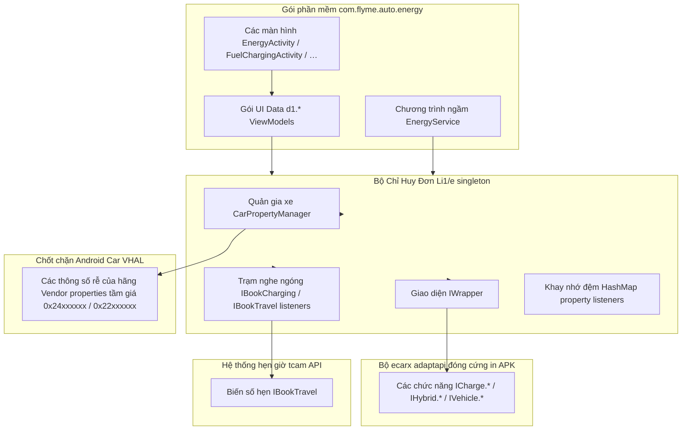

# com.flyme.auto.energy — Hướng dẫn phân tích APK

Tài liệu này mô tả ứng dụng hệ thống chính chủ tên là **Energy / Мощность** (Năng lượng / Công suất) (`com.flyme.auto.energy`) trích xuất từ màn hình giải trí trung tâm Geely **IHU629G**: bao gồm trung tâm năng lượng (báo sạc/xả, số km đi được, chế độ siêu tiết kiệm pin, tính năng đặt lịch chuyến đi), các dịch vụ chạy ngầm, cổng AIDL để lấy trạng thái sạc pin và cách kết nối truy cập xe thông qua API **eCarX AdaptAPI** kết hợp **Android Car VHAL**.

Thư viện hệ thống **chỉ được nhúng một phần vào APK** (khác với cách làm của app Climate):

- Gói `com.ecarx.xui.adaptapi` — Gồm **~991 class** nằm trong `classes.dex` (Chứa các giao diện IWrapper, ICharge.*, IHybrid.*, bộ hẹn giờ tcam IBookTravel/IBookCharging)
- Gói `android.car` — Có **~672 class** (Chứa CarPropertyManager, CarEnergyManager, các mã ID VehiclePropertyIds)

Ngay trên thiết bị xe sẽ có cài thêm thư viện liên kết động (shared library) là `ecarx.openapi` (phục vụ mã hóa chứng chỉ PKI/SSL cho các yêu cầu truy vấn lên máy chủ đám mây).

---

## 0. Tổng quan ứng dụng

| Tham số | Giá trị |
|----------|----------|
| Tên Package | `com.flyme.auto.energy` |
| Nhãn (Label - RU) | **Мощность** (Công suất) |
| Nhãn (Label - EN) | **Energy** (Năng lượng) |
| Nhãn (Label - ZH) | **能量中心** (Trung tâm Năng lượng) |
| Mã versionCode | `26012722` |
| Tên versionName | `flyme.beta.(AutoEnergy)(none)(26012722)(d7ebebe)` |
| SDK yêu cầu minSdk / targetSdk | 28 / 33 |
| Nền tảng biên dịch compileSdk | 34 (Bản Android 14) |
| sharedUserId | `android.uid.system` |
| Khối Application | Lớp `com.flyme.auto.energy.EnergyApplication` |
| Activity Trang chủ | Lớp `com.flyme.auto.energy.EnergyActivity` |
| File DEX | Gồm một file `classes.dex` (~3.1 MB, với **3580** class) |
| Native code | Gồm `libpag.so`, `libffavc.so` (Kiến trúc arm64-v8a, chịu trách nhiệm vẽ PAG-animations) |
| Kích thước APK | Nặng ~29 MB |

**Chức năng chính:** Đây là ứng dụng "trung tâm năng lượng" cấp hệ thống trên giao diện Flyme Auto HU — Đảm đương việc báo mức pin SOC, quản lý luồng sạc/xả điện (chuẩn AC/DC/V2L/V2V), đặt giới hạn dòng sạc/mức SOC tối đa, chuyển đổi các chế độ pin (như HLD/charge/save), hiển thị biểu đồ thống kê mức tiêu hao và quãng đường, kích hoạt **siêu tiết kiệm năng lượng** (ngắt máy lạnh AC/ngắt đèn trang trí/ngắt thu hồi năng lượng rekuperation, v.v.), chức năng **hẹn giờ sạc/hẹn giờ đi** (Lệnh BookTravel thông qua tcam API), quản lý trung tâm thông báo và cái plugin báo sạc ghim trên thanh SmartBar.

**Ngăn xếp giao diện UI Stack (Soi từ dex):**

- Các Activities + Liên kết dữ liệu **DataBinding** (`androidx.databinding`, gọi qua `DataBinderMapperImpl`)
- Cấu trúc Mô hình Domain-models: `BatteryLife`, `BookTravel`, `ChargeDischargeSetting`, `ChargeDischargeStatus`, `FuelCharging`, `MileageStatistics`, `PreCharge`, `SuperEndurance` (Tên gốc lấy từ bảng `source_file_idx`, còn trong file dex chúng bị băm nát làm mờ obfuscated thành kiểu dạng `d1.*`)
- Trình quản gia đại diện cho xe (Manager): **`Li1/e`** (singleton được gọi là `Li1/e.f()`): Khối này nhồi nhét `CarPropertyManager` + `IWrapper` + hẹn giờ tcam `IBookCharging` + Lệnh đăng ký nghe ngóng VHAL-listeners
- Nhóm chạy Nền: Trình `EnergyService` (Báo notifications, và thực thi các khối callback-interfaces `k1.*`)
- Kênh giao tiếp Public AIDL: Dịch vụ `ChargeStatusService` / `IChargeStatusService`
- Điện toán đám mây: Bắn mạng qua OkHttp → Đến server Geely OneOSS (Hỏi mấy lệnh như `getNewDayEnergySum`, …) nhờ chứng chỉ mã hóa eCarX PKI (`SSLUtils`, cắm vào `ecarx.openapi`)

**Từ khóa Log tag:** `AutoEnergy`

---

## 1. Nguồn gốc và Trích xuất (Artifacts)

| Tham số | Giá trị |
|----------|----------|
| Nền tảng (Nguồn lấy dump) | Thiết bị IHU629G |
| APK gốc (Tải qua ADBAppControl) | Lưu ở `downloads/250060 IHU629G/Мощность (com.flyme.auto.energy) [v.flyme.beta.(AutoEnergy)(none)(26012722)(d7ebebe)].apk` |
| Bản chép cục bộ (Local) | File `.tmp/flyme-energy.apk` |
| Thư mục giải nén APK | `.tmp/flyme-energy-apk/` |
| Tệp bóc thô dexdump (Bản đầy đủ) | `.tmp/flyme-energy-dexdump.txt` |
| Tệp chuỗi text (Bọc lọc lọc Strings từ dex) | `.tmp/flyme-energy-strings.txt` |

### Hướng dẫn tải APK từ máy xe

```bash
adb shell pm path com.flyme.auto.energy
adb pull /system/app/.../AutoEnergy.apk .tmp/flyme-energy.apk
```

### Các bước bung và soi code

```powershell
Copy-Item -LiteralPath ".tmp\flyme-energy.apk" -Destination ".tmp\flyme-energy.zip"
Expand-Archive -LiteralPath .tmp\flyme-energy.zip -DestinationPath .tmp\flyme-energy-apk -Force

$dexdump = (Get-ChildItem "$env:LOCALAPPDATA\Android\Sdk\build-tools" -Recurse -Filter "dexdump.exe" | Select-Object -First 1).FullName
& $dexdump -d .tmp\flyme-energy-apk\classes.dex | Select-String "CHARGE_FUNC|HYBRID_FUNC|SETTING_FUNC_ENERGY|Li1/e"
```

Công cụ **JADX / jadx-gui** — là quân cờ chủ lực để điều tra mã nguồn trong `EnergyActivity`, mảng cục `Li1/e` (cục quản lý car manager), thư mục `ChargeDischargeSetting`, và `EnergyService`.

### Kiến trúc phân mảng DEX (Các khối gói lớn)

| Gói Package / Mảng Tên | Tổng Số Lớp Class (Ước lượng ≈) | Mục Đích Nhiệm Vụ |
|-----------------|-------------|------------|
| Tầng `com.ecarx.xui.adaptapi.*` | 991 | Công cụ AdaptAPI (Chứa IWrapper, lệnh sạc ICharge, lai hybrid IHybrid, đặt giờ tcam BookTravel) |
| Tầng `android.car.*` | 672 | API cầu nối Android Car (Bị nhồi cứng vào file APK luôn) |
| Tầng lõi `com.flyme.auto.energy.*` | 140 | Mặt tiền UI, trạm services, bảng widgets, và chuỗi dữ liệu bean |
| Các Tầng như `androidx.*`, `com.google.*`, … | Nhóm mớ còn lại | Khuôn vẽ Material, mạng OkHttp, gỡ DataBinding, vẽ hiệu ứng PAG |

---

## 2. Giao diện (UI) và Hệ điều hướng (Navigation)

### 2.1 Các Activities hiển thị

| Lớp Activity | Định chế Launch mode | Lệnh gọi Intent action | Tác dụng làm gì |
|----------|-------------|---------------|------------|
| Tầng `EnergyActivity` | Thuộc diện `singleTask` | Nổ bằng cờ `MAIN` / `com.flyme.auto.energy.ENERGY` | Là Cái màn hình trang chủ điều phối (main dashboard) của trung tâm năng lượng |
| Tầng `FuelChargingActivity` | Kích `singleTop` | Gọi qua `com.flyme.auto.energy.FUELCHARGING` | Màn hình tinh chỉnh Sạc / Xả / Xăng (Dùng cho bản xe Lai PHEV) |
| Tầng `MileageStatisticsActivity` | Kích `singleTop` | Nhờ cờ `com.flyme.auto.energy.MILEAGESTATISTICS` | Trang hạch toán thống kê báo số km đi và đồ thị tiêu thụ năng lượng |
| Tầng `SuperEnduranceActivity` | Kích `singleTop` | Đi qua `com.flyme.auto.energy.SUPERENDURANCE` | Cái màn hình đen thui của Chế độ chạy vắt kiệt pin (Siêu tiết kiệm) |

```bash
# Lệnh gọi Trang chủ màn chính
adb shell am start -a com.flyme.auto.energy.ENERGY \
  -n com.flyme.auto.energy/.EnergyActivity

# Mở ngay màn cấu hình Sạc / xả
adb shell am start -a com.flyme.auto.energy.FUELCHARGING \
  -n com.flyme.auto.energy/.FuelChargingActivity

# Kéo bảng Thống kê lộ trình (Mileage)
adb shell am start -a com.flyme.auto.energy.MILEAGESTATISTICS \
  -n com.flyme.auto.energy/.MileageStatisticsActivity

# Bấm gọi thẳng Siêu tiết kiệm
adb shell am start -a com.flyme.auto.energy.SUPERENDURANCE \
  -n com.flyme.auto.energy/.SuperEnduranceActivity
```

### 2.2 Các Khối Domain ViewModels (Mảng DataBinding)

Danh tánh gốc gác của mấy cái hàm đã được moi móc dựa vào bảng tàng hình `source_file_idx` bọc trong file dex (bình thường các mã class này bị mã hóa obfuscated giấu dưới thư mục `d1`):

| Tên Gốc Nguyên Thủy | Mã Định Danh Dex (Đã bị mã hóa) | Thuộc Màn hình / Vùng nào |
|----------------|------------------|-----------------|
| Lớp `BatteryLife` | Che bằng `Ld1/a` | Tính Toán Phần trăm Pin SOC, sức khỏe bình điện, dashboard trang chính |
| Lớp `BookTravel` | Che bằng `Ld1/b` | Nơi Hẹn giờ sạc / Lên lịch khởi hành |
| Lớp `ChargeDischargeStatus` | Nấp dưới `Ld1/d` | Quan trắc Tình trạng điện Sạc/Xả thời gian thực (Live-status) |
| Lớp `ChargeDischargeSetting` | Dưới mã `Ld1/e` | Setting Cấu hình sạc (Nắn dòng điện, ép SOC, chức năng cắm sạc khi đậu bãi parking charge, …) |
| Lớp `MileageStatistics` | Chạy dưới `Ld1/f` | Phân tích Hành trình đi, rải đồ họa đồ thị biểu đồ, Reset lại báo đồng hồ trip |
| Lớp `PreCharge` | Giấu dưới `Ld1/g`, `Ld1/i` | Hâm nóng nhiệt/Làm ấm mồi cục pin / Bước tiền sạc |
| Lớp `SuperEndurance` | Đội lốt `Ld1/l` | Nơi nắm đầu công tắc tắt mở Siêu tiết kiệm pin và các công tắc vệ tinh liên đới |

### 2.3 Phân tách các Biểu tượng trạng thái sạc (UI icons)

Chương trình chính `EnergyActivity` nó đang cầm trịch ôm một mảng to đùng gồm **14** cái thẻ trạng thái minh họa bằng icon (như kiểu hình chấu cắm `ic_connection`, cờ sạc `ic_charging`, đèn báo cẩn thận `ic_warning`, dấu tít xanh `ic_complete`, đang râm râm ấm sạc nhồi `ic_preheating`, bóng đèn đặt trước `ic_reservation_light`, biểu tượng đùn điện xả ra `ic_discharging`, …) — Tụi nó được xâu chuỗi chiếu theo các mảng từ khóa định nghĩa kiểu enum `BATTERY_STATE_*` / `CHARGE_FUNC_CHARGING_DISCHARGING_STATE`.

---

## 3. Các Tổ Hợp Services, kênh nối AIDL và Kênh tích hợp

### 3.1 Dịch vụ ngầm `EnergyService`

| Tham Số | Nội Dung |
|----------|----------|
| Mã Class | Tên đầy đủ là `com.flyme.auto.energy.service.EnergyService` |
| Bật cờ exported | Trả về `false` |
| Nhiệm vụ chính (Role) | Chạy như Foreground-service: chuyên phụ trách phóng thông báo thông tin sạc/xả, thu gom tổng hợp cục callbacks của xe |

Nó có trách nhiệm đi gom và thực thi cho các khối giao diện callback (hiển thị trên dex là chuỗi `k1.*` → được dịch tên gốc ra là):

| Mã số Dex | Tên lệnh mồi callback gốc |
|-----|-------------------|
| Mã `Lk1/a` | Bản thể `IBatteryLifeCallback` |
| Mã `Lk1/b` | Lệnh bộ `IBookTravelCallback` |
| Mã `Lk1/c` | Kích `IChargeDischargeSettingCallback` |
| Mã `Lk1/d` | Gọi `IChargeDischargeStatusCallback` |
| Mã `Lk1/e` | Xin hàm `IMileageStatisticsCallback` |
| Mã `Lk1/f` | Gọi hàm `IPreChargeCallback` |
| Mã `Lk1/g` | Hàm báo `ISuperEnduranceCallback` |

### 3.2 Bộ kết nối `ChargeStatusService` (Dạng public AIDL công khai)

| Cấu trúc | Giá trị Gắn Kèm |
|----------|----------|
| Lệnh Action | Là `com.flyme.auto.energy.action.CHARGE_STATUS_SERVICE` |
| Định Dạng AIDL | Áp qua `IChargeStatusService` / kèm call `IChargeStatusServiceCallback` |
| Cờ exported | Trả về `true` |

**Các chiêu (hàm - Methods) trong `IChargeStatusService`:**

| Tên Hàm Method | Diễn giải chức năng |
|-------|----------|
| Lệnh `getChargingDischargingState()` | Báo tình hình đang Sạc/Xả ra sao (số nguyên int) |
| Lệnh `getEvBatteryPercentage()` | Trả trị số Pin SOC, theo % |
| Hàm `registerCallback(IChargeStatusServiceCallback)` | Cú pháp Ghi danh theo dõi Subcribe |
| Hàm `unRegisterCallback(...)` | Lệnh Hủy ngóng tin Unsubscribe |

**Phản hồi (Callback):** Đẩy cập nhật `updateChargeStatus(int)`, báo số điện `updateElectricity(int)`.

```bash
adb shell am startservice -a com.flyme.auto.energy.action.CHARGE_STATUS_SERVICE \
  -n com.flyme.auto.energy/.service.ChargeStatusService
```

### 3.3 Module tiện ích bám vào SmartBar

| Cấu Trúc Khối Component | Mã gọi Action |
|-----------|--------|
| Khối `SmartBarChargePlugin` | Mở `com.flyme.auto.plugin.action.PLUGIN_SMART_BAR` |

Đây là một mảng tiện ích con đính rễ ở cái thanh ngang dưới cùng của Flyme Auto: dùng để thông tin cấp tốc thu gọn tiến độ sạc (`ChargingHandler`).

### 3.4 Bảng hiện Widget ở màn hình

| Tổng đài Receiver | Cú phụ Action bổ sung |
|----------|-------------|
| Đài `DischargingAppWidget` | Chạy lệnh `flyme.auto.provider.DischargingAppWidget` |

---

## 4. Danh sách Broadcast và Vòng đời (lifecycle)

| Kênh tiếp đón Receiver | Gọi bằng Action | Có exported không | Đảm đương Việc Gì |
|----------|--------|----------|------------|
| Cục `BootCompleteReceiver` | Mở bằng `BOOT_COMPLETED` | Có yes | Gọi tỉnh khởi động dàn logic sau khi màn HU boot xong |
| Cục `PowerOnReceiver` | Dùng thẻ `ENERGY_POWER_ON`, `BOOKING_CHARGING_FAILED` | Không no | Liên quan đến ngõ cấp Nguồn / thông báo lỗi kẹt hẹn giờ sạc |
| Cục `ChargeStartReceiver` | Chạy cờ `ENERGY_CHARGE_START` | Không no | Bắt đầu quy trình tiếp điện sạc |

Loạt hàm gọi nội bộ tự chế (Custom intent internal):

- Mã `android.intent.action.ENERGY_POWER_ON`
- Mã `android.intent.action.BOOKING_CHARGING_FAILED`
- Mã `android.intent.action.ENERGY_CHARGE_START`

Lão quản gia thông số xe (`Li1/e`) cũng vểnh tai nghe lén hai kênh báo `ACTION_SHUTDOWN_HU` / `ACTION_BOOT_HU` và tự đi đăng ký gọi lệnh theo dõi `CarPowerManager` listener.

---

## 5. Cấu Hình Kiến Trúc Liên lạc Đến Xe Hơi (Car Architecture)



**Lối chơi ghi chú lệnh/Lấy thông số** (Hình mẫu thông dụng nằm ở `ChargeDischargeSetting`, hay trang `FuelCharging`):

1. Khớp mã chuyển đổi **function id** (Lấy từ hệ số chữ `CHARGE_FUNC_*`, `HYBRID_FUNC_*`, …) → Đối chiếu lòi ra mã VHAL property id thông qua cầu nối `IWrapper.getFuncIPropertyId()` (Nó đi đường vòng, thông qua tổng đài `Li1/e`).
2. Gọi hàm `CarPropertyManager.getProperty` / hoăc ghi `setProperty` (thậm chí là qua mặt mấy cái khuôn hàm bọc lại của `Li1/e.d`, `Li1/e.i`, `Li1/e.y`, `Li1/e.p`).
3. Trong trường hợp cần "xuất phiếu lệnh ghi yêu cầu xác nhận xác nhận (write với confirm)" — thì xài hệ thống `Handler` + với khoảng trễ timeout là 2 giây (Lấy ví dụ: cho các thao tác `CHARGE_FUNC_PARKING`, hay gạt chế độ `HYBRID_FUNC_BATTERY_MODE`).

**Kiểu Ghi danh Đăng ký ngóng thông tin:** Bộ `Li1/e.b()` sẽ đi tuần tra duyệt lướt nguyên một dải mảng cấu trúc tĩnh như `La/a.k` cho đến … `La/a.o` (đây là sổ tay danh mục nhốt đám property id) rồi gọi các chốt chặn `r()` / `s()` yêu cầu đính subscribe chờ đón dữ kiện mới trên mọi mặt trận.

---

## 6. Mổ Xẻ Các Mốc Lệnh cốt tử ở Adapt / Chức năng VHAL id

Bản danh sách đầy đủ thực tế dài dằng dặc hàng ngàn dòng đổ nát trong file `.tmp/flyme-energy-strings.txt`. Danh sách rút trích dưới đây là mớ chức năng được **tận dụng xài liên tục và công khai** nằm trong lõi Energy APK (chứng thực qua log strings + với cấu trúc mã bytecode).

### 6.1 Mảng Sạc / nhả điện Xả (`CHARGE_FUNC_*`)

| Khóa Function id | Có tác dụng gì (Dịch từ mớ string trong ruột APK) |
|-------------|-------------------------------|
| Dùng `CHARGE_FUNC_CHARGING_DISCHARGING_STATE` | Tổng quản ngó trạng thái chung đang được sạc hay xả |
| Dùng hệ `CHARGE_FUNC_CHARGING_SOC` / kèm cờ `_MAX` / `_MIN` / `_STEP` | Cái vạch nắn giới hạn Pin SOC trần để sạc (thanh kéo seekbar) |
| Dùng hệ `CHARGE_FUNC_CHARGING_CURRENT` / kèm cờ `_MAX` / `_MIN` / `_STEP` | Cái chốt ép dòng Ampe cường độ dòng điện đi vào |
| Dùng thẻ `CHARGE_FUNC_CHARGING_PLUG_STATE` / song hành `CHARGE_FUNC_DISCHARGING_PLUG_STATE` | Đầu đọc biết có đang cắm vòi súng sạc chưa |
| Dùng thẻ `CHARGE_FUNC_AC_CHARGING` / thẻ `CHARGE_FUNC_DC_CHARGING` | Theo dõi dòng AC xoay chiều chậm / DC một chiều sạc siêu tốc |
| Dùng thẻ `CHARGE_FUNC_DISCHARGING_SWITCH_V2L` / chia nhánh `_V2V` | Bộ biến áp chia dòng chia điện cho cắm điện gia dụng V2L / Hay nối bình cứu xe điện khác V2V |
| Dùng thẻ `CHARGE_FUNC_DISCHARGING_SOC` | Giới hạn vạch đáy khi chia sẻ xả điện |
| Dùng thẻ `CHARGE_FUNC_PARKING` | Sạc điện chậm lúc đậu đỗ xe (là biến cờ boolean bool, có thêm khóa thời gian timeout write) |
| Nhóm thẻ `CHARGE_FUNC_BATTERY_*` | Coi ngó công suất đầu ra, check cảm biến nhiệt, báo động đỏ lỗi, kiểm chứng mức độ ổn định (stability) |
| Dùng thẻ `CHARGE_FUNC_EXTERNAL_CHARGING_LIGHT` | Chốt đèn trang trí ngay cái nắp khe cắm sạc ngoài xe |

**Ví dụ móc thử VHAL id ánh xạ lụm trong đống bytecode:**

| Tên Khóa Function id | Sinh ra mã Property id (Lục phân hex) |
|-------------|-------------------|
| Mã `CHARGE_FUNC_PARKING` | Chuyển ra `0x24205a00` |
| Mã `HYBRID_FUNC_BATTERY_MODE` | Chuyển ra `0x24030300` |
| Mã `TRIP_FUNC_RESET` | Chuyển ra `0x24800200` |

### 6.2 Mảng Lai Xăng Điện (Hybrid) / Và Bộ Pin (`HYBRID_FUNC_*`)

| Khóa Function id | Tác Vụ Đem Lại |
|-------------|------------|
| Cờ `HYBRID_FUNC_BATTERY_MODE` | Gạt cần điều chỉnh chế độ pin (Chạy thường normal / Ép sạc nhồi charge / Kích HLD) |
| Cờ `HYBRID_FUNC_BATTERY_CHARGE_MODE` | Bật hệ thống phân nhánh ngầm của chế độ charge mode |
| Cờ `HYBRID_FUNC_BATTERY_SAVE_MODE` | Mở chế độ ép vắt tiết kiệm Save mode |
| Cờ `HYBRID_FUNC_BATTERY_SOC` | Mức dung lượng pin (SOC) mục tiêu mà xe cố tình duy trì ráng giữ |
| Cờ `HYBRID_FUNC_SUPER_ENERGY_SAVING` | Cái cầu dao tổng cắt điện (Master-switch) để nhảy vào Siêu tiết kiệm |
| Cờ `HYBRID_FUNC_SUPER_ENERGY_SAVING_AIR_CONDITIONER` | Ngắt dòng máy lạnh AC |
| Cờ `HYBRID_FUNC_SUPER_ENERGY_SAVING_AMBIENT_LIGHTING` | Cúp đèn màu mè ambient |
| Cờ `HYBRID_FUNC_SUPER_ENERGY_SAVING_ENERGY_RECOVERY` | Nắn lại bộ thu hồi hồi năng lượng rekuperation lúc xe đang ráng lết siêu tiết kiệm |
| Nhóm `HYBRID_FUNC_SUPER_ENERGY_SAVING_SEAT_*` | Tắt chế độ rung đấm lưng ghế / sưởi quạt mông |
| Cờ `HYBRID_FUNC_SUPER_ENERGY_SAVING_SPEED_LIMIT` | Khóa ga khóa vận tốc không cho đạp lút sàn |

### 6.3 Nhóm tính Công tơ mét Quãng đường / Tuyến Lái Trip (`TRIP_FUNC_*`)

| Khóa Function id | Tác Dụng Làm Gì |
|-------------|------------|
| Nút bấm `TRIP_FUNC_RESET` | Xóa sổ xóa số 0 thống kê bộ đo chuyến đi |
| Đo đạc `TRIP_FUNC_TRIP_DISTANCE_SINCE_LAST_CHARGE` | Khảo hạch xem chạy được bao xa kể từ lúc rút súng sạc |
| Tính toán `TRIP_FUNC_AVERAGE_ENERGY_CONSUMPTION_SINCE_LAST_CHARGE` | Chia tỷ lệ trung bình coi ngốn bao nhiêu điện |
| Bấm đồng hồ `TRIP_FUNC_DRIVING_TIME_SINCE_LAST_CHARGE` | Xem đã ngồi mòn đít cầm vô lăng mất bao lâu |
| Đếm số liệu `TRIP_FUNC_AVERAGE_SPEED_SINCE_LAST_CHARGE` | Cho ra vận tốc trung bình cày cuốc trên đường |

### 6.4 Mảng Tùy chỉnh (Settings) / Cơ Chế Thu Điện Nhả Trớn (Regen - Recuperation)

| Khóa Function id | Sự Trùng Hợp Giao Thoa với Geely EX2 Tools |
|-------------|-------------------------|
| Chốt mã `SETTING_FUNC_ENERGY_REGENERATION` | Thằng này hoàn toàn trùng số ID ở chỗ Adapt y xì như bên cái tài liệu [flyme-settings-apk.md](./flyme-settings-apk.md) cũng như số danh mục `VhalConstants.PROP_SETTING_FUNC_ENERGY_REGENERATION` (Trỏ ra giá trị là `0x20020500` / hệ số thực là `537003264`) |
| Gắn mã `SETTING_FUNC_ENERGY_REGENERATION_SUPPORT_VALUE` | Trả về thông số các mức độ hãm thu điện (regen) mà chiếc xe này cho phép |
| Dải biến `ENERGY_REGENERATION_LEVEL_*` | Có đầy đủ các level AUTO / LOW / MID / HIGH / OFF (Tự động / Yếu / Vừa / Ghì cực Mạnh / Khóa) |

### 6.5 Nhóm Hẹn Hành Trình BookTravel (Móc vào chip tcam, chứ không đi dây thẳng vô VHAL)

Tuyến đường API: `com.ecarx.xui.adaptapi.tcam.IBookTravel`

| Tên Hằng Số (Constant) | Nhận Mã Lệnh Số Nào |
|-----------|----------|
| Mã gạt `BOOKTRAVEL_SWITCH_OFF` | Số 0 |
| Mã bật `BOOKTRAVEL_TEMPORARY_SWITCH` | Số 1 |
| Chuỗi lệnh `BOOKTRAVEL_CYCLE_SWITCH` | Số 2 |
| Đặt thời điểm `BOOKTRAVEL_TIMESETTING_TYPE_CHARGE_START` | Số 10 |
| Chọn thời điểm `BOOKTRAVEL_TIMESETTING_TYPE_VALLEY` | Số 9 |

Kênh Listener hóng tin: Móc vào chuỗi `onBookTravelChargeStartChange`, ngóng `onBookTravelCycleSwitchChange`, đợi chờ `onBookTravelBattPreHeatgActSwitchChange`, …

---

## 7. Mảng Báo Cáo Đo Đạc Lên Mây (OneOSS)

Kết nối dạng chuẩn OkHttp + kèm chìa khóa eCarX PKI (`ecarx.openapi.permission.ACCESS_PKI`):

| Đường Dẫn Tín Hiệu URL | Nhằm làm trò gì |
|-----|------------|
| Trỏ vào `https://oneoss-ecu.geely.com/.../getNewDayEnergySum?localDate=` | Kéo về tổng mức húp năng lượng điện xài sạch trong ngày nay |
| Trỏ vào `https://oneoss-ecu.geely.com/.../getNewMonthEnergySum?localDate=` | Kết chuyển bảng điện theo tháng |
| Trỏ vào `https://oneoss-ecu.geely.com/.../getNewYearEnergySum` | Tính theo lịch trình cả năm |

Cấu trúc DTO đóng gói mảng trả về: Khai dạng `EnergyBean`, `EnergySumBean` (bao gồm mấy cục đo quãng đường như `dayMileageSum`, `monthMileageSum`, `yearMileageSum`).

---

## 8. Các Quyền Truy Cập Đặc Biệt (Biến Cars Permissions)

| Giấy Phép Cấp Phép | Xin để làm gì |
|------------|-------|
| Thẻ `android.car.permission.CAR_ENERGY` | Thọc sâu dò đạc điện năng / bộ bình pin |
| Thẻ `android.car.permission.CAR_POWERTRAIN` | Móc vô cụm động cơ truyền động (powertrain) |
| Thẻ `android.car.permission.CAR_MILEAGE` | Soi đồng hồ công tơ mét (Mileage) |
| Thẻ `android.car.permission.ADJUST_RANGE_REMAINING` | Bắt đo dự đoán số km còn ráng lết được |
| Thẻ `android.car.permission.CAR_VENDOR_EXTENSION` | Moi móc hệ riêng Vendor VHAL |
| Thẻ `android.car.permission.CAR_SPEED` | Bắt tốc độ Speed (dành cho phần báo trip/stat) |
| Thẻ `ecarx.openapi.permission.ACCESS_PKI` | Chìa khóa mạng TLS vào trạm mây OneOSS |

---

## 9. Cẩm nang Móc Nối Giao Giao Bám Kênh Geely EX2 Tools

| Chức năng cần mổ trong EX2 Tools | Điểm giao cắt liên đới với Energy APK |
|-------------------|----------------------------|
| **Cục phục hồi năng lượng hãm động cơ (Kinetic recovery/regen)** | Mang mã `SETTING_FUNC_ENERGY_REGENERATION` — xài chung một cái mã thẻ Adapt id; Trong đó thì EX2 Tools sẽ dùng thủ đoạn ghi đi vòng đè qua ổ `com.flyme.auto.api` / Trực tiếp húc vào VHAL `0x20020500`, Còn ứng dụng Energy thì đi đường chính ngạch qua thẻ trung gian của chính nó `Li1/e` + chèn `IWrapper` |
| Bộ chuyển đổi Chế độ Lái (Driving mode) / Tiếng giả động cơ AVAS / Chỉnh đèn gầm màu Ambient | Hai bên Chẳng có dây mơ rễ má gì với nhau cả; Ứng dụng Energy rất kiêu kỳ không thèm mở khóa kênh ngoại vi public API cho đứa nào xài, ngoại trừ cái loa phát tín hiệu `ChargeStatusService` |
| Bản hạch toán Thống kê quãng đường (Mileage) | Bọn `TRIP_FUNC_*` — Cái này bị độc quyền, bạn chỉ có thể vọc vạch khi đang hiện cái giao diện (UI) mặc định của con Energy này thôi |

**Kinh Nghiệm Thực Tiễn xương máu rút ra:** Đối với vụ muốn nắn hệ hãm xe thu hồi điện (regen) thì tốt nhất là bạn nên dùng khuôn mẫu **Settings / bắt bám vào Flyme API** (nghiên cứu bài học ở bộ `FlymeEnergyRegenerationApi.kt`), cái này sẽ ít bị "đá giò lái" lỗi rủi ro hơn hẳn kiểu ăn bám tiêm chọc (bind) trực tiếp vào cái xác Energy APK. 
Còn nếu bạn chỉ có ý định dòm xem mức **Pin (SOC) / Coi có đang sạc hay không (charge state)** Thì bạn cứ việc xài nhẹ nhàng cái cổng `IChargeStatusService` hoặc mượn mấy cái hàm `CHARGE_FUNC_*` bấu qua bộ AdaptAPI là đủ xài.

---

## 10. Chiến Thuật Đào Sâu Trích Code Nghiên Cứu Thêm (Reverse Engineering Tiên Tiến)

1. Mở **JADX** phẫu thuật thằng `.tmp/flyme-energy.apk` → Soi ngay vào cục `Li1/e`, cái mục `ChargeDischargeSetting`, và bộ dây `EnergyService`.
2. Dò theo chuỗi **Text (Strings):** Xài lệnh Shell `Select-String .tmp/flyme-energy-strings.txt -Pattern 'CHARGE_FUNC|HYBRID_FUNC'`.
3. Tìm kiếm mã thông số **Property id:** Mở banh cái bộ dexdump rồi tra quanh cụm lệnh mảng chữ `const v*, #float … // #24` kế bên cái lệnh kéo chữ `const-string … "CHARGE_FUNC_…"`.
4. Làm phép **So sánh đọ code với Setting app:** Nhặt những cục thuộc tính `SETTING_FUNC_*` / nhánh `IWrapper` — (Đã có sẵn trong cẩm nang [flyme-settings-apk.md](./flyme-settings-apk.md)).
5. Tìm hiểu cách cắm rút **dịch vụ Xe (Car service):** Đi sâu vào mớ thuộc tính ngầm của nhà máy vendor property groups — Mở đọc cái bí kíp [android-car-apk.md](./android-car-apk.md).

---

## 11. Bảng Trích Yếu Khái Quát Bộ Phận (Từ Manifest)

```text
com.flyme.auto.energy/
├── Ứng dụng chính EnergyApplication
├── Màn chiếu EnergyActivity              # Gánh cờ ENERGY / LAUNCHER
├── Chỗ hiện Sạc Xăng FuelChargingActivity        # Gánh cờ FUELCHARGING
├── Thống kê đo đường MileageStatisticsActivity   # Gánh cờ MILEAGESTATISTICS
├── Siêu pin SuperEnduranceActivity      # Gánh cờ SUPERENDURANCE
├── Trạm dịch vụ ngầm (service)/
│   ├── Kênh EnergyService           # Kênh chạy nổi (foreground), phụ trách nắn cờ callbacks k1.*
│   └── Đài phát ChargeStatusService     # Trạm AIDL, được phép gọi public (exported)
├── Gắn widget/Trình SmartBarChargePlugin
├── Gắn appwidget/Gói DischargingAppWidget
├── Lính gác receiver/ Canh khởi động (BootComplete), Canh mở nguồn (PowerOn), Báo có vô điện (ChargeStart)
└── Ổ khóa mạng okhttps/ + dán tem chứng chỉ ssl/             # Lên Cloud OneOSS + Gói bùa PKI
```
