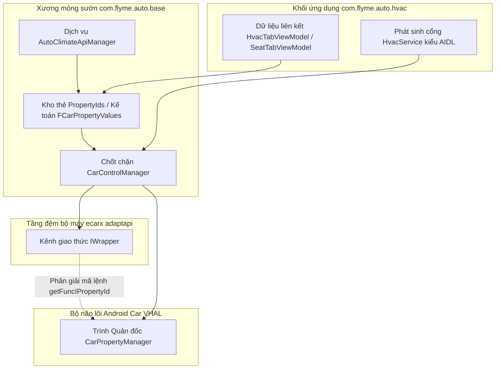

# com.flyme.auto.hvac — Hướng dẫn phân tích APK

Tài liệu này đi sâu mổ xẻ ứng dụng hệ thống nguyên bản có tên **Climate** (`com.flyme.auto.hvac`) lấy ra từ màn hình giải trí trung tâm (head unit) của Geely **IHU629G**: bao gồm kiến trúc giao diện (UI) điều hòa/ghế/nước hoa, các cửa ngõ kích hoạt app, dịch vụ nền `HvacService` cấp cho app bên ngoài và phương thức giao tiếp hệ thống xe thông qua mạng **eCarX AdaptAPI** cộng hưởng với **Android Car VHAL**.

Có hàng loạt bộ thư viện phụ thuộc **không nằm trong gói APK**, nhưng lại được mã nguồn móc nối gọi liên tục:

- Gói thư viện `com.ecarx.xui.adaptapi` — Dùng xài lệnh `IWrapper`, làm bảng dò (mapping) biến đổi từ mã `IHvac.*` / `IFunctionId.*` → trở thành chuỗi mã property id cho VHAL
- Thư viện hệ thống `android.car` — Mượn xài `CarPropertyManager`
- Bộ cung cấp nền tảng `com.flyme.auto.data` — SDK điều khiển cấu hình cài đặt / Lớp `PreferencesProvider`

---

## 0. Tổng quan ứng dụng

| Tham số | Ý Nghĩa / Giá trị |
|----------|----------|
| Gói ứng dụng Package | Dán mác `com.flyme.auto.hvac` |
| Tên hiển thị (Label EN) | Ghi là **Climate** (Hệ thống Khí hậu) |
| versionCode | Đóng số `26012721` |
| versionName | Có mác `flyme.beta.(AutoClimate)(null)(26012721)(5c75240)` |
| Yêu cầu minSdk / targetSdk | Các mốc 28 / 34 |
| Mốc compileSdk | Nền Android 34 (Bản 14) |
| Định danh user xài chung (sharedUserId) | Chạy cờ `android.uid.system` |
| Hạt nhân Application | Đi vào `com.flyme.auto.hvac.CarApplication` |
| Activity nòng cốt | Mở sảnh `com.flyme.auto.hvac.home.HvacHomeActivity` |
| Phân loại thanh chứa (taskAffinity) | Cắm cọc vô `FLYME.DOCK.APP.CLIMATE` |
| Nơi chứa não bộ xử lý chính DEX | Cất ở file `classes2.dex` (Tầm ~9.2 MB) |
| Khu vực chứa bảng UI widgets (PAG/WebP) | Gom riêng ở `classes3.dex` (Ký hiệu `com.flyme.hvacwidget.*`) |
| Toàn bộ dung lượng APK | Bự chảng ~124 MB (vì nhét cả kho phim chuyển động animation, hình ảnh nặng) |

**Bổn phận chính:** Làm trung tâm điều phối không khí "Climate" trải toàn màn hình của Flyme Auto HU — Lo vụ điều hòa máy lạnh AC trước/sau, kiểm soát ghế lái (kích hoạt sưởi/quạt làm mát/nện rung massage), bộ máy nước hoa, đảo quạt điện tử (electronic deflectors), báo nồng độ bụi mịn PM2.5/phun ion khử khuẩn, và ti tỉ tùy chọn tiện nghi khác. Song song đó, nó có nhiệm vụ xuất xưởng bộ **API chuẩn AIDL** (`HvacService`) chuyên dành cho bọn launcher, widgets hay mấy cái app hệ thống khác xài ké.

**Sơ đồ công nghệ giao diện UI (Mổ xẻ từ dex/JADX):**

- Lớp `HvacHomeActivity` → Bơm dữ liệu lên nhờ **DataBinding** (`ActivityHvacHomeBinding`) + Dàn tab trượt dưới đáy (`RadioGroup`)
- Phân luồng Màn hình: Hệ thống `Fragment` + Khối `*ViewModel` + Bảng gán `FCarPropertyValues` / và dùng `@PropertyInject`
- Kênh đâm thẳng vào xe: Trạm `CarControlManager` → Quản gia `CarPropertyManager` + Xài hàm `IWrapper.getFuncIPropertyId()`
- Dịch vụ mở ra API Public: Lớp `HvacService` (Chạy bọc chuẩn AIDL `HvacApiService.Stub`)
- Phân ban Thu thập thói quen Analytics: SDK của SensorsData phiên bản v0.2.2 (hàm `GlySensorsData.track`)
- Chọc gọi bằng VR (Thực tế ảo/Giọng nói): Bắt nhịp `ecarx.intent.action.ECARX_VR_APP_OPEN` → trỏ tới path `/空调调节页面` (Trang tinh chỉnh máy lạnh)

**Các module râu ria đi cùng bọc trong APK:**

- Gói `com.flyme.hvacwidget` — Đồ chơi đồ họa riêng (Vẽ hoạt cảnh PAG báo hướng gió, báo phân hạng gió to nhỏ, nút công tắc đủ kiểu)
- Gói `com.flyme.auto.base` — Cái móng chung của mọi app Climate (Bao bọc `CarControlManager`, `PropertyIds`, `AutoClimateApiManager`)
- Bộ AppWidget: Thả ra ngoài màn hình mấy cái widget báo tình trạng đấm lưng massage ghế ngồi (ghế tài 主驾 / ghế phụ 副驾)

---

## 1. Nguồn Gốc và Đồ Nghề Khai Quật

| Các Tham Số | Khai báo |
|----------|----------|
| Nơi trút đẻ gốc nền tảng | Đầu máy IHU629G |
| Nguyên mẫu File APK (Bằng lệnh ADBAppControl) | Kéo từ ổ `downloads/250060 IHU629G/Climate (com.flyme.auto.hvac) [v.flyme.beta.(AutoClimate)(null)(26012721)(5c75240)].apk` |
| Bản copy giấu trong máy cục bộ | Ổ `.tmp/flyme-hvac.apk` |
| Banh nén bung bét File APK | Nằm đây `.tmp/flyme-hvac-apk/` |
| Đọc mã trên JADX | Soi đây `.tmp/flyme-hvac-jadx/` |
| Kết xuất mảng Dex (bản chi tiết dexdump) | Quăng ra file `.tmp/flyme-hvac-dexdump.txt` |

### Thao Tác Câu Trộm Lấy Mẫu APK Về PC

```bash
adb shell pm path com.flyme.auto.hvac
adb pull /system/app/.../Hvac.apk .tmp/flyme-hvac.apk
```

### Xả Zip Bóc Vỏ và Đào Tìm Nhánh

```powershell
Copy-Item -LiteralPath ".tmp\flyme-hvac.apk" -Destination ".tmp\flyme-hvac.zip"
Expand-Archive -LiteralPath .tmp\flyme-hvac.zip -DestinationPath .tmp\flyme-hvac-apk -Force

$dexdump = (Get-ChildItem "$env:LOCALAPPDATA\Android\Sdk\build-tools" -Recurse -Filter "dexdump.exe" | Select-Object -First 1).FullName
& $dexdump -d .tmp\flyme-hvac-apk\classes2.dex | Select-String "HVAC_FUNC_|PropertyIds|CarControlManager"
```

Công cụ **JADX / jadx-gui** — luôn là anh thợ mổ lành nghề để moi gan ruột cục `HvacTabViewModel`, bảng `PropertyIds`, cái trạm `HvacService`, và trang chủ `HvacHomeActivity`.

### Lớp Nang Chứa Cấu Trúc File DEX

| File Thô | Ẩn chứa bên trong |
|------|------------|
| Tệp `classes.dex` | Bộ thư viện AOSP AndroidX, các SDK ngoại đạo |
| Tệp `classes2.dex` | Nhóm code `com.flyme.auto.hvac.*`, móng `com.flyme.auto.base.*` |
| Tệp `classes3.dex` | Toàn bộ thẻ widget đồ họa `com.flyme.hvacwidget.*` |
| Tệp `classes4.dex` | Các cục thư viện đắp vá dư thừa |

Trong lòng APK này **Sạch Bóng** không xài module Native mớ code C/C++ `.so` (`extractNativeLibs=false`).

---

## 2. Giao Diện Người Dùng (UI) Và Chuyển Trang Điều Hướng (Navigation)

### 2.1 Sảnh chính (`HvacHomeActivity`)

```mermaid
flowchart TB
    subgraph home [Giao diện mặt tiền HvacHomeActivity]
        TAB[Bảng chùm RadioGroup: AC (Điều hòa) / Seat (Ghế) / Rear (Lưng xe) / Fragrance (Nước hoa)]
        FRAG[Khay hứng chứa fl_container]
    end
    TAB -->|Ấn tab 0| HVAC[Đổ vào HvacTabFragment / Hoặc nhánh PresentSceneFragment]
    TAB -->|Ấn tab 1| SEAT[Bơm vô SeatTabFragment]
    TAB -->|Ấn tab 2| REAR[Kéo vô HvacRearFragment]
    TAB -->|Ấn tab 3| FRAG_TAB[Thả vào FragranceTabFragment]
    TAB --> FRAG
```

| Nút bấm Tab (Thuộc loại RadioButton) | Gắn Tag cho Nhánh Fragment | Gọi ViewModel | Quyền Sinh Sát |
|----------------------|--------------|-----------|------------|
| Nút AC (Máy lạnh táp lô phía trước) | Có thể là `HvacTabFragment` hay bị đổi thành `PresentSceneFragment` | Nuôi bằng `HvacTabViewModel` | Cho chỉnh Nhiệt, Quạt gió, Cách đảo gió, Ngắt AC/Bật Auto/Bóp họng ECO, Rã đông kính |
| Nút Seat (Chỉnh Ghế) | Gắn cục `SeatTabFragment` | Gắn vô `SeatTabViewModel` | Lo vụ Đốt sưởi/thổi gió thoáng/Nhồi đấm bóp massage, và luôn cả Bơm nóng tay lái |
| Nút Rear (Cụm sau lưng) | Trỏ nhánh `HvacRearFragment` | Bỏ trống — | Coi dàn lạnh người ngồi băng ghế sau |
| Nút Fragrance (Chất thơm) | Mở vô `FragranceTabFragment` | Nuôi bằng `FragranceTabViewModel` | Mở máy phun tinh dầu nước hoa |

**Lưu ý với Chế Độ "Nature" (Mô phỏng khí hậu môi trường thiên nhiên/cảnh giả):** Nếu như công tắc `SettingsProvider` / Cờ `Constant.SETTINGS_GLOBAL_HVAC_NATURE_MODE_SWITCH == 1`, thì thay vì hiện cái bảng AC khô khan, Tab AC sẽ biến hình nạp bộ giao diện phong cảnh ảo lòi tên là `PresentSceneFragment` đè chồng lên ngay vị trí của `HvacTabFragment`.

**Dấu vết hiển thị lưu vào Bảng System UI:** Hễ bật cái trang `HvacTabFragment` lên màn, là lập tức nó đi rải đinh báo cáo vô cờ của `Settings.Global`:

- In dấu ở khóa `HVAC_MAIN_PANEL`
- Số `1` — La lên panel đang mở tẽn he, Số `0` — Báo cáo panel bị che giấu

**Hiệu Ứng Phong Nền 3D (3D Wind Background):** Module `CarWindModel` / hay nhóm mô phỏng `CarPresentSceneWindModel` — Chịu trách nhiệm thổi hoạt ảnh luồng gió đang bay tùy theo hướng thổi thật của mồm điều hòa (Phụ thuộc ăn theo mã `HVAC_FAN_DIRECTION` điều khiển các cánh đảo gió bằng điện tử).

### 2.2 Các Khóa Công Tắc Điển Hình (`HvacTabViewModel`)

Mớ thuộc tính cờ Property này vốn được ép tiêm qua mã `@PropertyInject` nằm vào bảng `FCarPropertyValues` và được móc đính (bind) sống chết vô cái rọ `FragmentHvacTabBinding`.

| UI Nút Bấm / Mạch Logic | Mã hạch toán propertyId (của Adapt) | Mã Phân vùng areaId | Thuộc Kiểu Type | Lược dịch nhiệm vụ (Trích từ PropertyIds) |
|-------------|-------------------|--------|-----|---------------------------|
| Cờ `mPowerSwitch` | số `354419984` | 5 | thẻ bool | `HVAC_POWER_ON` — Nút Bật/Tắt Cầu Dao Tổng. |
| Cờ `mAutoSwitch` | số `354419978` | 1 | thẻ bool | `HVAC_AUTO_ON` |
| Cờ `mAcSwitch` | số `354419973` | 117 | thẻ bool | `HVAC_AC_ON` |
| Cờ `mAirRecircSwitch` | số `354419976` | 117 | thẻ bool | `HVAC_RECIRC_ON` (Chốt gió trong/ngoài) |
| Cờ `mEcoSwitch` | số `268960000` | 117 | thẻ bool | `HVAC_FUNC_ECO_SWITCH` |
| Cờ `mElectricDefrosterSwitch` | số `354419988` | 2 | thẻ bool | Lưới tản nhiệt đốt kiếng hậu (заднее стекло) |
| Cờ `mMaxDefrostSwitch` | Dùng tên `HVAC_MAX_DEFROST_ON` | 1 | thẻ bool | Chế độ khò sấy kính lái max công suất |
| Bấm `mTopSpeedDown` / `mTopSpeedUp` | Gọi `354419974` / `269750528` | Trống — | thẻ bool | Lệnh Làm Lạnh Cực Cấp 极速降温 / Cấp Cứu Sưởi Nóng 极速升温 |
| Đảo `mFanDirection` | số `356517121` | 1 | số int | Trỏ tới `HVAC_FAN_DIRECTION` |
| Vặn `mAirVolume` | số `356517120` | Trống — | số int | Đẩy ga quạt gió `HVAC_FAN_SPEED` |
| Đồng bộ `mTempDualSwitch` | số `354419977` | 117 | thẻ bool | Nối dây đồng hóa 2 luồng nhiệt độ (L/R) |
| Chỉnh mốc Nhiệt độ (Trái L/Phải R/Ghế sau Rear) | Mã chung `358614275` | các vùng 1 / 4 / 16 | số float | Dùng `HVAC_TEMPERATURE_SET` |
| Báo đồng hồ Nhiệt độ thực tế trong xe | Móc từ Cảm biến Sensor `3150098` | 0 | số float | Dùng cờ `ISensor.SENSOR_INNER_TEMP` |
| Đốt nóng `mWheelHeatLevel` | số `289408269` | Trống — | số int | Tăng nhiệt khò vô lăng |
| Bật Ion `mIAQCSwitch` / Báo Bụi Mịn PM2.5 | Dùng thẻ `268960256`, và kênh sensors | 5 | Bỏ ngỏ — | Module đo chất lượng hít thở trong xe |

Lệnh bắn thông số chốt đơn thay đổi: Ép ghi `FCarPropertyValues.setProperty()` / Hoặc cho ngâm xíu rồi ghi `setPropertyDelayed()` → Đẩy về cho thằng cha nội `CarControlManager.setIntProperty` / `setFloatProperty` / `setBooleanProperty`.

### 2.3 Râu Ria Các Bảng Màn Hình (Activity) Bổ Trợ Khác

| Tên Bảng Component | Để Dùng Làm Việc Gì |
|-----------|------------|
| Tầng `SettingsActivity` / Hay là `SettingsContentActivity` | Khu tinh chỉnh râu ria của máy lạnh (Tính năng sấy khô chống mốc auto dry, khử mùi quạt thông thoáng, bung bảng popup báo khói PM2.5, …) |
| Bảng `SeatMassageActivity` | Trang điều chỉnh đấm bóp dãn cơ toàn màn hình Fullscreen |
| Pop Cảnh Báo `AcCloseAlertActivity` | Ô cửa sổ hỏi xác nhận "Có chắc là anh mún cúp cái máy lạnh AC hông?" |
| Báo xin che gió `IonsCloseRequestActivity` | Ô cửa báo động gắt gao Yêu cầu lên hết kính chốt kín cửa trước khi kích bình Ion khử trùng |
| Popup Chọn Gói Đấm `DialogDispatchActivity` | Cái menu popup để nhấp ngón tay chọn đổi trò đấm bóp (program massage) |
| Thông báo Môi sinh `WindowCloseTipDialogDispatchActivity` | Dòng chữ nhắc tuồng "Đóng kín bưng cửa sổ vào cha ơi!" |

### 2.4 Cục Nhỏ Đắp Ra Màn Hình Ngoài (AppWidget)

| Tên Người Cấp Dịch Vụ Provider | Tem Tên (Label) | Nút Lệnh Kèm (Actions) |
|----------|-------|---------|
| Cục `SeatMassageWidgetProvider` | Đấm Lưng Ghế Lái 主驾按摩 | Bắn mã `action_seat_massage_level_switch`, kèm `action_seat_massage_program_switch` |
| Cục `SeatMassageCopilotWidgetProvider` | Đấm Lưng Ghế Phụ Phó Lái 副驾按摩 | Bắn mã cờ lệnh `action_copilot_seat_massage_*` |
| Tổng Đài `SeatMassageWidgetClickReceiver` | Bỏ Trống — | Thu nạp chắt lọc các cú nhấp chọt vào màn hình widget |

---

## 3. Các Cửa Ngõ Vào Lâu Đài: Cách Mở Lên Và Bấm

### 3.1 Bấm Icon Trên Màn/Thanh Dock Phía Dưới

```bash
adb shell am start -n com.flyme.auto.hvac/.home.HvacHomeActivity
```

Theo lối ngầm định (Default), mở lên nó sẽ xồ ra đập vào mắt trang chỉnh điều hòa phía trước (`HvacTabFragment` hoặc nếu kích hoạt thì hiện khung cảnh rừng cây Nature).

### 3.2 Ra Lệnh Rõ Ràng Qua Intent (Gọi Cờ Action Đích Danh → Chạy Vào Màn Hình Báo Thù)

| Cờ Lệnh Action | Chỉ Đích Đến Đâu (Экран) |
|--------|-------|
| Cờ `com.flyme.auto.hvac.action.ACTION_CLIMATE_HOME` | Ra lệnh nảy Màn chính (Máy lạnh AC phía trước) |
| Cờ `com.flyme.auto.hvac.action.ACTION_CLIMATE_REAR` | Bắn lệnh búng sang Tab Điều hòa lưng băng sau (Bung màn `HvacRearFragment`) |
| Cờ `com.flyme.auto.hvac.action.ACTION_SEAT_SET` | Bắn lẹ sang Tab nệm Ghế |
| Lệnh `com.flyme.auto.intent.action.ACTION_SEAT_SETTINGS` | Nhảy sang mục set Ghế (+ Phải nhét thêm miếng cờ phụ extra `show_seat_dialog`) |
| Lệnh `com.flyme.auto.hvac.action.ACTION_FRAGRANCE_SET` | Nổ thẳng sang trang Cài đặt nồng độ Nước hoa |
| Móc `com.flyme.auto.hvac.action.ACTION_WINDOW_CLOSE_TIP` | Khơi dậy màn khóc la Yêu cầu lên Kính `WindowCloseTipDialogDispatchActivity` |

Cách gõ lệnh đú đởn bằng Terminal:

```bash
# Bay thẳng trang Băng Lưng sau (Rear)
adb shell am start -a com.flyme.auto.hvac.action.ACTION_CLIMATE_REAR \
  -n com.flyme.auto.hvac/.home.HvacHomeActivity

# Ép chuyển sang sảnh độ Ghế nóng
adb shell am start -a com.flyme.auto.hvac.action.ACTION_SEAT_SET \
  -n com.flyme.auto.hvac/.home.HvacHomeActivity

# Ép ra mặt trận ngửi Nước hoa
adb shell am start -a com.flyme.auto.hvac.action.ACTION_FRAGRANCE_SET \
  -n com.flyme.auto.hvac/.home.HvacHomeActivity
```

### 3.3 Hét Ra Lửa / VR Deep link (Qua cổng ECARX)

Mã gọi lệnh Action: `ecarx.intent.action.ECARX_VR_APP_OPEN`  
Đường dắt Link mồi URI: `ecarx://vr.com/空调调节页面`  
Chèn thẻ Thông tin gốc meta-data qua nhãn `ECARX_VR_APP_NAME_EXPAND`: `空调|空调调节页面` (Tạm dịch: Máy lạnh | Trang cài đặt máy lạnh)

```bash
adb shell am start -a ecarx.intent.action.ECARX_VR_APP_OPEN \
  -d "ecarx://vr.com/%E7%A9%BA%E8%B0%83%E8%B0%83%E8%8A%82%E9%A1%B5%E9%9D%A2" \
  -n com.flyme.auto.hvac/.home.HvacHomeActivity
```

### 3.4 Bơm Trực Tiếp Bằng Các Trạm Ngầm (Background Services)

**Kênh `FHvacCarService`** — Phục vụ như bọn lính đánh thuê làm trò lẹ lẹ thao tác tắt trên màn (Launcher/Smartbar) không cần vào app:

| Tín Hiệu Action | Hậu Quả Để Lại (Ép buộc hệ thống xe) |
|--------|--------|
| Bắn lệnh `com.flyme.auto.hvac.action.ACTION_MAX_CLOUD` | Ép block máy lạnh khè hơi lạnh siêu tốc Cực Hạ Nhiệt 极速降温 (cắm thêm biến phụ extra `extra_checked`) |
| Bắn lệnh `com.flyme.auto.hvac.action.ACTION_MAX_HOT` | Thốc sưởi chà nhiệt tăng nhiệt khẩn cấp Đỉnh Sưởi Nóng 极速升温 |
| Lệnh kích cờ `com.flyme.auto.ACTION_HVAC` | Quăng mìn đánh thức hệ thống sưởi/thông gió HVAC (Trigger nổ tổng hợp) |

```bash
adb shell am startservice -a com.flyme.auto.hvac.action.ACTION_MAX_CLOUD \
  --ez extra_checked true -n com.flyme.auto.hvac/.service.FHvacCarService
```

**Bộ Ngầm `HvacService`** — Rải cung cấp mã nguồn public AIDL API cho bọn dân đen app ngoài xài bấu víu mượn gió:

```bash
# Phóng cờ kết nối bind action (Như kê khai trong cuốn sổ manifest)
adb shell am startservice -a com.flyme.auto.HVAC_SERVICE \
  -n com.flyme.auto.hvac/.service.HvacService
```

Loại Giấy Phép Permission đòi hỏi khi muốn bấu víu (bind): Phải có quyền đóng mộc chữ ký (signature) mang cờ `com.flyme.auto.HvacApiService`.

### 3.5 Báo Loa Đài Chuyển Tiếp Broadcast

| Gắn Mã Action | Nhiệm vụ đảm đương |
|--------|------------|
| La lên lệnh `com.flyme.auto.hvac.broadcast.action.ACTION_CLIMATE_CLOSE` | Kích hoạt chị trợ lý áo giọng TTS chửi / Dọn sạch màn panel đang chiếm chỗ trả lại không gian |

---

## 4. Đặc tả Sơ Đồ Xương Sống Bộ Máy Gọi Vào Tận Óc Chiếc Xe

Lõi Ứng dụng Climate chơi chiêu đè tới **hai lớp móng** lót chồng lên thằng nhân VHAL của xe: Lớp eCarX AdaptAPI (dịch thuật mã lóng adapt id → chuyển về hệ property id) và lớp cắm vòi trực tiếp bằng `CarPropertyManager`.



| Mảng Đấu Nối Kênh | Thao Tác Chọc Vào (Đọc - Read) | Lệnh Thay Đổi Ghi Chép (Ghi - Write) |
|-------|--------|--------|
| Combo cặp lệnh `FCarPropertyValues` đính + `@PropertyInject` | Ngồi hóng tin từ VHAL qua callback / Khởi tạo biến lưu giá trị ban đầu init value | Ép gọi `setProperty`, hoặc có độ trễ `setPropertyDelayed` |
| Chọc vô thằng `CarControlManager` | Truy xuất bằng `getIntProperty`, hàm lấy phẩy `getFloatProperty`, đòi gán trị `getBooleanProperty` | Điền vô biến lệnh dạng `set*Property` |
| Sử Dụng tay sai `AutoClimateApiManager` | Hoạt động như trạm độc quyền singleton nuôi đám widgets đồ chơi ngoài / Gắn bọc trùm hết biến `bindAllPropertyValues` | Vẫn đi đường cũ chui hầm chung với tay `FCarPropertyValues` |
| Qua Cổng Lậu `HvacService` (Chạy AIDL) | Khều hàm `getIntProperty(id, area)` | Rải lệnh `setIntProperty(id, area, value)` |
| Tiếng Lóng (Flyme string API) | Gào chuỗi hàm `getIntFlymeProperty(name, area)` | Nhồi chuỗi lệnh vào bằng `setIntFlymeProperty` → Truyền lệnh đi rải `FlymeApiManager.dispatchEvent` |

**Máy phân giải ngữ nghĩa (Mapping func → Đổi qua gốc rễ VHAL):** Thằng `PropertyIds.getFuncPropertyId(adaptId)` nó sẽ đá bóng qua gọi cha nội `CarControlManager.getFuncIPropertyId()` → Thằng này lại đá tiếp vào lòi ra được ông trùm thật `IWrapper.IPropertyId.getPropertyId()`. Nực cười là ở trong ruột hàm tính bộ đệm `PropertyIds.createPropertyInfo()` cái mớ định danh adapt id với kết quả mã property id (resolved) nó lòi ra y xì đúc hệt trùng lặp nhau cho hàng loạt các hàm rễ cố định `VehiclePropertyIds.*`.

---

## 5. Bản Đồ Múi Khu Vực Địa Lý Trong Xe (Gán areaId)

Bảng chi tiết lớp `com.flyme.auto.hvac.car_api.Zone`:

| Mã Tên Cúng Cơm Khai Báo (Константа) | Gán Mã Số (int) | Quy Hoạch Cho Vùng Nào Dùng Để Đụng Tới |
|-----------|----------|---------------|
| Chế Độ Toàn Cục Trái Đất `GLOBAL` | Cấp số 0 | Gói trọn dàn bộ mắt cảm biến (sensors) toàn máy |
| Tọa độ `SEAT_ROW_1_LEFT` | Số phòng là 1 | Ghế dành cho anh tài xế (Lái xe) |
| Tọa độ `SEAT_ROW_1_RIGHT` | Số thẻ là 4 | Chỗ ông hành khách ghế phó (Ghế Phụ bên cạnh) |
| Tọa độ `SEAT_ROW_1_CENTER` | Cho số hiệu 2 | Điểm mốc khoang giữa chẻ ra của Hàng ghế số 1 (Băng đầu) |
| Tọa độ `ZONE_ROW_1_ALL` | Quăng cục 5 | Gom sạch sành sanh Hàng ghế số 1 (Để cúp cầu dao điện power) |
| Tọa độ `ZONE_ROW_2_LEFT` | Trả số 16 | Rơi xuống Băng ghế 2 (Góc bên trái đằng sau lưng tài xế) |
| Tọa độ `ZONE_ROW_2_RIGHT` | Nặn mã 64 | Lọt xuống Băng 2 (Góc bên Hữu, đằng sau lưng ghế phụ) |
| Tọa độ Hốt Sạch `ZONE_ALL` | Bốc mã 117 | Gom xử lý chung bồn máy lạnh AC/Vòng tuần hoàn gió recirc/Kiểm năng ECO (Thầu cả 2 Băng số 1+2) |
| Phân cụm mồm họng gió `VENT_ROW_1_*` | Chạy theo chỉ số 1–4 | Các hốc mồm gió thổi tự động có cánh đảo gió điện tử (deflectors) |

---

## 6. Sổ Thần Tài Bí Tịch Liệt Kê Chìa Khóa VHAL / Mã Gốc Adapt (property id)

Danh sách báu vật này moi ra từ lõi bụng hàm `PropertyIds.createPropertyInfo()` (Đúng mã IHU629G, với cục build số 26012721). Chữ ghi Hex — Là mã hiệu thật (**property id**) dành nhét mồm cho quái vật `CarPropertyManager` nhai.

### 6.1 Máy Lạnh Trung Ương (Các chiêu cốt lõi cơ bản)

| Danh Tính | Gán Số Thập Phân (Dec id) | Chuỗi Chữ Số (Hex) | Định dạng Typ | Ghi Nốt Nghĩa CN ở dưới lòng dex |
|-----|--------|-----|-----|-------------------|
| Mã `HVAC_MAX_DEFROST_ON` | Cục 354419985 | Vệt `0x15200511` | dạng bool | Dọn Sương Sấy Tan Kính Phía Trước 前除霜除雾 |
| Mã `HVAC_TEMPERATURE_CURRENT` | Cục 358614274 | Mảnh `0x15600502` | biến float | Con Số Báo Mức Nhiệt Độ Hiện Tại Đang Hiển Thị 当前温度显示 |
| Mã `HVAC_TEMPERATURE_SET` | Nặn 358614275 | Quăng `0x15600503` | dạng float | Vạch Vặn Nút Chỉnh Đặt Độ Lạnh 温度调节 |
| Mã `HVAC_POWER_ON` | In số 354419984 | Chìa `0x15200510` | kiểu bool | Chốt Cầu Dao Bật Nguồn Tổng 总开关 |
| Mã `HVAC_AC_ON` | Kéo số 354419973 | Ổ `0x15200505` | định bool | Ấn Công Tắc Máy Nén Lạnh A/C |
| Mã `HVAC_AUTO_ON` | Dựng số 354419978 | Chốt `0x1520050A` | dạng bool | Chế độ Tự Cân Bằng Auto |
| Mã `HVAC_ELECTRIC_DEFROSTER_ON` | Số liệu 354419988 | Pass `0x15200514` | mảng bool | Sợi Đốt Bức Nhiệt Sấy Kính Hậu 后除霜 |
| Cờ `HVAC_FAN_SPEED` | Gọi bảng 356517120 | Đạp `0x15400500` | mảng int | Mốc Đo Sức Gió Lồng Quạt 风量 |
| Cờ `HVAC_FAN_DIRECTION` | In mã 356517121 | Gắn `0x15400501` | hệ int | Dáng Đứng Cách Thổi Hướng Gió 吹风模式 |
| Cờ `HVAC_RECIRC_ON` | Bắn số 354419976 | Chỉ `0x15200508` | ép bool | Mạch Tuần Hoàn Gió Trong Ngoài 空气循环 |
| Cờ `HVAC_MAX_AC_ON` | In cờ 354419974 | Khóa `0x15200506` | báo bool | Ép Nhiệt Độ Sập Xuống Âm Độ 极速降温 |
| Lệnh `HVAC_DUAL_ON` | Đẩy 354419977 | Kêu `0x15200509` | gán bool | Ráp Đôi Đồng Hóa Mức Cảm Nhiệt 2 Vùng 温度同步 |
| Sợi `HVAC_SEAT_TEMPERATURE` | Phóng 356517131 | Chọt `0x1540050B` | thả int | Trị Số Tăng Nhiệt Vỉ Than Dưới Mông 座椅加热 |
| Đảo `HVAC_SEAT_VENTILATION` | Ấn 356517139 | Nảy `0x15400513` | nhồi int | Thổi Gió Mát Trôn Ghế Lưng Lỗ Thoáng 座椅通风 |
| Vòng `HVAC_STEERING_WHEEL_HEAT` | Lôi 289408269 | Gõ `0x1140050D` | chốt int | Dòng Sưởi Vòng Quanh Vô Lăng Lái 方向盘加热 |
| Hệ `HVAC_TEMPERATURE_DISPLAY_UNITS` | Rút 289408270 | Chạy `0x1140050E` | định int | Công tắc Bật nhảy thang hệ Đo độ °C hay °F |

### 6.2 Nhóm mã Dành Cho Nội Thân Bộ Lọc Adapt (Chỉ qua đường truyền Adapt-only `IHvac.*`, đính cờ funType=2)

| Mã nội dịch (Adapt id) | Giá trị Hex nguyên | Cái Tên Mệnh Danh (Имя/Name) |
|----------|-----|-----|
| Số báo danh 268960000 | Phủ `0x10080100` | Lên cờ `HVAC_FUNC_ECO_SWITCH` |
| Sổ bìa 269746432 | Mang `0x10140100` | Phun `HVAC_FUNC_ELECTRICAL_AIR_VENT` |
| Quăng nốt 269754624 | In giấy `0x10142100` | Đóng nhãn `HVAC_FUNC_FAN_DIRECTION_AUTO_STATE` |
| Chôn sâu 269750528 | Hiện `0x10141100` | Xồ ra `HVAC_FUNC_RAPID_WARMING` |
| Phẩy số 268764928 | Đè lên `0x10050700` | Dấy cờ `HVAC_FUNC_SEAT_MASSAGE` |
| Bắn vào 268765696 | Nổ `0x10050800` | Sáng lòe `HVAC_FUNC_SEAT_MASSAGE_SWITCH` |
| Đập tiếp 268765952 | Chọi `0x10050900` | Bay vút `HVAC_FUNC_SEAT_MASSAGE_PROGRAM` |
| Gõ lệnh 269157120 | Bấm `0x100b0300` | Hú `HVAC_FUNC_AIR_FRAGRANCE_LEVEL` |
| Lệnh nháy 269157632 | Nhấp `0x100b0400` | Trả `HVAC_FUNC_AIR_FRAGRANCE_TYPE_ID` |
| Cờ ngầm 269157376 | Hiện `0x100b0200` | Moi `HVAC_FUNC_AIR_FRAGRANCE_SLOT` |

Nguyên một đống rác chữ tên hàm lệnh có kèm mào đầu `HVAC_FUNC_*` (Nằm rải rác chôn trong `classes3.dex`, phần liên kết mặt tiền ecarx OEM facade) — Lên tới con số ngất ngưởng hơn **80 cái tên** khác nhau; Ai mún tìm hiểu kỹ bới lông tìm vết vô coi lẹ file `.tmp/flyme-hvac-dexdump.txt` hay trỏ vô đọc lén file code `FuncIds.java` là thấy tuốt tuồn tuột.

### 6.3 Hạng Mục Cảm Biến Báo Số Đo Nhiệt Độ: Sự sai lệch Giữa Bộ Máy Lạnh Trắng Climate so với Tool Độ (geely_ex2_tools)

| Bên Lên Tiếng Khai Báo (Nguồn) | Thông Số Mật Báo (Property) | Cụm Hex Đích Ngắm | Dịch Thuật Quy Đổi Chế Độ (Decode/Giải mã) |
|----------|----------|-----|---------------|
| **Khu Giao Diện Climate UI Của Máy** | Đè xài `HVAC_TEMPERATURE_SET` / Báo kèm `SENSOR_INNER_TEMP` | Chọc `0x15600503` / Bấu vào Cảm biến `3150098` | Mã Float phẩy phân, logic xử lý nhường sân cho khối lệnh nhồi UI-components của xe hạch toán tự chia |
| **Công cụ ngoài `geely_ex2_tools`** (Trạm bắt số liệu `TemperatureReader`) | Đè xài mã cũ rích `AC_AMBIENT_TEMP` | Móc vô cửa sổ `0x2140A377` | Báo bằng số Int cục: Công thức giải tính là `(raw - 80) / 2` Đơn vị nhiệt °C |
| Mã Hỗ trợ Bơi Xuồng Fallback | Bám vào phao `ENV_OUTSIDE_TEMPERATURE` | Bấu ở `0x11600703` | Lấy nguyên con chuẩn từ mã gốc float AOSP Android thả xuống |

Màn hình Máy lạnh Climate **Kiên Quyết Cạch Mặt Khước Từ** hoàn toàn chẳng thèm xài gọi rớ cái tên biến `AC_AMBIENT_TEMP` theo quan sát đo code dịch ngược; Còn cái khối nổi tính đồ chơi gắn thông báo nhiệt độ của tool cá mập EX2 Tools là cố tình làm trò giang hồ đi móc cửa hậu luồn tay vô đọc thẳng thừng băng qua ngã tắt vào trực diện bảng số của cha mẹ đẻ xe hơi OEM vendor property. Mún hóng hớt cặn kẽ chuyện ăn mảnh này hãy chạy sang coi mổ xẻ [flyme-settings-apk.md](./flyme-settings-apk.md) ở ngay chỗ đề mục số §6.4.

---

## 7. Cửa Giao Tiếp Phục Vụ Quần Chúng API (`HvacService`)

Tuyến giao thức (AIDL): Mang tên hiệu `com.flyme.auto.hvac.HvacApiService`  
Hiện thực hóa thân (Implementation): Kế thừa bằng cục `HvacService` ngâm mình ở lớp nền extends ngầm qua đường nối `Service`, rò tín hiệu tại hàm đính kết `onBind` → Thò tay móc ra cục `Stub`.

| Lệnh Khai Ra Method | Báo Cáo Giải Tỏa Lộ Trình Ý Nghĩa |
|-------|----------|
| Ra lệnh ghi `setIntProperty(propertyId, area, value)` | → Bắn chuyền bóng đùn cho ông cả `CarControlManager.setIntProperty` thực thi |
| Nhấp môi nếm `getIntProperty(propertyId, area)` | → Sai con em dắt lối vào hóng chuyện `CarControlManager.getIntProperty` |
| Áp gán/Bắt giò `setBooleanProperty` / Phản lệnh `getBooleanProperty` | Điểu phối mảng hạch toán thuộc dạng Công tắc bật tắt true/false (bool properties) |
| Nắn ép phẩy/Rút tỉa số `setFloatProperty` / Khai báo lệnh `getFloatProperty` | Bơm xử lý dòng thông số ngắt khúc thập phân (float - Thường hay xài cho điều tiết Nhiệt độ) |
| Khơi dòng chảy `getFunProperty(adaptId)` | Chạy vòng máy ảo (resolve) để mò tìm ra ngõ hẻm thông qua lệnh `getFuncPropertyId` |
| Báo cáo mốc hiện trạng `getPropertyStatus(id, area)` | Hỏi giò hỏi cẳng dò la độ tương thích năng lực xe thông qua tay sai `CarControlManager.isSupport` |
| Lệnh đóng dấu thề `registerApiCallback(uid, Event, HvacApiCallback)` | Ký giấy bảo kê nhận nghe hóng chuyện bám sát liên tục của các mục mảng tài sản property |
| Chọc nhái hàm lạ `setIntFlymeProperty(name, area, value)` | Áp giải công thức độc quyền bằng chuỗi ký tự String Flyme API |
| Ép theo đuôi `registerFlymeApiCallback` | Chạy bộ phản ứng ngầm theo dõi các chùm sự thay đổi của chốt string-key |

**Pha Làm Mẫu Xâm Nhập (Bản nháp ý tưởng):** Dán móc dây ngầm (bind) vào khe ngực rỗng cửa hậu của `com.flyme.auto.HVAC_SERVICE`, lùa lấy ra cho bằng được con cá mập `HvacApiService`, Kêu gào đùn nó chạy lệnh `setBooleanProperty(354419984, 5, true)` cốt yếu để cúp cầu dao mồi gọi ngọn lửa đánh thức khối hệ thống nguồn điện máy lạnh HVAC (Nhớ nhắc nhẹ là phải sục sạo hỏi cho rõ cái bệnh án `getPropertyStatus` coi chiếc xe này có cùi pắp không đỡ nổi hàm này không đã nghe chưa).

---

## 8. Bản Đồ Khoa Học Phân Vùng Lớp Dữ Liệu Các Gói APK (Sơ Đồ Code Cấu Trúc)

| Khai Phá Tên Class | Đặt Làm Bao Cát Công Năng Trọng Trách |
|-------|------------|
| Tiệm Tạp Hóa `HvacHomeActivity` | Đóng vỏ (Shell): Thầu các mấu ngàm các tab, quản trị đường dây nối chuyển routing theo từng mảng cờ intent, bọc bắt thông tin lệnh VR, điều khiển đèn đóm bảng mồi mảng che che đậy đậy cờ báo hiệu biến cố che `HVAC_MAIN_PANEL` |
| Khối Màng Gió Đầu Xe `HvacTabFragment` | Nhào nặn lên cục màn hình (UI) điều hòa khí tượng ở phân vùng phía mặt tiền trước xe |
| Cục Sạc Mạch Điên Đảo `HvacTabViewModel` | Chứa cốt óc tinh hoa xử lý của bộ sậu AC lạnh: Bật mớ đóng điện tổng, nắn nhiệt, quạt tốc, thổi xua sương, kẹp nhét bóp eo cổ ECO, báo động đỏ PM2.5 |
| Bọc Dàn Lưng Ghế `SeatTabFragment` / Lái Dữ Liệu `SeatTabViewModel` | Bóp lẹ dàn mút massage, và kẹp hông luôn mâm khò sưởi chà nhiệt vô lăng |
| Bình Khò Hóa Chất `FragranceTabFragment` / Nhồi Lệnh `FragranceTabViewModel` | Thầu máy lọc vòi bơm hơi làm thơm (Aromatherapy/Fragrance) |
| Miếng Bụng Lưng Máy Xe `HvacRearFragment` | Chọc thủng bức màn chỉ đạo vùng phân phối máy lạnh chĩa về phía dưới khu dân cư khách băng sau lưng (Zoner Rear) |
| Bộ Phim Hoạt Cảnh Sống Ảo `PresentSceneFragment` | Nuôi khung cảnh Nature (Thiên nhiên) / Chế độ mô phỏng ảo tung chảo sống cùng muông thú kịch bản |
| Sếp Nhỏ Kéo Phanh `CarControlManager` | Giữ bùa sinh thái trạm một cửa duy nhất (Singleton) Móc câu chằng dây giữa màng cứng VHAL và đường đi API riêng eCarX (AdaptAPI) |
| Sổ Nợ Nam Tào Bìa Cứng `PropertyIds` | Lập sổ tử lôi hết định danh mã hiệu ID property + Đóng nhãn giải thích cặn kẽ ghi chu giải (descriptions) bên cạnh |
| Chùm Dây Nối Mở `AutoClimateApiManager` | Đắp đê thành đập cấp tín hiệu (API-layer) xé nhỏ chia nguồn dữ liệu ra vứt cho cho mấy cục Widgets / Nuôi béo khách vãng lai tạt ngang đòi hít sương (external clients) xài mượn |
| Khay Phân Loại Ký Hiệu `FuncIds` / Giá trị Thô Trơ `FuncValues` | In đậm các chuẩn hằng số khai báo ngầm adapt func + Các nấc mốc rập khuôn chia của hệ enum |
| Chóp Bu Đài Mạng Lậu `HvacService` | Đóng tổng trạm phát truyền mỏ API cấp cao (AIDL server) |
| Nút Ấn Giáp Lá Cà Xé Chăn `FHvacCarService` | Làm cái nấc chớp vứt mồi giật số (MAX cold làm cực lạnh/hot đốt nóng như lửa), Khơi mồi chạy đấm đá cho cái cục widget massage xoa bóp |
| Tay Nài Rải Tin Đồn Gắn Mã Vạch `FlymeApiManager` | Sai vặt chạy đi đi thả (dispatch) tung hô mấy sự chuyển hóa mang mã string-key rỗng (events) |
| Họa Sĩ Hoạt Ảnh Nhăn Răng 3D `CarWindModel` | Cầm cọ tô điểm xoay diễn (3D/anim) tạo hướng vút ảo gió chạy theo cái đường lẫy gạt quạt điện thực (Fan Direction) |

---

## 9. Bộ Giấy Đi Khách Giấy Phép Đòi Quyền Gỡ Băng (Từ Vựng Manifest)

| Lệnh Bài Permission Đòi Hạch Sách | Xin Ơi Làm Quái Gì Nữa Đây |
|------------|-------|
| Thẻ xin ấn `android.car.permission.CONTROL_CAR_CLIMATE` | Trịch thượng đòi ghi sổ sửa chỉnh khí hậu (write climate control) |
| Thẻ cướp ngõ `android.car.permission.CAR_VENDOR_EXTENSION` | Tòm tem đòi chui vô đụng chạm cái rọ ổ chóp mâm riêng của nhà sản xuất (vendor properties) |
| Thẻ bùa `com.flyme.auto.data.permission.DATA` | Cho nó mót data xài mượn của hệ đoản Flyme Data SDK |
| Thẻ xin lẻ bóp quạt `com.flyme.auto.hvac.permission.FAN_SPEED_CONTROL` | (Được mồi gán mác cờ xin quyền custom do hãng chế ngầm) Được đặc cách nặn tốc độ quạt tay |
| Thẻ móc liên lụy `INTERACT_ACROSS_USERS` | Để xưng danh có nanh vuốt quyền hạn sếp tổng hệ thống app (system app) |

---

## 10. Bí Mật Bí Kíp Hướng Dẫn Truy Tìm Các Hàm Func Mới Nở Muộn Mới Sinh Ẩn Vùng Kín Bên Trong Lòng Cái Ổ Nhện APK Này

1. **Khơi chạy JADX** — Lùng sục dùng kính núp lướt coi soi kỹ vào mớ chuỗi chữ dịch hán ngữ tàu khựa (CN-strings) hiện ngoài mặt màn giao diện UI hay đục thẳng bám theo hệ dải mảng cờ hiệu mang từ lóng `HVAC_FUNC_` / Đeo đuổi nhóm đụn `VehiclePropertyIds.`.
2. **Khai mương Đào mỏ vào ViewModel** — Soi nát mấy cái chỗ có gắn tag chèn chú thích dán nhãn biến trường phái `@PropertyInject(propertyId=…, areaId=…, funType=…)`.
3. **Phân Rã Vạch Mã Ruột Dịch Số `PropertyIds.createPropertyInfo()`** — Cứ moi chỗ này là kiếm được cả thúng lời ghi chú thuyết minh diễn giải ra trò rành mạch con số mã hóa nào đang nhét cái gì ra tiếng người đọc hiểu bằng con chữ (human-readable) bằng bảng font Trung Quốc.
4. **Cậy nắp thùng mã hóa (dexdump)** — Quăng lưới đè ngợp vào ngay 3 chỗ `PropertyIds` / Lọc `FCarPropertyValues` / Bắt ép tìm kiếm `setIntProperty`.
5. Nếu mún lôi mớ kênh lậu **AIDL API đùn** — Xới ngay cái đống `HvacService.Stub` → Rồi kéo móc truy tận gốc cái vòi lòi ra bên trong `CarControlManager`.

### Hình Mẫu Chế Khuôn Dùng Bơm Cờ Mệnh Lệnh Vào Hàm Lậu AIDL Trọng Hệ System (Bool Boolean write template)

```kotlin
// Bạn nhớ bưng bế cái mớ propertyId với rà lấy chuẩn số định danh vùng area đi nhặt móc ra từ rọ hộp PropertyIds / Hay ổ mương ViewModel nhé
val HVAC_POWER_ON = 354419984
val ZONE_ROW_1_ALL = 5
// Móc nối bện dây vào HvacService đã nghen, sau đó sút luôn lệnh này vô:
hvacApi.setBooleanProperty(HVAC_POWER_ON, ZONE_ROW_1_ALL, true)
```

### Kịch Bản Mẫu Code Giật Trực Diện Đầu Mối Trạm Lõi Não VHAL (Bắt Chước Kiểu Hàm Theo Dõi Làm Tool TemperatureReader)

```kotlin
carPropertyManager.getIntProperty(0x2140A377, 0) // Moi cái lõi nguyên AC_AMBIENT_TEMP
// Trình Bày Công Thức Dịch Giải Xé Lẻ Số Tinh Tế Decode Ra Màn Nè: (Lấy Mớ Cục raw Vừa Dò Được đem trừ đi bớt - 80f) rồi đè chia cho / 2f
```

---

## 11. Trị Bệnh Tìm Cớ Bốc Thuốc Dò Mã Lỗi Code Ngớ Ngẩn (Troubleshooting Và Bắt Mạch Tóm Gọn Dùng Debug)

```bash
# Câu Trộm Quăng Lưới Vào Cái Hố Log Phát Báo Tin Của Máy Nè (Logcat)
adb logcat | findstr /i "HvacHomeActivity HvacTabViewModel CarControlManager HvacService FHvacCarService"

# Câu Bắt Mạch Bệnh Báo Bất Kể Dấu Hiệu Xem Màn Panel Chữ Nghĩa Cái Nào Đang Nhảy Trồi Ra Trên Màn Nghe Mày
adb logcat | findstr /i "switchFragment initFragment"
```

| Nỗi Lòng Triệu Chứng Lâm Sàng Kêu Ca | Đoán Ra Nghi Phạm Nhóm Nhận Trát Kêu Tội Ở Hàng Nào |
|---------|-------------------|
| Moi bóc móc hoài lòi ra toàn báo cục lỗi Mã Cờ Số 0 (Property id = 0) | Chắc là cái thằng xách dép đòi dò hàm `getFuncIPropertyId` nó bó tay vứt cờ trắng trả về báo không có (null) rồi chứ gì nữa (Nghĩa là ECU chiếc xe méo có biết lắp cái mảng bộ phận vật lý đó) |
| Hùng hùng hổ hổ cắm đâm thọt bắt ghi ép Write mà xe chả ỏ ê thèm hiện nhúc nhích mẹ gì | Xem lại coi gõ sai số nhận diện chuồng (nhóm mã vùng Area) mịa gòi chớ sao lầm vào đâu (Ra lại bảng sổ lật mục danh mục mảng khoang `Zone` đi nghen) |
| Khóc rống mếu lạy Cầu gọi vòi xin xỏ Bind cái cổng dịch vụ `HvacService` rớt mẹ mạng nổ Fail chớp tắt liên hoàn | Hết phép rồi, Bụng app mài không gắn đính theo cờ giấy chứng minh signature cấp vương quyền ngầm của hệ `com.flyme.auto.HvacApiService` mà đòi lết vào chơi cúp hờ |
| Dân Chơi Láo Xược Kêu Lệnh Mở App Máy Lạnh Từ Trình Tiếng Mẹ Đẻ VR Xong Nó Lăn Ra Một Góc Khỉ Ho Cò Gáy Đéo Phải Bảng Nhồi Máy Lạnh Nữa Tức Ói Má | Ngáo Ơi Ngáo Ngu Mẹ Rồi Viết Cái Chuỗi Tên Lệnh Thọt Rãnh Xưng Tên Phải Đúng Chuẩn Dòng (Path Đích) Đè Mã Vạch Dấu Tàu Kia Là `/空调调节页面` Giùm Con Nhe Bố Già Ơi |
| Vấn nạn lệch số: Sao đồng hồ độ tao coi trong Tool EX2 Nó Ra Số Khác Quắc Cái Chữ Hiện Trên Giao Diện Màn Climate Thế | Gà, do tụi mài đang xài đo bằng 2 cục cảm biến râu ông nọ cắm cằm bà kia (Do đọc sai thuộc tính Property — Một bên báo ở lõi `AC_AMBIENT_TEMP` còn bên UI là báo từ dây điện trở cục `HVAC_TEMPERATURE_*`) |

---

*Mớ Bòng Bong Dông Dài Cuốn Thánh Kinh Sách Tài Liệu Thối Óc Này Được Trích Lục Phanh Phui Giải Khẩu Ruột Gan Từng Phần Của Gói Hệ Thống Ổ Nhền Nhện Cùi Bắp `com.flyme.auto.hvac` Ở Bản Mốc (Version v26012721) Bám Trụ Đóng Trên Chóp Màn (IHU629G, Rớt Đài Vô Mã Bảng Build Code Số: 5c75240). Nói Thật Với Bạn Khi Mà Lò Xe Bọn Hãng Mẹ Nổi Hứng Ép Nâng Cấp ROM Khác ROM Mới Á Thì Mớ Công Trình Nghiên Cứu Này 1 Chữ: BỎ TRẮNG PHẾ! Chịu Khó Ra Tay Ngồi Dịch Trích Quét (Reverse) Đào Lại Từ Cổ Chí Kim Thêm Cú Nữa Nhé Anh Nhé — Trọng Tâm Lúc Đó Rà Lại Dãy Định Danh Property ID Này, Thằng Hố Ga Path Chờ Lệnh VR Này, Với Cái Mớ Mã Đăng Ký Ôm Gói Thẻ Danh Bạ Cả Lô Trọn Ổ Khóa Từ Khóa Họng Cúng Đủ `HVAC_FUNC_*` Chắc Chắn Cũng Đã Rụng Rốn Biến Mất Xác Thành Con Số Lạ Hoắc Bay Lượn Ngay Khác Chỗ Lạ Hoắc Ngay Thôi Tụi Ơi!*
