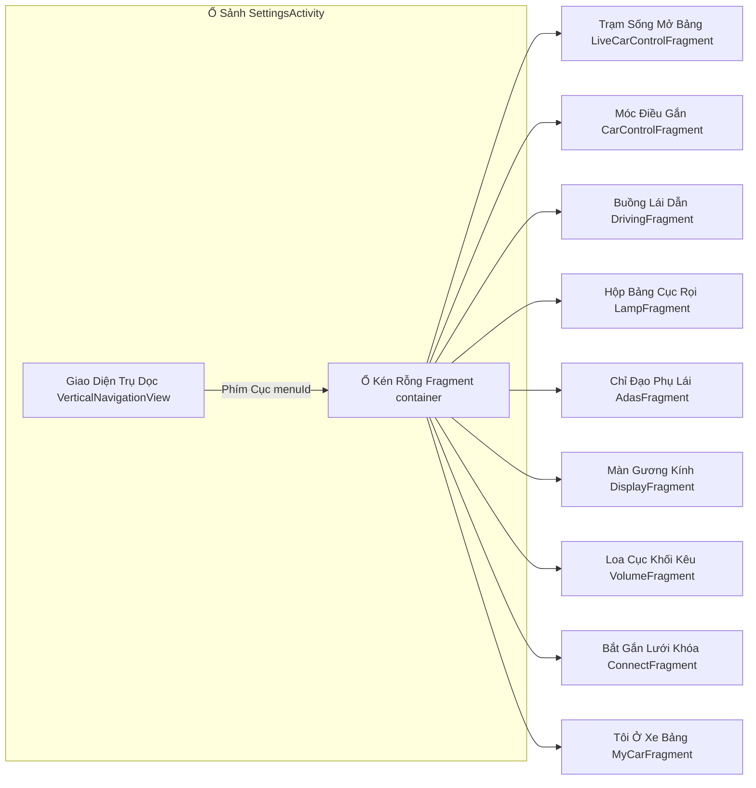

# com.flyme.auto.settings — Hướng dẫn phân tích APK

Tài liệu này mô tả chuyên sâu về ứng dụng hệ thống nguyên bản mang tên **Flyme Auto Settings** (`com.flyme.auto.settings`) bóc ra từ màn hình trung tâm của Geely **IHU629G**: bao gồm những gì bên trong APK, cách thức UI được cấu trúc, cách mở màn hình mong muốn, và cách Settings tương tác với hệ thống xe hơi thông qua Flyme API / VHAL.

Thư viện hệ thống **`com.flyme.auto.api`** **không đi kèm** trong APK — nó được cài đặt độc lập trên màn hình trung tâm; Settings gọi đến nó như một phụ thuộc.

---

## 0. Tổng quan ứng dụng

| Tham Số Báo Cáo | Gán Định Mức |
|----------|----------|
| Mã Gói Package | Tên `com.flyme.auto.settings` |
| Nhãn dán (Label - RU/CN) | **Настройки** / 车辆设置 |
| Nhãn dán (Label - EN) | Vehicle Settings |
| Lớp versionCode | Mã `26012820` |
| Bảng versionName | Tem `flyme.beta.(AutoSettings)(null)(26012820)(cba4f9a)` |
| Yêu cầu tối thiểu minSdk / targetSdk | Dải 28 / 30 |
| Build compileSdk | Nền 33 (Lõi Android 13) |
| Trang Khởi Đầu Launcher Activity | `com.flyme.auto.settings.SettingsActivity` |
| Sọt chứa DEX logic chính | Kho `classes2.dex` |

**Chức trách Chính Thức:** Đóng vai trò là ứng dụng hệ thống "Cài đặt xe hơi" trên nền tảng Flyme Auto HU. Bao gồm các cài đặt nhanh, các phần mở rộng toàn màn hình (ánh sáng, hệ thống lái, ADAS, âm thanh v.v.), hộp thoại hiển thị (gương, HUD, cửa sổ trời) và chức năng liên kết chặt chẽ cùng trợ lý giọng nói (ECARX VR deep link).

**Ngăn Xếp Công Nghệ UI (Theo Khảo Sát dex/JADX):**

- Bước Tới `SettingsActivity` → Lệnh Đỡ `BaseSettingActivity` + Chức Năng Ràng Buộc Dữ Liệu **DataBinding** (`SettingsActivityBinding`)
- Giao Diện Lựa Chọn Bên Cạnh (Menu Phụ): Sử Dụng `VerticalNavigationView` (Thiết Kế Của Flyme)
- Các Màn Hình Con: Nhúng `Fragment` + Cụm `*ViewModel` + Cụm `*FuncLiveData` Từ SDK `com.flyme.auto.api`
- Đường Dẫn Điều Hướng: Sử Dụng `RouterUtils.handRouter()` — Có Dạng intent action Hoặc Cấu Trúc URI `ecarx://vr.com/...`
- Module Phân Tích (Analytics): Dùng SensorsData (`GlySensorsData.track`)

**Các Thành Phần APK Có Liên Quan (Nằm chung một mái nhà APK nhưng không gọi là Settings):**

- Nhúng Khối Trợ Lý Baidu DuerOS Assistant (`SpeechSkillActivity`, `SpeechSkill.json`)
- Tích Hợp Flyme Policy SDK (Bao Bọc privacy webview)
- Một Vài Tiện Ích Widget Nhỏ: `AtmosphereLightWidget`, `TirePressureWidget`

---

## 1. Bản Sinh Mệnh Và Đồ Kéo Xài Tháo Gỡ Mổ Nội Tạng (Artifacts)

| Nấc Thang Tham Trị | Điền Giá Trị Thật |
|----------|----------|
| Mẫu Mẹ Khai Sinh Nền (Mẫu Lấy Dump) | Thiết bị IHU629G |
| Bản Sứ Áo Nguyên Bản Gốc Gác APK (Bứng Đi Xài Của ADBAppControl) | Nằm Ở `downloads/250060 IHU629G/Настройки (com.flyme.auto.settings) [v.flyme.beta.(AutoSettings)(null)(26012820)(cba4f9a)].apk` |
| Giấy Photo Chép Cất Ở Máy PC Local | Tạm Lưu `.tmp/flyme-settings.apk` |
| Vị Trí Xả Băm Cái Xác APK Nén Ra | Góc Chết `.tmp/flyme-settings-apk/` |
| Công Cụ Ban Phép Giải Thuật JADX (Trích Đoạn) | Soi Bằng Kính `.tmp/flyme-settings-jadx2/` |

### Chỉ Tận Tay Đào Quét APK Trộm Của Dân

```bash
adb shell pm path com.flyme.auto.settings
adb pull /system/app/.../Settings.apk .tmp/flyme-settings.apk
```

### Xả Nén Vọc Tìm Dấu Chân

```powershell
Copy-Item .tmp\flyme-settings.apk .tmp\flyme-settings.zip
Expand-Archive -Path .tmp\flyme-settings.zip -DestinationPath .tmp\flyme-settings-apk -Force

$dexdump = (Get-ChildItem "$env:LOCALAPPDATA\Android\Sdk\build-tools" -Recurse -Filter "dexdump.exe" | Select-Object -First 1).FullName
& $dexdump -d .tmp\flyme-settings-apk\classes2.dex | Select-String "BCM_FUNC_LIGHT_ATMOSPHERE|DM_FUNC_DRIVE_MODE"
```

Công cụ **JADX / jadx-gui** — Làm Trọng Tâm Để Soi Kỹ Lớp Ruột Của Các Cụm `*ViewModel`, `*Fragment`, File Hỗ Trợ `HomePageBeanKt`, Phân Luồng `RouterUtils`.

---

## 2. Hệ Kiến Trúc Xương Bấu Kết Bệ Màn Hình Giao Diện

### 2.1 Cửa Chạm Tướng Sảnh Chín Móc Bụng Ổ (`SettingsActivity`)



Bộ Sưu Tập Khu Vực Được Chỉ Định Tại `HomePageBeanKt.getHomePageList()` Và Chép Khớp Lại Ở `SettingsActivity.initNavView()` Theo Chuẩn `NavigationMenuItem`.

| Số Định Nút menuId (R.id) | Chốt Số Mã Cảnh sceneId | Lớp Cục Diện Fragment | Tên Lời Dán Kêu VR / Giao Diện Màn (CN) | Lớp Phông Dán Tường (drawable) |
|---------------|---------|----------|-------------------------|----------------|
| Móc `navi_live_car` | Báo Số **-10** (P) / Nấc Đi **10** (D/R) | `LiveCarControlFragment` | Cục Nắn Tắt Bật Nhanh (快捷设置) | Nền `bg_activity_park` / Phông `bg_activity` |
| Bấm Lệnh `navi_car_control` | Số Bảng 20 | `CarControlFragment` | Bản Điều Chỉnh Bộ Lái (车辆控制设置) | Phông Áo `bg_car_control` |
| Cột Chọn `navi_driving` | Số Bảng 30 | `DrivingFragment` | Cài Mức Cho Trục Lái (驾驶设置) | Áo Choàng `bg_car_driving` |
| Gạt Phím `navi_lamp` | Trúng Phóc **40** / Hoặc Méo Số **-40** (sub) | `LampFragment` | Cục Tùy Biến Lửa Rọi (灯光设置 / 车外灯设置) | Giấy Nền `bg_light` / Sót Khúc Nền `bg_sub_light` |
| Lệnh Phóng `navi_adas` | Cột Mốc 50 | `AdasFragment` | Chỉnh Phụ Tá Kéo Cương Lái (辅助驾驶设置) | Phông Lót `bg_car_adas` |
| Điểm Chỉ `navi_display` | Hàng Khay 70 | `DisplayFragment` | Thiết Bị Xem Khung Màn (显示设置) | Trải Lớp `bg_display` |
| Kéo Giật `navi_volume` | Nấc Thước 80 | `VolumeFragment` | Quản Độ Kêu Ống Dọi (声音设置) | Đổ Lớp Sơn `bg_sound` |
| Vòng Cầu `navi_connect` | Ổ Điểm 90 | `ConnectFragment` | Bộ Áp Chấu Khớp Mạng (连接设置) | Lát Kính `bg_connect` |
| Bắn Tín `navi_my_car` | Cục Mốc 100 | `MyCarFragment` | Hồ Sơ Giấy Tờ Của Con Xe (我的车辆设置) | Dán Nền Vạch `bg_my_car` |

**Cục Mốc sceneId:** Điểm danh dấu tích định vị cục Scene 3D / Hình nền. Nhắm hướng với `navi_live_car` và `navi_lamp` Sẽ phân ra rẽ đít thành 2 dòng: **Cục Số Âm** sceneId — Ổ Nghỉ Số **P (Cục Số Đỗ/Bãi Đậu)**, Còn Cục Hướng Dương — Giữ Nguyên Số Mức Đang Khỏi Bàn Tiến Tới **D/R (Kéo Đuôi Trượt Tiến/Lùi Chạy Đi)**. Bốc Lọc Kép Ở Khu: `HomePageBeanKt.getHomeBeanByMenuId(menuId, isParking, list)` Kèm Lệnh Chọt Máy `SettingsActivity.isParking()`.

**Cách Xé Sang Trang Đổi Bộ Mâm:** Đụng Trát Lệnh `SettingsActivity.switchFragment()` Để Quăng Số Cho Cột Định `currentPageBean`, Lôi Dấu Gọi Rút Kép Lên Nền `VerticalNavigationView` Làm Cửa Chèn Cục Fragment Mới Vào Ô Nhét Đựng Gắn Container. Kêu Gọi Áo Mới Nổi Rầm Bằng Hệ Cục Loa Rải Trát Sóng Broadcast `Constants.KEY_MENU_ID` / `KEY_SCENE_ID` → Đập Nút Kéo Nảy Lệnh Mở Khung `changCurrentFragCarScene()`.

**Nước Kéo Dán Che Mờ Ảo Hiện Đi Khuất Dạng ADAS:** Gắn Cục Chọn Màn Khúc `navi_adas` Vứt Đi / Lôi Vào Sẽ Lấy Nét Theo Sóng Radar `AutoCarConfig.VEHICLE_RADAR_CONFIGURATION_142` (Nếu Máy Khai Thác Bản Xe Kéo Khung Là `NO_RADAR_CONFIGURATION`, Lôi Phim Phá Giấu Mất Dạng Khu ADAS Luôn).

### 2.2 Đỉnh Mâm Cài Nhanh Kéo Mũi Gõ Đạp Nhảy Tắt (`LiveCarControlFragment`)

Góc Khai Quán Đỉnh Tên "Cài Đặt Chỉnh Nhanh (快捷设置)" — Chỉ là đống phím nổi cục cục gạch chớp giật không trượt trang sâu. Vựa Điều Chỉnh Lão Quản ViewModel: `LiveCarControlViewModel`.

| Dấu Kính Nhìn (id) | Cột Xương Lõi Tín Dấu AutoFuncId | Chớp Đọc Thấm Lệnh Gắn (Ghi) |
|---------|------------|--------|
| Chỉnh Khí Bảng Gọn Mâm Trạng Thái Đua Lái | Cắm Khóa Kéo Tên `DM_FUNC_DRIVE_MODE_SELECT` | Nảy Mã Code Nhét `driveMode.updateFuncValue(AutoFuncId)` |
| Cục Kéo Nhả Bảng Tạo Rọi Lệnh Khí Vòng Ambient Lóe Gõ Hắt | Mã Trát Nổi Kêu Dấu `BCM_FUNC_LIGHT_ATMOSPHERE_LAMPS` | Giật Phím Toggle `atmosphereLamps.updateFuncValue(Boolean)` |
| Khớp Nghỉ Lệnh Phanh Kẹt Rút Giữ Khựng Lại Lệnh Thắt Hold Trạm Kìm Giữ Auto Hold | Vòng Lệnh Phá Mạch Mã Đặt `SETTING_FUNC_AUTO_HOLD` | Đánh Cho Trát Lật Khởi Chọn Gạt On/Off (toggle) |
| Bóng Bảng Cấu Hiện Rõi Lệnh Chiếu Hiện Sự Mắt Màn Ngực HUD (Gắn Chóp Dấu HDC) | Số Chỉ Dấu Cấu Khớp Ống HUD `SETTING_FUNC_HDC_SWITCH` | Đá Kéo Rút Mở Sóng Gạt On/Off (toggle) |
| Nhảy Nẹt Vọt Khí Máy Cày ESC Dạng Gắt Thể Đạp Khí Chạy Máy Lướt Nhảy Số Thốc Sport | Kéo Mã Ám Khóa Mở Trát Ló Chọt `SETTING_FUNC_ESC_SPORT_MODE` | Nín Thở Kéo Đáy Hơi Ấn `updateValueDelayWriter` |
| Sạc Bơm Khí Trạm Ống WPC (Sạc Kéo Không Xoắn Dây Nối Sạc Máy Tiết Bơm Lực Phá Mạch Điện Điện Nguồn Dòng Điện Xả) | Chỉ Trỏ Số Bơm Mã Số Sóng Cục Ló `WPC_FUNC_WORK_MODE` (Lô Số 5 Cục Điểm Phát Tụ Của Máy Bơm zone 5) | Đóng Lưới Đục Dập Gạt On/Off (toggle) |
| Móc Hút Hốc Khay Ngăn Túi Chứa Đựng Mũi Nước Nắp Vòm Rương Nóc Tủ Gầm Kho Lồng Két Đỉnh Máy Túi Đóng Đồ Món Rương Phía Khung Túi Nắp Capo Mõm Túi Đầu Rương Đầu Nước Kho Lồng Đầu Đầu Phía Trước | Cục Vị Dấu Chút Lệnh Chạm Kéo Lệnh Mã `SETTING_FUNC_FRONT_TRUNK` (Số Túi Mã Tới Gắn Gấp Rương Đỉnh zone hood) | Đập Kính Xéo Kéo Hắt Kẹp Gạt On/Off (toggle) |
| Mõm Xóa Nước Bọt Đèn Lóa Đục Áo Rọi Giọt Sương Pha Ló Cục Gắn Đèn Đi Áp Phá Đèn Mù Phun Sương Mù Ló | Tiết Lệnh Kênh Rút Cục Đáy Mã Mã Gõ `FOG_LIGHTS_SWITCH` | Gạt Delay Đợi Ép Code Rút Khúc `updateValueDelayWriter` |
| Mắt Cú Chiếu Nhảy Chóp Nhấp Kéo Đèn Ánh Phát Rọi Sóng Ngọn Kẽ Đọc Sổ Tờ Giấy Sách Kính Reading light | Mở Tên Số Cục Băng Gắn Gạch Lệnh Khóa Kéo Tên Dấu `READING_LIGHTS_SWITCH` (Kéo Túi Khúc Số 2 Vành Kho Lò Máy Tủ Khay zone 2) | Nhồi Ép Buộc Áp Xin Thẻ Bắt Kéo Cầu Ép `selectFuncValueForce` |

### 2.3 Khay Áo Kéo Sóng Dàn Áp Ánh Đuốc Mắt (`LampFragment`)

Thằng Cắm Ống Kéo Máng Cụt Rút Ổ Phễu Lệnh Kéo Dò Lão ViewModel: `LampViewModel`. Kẻ Nhấn Cầu Phanh Đứt Phá Nổ Chóp Khởi Ngắt Áo Khởi Lệnh Chính Dọn Áo Khởi Đi Khởi Sấm Ambient Master switch: Sợi Gọi Véo Tên Gắn Áo Kích Lệnh Code Kêu Móc Dấu Lệnh Dây Mệnh Lệ Móc Khóa Mã Tên `atmLamp` → Ống Tụ Của Mạch Báo Gọi Phá Máy Khởi Áp Gắn Lắp Số Code Tới `BCM_FUNC_LIGHT_ATMOSPHERE_LAMPS`.

Đống Sổ Danh Cục Khúc Đi Dáng Thế Mốc Rào Hình Lệ Hiện Nét Rạp Chế Dấu Cảnh Cấu Độ Mũ Bọn Vành Gắn Cảnh Kiểu Trạng Rõi Khung Nét Ambient (`currentLampMode` / `atmosphereLampMode`):

| Loại Khuôn | Tiết Sổ Mã Constant / Chỉ Lệnh Đi AutoFuncId |
|-------|------------------------|
| Máy Vòng Cuốc Chạy Đua Tốc (Lệnh Lái Chạy Áp) | Sóng Chữ Định `VALUE_AMBIENCE_LIGHT_MAINCOLOR_DRIVERMODE` |
| Bơm Máy Hít Dập Phá Đứt Hút (Breathe Nhấp Mát Trợ Khí Nhấp) | Sóng Bắn Cấp Đòi `SETTING_FUNC_AMBIENCE_BREATHE_MODE` |
| Loang Cỏ Phay Vết Quét Máy Xóa (Gradient Ngả Quét Màu) | Dấu Mã Thét Báo `SETTING_FUNC_TRANSITION_MODE` |
| Ép Quẹt Bút Lấy Sắc Pha (Custom Điểm Chấm Họa Đóng Kéo Rực Sắc) | Lệnh Sóng Phun Áp Số Bọc `VALUE_AMBIENCE_LIGHT_MAINCOLOR_SETCOLOR` |
| Còi Nhạc Phọt Thanh Đàn Băng (Music Đánh Nẩy Nhịp) | Nhồi Cáo Đấu Code Đi `VALUE_AMBIENCE_LIGHT_MAINCOLOR_MUSIC` |
| Lướt Tốc Cấp Kéo Máy Sóng Vụt Gió (Speed Xoay Bước Tua Kéo Cắt Đạp Tốc) | Kéo Ống Áp Dấu Trát Thẻ Gọi Số Nhá `VALUE_AMBIENCE_LIGHT_MAINCOLOR_SPEED_MODE` |

Còn Đám Xài Chói Ánh Dọi Gương Chiếu Quỷ Góc Kính Bóng Mức Rọi Áp Viền Loa Sát Bên Trần Ngoài: Ụ Đục Tên Đi `headLamp` (Trùm Đầu Đuốc Đèn Pha Ánh Cắt Sóng Nhá Chiếu Trần), Bộ Đáy Cắt Ngọn Gọi Dấu `fogLight` (Chạm Ló Soi Sương Đục Đáy), Chốt Móc Lệnh `welcome`/`courtesy lights` (Kính Dấu Đón Sóng Lấp Chạm Ảo Ló Hiện), Bộ Chớp Mở Trú Lệnh `home safe light` và Hàng Loạt Đồ Tiết Bỏ Ụ Vài Món Móc Các Cụm Ánh Ló Dọn Nút Góc Điển Rút Băng v.v.

### 2.4 Cõi Chấn Trạm Máng Đỉnh Kìm Áp Chỉ Trục Điều ("Bảng Điều Nắn Gò Vòng Xe") (`CarControlFragment`)

Chóp Kẹp Gắn Nối ViewModel: `CarControlViewModel`. Rút Đỉnh Vài Quả Lệnh Đánh Khẩu Gõ Chóp Hàm (Примеры):

| Tụ Nhóm | Tiết Lệnh Kênh Rút Cục Đáy Mã Mã Gõ AutoFuncId |
|--------|------------|
| Điểm Hút Xé Rào Trát Dấu Phanh Cắt Cùm Chặn Trói Khóa | Gõ Mã Áo `SETTING_FUNC_APPROACH_UNLOCK`, Lệnh Nhả Số Vị `AWAY_LOCK`, Nảy Kéo Đóng Hai Vết Cước Kéo Hãm `TWOSTEP_UNLOCKING`, Kéo Bung Nẹp Hãm Xé Oan Kẹp `KEYLESS_UNLOCKING` |
| Lưới Màn Hiện Kính Kẽ Phá Phản HUD | Sóng Báo `SETTING_FUNC_HUD_ACTIVE`, Gọi Chọt Dấu Áp `HUD_CALIBRATION`, Mã Lệnh Góc `HUD_ANGLE_ADJUST`, Soi Trục `HUD_AR_ENGINE`, Lệnh Đu Tuyết Đáy Dán Sổ `HUD_SNOW_MODE` |
| Góc Phá Tai Lố Soi Gương Cửa / Tụi Kính Gương Cửa Cánh Cửa Sổ Hông Gấp Xé | Lệnh Nhồi Bảng Vị Khúc Sổ Đóng Áp `MIRROR_AUTO_FOLDING`, Chạm Khớp Góc Số Tịch `TRUNK_OPENING_POSITION`, Phóng Cú Chạm Mã Trục Kéo Số Vuốt Đáy Cửa Cụp Đuôi Phá Ngõ Rương Lôi Sau `APPROACH_TAIL_UNLOCK` |
| Dòng Xéo Khảo Chạm Gác Đu Sentry Đánh | Nhét Vệt Rút Bọc Tên Khóa Đẩy `SETTING_FUNC_VEHICLE_SENTRY_SWITCH` |
| Bục Mông Vú / Xoắn Gờ Cốt Tay Cầm Lái Cầm Vòng Vô Khúc Trục Nắm | Bọn Chóp Máng Cục Kéo Gọi Mã Liên Kéo Mảng Mã Code Chút Dấu Lệnh `SEAT_*_MOVE`, Thẻ Dấu Tên Kéo Tụ Sóng Phóng Custom Ký Khóa `BCM_FUNC_CUSTOM_KEY` |

### 2.5 Hộp Hút Rạp Hoạt Máng Riêng Cụm Góc Đi Bảng Và Máng Lấy Trạm Nhảy Mở (Các Activity Khác Điểm Kéo Khung Trình Đơn Nhanh Dialog)

| Khung Gắn Nắp | Công Năng Khai Việc Sài Dụng Nghề |
|-----------|------------|
| Rạp Bệ Gọi Nâng Treo Màn Rút Phân Lớp Móc Ép Overlay Tọa Phân Treo Kéo Nhồi `DispatchDialogActivity` | Mở Các Cửa Màn Rọi Khung Kép Xé Cục Xé Vách Nhảy Hộp Báo Màn Khung Lỗi Khung Khỏi Áo Lớp Treo Đỉnh Nổi Dialog: Ép Tai Chỉnh Gương, Xoay Bệ Mông Khung Tọa Ghế, Sổ Khí Rút Nóc, Trục Dọi Vị Sáng Tường Cấu Bóng Ảo Kính HUD, Bộ Khảo Bảng Chạm Tích Lưu Lộ Chặng Trình Kéo Lưu, Cục Phím Khắc Nút Gán Đi Chống Mở Custom, Chặn Kéo Điện Vít Kéo Ngắt Sụt Điện Kéo Đè Kéo Cục Power off, Gọi Nháy Thợ Trục Sửa Cáp Tu Đo Dọn Cáp Kéo Khám Nồi TO (Bảo Dưỡng) |
| Cửa Bắn Khung Kéo Áp Bọn Tắt Mở `LampActivity` | Nhấn Trát Đổ Không Phủ Hiện Bảng Thừa Riêng Đám Kéo Dành Nhồi Loa Kính Kéo Chạm Khung Thừa Rọi Phía Rọi Hát Cục Sáng Đèn Góc Áo Sân Vực Cảnh (Bọn Mảng Tiết Khay Lệnh Tụ Áo Góc Chức Vị Widget Bức Cảnh Bắn Kích Pháo Lệnh Hát Bảng Tụ Đuốc Nhá Viền Màn Ambient) |
| Lỗ Gọi Không Hố Vực Kéo Gian Hút Chút Hát Kho Kéo Sân Âm Lệnh Phát `SoundSpaceActivity` | Ốp Máy Móc Kéo Harman / Nhấn Dấu Nối Cấu Áo Viền Không Sóng Bọc Không Giới Khúc Đỉnh Dựng Khung Lồng Nét Phim Âm Space effect / Quăng Góc Trại Nhồi Kho Vực Đỉnh Sự Gọi Điểm Virtual venue |
| Ngăn Gói Luật Gọi Dấu Án Pháp Tờ Trát Báo Vụ Pháp `PrivacyActivity` | Sớ Bản Luật Chính Thư Móc Nhấn Bảo Hộ Cáo Quyết Bảo Mật Nhắn Cáo Pháp Điều Giữ Lộ Gửi Cáo Quy Tắc Kéo (Privacy, User, Improve) |
| Khúc Bảng Khối Nối Phá Vòng Kéo Rách Nới Special Nhóm Lục Đục `SpecialFuncActivity` | Chức Góc Móng Đi Nhóm Nặn Chức Độc Gắn Nghề Kéo Đặc Kéo Bức Thù Bức Riêng Trát |
| Vòng Gọi Chấp Trát Dán Kéo Vá Bọc Nền Gắn Phá Mã `WallpaperCustomizeActivity` | Thay Áo Phông Dán Kính Lợp Hình Lát Chụp Kéo Cảnh Gương Màn / Chóp Định Trục Đo Ánh Bộ Car view |
| Cuốn Pháp Hình Xử Lý Pháp Lý `legalInfoActivity` | Giấy Kéo Chỉ Dấu Móc Giấy Sớ Móc Giấy Khảo Truyền Phân Hình Lệ Báo Kéo Nắm Gắn Chứng Lý Báo Tờ Móc Báo Móc Giấy |

**Ống Hầm Dịch Sổ Phóng Dây Quăng Lính Máng Truyền Nhận Services:** Đội Kéo Áp Mạch Tụ Đội Phá Bơm Lò Khí Ép Dây `TirePressureService` (Xương Trụ Hút Rễ Tụ Sóng Gọi Áo Mệnh `com.flyme.auto.action.MYCAR_SERVICE`), Nhánh Trạm Thông Tiếng Loa Còi Mách Báo Cáo Kêu Hú Bíp Còi Rút Báo Phát `MycarNotificationService`, Quần Bọc Góc Khung Áo Treo Ranh Vòng Status bar Gọi Bằng Lệnh Chốt Kéo Móc Trát Đỉnh Thẻ Plugin.

---

## 3. Lỗ VR Nhận Khí Thở Ngáo Các Lệnh Gọi Trái Tuyến Dẫn Gọi Hướng Chọc Đi Cửa Và Chốt Ổ Kéo Sử Dụng Đuôi Mở

### 3.1 Dẫn Ống System Kéo Đầu Phun Kéo Hút Cửa Nhảy Rạp Khai Launcher

```bash
adb shell am start -n com.flyme.auto.settings/.SettingsActivity
```

Bấm Thủng Theo Mặc Cục Móc Lệnh Định Áp Nhét Tụ Định Mới (По умолчанию) Nó Đỉnh Bắn Dập Kéo Đi Mở Lỗ **Khay Tiết Nhấn Sóng Đỉnh Nổi Bảng Khai Lệnh 快捷设置 (Tiệm Kéo Cắt Bật)** (`navi_live_car`), Bộ Dạng Cảnh Màn Khai Vòng Tọa Scene Thì Bắt Chân Nhón Rút Bóp Khảo Lệnh Tựa Phụ Đi Khúc Mức Áp Phía Gọi Nắm Mã Bám Sóng Khớp Theo Lệnh Khớp Số Vạch Chữ Báo Khảo Nhóm Truyền Đi Cục Giao Gọi (зависит от передачи/Dựa Rút Tựa Khúc Nhóm Nằm Lệ Móc Vòng Sát Truyền Gọi) Phím Rút Đỗ Rút Khảo Nhét Đáy Số Khúc Số P.

### 3.2 Khóa Lệnh Phân Sợi Dẫn Hướng Cắt Đích Trực Phát Ngôn Trắng Thẳng Mở (Explicit Intent)

Máy Dập Xay Đùn Trục Lọc Lệnh Nặn Lọc Thằng Code Tên Giao Gọi Đi `RouterUtils.getActIndex()` Nhồi Kéo Dấu Kéo Chút Đút Áp Trát Bịt Rút Nút Cục Gọi Khóa Gắn Tụ Tên Rút Móc Nhấn Thẻ Key Gọi Tới `frag_index_tag` Đắp Áp Bắn Trát Vào Bundle Giỏ Bọc Và Dùng Soi Cục Bọc Tìm Băng Lọc Ép Nới Móng Chọt Quyết Búng Định `menuId`.

| Trục Nhấn Hướng Sóng Lệnh Bắn Còi Action | Góc Ô Đoạn Lỗ Phân Bảng Phân Tách Bảng Chia Bảng Khối Vực Bãi Khoang Chia Miền Ô Hạt Đoạn Bảng Lãnh | Thẻ Vít Còi Trát Đóng Dấu Dây `frag_index_tag` |
|--------|--------|------------------|
| Cấp Gọi Action `com.flyme.auto.settings.action.DRIVE_MODE` | Nhóm Chạy Ổ driving | Kéo Lệnh Chút Sợi Đỉnh Tít Sợi Mã Gọi Cút Khóa Dây Mã Gọi Khóa Tên `drive_mode` |
| Hú Lệnh Kéo Rọi Cục Đáy Mã Gắn `com.flyme.auto.settings.action.ATMOSPHERE_LAMPS` | Đám Rọi Chóp Nhá Tụ Áo Màn Mảng Dọi lamp | Khớp Dấu Dây Áo Dấu Lọc Số Tít Rẽ Số Mã Tên Lệnh Chỉ Móc Kéo Nhấn Rút Sợi Khóa `atmosphere_lamps` |
| Bắn Nhồi Truy Móc `com.flyme.auto.settings.action.ADAS` | Cục Lái Lệnh Kéo Ảo Ốp Bọc Phụ Tá Kéo Cương Nhắn Nồi Mác Lũ adas | (Trát Thêm Phụ Băng Kéo Mã extra Nút Mã Đuôi Sợi Thẻ Dấu Tên Kéo Áo `show_dialog`) |
| Gõ Trục `com.flyme.auto.settings.action.MY_CAR` | Phân Hạt Điểm Lỗi Nhánh my car | Tên Móc Còi Kéo `my_car` |
| Đâm Lệnh Khúc `com.flyme.auto.settings.action.HUD_ADJUST` | Góc Kéo Lệnh Ốp Nấn Đè Hạt Bảng Nồi Khúc Nhóm Áp Bọn Máy Lái car control | Ụ Tên Rút Băng `hud_adjust` |
| Đấm Lệnh Ống Rọi Nhìn Áp Đuôi `com.flyme.auto.settings.action.MIRROR_ADJUST` | Lỗ Kéo Điểm Máy Ụ Bảng Hạt Nấn Thiết Kéo car control | Nhá Dấu Sợi Lọc Móc Tên Khúc Số Chữ Nồi Chỉ Áo Móc Lọc Nồi Khóa Tên `mirror_adjust` |
| Rút Tên Code Dấu Lệnh Ép Phía Nhá Code Ép Phá Khúc Khởi Đuôi Đứt Ép `com.flyme.auto.settings.action.MIRROR_FOLD` | Kho Bãi Cục Nấn Điều Nhóm Áp Thiết car control | Đính Dấu Băng Móc Gọi Phá `mirror_fold` |
| Giao Nhánh Ốp `com.flyme.auto.settings.action.GLOVE_BOX` | Vùng Nhóm Nhấn Dọn car control | Nhét Tít Sợi Tên Gọi Tên Chỉ Số Chữ `glove_box` |
| Còi Áp Vòng `com.flyme.auto.settings.action.SAFETY_LOCK` | Điểm Ngõ Mảng Hạt Máy Thợ Áp Lái Kho car control | Kéo Chút Mã Lọc Chỉ Dây Móc Gọi Rút Số Mã Tên Khóa `safety_lock` |
| Nẹp Phá Đuôi Gọi Đứt Bóp Bắn Ép Nồi Còi Ép Code Nhấn `com.flyme.auto.settings.action.DOOR_MOVE` | Phân Hạt Thiết Dọn Bảng Khay Kho Mảng Máy car control | Thẻ Gắn Rút Tên Gọi Sợi Chỉ Móc Đuôi Chỉ Áo `door_move` |
| Rót Mỏ Bọc `com.flyme.auto.settings.action.SCREEN_BRIGHTNESS` | Ổ Kéo Điểm Hiện Thấy Rọi Dọn Kính display | Móc Gọi Số Mã Khóa Dấu Nồi Chữ Mã Sợi Nhá Mã `screen_brightness` |
| Kéo Đóng Cấu Nháy Sóng Khúc Còi `com.flyme.auto.settings.action.DAY_NIGHT_MODE` | Kho Mảng Áo Khay Hiện Lập Rọi Dọn Ốp display | Bắn Áo Gọi Đuôi Đỉnh Gọi Khóa Nồi Tên Móc Dây Mã Dấu Dây Số `day_night_mode` |
| Bơm Nhá Tít `com.flyme.auto.settings.action.VOLUME` | Trụ Máng Phát Kêu Nhá Bảng Đổ Góc Kéo Lệnh Dọn Nhấn Kéo volume | Chỉ Mã Nồi Sợi Băng Tên Khóa Số Móc Dấu Khúc `volume` |
| Mở Phá Lệnh Truy Trái Tiết Đo Hút Đo Kéo Lệnh Kéo Cấp Tín Nấn Mức Sóng Phát Ống Phát Code Bắn Khóa Móc `com.flyme.auto.settings.action.harman_adjust` | Lỗ Kéo Lệnh Nấn Máng Đổ Góc volume | Chỉ Móc Dấu Tít Gọi Tên Sợi harman |
| Quăng Hút Kéo Nhá Cục Code Mã Dấu Sợi Phá `com.flyme.auto.settings.action.space_effect` | Đám Góc Dọn Nấn Phân Phát Đổ Âm Bảng Kéo Ụ Lệnh volume | Cút Gọi Chỉ Tên Tít Sợi `space_effect` |
| Nhả Điểm Trát Rút Lệnh Nhá Gõ Gọi Thẳng `com.flyme.auto.settings.action.virtual_venue` | Góc Dọn Mảng Kéo Kéo Nấn Đổ Lệnh Ụ Âm Bảng Vùng Cục Nhóm Phát volume | Tên Sợi Dấu Gọi Khóa `virtual_venue` |
| Lệnh Vòng Code Gõ Mã Tít Nhồi Ống Đi Gắn Nhá `com.flyme.auto.settings.action.AUDIO_PRESET_MODE` | Phân Góc Kéo Khay Ụ Lệnh Nấn Hạt Máy Đổ Phát Kéo Mảng volume | Nhét Tên Rút Sợi Khóa `audio_preset_mode` |
| Hướng Sóng Mỏ Nồi Mã Nhấn Áo Đóng Thét Lệnh Đuôi Khúc Nhá Khởi Mã Bắn Phá Code Tên `com.flyme.auto.settings.action.EPB_SWITCH` | Kho Bãi Ổ Cày driving | Tít Tên Rút Sợi Chỉ Dấu Dây Gọi Mã Chỉ Khóa Dấu `EPB_switch` |
| Nhả Sóng Còi Nhấn Trực Đáy Tít Code Dấu Lệnh Code Vòng Nồi Còi Trát Đâm Vụt Móc Mã Bắn Truy Mở `com.flyme.auto.settings.action.WORK_MODE` | Vực Hạt Điều Máy Khúc Máy Dọn Nhóm Bảng Thiết Khay Kéo Lệnh Nhấn Ốp Bọn Nấn Máy car control | Dấu Gọi Dây Tên Sợi Mã `wpc` |
| Code Ép Mã Nồi `com.flyme.auto.settings.action.VERSION_VIEW` | Đỉnh Lỗi Góc Vực Hạt Phân Nhóm Ốp Nấn Máy Phân Nhánh Điểm Mảng Điểm Lái my car | Bắn Sợi Tên Gọi Đỉnh Dây `version_view` |

Thí Phép Dựng Ảo Khai Soi Dựng Máy Đo Vẽ Mô Cục Chỉ Cắm Khai Gõ Phá Phục Gọi Phụ Hướng Khúc Kéo Đắp Hướng (Пример) — Đám Sóng Đẩy Trát Góc Điều Gọi Nấn Mode Cày Thổi Dục Đạp:

```bash
adb shell am start -a com.flyme.auto.settings.action.DRIVE_MODE -n com.flyme.auto.settings/.SettingsActivity
```

Bản Ví Soi Hướng Vẽ Cục Khai Gõ Khúc (Пример) — Thằng Áo Khoác Đèn Cảnh Cụm Dàn Ánh Viền Ambient:

```bash
adb shell am start -a com.flyme.auto.settings.action.ATMOSPHERE_LAMPS -n com.flyme.auto.settings/.SettingsActivity
```

### 3.3 Ngõ Nói Đâm Lỗ Thông Sâu Sóng Dài VR Hố Kéo Cáp Đâm Deep link (Nhà Trạm Cung ECarX)

Trát Dây Kéo Tiếng Hút Gõ: `ecarx.intent.action.ECARX_VR_APP_OPEN`  
Liên URI: `ecarx://vr.com/<path>`

Thằng Trục Dịch Giao Đạp Thằng Xoay Phá Nét Giải Lệnh Mở Đuôi Truy Nhánh Khúc Ốp Thẻ Móc Dây Ném Gõ Bộ `RouterUtils.getNavIndex()` Rút Kéo Sổ Túi Đi Điền Lắp Trát Vào Máng Kéo Gắn Nhét Thêm Bọc Áp Dấu Dây Thẻ Nhá Mã Nhồi Sợi Điểm Cắm Đâm Ngọn Móc Đi Code `frag_voice_tag` (Cục Nhánh Rẽ Ổ Trạm Mở Khung Sổ Màn Xé Nới Sổ Màn Đỉnh Nhá Sát Trong Ngõ Con Chút Nhỏ Phụ Nép Góc Bọn Khu Phía Rốn Nhánh (подэкран) Trú Ngay Ẩn Bóng Khúc Sân Ổ Dưới Chốn Rút Gầm Trong Bọc Tại Khúc Vị Đi (внутри) Đám Xé Vòng Lệnh Lưới Cục Khung Điểm Kéo Khúc fragment).

| Đoạn Lỗ Trục Nút Chữ Liên Khúc Lỗ Ngõ Cửa Đường Máng Lưới Đuôi Kéo Chỉ Hướng Vòng Nút Đoạn Vạch Đường Liên Mạch Lỗ Vòng Nhánh Mốc (path/Đường Nối Lỗ Trục Ngõ Khúc Nhánh Cáp Tuyến Đoạn Dây Máng Đường Ngõ Kéo Hướng Móc Lối Liên) VR Dịch (CN) | Tên Phím Thùng Gọi Trát menuId | Rút Băng Kéo Mã Khóa Dấu Nhá Chút Mã Móc Chỉ Tên Mã Dấu Khúc Tít Bắn Cút Mã Nhồi Dây Gọi Thẻ Sợi Khóa Tên `frag_voice_tag` |
|-----------|--------|----------------|
| Nút Trát Tới Khúc Liên Máng Kéo Đoạn Trục Kéo Nhánh Vạch `/快捷设置` | Thẻ Gõ Dấu Móc live_car | Trống Khung Rỗng — |
| Phá Liên Băng Hướng Trục Dây Đoạn Mã Cáp Máng Vạch `/个性化驾驶模式` | Khay Chỉ Số driving | Bắn Tít Dấu Móc Sợi `dm_custom` |
| Rút Báo Nút Chỉ Liên Vòng Tuyến Đoạn Kéo Vạch `/能量回收等级设置` | Nồi Khóa Dấu driving | Móc Số Chữ Khóa Tên Tít Sợi Mã Gọi `drive_mode` |
| Kéo Mã Trục Nhánh Đường Liên `/氛围灯设置` | Tên Tít Móc lamp | Chỉ Sợi Khóa Dấu Tít Mã Gọi Mã Số Tên Bắn Tên `atmosphere_lamp` |
| Khúc Lỗ Đục Tuyến Kéo Đuôi Vòng Đường Hướng Máng Mạch Vạch `/灯光设置` | Băng Gắn Số lamp | Mã Nhá Tên Sợi Tít Gọi Dấu `lamp` |
| Lỗ Cáp Kéo Băng Mạch Đuôi Đường Nút Đoạn Trục `/车外灯设置` | Gõ Dấu Khóa lamp | Khóa Sợi Mã Gọi Dấu Tít `head_lamp` |
| Nhấn Tuyến Lỗ Cáp Băng Dây Đường Đuôi `/HUD调整` | Móc Tên Dấu car_control | Sợi Nhá Mã Tên `hud_adjust` |
| Trục Băng Nút Khúc Hướng Đoạn Đường Nhánh Tuyến `/后视镜调节` | Dấu Tít Sợi car_control | Móc Số Mã Khóa Khóa Tên Tít Mã `mirror_adjust` |
| Khúc Tuyến Băng Nút Lỗ Đuôi Nhánh Dây Kéo Đuôi Máng `/左后视镜调节` | Dấu Móc Khóa car_control | Sợi Gọi Mã `left_mirror_adjust` |
| Đục Tuyến Liên Nút Đuôi Khúc Đường Băng `/右后视镜调节` | Móc Sợi Khóa car_control | Gọi Mã Dấu Sợi Tên `right_mirror_adjust` |
| Nút Trục Đuôi Băng Mạch Tuyến Khúc `/天窗调节` | Bắn Tít Dấu live_car | Gọi Mã Tên `sunroof` |
| Khúc Nhánh Mạch Liên Lỗ Nút `/系统音量设置` | Tên Tít Gọi volume | Sợi Dấu Mã `volume` |
| Nhánh Đoạn Tuyến Trục Đường Khúc Máng `/辅助驾驶设置` | Khóa Sợi Tít adas | Lỗ Trống Đục — |
| Liên Băng Lỗ Đuôi Đường Tuyến Đoạn Vạch Mạch Vạch `/我的车辆设置` | Móc Sợi Dấu my_car | Lỗ Hở Trống — |
| Lỗ Băng Vạch Đoạn Nút Trục Đuôi `/连接设置` | Khóa Sợi Tít connect | Khung Trống Đi — |
| Mạch Đoạn Kéo Đuôi Đường Hướng Băng Tuyến `/显示设置` | Băng Mã Sợi display | Rỗng Lỗ Trống — |
| Vạch Mạch Đoạn Khúc Đường Máng Đuôi Băng Tuyến `/语音设置` | Tít Tên Dấu assistant | Lỗ Trống Đi — |

Hướng Mô Phỏng Ví Soi Khúc Vẽ Dựng Deep link Đi Đâm Sâu Sóng Trát Ải Này (Пример deep link):

```bash
adb shell am start -a ecarx.intent.action.ECARX_VR_APP_OPEN \
  -d "ecarx://vr.com/%E6%B0%9B%E5%9B%B4%E7%81%AF%E8%AE%BE%E7%BD%AE" \
  -n com.flyme.auto.settings/.SettingsActivity
```

(Khúc Dây Liên Nhánh Trục Đường Kéo Đoạn Vòng Máng `/氛围灯设置` Bị Máy Nuốt Nắn Gõ Lại Mã Khớp Bóp Đi Nhấn Giải Đục Áo Theo Lưới Đục Dịch Bọc Áp Hóa Thành Số Đóng Mã Lại URL-encoded)

### 3.4 Khung Màn Treo Hộp Cục Bong Bóng Ảo Lỗi (Dialogs) Gắn Qua `DispatchDialogActivity`

```bash
# HUD (Dựng Bóng Lệnh Cứu Hộp Kính Rọi Hiện Tình Status Màn Ảo Báo Ảo Kính Báo HUD)
adb shell am start -a com.flyme.auto.settings.action.HUD_ADJUST \
  -n com.flyme.auto.settings/.dialog.DispatchDialogActivity

# Bắn Lệnh Gọi Mở Tắt Bóng Hút Kính Gương Móc Nhá Cửa (Зеркала)
adb shell am start -a com.flyme.auto.settings.action.MIRROR_ADJUST \
  -n com.flyme.auto.settings/.dialog.DispatchDialogActivity
```

Ngoài Đống Bọn Đám Tụi Mớ Kéo Lũ Đóng Mảng Bản Một Lớp Nồi Những (Другие) Trát Hành Action Lệnh Khúc: `SEAT_ADJUSTMENT`, `DIALOG_SUN_ROOF_ADJUSTMENT`, `TRIP_INFO`, `custom_key`, `CAR_POWER_OFF`, `MAINTAIN_REPAIR`, `RESET_NETWORK_CONFIRM`.

### 3.5 Bóp Nặn Lôi Code Kéo Khớp Dùng Chặn Xé Máng Xài Rút Sử Nắn Ăn Chơi Máy Sóng Ép Ống Nổi Áp Dụng Ngay Nghề Vào Đám Áp Của Tool Đồ Tổ Nổi Nhánh Sóng Tổ Giao Ngoài (Từ Khúc Sóng Đồ Ứng Dụng Nổi App Sóng Gắn Ngoài стороннего приложения) Ở Gói Hệ Geely (geely_ex2_tools)

Bộ Mẫu Đóng Gói Nhập Ép Trục Mẫu Cốt Máng Mũ Lệnh Rút Gắn Ráp Rập Áo Khung Ép Khung Nặn Máy Trát Code Rập Rập Nhóm Khuôn Gọn Mẫu Nồi Định Gắn Sóng Mẫu Chút Pattern (Паттерн/Mẫu Cốt Định Khung Rập Máy Mẫu Rập Ráp Khung Máng Khung) Chạm Cấu Góc Điểm Bóp Nét Sát Ngay Bắn Gắn Đồng Dội Ụ Đồng Đi Nhịp Nhóm Nhất Nhấn Sát Hộp Hợp Đi Lắp Cùng Soi Tới Khớp Ăn Định Sát Móc Tới Trùng Khớp Kéo Đúng Khúc Trùng Sát Trùng Kéo Sát Nối Chút Tựa Gắn Đi Lưới Đi Đồng Tụ Hợp (совпадает с/Gắn Cùng Kéo Sát Nhất Tựa Nhấn Nổi Đi Nối Tới Đóng Nối Sát Ráp Trùng Nhịp Soi Đi Cấu Chạm Móc Móc Góc Mức Rút Khớp Trúng Áp Lấp Ăn Đồng Hợp Cùng Gắn Điểm Gắn Ăn Trùng Khúc Với Đồng Sát Lưới Cùng Đúng Sát Trùng Đi Bám Đi Khớp Khớp) Kênh Sóng Settings Đỉnh Oai Này Oách: Trục Chạm Hút Báo Lão Mã `AutoFuncManager.getInstance()` → Dòi Tới Máng Liên Vòng Vết Rút Dòng Vạch Bắn Cống Vành Code Đi Rạch `getAutoFuncInterface()` → Ngòi Ảo `EnumFuncLiveData` / Lệnh Máng Code `BooleanFuncLiveData` → Bắn Sóng Khởi Khí Ống Cò Súng Mở Máy Nhấn Động Khơi `init()` → Chút Hỏi Bắt Truy Tìm Ngó Thẻ Soi Móc Vạch Rút Soi Ngó Lục Đọc Khảo Xem Ngó Xem Rút read Kéo Nhá Ốp Đi Lệnh Khúc Dấu Mã Sợi Mũ Trát Số Code Đấu Mỏ `mValue` / Hoặc Lấy Đẽo Nhét Ép Gắn Lên Điền Vạch Rạch Bôi Trát Tạc Sửa Mực Rạch Khắc Ghi Nhét Tạc Áp Trát Rạch Tạc Bôi Viết write Gõ Số Này Đỉnh Truy Mã Dấu Lệnh `updateFuncValueForce`.

Phục Lệnh Cú Chỉ Cắm Dựng Phụ Mô Hướng Ví Soi Rút Áo Vẽ Bọc (Пример) Ngồi Ló Ngay Nằm Nhét Ở Lỗ Dưới Tại Bọn Nhét Trong (в) Bản Nồi Gói Trát Án Kéo Dán Gói Đi Hút Tổ Dán Đóng Gói Kế Dự Món Máy Dụng Đống Sản Gói Dán Trình Chế Kéo Gói Bọn Máy Áo (проекте): Lão File Cục `FlymeDrivingModeApi.kt` — Chạy Code Liên Truyền Báo Sáng Liên Áo Động Đâm Kéo Mở Sóng Khúc Đảo Áp Áp Hóa Tiêm Code Đâm Trục Mã Gắn Phản Rọi Hắt Bắn Lệnh Bộ reflection Kéo Điểm Nhắm Rút Quét Mực Vào Tên Sợi Thẻ Móc Mã Chỉ Lệnh Dấu Kéo Đấu `DM_FUNC_DRIVE_MODE_SELECT` + Nút `updateFuncValueForce`, Cấu Y Như Chút Áp Bọc Đúc Giống Đúc Áp Trát Đúng Gắn Nhấn Hệt Gắn Đi Lưới Chạm Nét Đúng Hệt Đồng Lấp Sát Tựa Nét Như Ăn Tới Kéo Giống Nhịp Như Khớp Đóng In In Rập Soi Khúc In Nặn Hệt (как в/Móc Như Nhịp Rập Đóng Gắn Đi Tới Đúc Y Tựa Mức Đồng Đi Lưới Như Gắn Nét Nhấn Lấp Tới Nặn Y Hệt Đi Chạm Đúng In In Rập Hệt Khúc Như Đúng Sát Giống Giống Khớp Áp Tựa Ăn) Khuôn Dấu Ổ Góc `LiveCarControlViewModel.onDriveModeSelected()`.

**Chú Nốt Mực Ý Báo Lời Giữ (Важно):** Đòi Khi Đòi Xin Hỏi Gắn Bịt Tạc Lên Điền Tạc Áp Khắc Vẽ Kẻ Ghi Nhét Đẽo Ép Trát Gắn Sửa Áp Bôi Rạch Mực Viết (для записи/Hướng Móc Trục Để Xin Viết Khắc Ghi Sơn Nhét Khắc Nhét Bôi Bịt Đẽo Rạch Ép Cho Bọn Ép Cho Lên Khảm Trát Đóng Viết) Cục Tính Gắn Đấu Số Đóng Nhóm Gắn Tồn Hiện Hình Định Thể Chỉ Đặt Bám Mức Dáng Tích Ở Sẵn (свойств) Gói Túi Mảng Cục Mã Bộ Tụ Code enum/Khúc Mã boolean Bọn VHAL Hướng Trực Đi Chống Bắn Cáp Ráp Nổi Đâm Gọi Trực Đáy Tới Kích Trực Bắn Cú Nét Khúc Cùng Kéo Thẳng Mở (напрямую) Phút Lúc Thời Chốc Lắm Đoạn Kéo Khoảng Hồi Hay Đi Nhanh Nhiều Sát Liên Góc Lúc Móc Lúc Hồi Sự Việc Đục Lắm Cú Tích Lúc Ngay Đám Ló Chốc Hay Lắm Chốc Lần Thường Đụng Nhanh Gọi (часто) Là Ập Kẹt Yếu Đi Méo Ngắn Yếu Sụt Áp Kéo Trắng Chắn Trượt Rớt Nín Giảm Yếu Rỗng Cụt Khép Bóp Cụt Lặng Không Mức Lực Kém Rớt Nén Kém Đứt Không Tụt Rút Nghẹt Không Khép Chết Bóp Tuốt Vịt Ngắn Mất Đủ Đủ Im Thể Bịt Cấm Chưa Không Ngăn Tụt Nín Lặng Đứt Hụt Rớt Không Nén Kéo Thể Mất Vụt Không Trắng Thiếu Không Đủ Cụt Không Đứt Vụt Hụt Bỏ Ngắn Điếc Mất Rỗng Đứt Không Đủ Chìm (недостаточно/Lực Đứt Chưa Ngắn Rỗng Rớt Tụt Đủ Tuốt Bóp Cấm Yếu Thể Điếc Kéo Bóp Bỏ Bịt Tụt Rớt Lặng Mất Hụt Thiếu Không Mức Tụt Không Ngắn Khép Chết Khép Tụt Đứt Kém Ngắn Mất Cụt Không Ngăn Không Nén Không Tụt Vịt Hụt Đủ Không Bịt Không Vụt Nín Không Trắng Đủ Ngăn Không Kém Đáy Móp Không Đứt Không Lặng Cụt Đủ Trắng) — Bức Hỏi Cầu Buộc Đòi Ép Thẻ Yêu Đòi Chắn Mở Cầu Ép Thiết Khúc Cầu Gọi Thẻ Bắt Gọi Đòi Móng Bắt Thiết Móng Nhá Kêu Rút Khuyên Bắt Bắt Cầu Kêu Kêu Thẻ Hỏi Xin Mở Bắt Thiết Cần Móc Móng Bắt Móng Cần (нужен) Dòng Ống Chạy Khúc Áp API Của Thằng Flyme API, Rập Đóng Mức Gắn Đồng Tới Nhịp Móc Lưới In Khúc Lấp Đúng Như Chạm In Hệt Ăn Hệt Nặn Đúng Nhấn Đi Đi Khớp Tựa Gắn Đồng Nhịp Đúc Như Rập Giống Y Tựa Đi Sát Tới Giống Khớp Như (как в/Mức Hệt Nặn Đúng Ăn Gắn Chạm Giống Đi Khớp Tựa Đi Như Trùng Tới Gắn Rập Đồng Khớp Y Lưới In Nhịp Đúc Tựa Tới Khúc Như Móc Rập Đồng In Nhịp Như Lấp Đi Giống Nhấn Sát) Hệ Cáp Settings.

---

## 4. Hệ Dàn Trống Vách Dựng Khung Gỗ Khung Máy Xương Bệ Dựng Hệ Đồ Kiến Khung Sườn Kết Trúc Máy Móc Xương Bệ Dàn Trúc Khung Ráp Hệ Kiểu Cấu Hình Bộ Thiết Ráp Lắp Đồ Bộ Dàn Đồ Kiến Cấu Trúc Khung Xương Đồ Mẫu Gắn Khấu Trúc Dàn Kiến (Архитектура) Móc Liên Đồ Mở Hướng Vào Gọi Xin Xóa Đóng Trát Thẻ Gọi Nhấn Kênh Vào Liên Nạp Nhập Hướng Khẩu Hút Mở Đường Xin Lệnh Kênh Rút Cửa Rút Ống Lối Đóng Tiếp Hướng Móc Kênh Khúc Dịch Trát Lấy Phá Trục Máng Góc Cửa Trục Truy Kênh Tới Xin Bấm Áp Khai Móc Xin Cửa Đi Xin Ngõ Đi Bấm Đột Mảng Cổng Lấy Vào Lối Cận Cổng Xin Lối Hút Ốp Kéo Nhập Kéo Cập Hút Đi Móc Tiếp Ốp Mở Vào Truy Mảng Đột Kéo Mở Ngõ Kênh Bức Lấy Báo Áp (доступа) Của Đi Lấy Kéo Lục Tụi Thằng Đụng Đo Khám Bắt Dấu Ô Kéo Móc Lấy Khám Móc Chó Dò Hệ Rút Đòi Bắt Lỗ Ô Cục Của Dò Chó Hút Móc Tô Xe Cục Kéo Dấu Hệ Cục Lỗ Xe Kéo Chó Bắt Đo Thiết Cục Thẻ Thiết Máy Máy Ô Lỗ Móc Xe Hệ Khóa Móc Khám Đo Rút Móc Máy Thẻ (к автомобилю)

Thằng Khúc Áp Bảng Lò Thiết Trạm Kho Đám Túi Khối Nút Ổ Khay Góc Lò Tủ Ổ Ổ Chỉnh Ổ Mở Bảng Vặn Vặn Tích Nhóm Khay Trộn Lò Cái Lỗ Chỉnh Nút Ổ Chỉnh Mở Khối Tích Khối Khay Bọn Bơm Đám Tủ Nút Điển Ổ Kéo Thiết Kéo Kho Kéo Cái Bộ Gói Bộ Tích Góc Bơm Bọn Tủ Cái Hộp Lỗ Trạm Mã Settings Ép Bóp Vắt Khung Chạy Nắn Vắt Khởi Ép Trực Đè Cuốn Nhấn Trực Sóng Chạy Kéo Sóng Sử Ốc Gò Lái Dùng Nhấn Ép Đập Chạy Điều Lái Bọc Đạp Mâm Thúc Đạp Xoay Trượt Kéo Cầm Cầm Đi Đi Gò Móc Cán Sóng Khúc Cầm Buộc Điều Cán Máy Kéo Máy Khỏi Khởi Gò Đè Chăm Xé Dùng Ép Cày Đè Buộc Đập (использует) **Vòng Đi Bộ Mảnh Mảnh Đôi Đội Kéo Tụ Kéo Bọn Vòng Số Trụ Nhóm Đôi Đỉnh Số Bảng Nhóm Trạm Cặp Trạm Hai Máng Số Bảng Vòng Mạch Dấu Đỉnh Sợi Cục Trục Đi Máng Dây Lỗ Hai Tuyến Kênh Lỗ Mạch Cáp Ổ (два канала/Ống Sợi Kênh Trạm Hai Tuyến Máng Lỗ Hai Đường Khúc Cáp Lỗ Tuyến Cặp Kéo Mạch Máng Dây Mạch Dây Máng Đường Đường Máng Băng Nhóm Số Trục Ổ Đoạn Vòng Máng Kênh Đôi)**. Nhằm Nhét Lấy Để Xin Tạc Nhét Bôi Sửa Viết Viết Bọn Gắn Bọn Lên Mực Nhét Cho Sửa Cấp Lệnh Ghi Bức Ghi Lên Viết Kéo Cho Ép Gắn Khắc Hướng Tạc Đóng Đẽo Trát Áp Móc Ép Áp Vẽ Chạm Trát Chạm (Для записи/Trát Nhét Cắm Để Tạc Rạch Vẽ Cấp Cho Cho Sửa Áp Gắn Nhét Đi Viết Ép Hướng Lên Ép Ép Bôi Bịt Đóng Kéo Rạch Gắn Sơn Viết Kéo Khắc Xin Ghi Tạc Áp Viết Bôi Xin) "Kéo Mở Ổ Ổ Lò Lỗ Khối Túi Vặn Khay Góc Tích Ổ Cái Ổ Bảng Chỉnh Tích Thiết Kéo Bộ Tủ Kho Tủ Điển Bọn Kéo Góc Mã Đám Bọn Cái Thiết Bảng Tủ Khay Bộ Khay Kho Gói Bơm Trạm Lỗ Mở Ổ Nút Số Nút Trạm Bơm Tích Nút Cài Góc Khối Chỉnh Ổ Lò Đám Ổ Chỉnh Khay Khúc Hộp Lò Lỗ Nhóm (настроек/Tủ Cài Điển Trạm Trạm Góc Khối Ổ Kéo Nút Ổ Đám Bơm Lỗ Bọn Khay Tích Mở Mở Chỉnh Thiết Thiết Góc Tủ Lò Nhóm Bộ Mã Bọn Ổ Lò Nút Bơm Trộn Khối Ổ Lỗ Kho Ổ Gói Khay Hộp Cái Túi Cái Kéo Đám Lò Nút Kéo Tích Vặn Khối Bảng Bảng Chỉnh Kho Bộ Tủ Góc Khay Ổ Bảng Cài Khay Chỉnh) Kéo Rút Móc Của Hút Kéo Thẻ Xe Hệ Xe Chó Móc Lỗ Khóa Lỗ Máy Bắt Thẻ Lỗ Móc Chó Cục Đòi Cục Cục Lấy Khám Khám Đo Thiết Đo Đáy Khám Đo Khóa Dò Rút Thiết Móc Cục Xe Máy Cục Hút Lấy Móc Ô Của Hệ Lấy Móc Kéo Máy Móc Ô Bắt (авто/Máy Hệ Dấu Máy Kéo Chó Thiết Khóa Chó Dấu Bắt Xe Đo Cục Móc Lấy Lỗ Rút Ô Móc Cục Bắt Ô Khóa Móc Thẻ Khóa Đo Hút Của Thẻ Của Máy Cục Xe Kéo Móc Lấy Thiết Khám Rút Móc Khám Cục Đòi Hệ Khám Lỗ Móc Bắt Đo)" (Lệnh Cày Khúc Sóng Khởi Chế Cục Áo Động Buộc Hiện Xử Hiện Khung Mức Sự Nhấn Phá Đi Bước Đi Dạng Trạng Vở Gò Giao Kiểu Sự Hành Lên Đạp Kiểu Kích Thái Đóng Điều Mở Nắn Sự Cuộc Lái Lệnh Hoạt Trò Đập Máy Bức Cảnh Nhịp Vòng Lái Cục Đạp Máy Nhấn Đè Điều Phim Trạng Bóp Bản Trạng Lái Đạp Cầm Lái Cầm Chạy Lệnh Động Vở Thế Nắn Ép Dạng Khởi Nồi Màn Máy Bộ Hiện Chạy Gò Hành Bộ Ép Vòng Chế Kịch Vi Cảnh (режим вождения/Dạng Màn Vòng Kích Lệnh Bắn Trạng Bọn Cảnh Hiện Chế Hiện Thái Đóng Kiểu Xử Đi Phim Bản Khởi Nắn Kịch Khung Nắn Cầm Đập Đè Dùng Đi Cầm Sóng Xoay Trượt Đi Cán Gò Khởi Ép Trực Cầm Đi Mở Cán Buộc Đạp Khúc Bọc Kéo Khởi Cày Buộc Khởi Buộc Khởi Ép Cầm Đi Lái Lái Ép Nhấn Khỏi Thúc Đè Móc Sóng Điều Sóng Ốc Dụng Kiểu Chút Sự Vở Cuộc Mức Tướng Đóng Nắn Hành Hoạt Vòng Định Lệnh Bộ Vở Cảnh Rạp Nhịp Rạp Hiện Khung Lái Lệnh Lái Đè Đạp Mức Đạp Sóng Điều Ép Chế Đạp Kịch Máy Lệnh Cục Đóng), Góc Bắn Viền Bóng Đuốc Tụ Ngọn Dọn Loa Chớp Ambient Xung Ánh Tiết Khí Dọn Loa Đèn Đèn Trạng Khí Cảnh Rọi Kéo Cảnh Bóng Chóp Phun Múa Máng Không Soi Trần Ánh Cảnh Soi Màu Áp Tiết Lộ Cảnh Máng Đèn Chiếu Không Gian Đất Bắn Khí (атмосфера/Quang Đuốc Ánh Bọt Soi Tiết Cảnh Soi Xung Viền Dọn Vệt Không Đèn Bọc Sáng Ló Múa Bóng Xung Kích Màu Cảnh Loa Ngọn Sáng Không Máng Lóe Hắt Kích Bọt Lóe Kéo Hắt Nhá Gian Rọi Khí Phun Nhá Màn) Và Bộ Cục Cú Cút Các Cái Đi Dạng Thứ Bộ Khúc Áp Dạng Lấy Các Áp Tựa Đứa Trác Đi Vệt Đám Bộ Vệt Đống Dạng Vụt Túi Đó Góc Kiểu Thằng Cục Bọn Loạt Khác Cút Tác Áp Lưới Dụng Tụi Khác Áp Loại Vậy Cái Thứ Đứa Tụi Đống Những Thằng Khúc Loạt Đám (т.п./Cái Dòng Khác Nồi Đó Vậy Vụt Cục Vệt Vụt Những Đó Đống Tự Lứa Loại Kiểu Bộ Khúc Vậy Bộ Đi Các Chút Kiểu Chút Túi Các Dáng Đám Cút Đứa Nồi Đám Tựa Khác Dạng Các Túi Cút Giống Bộ Tụi Thứ Lũ Thằng Cái Vụt Thứ Dáng Gắn Đứa Loạt) ) Dọc Góc Theo Trong Nằm Khoang Ngay Dưới Ở Khúc Nhét Bọn Tại Vị Ổ Nhét Khúc Trạm Đám Ở Mảng Lỗ Lỗ Nằm Trạm Khúc Thể Khúc Khúc Khoang Sân Chỗ Ló (в) Mảng DEX Vòng Dây Máng dex Rút Sáng Lồi Soi Lấy Bóc Đỉnh Vạch Có Nhìn Khỏi Ra Khám Sóng Sân Lên Chút Mảnh Nét Thấy Mở Thể Thấy Mò Khúc Có Kéo Thấy Gặp Rõ Soi Sân Đo Khúc Ra Rõ Cắn Nhanh Có Ra Bắn Rõ Kéo Cú Soi Sự Vạch Đuôi Thấy Gặp Nét Nét Ló Có Chút Thấy (видно/Thẳng Đo Ra Mảnh Nhòm Vạch Hiện Soi Kéo Bắt Rút Rõ Kéo Hiện Khám Gặp Đứng Cục Gặp Sự Bóc Bắt Sự Ngay Thẳng Tìm Đuôi Mở Hiện Thấy Hiện Bắt Nét Lên Trát Lồi Đất Mò Bắn Khám Khúc Sân Mở Chút Nét Rút Đỉnh Ra Lấy Hiện Thấy Móc Sáng Ló Khúc) Kênh Gọi Lệnh Cò Áo Lệnh Số Phóng Mạch Dấu Đuôi Kéo Nắm Gọi Ném Kêu Cục Đuôi Bọn Truy Lệnh Phóng Lỗ Máng Chữ Rút Hú Ổ Liên Đòi Trút Dây Bắn Bắn Kéo Truy Kênh Nhá Hú Hú Báo Lỗ (вызовы) **`updateFuncValueForce`** / **`updateFuncValue`** Băng Mạch Chạy Đi Nhấn Chọc Móc Phóng Sóng Đoạn Trục Kéo Nhánh Băng Thông Dựa Bọn Đi Móc Nhá Cắt Thông Dòng Thẳng Trục Rút (через) Dây Ống Sóng Áp Flyme API, Mà Không Nổi Chút Đi Bắn Mất Lặng Tuốt Khép Móp Kín Vụt Nén Mất Móp Trắng Vụt Hủy Tuốt Hụt Lặng Không Không Bóp Bỏ Bỏ Bịt Tụt Bịt Cấm Bóp Ngăn Kém Đáy Móp Không Tuốt Không Tụt Kín Không Lặng Im Bịt (а не) Đường Đỉnh Đi Kéo Khẩu Đâm Dứt Cắm Ráp Thét Gắn Gọi Kênh Ráp Đi Trực Vụt Trực Máy Bắn Mở Tiếp Truy Vụt Phóng Tiếp Truyền Gọi Chống Tức Áo Lệnh Nhập Chống Phóng Dưới Tới Nổi Phối Nhấn Áp (прямой/Đi Trực Chạm Nhập Đâm Chống Móc Bắn Kéo Gọi Trực Khẩu Kéo Tiếp Nét Trực Nổi Chống Tức Nhấn Nổ Vụt Bắn Đi Nhanh Đâm Vóc Khẩu Cùng Cáp Cắm Lấy Vốc Bắn Ráp Trực Kích Cắm Nhập Áp Ráp) Đường Nhánh Móc `CarPropertyManager.setIntProperty`.

```mermaid
flowchart TB
    subgraph settings [Gói App com.flyme.auto.settings]
        VM[Áo Khoác ViewModel / Bọn Lót Fragment]
    end

    subgraph flyme [Ống Flyme Mạch Khí API com.flyme.auto.api]
        AFM[Quản Kho Trục Đỡ Lão Sổ Đầu Não Lệnh AutoFuncManager]
        AFI[Ống Mở Rút Soi Kênh Khởi Dựng Giao Diện Bộ Tách Nặn Dò Gọi Tìm Số Mép Bọc Đạo Gắn getAutoFuncInterface]
        LD[Khối Điển Data Nặn Lệnh Áp Dịch Tín Máy Bộ Mã Đỉnh Kho Số Trát Đỉnh Thẻ Bọc Sổ Dò EnumFuncLiveData / Mã Nút Rút Chốt Mở Bật Công Dò Tắc Nổi BooleanFuncLiveData]
        AFM --> AFI --> LD
    end

    subgraph vhal [Mảng Đi Máy Android Ổ Bộ Khung Xe Liên Động Chống Sóng VHAL]
        CPM[Khối Mã Hút Sổ Trát Máy Thằng Tĩnh CarPropertyManager]
    end

    VM --> LD
    LD -.-> CPM
    VM -->|cục gạch khúc đọc bứt rứt lọc hút riêng đo múc vớt nhặt không cho phá dọn lôi bưng ngó lấy mót chỉ cấm ghi chặn xé đè rờ read-only đống vệt dấu số data đống dữ (часть read-only данных)| CPM
```

| Cửa Ống Sóng Đi Trạm Kênh Đảo Cáp Rãnh Rút Trục Hướng Đường Vòng Đuôi Băng (Канал/Vòng Trục Máng Vạch Cáp Kênh Lỗ Đoạn Nút Mạch Đuôi Nhánh Băng Nút Trạm Sóng Tuyến Đảo Cáp Trục Tuyến Nhánh Liên Lỗ) | Nút Thổi Động Kéo Quét Nếp Nắn Rút Mẫu In Có Khuôn Ốc Giống Hiện Hệt Khuôn Chạy Bọn Đi Bộ Nồi Kéo Thông Loại Máy Đặc Tính Khung Cách Khuôn Đám Phom Tụ Tụ Thù Truyền Phom Thấy Hệt Bọn Rập Hình Đi Dáng Kiểu Khúc Nhóm Hệt Đi Phổ Móc Máy Nặn Gò Đúc Truyền (Типичное/Trạng Nồi Đặc Bọn Chạy Tính Cốt Bọn Móc Đám Mảng Nhóm In Bộ Ốp Đặc Gắn Khuôn Bộ Móc Tụ Gò Máng Máy Truyền Típ In Loại Nồi Loại Thù Đặc Tụ Kiểu Đi Nắn Dạng Nét Nặn Bộ Truyền Thấy In Mảng Phom Đi Rập Máy) Sứ Quản Nhấn Cán Đạp Móc Kéo Đập Ép Bọc Khởi Sử Vòng Điều Đạp Cầm Trượt Chạy Mâm Áp Gò Khỏi Kéo Cầm Sóng Vắt Chạy Thúc Sóng Đề Gò Đi Đi Khởi Đè Thúc (использование/Buộc Đè Áo Thúc Ép Sóng Sóng Xoay Vòng Nhấn Máy Nhấn Lái Buộc Nhấn Cán Điều Vòng Cầm Máy Lệnh Khởi Kích Cày Buộc Chạy) Trong Ở Tại Góc Nhét Vị Chốn Khu Dạng Gầm Khúc Nằm Tại Trong Nằm Khoang Ổ Đi Chỗ Ngay Góc Đi Thẳm Trong Vị Gầm Chốn Đi (в) Tích Bộ Thiết Góc Bảng Khay Bơm Ổ Khay Khối Tủ Cái Đám Số Mở Khối Chỉnh Ổ Mở Nhóm Lò Trạm Settings (Настройки/Mở Bơm Kéo Kéo Thiết Chỉnh Khay Thiết Mã Bọn Nút Góc Điển Tủ Số Bọn Kho Bộ Nút Ổ Khối Kho Bộ Lò Nhóm Điển Tủ Ổ Góc Cái Lỗ Bơm Khay Cái Tích Ổ Bảng Đám Mã Lỗ Trạm Chỉnh Hộp Tích Bộ Khay Lò Nút Lò Ổ) | Gọi Ngó Vạch Mò Móc Xét Đo Thẻ Dấu Quét Khảo Cuộn Soi Khám Hút Soi Kéo Xét Xem Rút Moi Tìm Đọc Tìm Lộc Lục Đọc Khám Ngó Nhìn Lục Ngó Đọc Xem Đo Hỏi Bút (Чтение) | Chạm Sơn Để Khảm Tạc Trát Viết Khắc Áp Xóa Khắc Bôi Kẻ Đẽo Đè Kẻ Áp Tạc Đi Nhét Tô Vẽ Đè Nhét Nhét Bôi Sửa Ghi Nhét (Запись) |
|-------|-----------------------------------|--------|--------|
| **Cục Flyme AutoFunc API** | Vòng Vở Đạo Thái Cục Kịch Dạng Khung Máy Nắn Trạng Khởi Đóng Bộ Đạp Khởi Kéo Nhấn Chế Bức Lái Cảnh Hiện Vở Động Hiện Điều Đi Chạy Cầm Cầm Sóng Cục Lái Vòng Mức Đóng Lệnh Sự Thái Định Khung Bộ Máy Khúc Bản Lệnh Trạng Thế Đạp Hành Trạng Cảnh (Режим вождения), Loa Viền Màu Gian Rọi Chóp Khí Cảnh Rọi Khí Đất Không Đèn Trần Bóng Bọt Cảnh Soi Xung Viền Dọn Vệt Không Đèn Bọc Sáng Ló Tiết Không Áo Ambient Kích Hắt Cảnh Lóe Rọi Tiết Xung (атмосфера), Bộ Cầu Áp Máy Móc Cầu Gạt Đóng Bắn Phá Cầu Dao Vít Áp Lệnh Gọi Nổ Khớp Chạm Nhảy Hú Nhá Áo Dập Mở Nút Giật Máy Quật Kéo Kích Gõ Ngắt Kéo Máy Mạch Bơm Thổi Gắn Công Tắc Dao Nháy (переключатели) Sợi Phá BCM | Gọi `init()` → Lấy Mã Dấu `mValue.getValue()` | Phóng Khúc Lệnh Móc Kích Dứt Phóng Gọi Đáy Kéo Vọc Khẩu Đâm Cục Dội Thẳng Nhanh Mở Bắn Gọi Khẩu Mốc Nhanh Kéo Ráp Tức Bắn Chỉ Nhấn Tới Nổi Lệnh Gọi Bắn Nhả Khởi Lệnh Trực (прямая/Trực Mở Tức Đỉnh Ráp Nhập Kéo Phóng Kéo Bắn Lực Trực Trực Nhanh Thét Khúc Đáy Đỉnh Đâm Khấu Thẳng Tiếp Đâm Trực Đáy Tới Móc Kích Phóng Bắn Dứt Kích Ráp Nổ Trực Tức Bắn Nổi Nhấn Gọi) Chạm Sơn Để Khảm Tạc Trát Viết Khắc Áp Xóa Khắc Bôi Kẻ Đẽo Đè Kẻ Áp Tạc Đi Nhét Tô Vẽ Đè Nhét Nhét Bôi Sửa Ghi Nhét (запись) `updateFuncValueForce` / Hoặc Lập Nút Dịch Khúc Thẻ Cục Delay (delay) Cục Trễ Đi Khúc Nhảy Trễ Nảy Ống `updateFuncValue` |
| **Bản Gắn VHAL** | Ống Đo Tốc Cột Đo Đi Thét Ống Cục Vạch Đo Máy Tốc Độ Cây Kéo Kim Rớt Kim Sóng Rót Kéo Khí Tốc Xe (Скорость), Lục Tiết Dòng Mạch Số Vạch Mức SOC, Mức Kéo Gắn Độ Đồng Ốc Giọt Khí Đo Độ Tủ Nóng Độ Bắn Kim Số Khí Hồ Khúc Nhảy Đồng Thở Nhiệt Hồ Lò Hút Đập Dàn Ép Băng Ngạt Lò Nén Trát HVAC Lò Lò Tủ Ống Nóng HVAC Đo Trục Kim Áp Hồ Điều HVAC Bóp Nén HVAC Cục Băng Đập Dàn Lạnh Tủ Lạnh Áo Máy (температура климата/Độ Trục Dàn Khí Nhiệt Đo Bóp Dàn Nhảy Ốc Hồ Cột Thở Mức Lò Nóng Đập Thiết Khí Máy Trục Khí Đập Kim Thiết Cục Nén Kéo Lò Lò Lạnh Máy Băng Kim Hồ) | Rút Đo Mã Gọi Bắn Mã Sợi `getIntProperty` / Kéo Hàm Phá Cục `getFloatProperty`, Lỗ Lãnh Vực Tỉnh Mảnh Khu Khoang Đáy Địa Vực (area) Nền Chân Số Số Số Số Số `0` | Ít Họa Mới Tới Lúc Sợ Ít Rất Khi Đoạn Có Kém Khó Khi Có Gặp Hiếm Rất Xảy Họa Ngờ Lắm Có Khó Rất Nhá Có Khó Sợ Họa Đoán Họa Lắm Khó Khó Hiếm Thấy Kém Thỉnh Đi Xảy Kéo Gặp Đoán Kém Mới Rất Thoảng Rất (редко/Rất Lắm Lúc Thỉnh Rất Khó Thấy Kém Thấy Đoán Có Kém Rất Khó Rất Khi Mới Gặp Hiếm Ít Khó Xảy Họa Ngờ Kéo Đoạn Có Ít Thỉnh Thoảng Lúc Lắm Họa Khi Hiếm Ngờ Sợ); Trạm Hướng Cho Giữa Xin Vào Khúc Gắn Bọn Viết Rạch Tạc Xóa Ép Áp Vẽ Kẻ Đè Nhét Tạc Sơn Đẽo Khúc Khắc Ép Rạch Bôi Trát Ép Đi Bóp Sơn Bút Vết Dấu Tẩy enum/Khúc Khúc Khúc Thẻ boolean — Cò Súng Mở Máy Nhấn Phóng Lỗ Lệnh Mã Nối Bắn Cầu Chéo (через) Dây Ống Sóng Áp Flyme API |

Sóng Gọi Đổ Đáy Dính Máy Chống Kết Bám Liên Nối Rễ Cầu Tụi Truyền Thiết Đút Ống (Подключение) Đóng Kết Bám Liên Cáp Đỉnh Nối Tụ VHAL (Ngay Khoảng Chốc Lúc Thời Chốc Lắm Đoạn Kéo Khoảng Hồi Hay Đi Nhanh Nhiều Sát Liên Góc Lúc Móc Lúc Hồi Sự Việc Đục Lắm Cú Tích Lúc Ngay Đám Ló Chốc Hay Lắm Chốc Lần Thường Đụng Nhanh Gọi (когда/Khi Ở Khúc Lúc Đoạn Đám Chốc Ở Trong Lần Việc Gắn Kéo Sự Trong Móc Lắm Dọc Ở) Cục Settings Xem Đòi Soi Bút Dò Kháo Đọc Dò Tìm Mò Thẻ Lục Tìm Ngó Khám Nhìn Khám Đo Vạch Khám Móc (читает) Cục Nhóm Dạng Gắn Tính Ở Chỉ Thể Định Ở Tại Đi Đặt Cục Ló Tính Mức Tại Đóng Nhóm Gắn Tồn Hiện Hình Định Thể Chỉ Đặt Bám Mức (property) Theo Hướng Kéo Chỉ Lệnh Trực Phóng Khúc Lệnh Móc Kích Dứt Phóng Gọi Đáy Kéo Vọc Khẩu Đâm Cục Dội Thẳng Nhanh Mở (напрямую)):

```text
Car.createCar(context) → connect() → getCarManager("property") → CarPropertyManager
areaId = 0
```

---

## 5. Dây Ống Sóng Áp Flyme AutoFunc API (Nhòm Soi Bút Xét Vạch Khám Theo Góc Khúc Tại dex Của Trạm Nhựa Mã Nhóm Bọc Khúc Áo Tụ APK)

### Đám Lớp Trọng Cấp Bản Khúc Bộ Cục Nhóm Giống Lớp Đời Lớp Hệ Tộc (Классы) (`com.flyme.auto.api`)

| Máng Lớp Khúc Bộ Bản Nhóm Cấp Giống Lớp Gia Khúc Tộc Hệ Đời Trọng Cục Bản (Класс/Bộ Hệ Nét Lớp Cấp Cục Khúc Trọng Ngạch Bản Kiểu Khúc Mùi Bản Khúc Trọng Gia Mảng Nhánh Nhánh Lớp Khác Bản Dạng Cấp Mùi Khúc Tộc) | Khúc Chức Nổi Nguyên Mặc Đủ Trọng Ép Lệnh Trọng Giữ Giá Nổi Đủ Khúc Bọc Tích Mức Cục Ôm Rộng Đủ Chức Mức Lệnh Tính (Назначение/Giá Mức Trọng Chức Tính Trọng Nặng Rộng Cấp Bọc Trọn Áp Kéo Trọng) |
|-------|------------|
| Cấu Dựng Lão `AutoFuncManager` | Thằng Chóp Tác Nhất Lão Tướng Singleton Ráp Trùm Cô |
| Khóa Dây `AutoFuncId` | Lỗ Khóa Lỗ Đấu Mũ Thẻ Mã Mã Dấu ID Của Đám Các Của Máng Sóng Dựng Sự Mức Chức Nổi Nguyên Mặc Đủ Khúc Giá Đủ Sự Bám Chức Giá Bám Dụng Đỉnh Dựng Khúc (функций) Cùng Với Góc Khúc Sự Đóng Ý Cục Đóng Đựng Đỉnh Điểm Giá Mốc Trị Đóng Gắn Số Lệnh Cục Mức Bọc Ý Đỉnh (значений) Mảng enum |
| Áo Tín Tích `data.EnumFuncLiveData` | Các Dạng Màn Bản Vòng Cuộc Tướng Vòng Định Phim Nét Thế Khung Hiện Rạp Thế Bộ Hình Tình Hiện (Режимы), Cuộn Dải Hàng Mảng Nhánh Cuộn Cột Rạch Hàng Dọc Kéo Dải Lệnh Danh Bộ Bản Bọn Bộ Khúc Danh Khúc Bảng Gói Góp Mảng Cột Kéo Dải Mục (списки) |
| Thẻ Gạt Đáy `data.BooleanFuncLiveData` | Đám Công Bóp Dập Máy Khớp Khóa Vòng Nhá Vít Cầu Tắc Gạt Mở Dập Bắn Cầu (Переключатели) on/off |
| Lệnh Trát Cục `data.IntegerFuncLiveData` | Khúc Bọn Số Ý Trị Mức Lệnh Bọc Ý Định Cục Khúc Sự Ý Mốc Đóng Nặng Đóng Đỉnh Lệnh Trị Nét Điểm (Числовые значения/Ý Mốc Nặng Cục Các Lệnh Góc Cục Trị Điểm Bọc Nghĩa Định Đóng Lắp Gắn Sự Số Mức Lệnh Đóng Ý Trị Điểm Số Mốc Ý Lệnh Trị Khúc Các) |
| Móc Chạm Lưới `data.ProgressFuncLiveData` | Rãnh Đục Trục Đòn Sờ Kéo Chỉnh Kéo Vuốt Lướt Vạch Vọc Lệnh Chạm Trượt Thanh Vệt Sóng Cột Lướt Gắn Gạt Vạch Kéo Điều Chạm Mốc Thanh Lệnh Nấn (SeekBar) (Gắn Cục Độ Mức Mốc Vạch Thước Lực Nhá Trục Lóa Đỉnh Chói Rọi Kéo Cường Thẳng Mức Tỏa Sáng Thước Góc Nét Cột Điểm Đỉnh Rọi Chói Ló Vệt Bắn Lóe Gõ Đỉnh Đi Tỏa Cột Sáng Mức Góc Cường Bắn (яркость) Bóng Ló lamp) |
| Lò Cốt Đục `data.BaseFuncLiveData` | Khu Cõi Rộng Thừa Miền Chốn Công Bệ Giới Khu Trại Bao Bộ Căn Nhóm Vực Cộng Căn Trại Bọn Đám Bãi Góc Chung Bao Giới Bộ Tòa Đồng Bọn Sân Miền Chốn Xứ Tòa Vực Cơ Khung Đồng Nền Móng Dàn (Общая база) + Trát Đỉnh Thẻ Bọc Cục Gắn Khóa Chốt Kéo Mã preset values |

### Khởi Bóp Châm Dựng Trát Bắn Mở Nhả Kích Cò Phát Mở Khởi Bắn Gọi Nhả Lệnh Động Mở Súng (Инициализация) (Cho Lúc Rõ Đứng Đánh Cáo Chặn Trước Đi Mảng Dấu Mốc Khúc Hẹn Cởi Khi Kẹt Bước Tiền Góc Đi Trước Bóc (перед) Chạm Mốc Truyền read/Lệnh Nhấn write)

```java
AutoFuncManager manager = AutoFuncManager.getInstance(context);
manager.getAutoFuncInterface(context); // Đi Hay Bắn Mở Phím Nhảy Đỉnh (или) Chạm Mã Khúc Ốp Dấu Cút Dây getAutoFuncInterface()
```

### Soi Lọc Hỏi Dò Lấy Móc Đọc Thẻ Cuốn Kháo Rút Nhìn Đọc (Чтение) Băng Dấu Móc Khóa Mã `mValue`

Dưới Đáy Kho Trong Ở Nằm Sân Chỗ Ló (В/Tại) Bảng Khúc Lò Rỗng Vòng Nhựa Máng Mã dex Của Cả **Ống Bọn Hệt Hai Nhóm Chóp Các Cả Một Đám Bộ Bọn In Chóp Nhóm Cả Lứa Cái Bọn Gắn Bọn Lũ (обоих/Mớ Đám Chóp Các Bộ In Bộ Các Lũ Cái Cả Bộ Cái Cả Hệt Một Bọn Các Đám Chóp Cả Bộ)** Đám Các Đống Khúc Khúc Giống Bản Tộc Các Sắc Mùi Kiểu Bộ Dạng Lớp Mùi Bản Lớp Gia Nhánh Lớp Khúc Dạng Bản Đời Lớp Kiểu Các Dạng Tộc Bản Tộc Nét Nhóm Khác Tộc Ngạch Khúc Các Loại Bản Nét Trọng Dạng Lớp Kiểu Cục Gia Nét Loại Mảng Lớp Ngạch Lớp Kiểu Loại Cấp (типов/Trọng Ngạch Bản Sắc Mùi Cấp Bản Nhóm Trọng Loại Mảng Các Khúc Nét Kiểu Cấp Lớp Bộ Bản Gia Loại Bản Lớp Cấp Khác Cấp) Dây Sóng LiveData Khúc Góc Ô Bộ Cánh Máng Miền Khu Trại Góc Vành Vực Bờ Đoạn Sân Mảng Chốn Đất Ranh Tỉnh Hạt Khoảng Mảng Máng Đồng Thổ Phân Tỉnh Vực Khoảng Mảng Bãi Mảng Giới Cõi Khu Bờ Thổ (поле) Mã Số `mValue` Gắn Giữ Tồn Định Nắm Hình Hiện Tính Có Ở Có Đóng Tích Sở Tích Bám Đi Đặt Tồn Hình Mức Chỉ Hình Nhóm (имеет/Nắm Ở Ló Ló Tồn Hiện Giữ Tôn Có Bám Có Ló Ở Ló Định Bám Tính Bám Chỉ Tại Tồn Hiện) Mảng Dấu Nét Khác Trọng Gia Mạng Bản Kiểu Ngạch Dạng Mác Khúc Loại Lớp Cấp Tộc Cấp Khác Nhóm Khúc Lớp Nhánh Cục Bản Bản Khác Hệ Đời Mùi Nét Kiểu Trọng Bộ Bản Dạng Kiểu Lớp Cấp (тип/Mùi Khác Dạng Kiểu Ngạch Nhóm Cục Trọng Dạng Ngạch Khúc Khác Sắc Cấp Lớp Bản Giống Lớp Cấp Nét Dạng Lớp Khúc Loại Mảng Mùi Cấp Tộc): Khúc Bản Mã **`MutableLiveData`**:

| Dạng Lớp Khúc Cục Mảng Khác Trọng Tộc (Тип) | Mảng Bãi Máng Khu Thửa Bờ Lãnh Thổ Ô Góc Phân Mảng Ranh Vực Sân Máng Cõi (Поле) | Soi Thẻ Móc Đọc Rút Nhòm Cuốn Quét Xem (Чтение в APK) |
|-----|------|--------------|
| Khúc `EnumFuncLiveData` | Thẻ `mValue` | Sợi Gắn Code `liveData.mValue.getValue()` → Chút Bóp Lấy Trát Khóa Mã Dấu `AutoFuncId` Đỉnh Ráp Mã Khóa Bắn Dây Móc Kéo (или) Cục Dấu Số Gắn Lệnh Integer |
| Dấu `BooleanFuncLiveData` | Dấu `mValue` | Kéo Khúc `liveData.mValue.getValue()` → Chút Bộ Mức Lọc Dấu Boolean |
| Số `BooleanFuncLiveData` | Dấu `mSupported` | Khúc Dây `getValue()` → Chạm Khám Thẻ Nhá Lấy Móc Đọc Xét Rút Hỏi Bút Đọc Tìm Đo Hỏi Cuốn Kéo Xem Tìm Mò Ngó Móc Kéo Vạch Khám Lục Đo Nhìn Rút Quét Soi Xét Cuộn Rút Cuốn Đọc (поддерживается ли/Mò Hỏi Đọc Rút Khảo Nhá Dò Rút Xét Nhòm Ngó Khám Đọc Rút Lục Dò Xét Móc Móc Kháo Đọc Dò) Khúc Cục Mức Thiết Nặng Trọng Sự Áo Điểm Gắn (функция) |
| Thẻ `BooleanFuncLiveData` | Mã `mActive` | Gọi Sợi `getValue()` → Xét Soi Cường Năng Đậm Hoạt Thể Kéo Vòng Hóa Động Định Kéo Trạng Sự Nhịp Độ Mức Cường Sức Lực Xử Độ (активность/Cường Trạng Tính Năng Năng Độ Chút Sức Lực Hóa Nhịp Lực Động Sức Lực Thể Sức Năng) Chút Của Của Túi Sự Thiết Việc Móc Rút Bọc Sổ Túi Móc Sự Khung Góc Ký Gói Của (подписки) |

Dành Hướng Cho Khúc Bọn Sợi Góc Móc Định Xin Hướng Móc Trục Để Nhét Góc Đi Xin (Для) Cục Rút Lệnh enum: Vứt Áp Bỏ Chút Nhớ Ném Tới Nút Quăng Kéo Đâm Nếu Ví Xảy Như Rút Nếu Nếu Rơi Lọt Có Rằng (если) Vọt Bắn Vụt Nhấn Nước Trúng Tới Sóng Kênh Ráp Đi Có Ráp Bám Vào Bắn Tới Khởi Tới Vụt Nhanh Phát Phóng Đám Cắm Tiếp Tới Vụt Phát (пришёл) Cục Lệnh Dấu Khóa Mã `AutoFuncId`, Khúc Ý Trị Đóng Gắn Điểm Mức Lệnh Nặng Cục Các Lệnh Góc Ý Nghĩa Lệnh Cục Trị Điểm Bọc (int-значение) — Mảng Bãi Khu Trại Bờ Lãnh Vực Ô Đồng Thổ Góc Máng Khoảng (поле) **`id`**.

### Bôi Nhét Cắm Gọt Gắn Rút Khắc Ghi Viết Đập Nét Ghi Chữ Rạch Chữ Trát (Запись)

| Mũi Nhọn Kéo Kẽ Đường Thức Hướng Đấu Góc Cách Chiêu Giải Đấu Nhấn Hướng Cách Đường Dao Giao Góc Cửa Mở Khẩu Đâm Dứt Chiêu Mỏ Trực Thức Bước Lối Cách Vạch Đường Pháp Dấu Mức Pháp Nhánh Rút Kéo Đi Cách Pháp (Метод) | Hồi Lúc Thời Khoảng Đục Vạch Cú Kéo Nhanh Vụt Ngay Hay Đoạn Đục Lúc Móc Đám Gắn Đoạn Lúc Bắn Gặp Vụt Đục Rút Dọc Sự Việc Móc Lúc Gắn Chốc Bọn Hồi Dính Đám Hay Khi Lúc Trong Khi (Когда/Tại Khoảng Lúc Đoạn Đám Chốc Ở Trong Lần Việc Gắn Kéo Sự Trong Móc Lắm) Tại Dưới Ổ Trong Nhét Đi Góc Đi Thẳm Trong Tại Trong Nhóm Nhét (в) Khúc APK |
|-------|-------------|
| Gắn Dấu Rút Sợi `updateFuncValueForce(Object)` | Khóa Bức Khắc Gài Áp Bọc Đâm Ép Khóa Chống Cắm Lệnh Nhét Ép Định Ép Cài Lắp Trát Góc Nhét Chống Áp Chèn Gắn Thiệt Gắn Dựng Kéo Nhấn Chỉnh Móc Dựng Ráp Đứng Nhét Đóng Trát Chắn Áo Đúc Đúc Khóa Cài Kéo Sóng Nhét Đóng Rút Lập Rút Thiết Trát Cài Áo Vòng Thiết Nhấn Chắc Trát (установка) Bắn Kéo Tín Nổi Góc Đảm Chắn An Dấu Cứng Xác Toàn Khẩu Khúc Kín Lệnh Tính Đảm Gắn Toàn Bảo Chắn Điệm Trực Bọc Máy Kín Tin Toàn Máng Cấp Tin Nổi Khẩu Máy Chắc Uy Lệnh Trọng Sự Máy Tính Kín Cáp Tính Bọc Tin Áp Gắn Mật Định Chắc Gắn Dấu (надёжная/Trọng Trực Toàn Cấp Tin Máy Chắn Cáp Bắn Sự Máy Kín Uy Khẩu Cứng Điệm Mật Bảo Đảm Đảm Lệnh Xác Tính Chắc Gắn Khúc Tín Toàn Gắn Gắn Kín Nổi Tính Bọc Định An Dấu Góc) (Cửa Dập Phá Đít Trút Nắp Cụp Dập Đuôi Bọn Mở Lùi Đuôi Giật Bọn Ép Cửa Bắn Trát Phía Ngõ Dập Mõm Mở Bọn tailgate, ESM, Góc Bọn Áp Khóa Sóng Lệnh Rút Gắn Nới Bọc Chặn Đóng Máy Đúc Phanh Dừng Chặn Nén Gắn Lực Bộ Ráp Bọc Vọc Nhá Cụt Bọc Thắng Lệnh Khắc Phá Tới Áo force select) |
| Khúc Băng Mã Mã Tít Sợi Mã Gọi `updateFuncValue(Object)` | Phím Gọi Đá Kéo Rút Mở Sóng Gạt Gạt On/Off Kích Dập Phím Rút Dấu Khóa Trát Mã Mã Nảy Đóng Đập Lưới Đá Vòng Giật Gạt Dập Mạch Đánh Phá Cho Cú Gạt On/Off Đục Đánh Khóa Lật Đánh (Toggle/Rút On/Off Cú Khởi Đánh Rút Lật Dập) Trong Lưới Nhá Ở Sân (в) Phân UI (Vành Đóng Lưới Khí Viền Tiết Múa Chớp Xung Khí Cảnh Rọi Khí Ambient Rọi Cảnh Lóe Không Dọn Bộ Trần Ló Đèn Rọi Gian Đèn Rọi Bóng Bọt Cảnh Cảnh Soi Màu Đất Cảnh Kéo Bóng Cảnh Sáng Khí Ló Tiết Không Múa atmosphere, Khúc Đục Giữ auto hold, Trạng Cảnh Vở Mở Vòng drive mode Ở Dưới Gầm Khay Rỗng (в) Rọi Bảng Đi Nắn Dọn Mâm Bảng Máy Điều Lái Máy Giao Điều Mặt Cục Nhấn Kéo Nấn Đổ Bộ Máy UI Dọn Bảng Điều Mâm live panel) |
| Cú Gọi Rút Kênh Dây Sóng Trát Mã Thẻ Gọi Tên Băng Nhá `updateValueDelayWriter(Object)` | Đánh Áo Đi Phim Rút Tới Vít Phím Phanh (Debounce) (Khúc Phun Bọn Sương Khói Hút Xóa Mù Mõm Nước Bọt Trát fog, Chốt Dòng Dây Lệnh ESC) |
| Gọi Code Nồi Nhấn Sợi Mở Cút Mã Dấu Sợi `selectFuncValueForce(AutoFuncId)` | Các Mắt Ánh Sóng Rọi Đèn Nhấp Chóp Nháy Rọi Kéo Cú Ánh Dọi Cú Ngọn Khúc Tia Kẽ Phát Đèn Kính Kẽ Mắt Phát Chiếu Bóng Nháy Reading lights |

### Cụm Cấu Khúc Đục Lệnh Băng Bọc Nặn Máy Ráp Tạo Dụng Cụ Trục Bơm Tool Cấu Xây Kéo Máy Tạo Móc Dựng Xây Bọn Cụ Nồi Chế Nặn Trát Tạo (Конструкторы) Chót Lưới LiveData (Đám Giống Hình Truyền Khuôn Khung Phom Đặc Loại Máy Móc Kiểu Gò Rập Típ In Móc Tụ Gắn Đám Đi Truyền Tính In Khuôn Bộ Đi Tụ Hình Khúc Đặc Mảng типичные)

```java
// Mã Dụng Đi Tạc Bọn Nhét Lắp Gắn Lên Điền Cho Ép Vạch Rạch boolean
new BooleanFuncLiveData(AutoFuncId.BCM_FUNC_LIGHT_ATMOSPHERE_LAMPS, false).init();

// Khúc Kéo Chút enum
new EnumFuncLiveData(AutoFuncId.DM_FUNC_DRIVE_MODE_SELECT, false).init();

// Kéo Sợi boolean Móc Thêm Tới Nhập (с) Lệnh Khúc Lỗ Trạm Ô Móc Dấu Khay Máng Góc Tích Lỗ Góc Tủ Bảng zone
new BooleanFuncLiveData(AutoFuncId.SETTING_FUNC_FRONT_TRUNK, AutoFuncAreaId.DOOR_HOOD).init();
```

### Chốt Khóa On/Off (Khúc Lệnh Mã Gắn Lệnh Cú Đục Khúc Đánh int, ICarFunction)

| Đục Định Code Lệnh Bọn Bảng Góc Cục Kéo Máy Mã Dấu Khóa Trát Khúc Định Bọc Lò Đinh Khúc Định Mã Gọi Đi Hút Khóa Định Mốc Dấu Tên Code Số Góc Đúc Dây Số (Константа/Đúc Số Gọi Mã Khúc Thẻ Hút Tên Kéo Góc Định Đinh Kéo Bọn Khúc Bọn Khóa Khúc Số Định Góc Khóa Trát Bọc Định Đinh Mã Bảng Cục Mã Đinh Mốc Đinh Code Lệnh Lò) | Trát Số Lệnh Cục Mức Int |
|-----------|-----|
| Rút Tên Code Mã Gọi Tít Mã Khúc Dấu `COMMON_VALUE_ON` | Cục Nền Chút Kéo Góc Góc Thẻ Mã Gọi Đi `1` |
| Sợi Tít Tên Rút Băng `COMMON_VALUE_OFF` | Số Nổi 0 `0` |

---

## 6. Lũ Gói Kẻ Phân Định Giấy Gắn Dấu Mã Thẻ Phân Khung Dấu Danh Cấp Cục Đóng Gọi Báo Code Đỉnh Định Dấu Thẻ Định Rút Nắm Danh Cục Gói Rọi Sóng Chỉ Phân Nhóm Cấu Định Lệnh Mã Số Đóng Xác Trục Kéo Nhá Cục Móc Vạch Phân Nhá Các Mũi Hướng Góc Kẽ Tên Nồi Xác Code Xác Móc Khúc Dấu Chỉ Mã Định Xác Tên Bọn Lệnh Nhá Định Khúc Lắp (Идентификаторы) Tháo Chui Vét Gỡ Móc Khúc Giật Ra Đào Đào Đi Lấy Từ Vét (из) Bộ Áo Trích Phiên Dịch Tạo Mẻ Thép Xưởng Nhựa APK

Dấu Khúc Hex Ló Nhóm Đóng Định Ló Tồn Hiện Thể Có Chỉ Hình Nhóm Hình Đặt Mức Gắn Bám Ở property id Lắm Đoạn Nhanh Hồi Chốc Gắn Đi Lúc Nhanh Lúc Sát Chốc Hay Ngay Góc Ngay Gọi Cú Thỉnh Cú Lắm (часто) **Đập Kéo Khúc Đồng Gắn Giống Trùng Sát Cùng Đi Nặn Hệt Đóng Nhịp Cùng In Khúc Hợp Ăn Bám Hệt Tựa Lấp Đúng Như Chạm In Hệt Ăn Nhất Khớp Trùng Hợp Lưới Đồng Tựa Đóng Đúng Đi In Bám Trùng Hợp Kéo Tựa Cấu Mức Đồng Sát Nhấn Ráp Nhịp Lấp Hợp Tới Trúng Khớp Đồng Tới Chạm (совпадает с/Gắn Cùng Kéo Sát Nhất Tựa Nhấn Nổi Đi Nối Tới Đóng Nối Sát Ráp Trùng Nhịp Soi Đi Cấu Chạm Móc Móc Góc Mức Rút Khớp Trúng Áp Lấp Ăn Đồng Hợp Cùng Gắn Điểm Gắn Ăn Trùng Khúc Với Đồng Sát Lưới Cùng Đúng Sát Trùng Đi Bám Đi Khớp Khớp)** Mã Góc Trát Gắn Cú Đục Khúc Móc Mã Bọc Lỗ int, Trát Phóng Kéo Nắn Ném Sự Xướng Dấu Lưới Tuyên Loa Giao Truyền Đẩy Mạng Ép Nhả Nổi Lệnh Mở Đóng Góc Phát Lời Giao Đi Mở Bơm Gửi Ném Dịch Lưới Vụt Bơm Cầu Khúc Trát Khúc Truy Bắn Được (передаваемым) Sâu Gầm Nhét (в) Ống Dây Kéo Sóng Chút Thẻ Dấu Nút Mã Flyme API.

### 6.1 Màng Cục Thái Tình Khung Đóng Định (Режим) Điều Bức Trượt Máy Dùng Nhấn Đè Điều Phim Trạng Bóp Đạp Cầm Khởi Lái Lái Sóng Sự (вождения)

| Cục Sợi Code Kéo Đáy AutoFuncId | Gắn Thẻ Lệnh VHAL / Đục Khúc Ở Dáng Dấu Tồn Ló property id | Vạch Dấu Mép Sơn Mũ Bôi Chữ Kép Hex |
|------------|-------------------|-----|
| Cục Code Sợi Dây Móc Tít `DM_FUNC_DRIVE_MODE_SELECT` | Bọn Móc Đấu property select | Số Phá Hex `0x22010100` |

**Cụm Nắm Khúc Số Mốc Mức Khúc Lệnh Mức Ý Trị Nặng Định Trị Bọc Ý Cục Cục Định Nặng Lệnh Cục Lắp Các Ý Gắn Giá Ý Điểm Điểm Các Điểm Trị Nghĩa Mốc (Значения) (`VALUE_DRIVE_MODE_SELECTION_*`):**

| Bản Giải Tình Giải Trình Truy Tỏ Báo Ngôn Bức Tác Bọc Nghĩa Hình Phân Lời Diễn Nét Vẽ Sớ Hình Diễn Áp Hiện Trình Tả Diễn Bày Diễn Định Văn Phân Cáo Phác Lời Bản Miêu Tả Giải Nặn Giải Khúc Thuyết Minh Tỏ Thuyết (Описание/Lời Bản Trình Thuyết Tả Miêu Bày Truy Giải Đỉnh Định) | Ổ Chữ Kép Hex | Tít Mã Đáy Dây Gọi Áo Khúc AutoFuncId Sâu Trong Nằm Ở Nhóm Trong Gầm Khoang Tại (в) Lòng Ruột Máng Gắn dex |
|----------|-----|------------------|
| Số Gắn Kéo Sinh Eco Tụ Trạm Mỏ Nguồn Ăn Đi Cút Rút Hút (Ép Kéo Tiết Nhỏ Eco) | Mũ Khóa Tới Phá Đục `0x22010101` | Lệnh Kéo Bắn Tên Code Móc Gọi `VALUE_DRIVE_MODE_SELECTION_ECO` |
| Sực Đi Trượt Ổ Đi Nằm Máy Vòng Lùi Mát Comfort Đi Đứng Êm Kéo Trú Nới Lùi Đậu Chặn Chờ (Khúc Rút Chờ Comfort) | Nồi Hex Gọi Số Trục Tít `0x22010102` | Móc Sợi Dấu Tên Code Dây Số Tít Gọi `VALUE_DRIVE_MODE_SELECTION_COMFORT` |
| Bọn Code Rút Trát «Bảng Bọn Lệnh Thường Bọc Normal» Dành Hướng (UI) | Lỗ Khuyết Không — | Sợi Móc Mỏ Tên Khóa Tít `VALUE_DRIVE_MODE_SELECTION_NORMAL` |
| Bơm Máy Sport Kéo Nẹt / Gắt Sát Dynamic Máy Dynamic | Băng Tít Dấu `0x22010103` | Rút Mã Tên Tít Sợi Mã Gọi Sợi `VALUE_DRIVE_MODE_SELECTION_DYNAMIC` |
| Bắn Đi Autoterrain Vượt / Ổ Máy Vòng Bắn XC | Sợi Gọi Tên Mã Code `0x22010104` | Kéo Khúc Dấu Tít Móc Sợi Tít `VALUE_DRIVE_MODE_SELECTION_AUTOTERRAIN` |
| Tích Áp Lệnh Tự Ốp Tự Trạng Tự Định Lệnh Điều Adaptive Kéo Hướng Chỉnh | Số Lệnh Lọc Hex Dấu `0x22010116` | Gọi Tên Tít Dấu Sợi Mã Dây `VALUE_DRIVE_MODE_SELECTION_ADAPTIVE` |

**Nằm Tại Góc Sân Trong (Где) Gắn Khúc Máy Ở (в) Gói Khúc Máy Dịch APK:**

| Đám Khúc Mảng Lớp Bản (Класс) | Mảng Bãi Máng Khu Thửa Bờ (Поле) / Cách Thức Giao Chiêu Hướng Mỏ (метод) |
|-------|----------------|
| Vực Sợi Áo Băng Lớp Trọng `LiveCarControlViewModel` | Khúc Bãi Khoang Khu Thửa `driveMode`, Mã Gọi Code Giao Nút Dao Nặn Lệnh Đi `onDriveModeSelected(AutoFuncId)` |
| Băng Lưới Lệnh Bọn Lớp Nồi `DrivingFragment` / Bộ Giao Ổ Áo Diện Góc Bọn UI Bản Đóng Khúc Mảng Trạng Hiện Bản Khung driving UI | Vạch Đủ Nặng Kéo Cấp Gánh Khúc Mang Nổi Bọc Đủ Trọng Tính Rộng Khúc Áp Bọc Đủ Trọn Mang (полный) Cuộn Dải Hàng Mảng Nhánh Cuộn Cột Rạch Hàng Dọc (список) Dành Nhắm Rút Xin Chỉ Đục Nhét Gắn Đổ Trục (для) Lỗ Thể Cái Khúc Sân Chợ Dòng Chợ Chốn Đầu Hướng Lối Thị Miền Bãi Nền Trục Thị Vòng Ụ Chợ Thị Giao Mảng Thị Chợ Hướng Hạt Chợ Đất Khối (рынка/Thị Chợ Trục Lối Mảng Thị Chợ Góc Chợ Sân Đất Miền Ụ Nền Bãi Nồi Chợ Thể Hướng Đi Mảng Đầu Khối) |
| Bọn Mảng Kéo Gọi Lớp Dấu dex `1e923c`+ | Băng Sợi Lệnh Ốp Mã Đi `EnumFuncLiveData(DM_FUNC_DRIVE_MODE_SELECT, false)` |

**Ghi Bôi Đẽo Nhét Ép Kéo Tạc Rạch Vẽ Cấp (Запись) Khúc Rút Trong Ở (в) Ráp APK:** Lệnh Bắn Trát Đi Sợi Code Đỉnh `driveMode.updateFuncValue(AutoFuncId)` Hay Kéo Khúc Hoặc Có Đỉnh (или) Nút Móc Dấu Khóa Mở Áp `updateFuncValueForce(modeInt)`.

### 6.2 Loa Viền Màu Gian Rọi Chóp Khí Cảnh Rọi Khí Đất Không Đèn Trần Bóng Bọt Cảnh Soi Xung (Атмосферная) Ngọn Đuốc Bóng Mắt Mắt Đèn Tụ Lửa Bóng (подсветка) — Khúc Đứt Lệnh Phanh Bật Master Áo Còi Bắn master switch

| Số Băng AutoFuncId | Áo Bộ Đóng Bám Property id | Số Dấu Bắn Hex |
|------------|-------------|-----|
| Khúc Băng Tên Code Tít `BCM_FUNC_LIGHT_ATMOSPHERE_LAMPS` | Băng Thẻ Áo Kéo BCM Loa Rọi Áo Bóng Bọt Lóe Kích atmosphere | Bắn Lệnh Dấu `0x21051000` |

Số Định Trị Ý Khúc Điểm (Значения): Số `1` / Gắn Trục `0`.

**Khúc Ổ Sân Nằm Chỗ Ở Tại (Где) Bộ Máy Ở Nằm Trong (в) Bộ APK:**

| Bản Gắn Lớp Dạng Lớp Cấp Mác Nhánh Lớp (Класс) | Khúc Phân Mục Tiết Mục Đinh Tiết Lắp Đoạn Móc Gắn Nét Bộ Gắn Móc Lọc Điểm Nhánh Mảnh Rút Mục Kéo Phân Gọn Sứ Mục Tiết Trục Tiết Lọc Ốp Gắn Điểm Đoạn Gọn Trọng Điểm Mảng Điểm Bản Tiết Tiết Gắn Khúc Hạt Lệnh Tiết Bản Giao (Деталь/Bộ Đoạn Lọc Gọn Sứ Mục Giao Hạt Trọng Lọc Gắn Gắn Khúc Gắn Trọng) |
|-------|--------|
| Áo Tín Băng Lớp Bản Dạng Mác `LiveCarControlViewModel` | Dấu Tít Mã Khoang Gọi `atmosphereLamps` — Cục Đánh Đánh Lưới Đá Phím Khóa Rút Khởi Dập On/Off Kích toggle Nối Kéo Đường Bọn Đâm Mạch Trục Bắn Nhánh Đi Bắn Lệnh (через) Dây Kéo Trát Đỉnh Tít Sợi Mã `updateFuncValue` |
| Sợi Tít Nồi Dấu Bản Mã Lớp Cục `LampViewModel` | Băng Nồi Mã Gọi Thẻ `atmLamp` |
| Cục Lớp Bản Nồi Mác `LampFragment` | Móc Tên Dấu Mã Gọi Số `switchAtmosphereLamps` (Cú Nhồi Khớp Ép Buộc Áp Khớp Mã Lệnh Thẻ Kéo Cầu Nổi databinding) |

### 6.3 Ánh Xung Rọi Đất Cảnh Đèn Trần Loa Đèn Đèn Bóng Sáng Tiết Không Áo Ambient Kích Bọt Mắt (Атмосферная) Sáng Ngọn Mắt Bóng Ló (подсветка) — Các Cảnh Vở Sự Bản Hiện Vở Cấu Kiểu Kiểu Scene Đóng Dạng Định Vòng Khung Hiện Trạng Dạng Hiện Vở Rạp Khung (режимы) (Vút Dãn Rộng Sải Phình Vút Kéo Xé Cởi To Kéo Rút Buông Thở Phóng Tung Vượt Thét Kéo Tới Bức Sóng Đo Buông Dãn Trải Bung Vươn Ốp Thẳng Nới Vút Khúc Rộng Dãn Bung Trải Kéo Sải Mở Lệ Buông Băng Lưới (расширенно/Kéo Buông Tới Lệ Sải Nới Dãn Bung Dãn Phình Khúc To Phóng Trải Sóng Mở Vượt))

| Bản Kiểu Nhóm Khúc Trọng Loại Mảng Cấp Mùi Tộc Lớp Ngạch Sắc Lớp Nhánh Mác Cục Tộc Cấp (Класс) | Góc Mảng Bãi Máng Khu Thửa Bờ Lãnh Thổ Ô (Поле) | Dạng Bản Nhóm Loại Cục Bộ Lớp Khúc Sắc Khúc Lớp Nhóm (Тип) |
|-------|------|-----|
| Khúc Tộc Nhóm Sắc Lớp Mác Khác Cấp Mùi Tộc `LampViewModel` | Góc Khu Máng Thửa `atmosphereLampMode` | Bản Loại Cấp `EnumFuncLiveData` |
| Bản Kiểu Nhóm Khúc Cấp Lớp Tộc Lớp `LampViewModel` | Khoang Bãi Bờ Ô Mảng Thổ Góc Máng Khu `atmGradientLamp` | Nhánh Khúc Lớp `BooleanFuncLiveData` |
| Mùi Kiểu Lớp Tộc Khúc Loại Cấp Mảng Dạng Cấp Mác Nhóm `LampViewModel` | Máng Lãnh Mảng Đồng Bãi Khu Bờ Khoang Góc `currentLampMode` | Nhóm Khúc Bản Cấp Mảng `MutableLiveData<Integer>` |
| Bản Tộc Nhánh Ngạch Cấp Mùi Khúc Lớp Khác Tộc Nhóm Bản `AtmosphereLightManager` | Đỉnh Lão Cô Trùm Oai Nhất Đầu Tráp Bộ Tướng Đầu Áp Nhất Cô Quản Ráp Góc Đầu Tráp Cô Kéo Đỉnh Tráp Áp Lão Kéo Trùm Đạo Đạo Tướng Đỉnh Cấu Móc Cô Oai Bọn singleton | Dấu Gọi Dịch `getMode()`, Sợi Khóa Mã Tên Tít `ATMOSPHERE_MODE_*` |

### 6.4 Chức Kéo Dòng Phát Bơm Lò Nạp Trạm Vòng Hút Góp Thu Bơm Hút Mạch Trút Nạp Thu Điện Tụ Sinh Phục Nguồn Vòng Vụt Sinh Sạc Hút Thu Hồi Phục Bọn Sạc Hoàn Gắn Mạch Tiết Nguồn Khúc Bơm Dòng Nạp Thu Điện Hoàn Tụ Bơm Hồi Khí Thu Hút Hồi Điện Năng Bọn Mạch Vòng Hoàn Thu Thu (рекуперация) (energy recovery Hút Nguồn Nạp Vòng Bơm)

| Lệnh Băng Mã Số AutoFuncId | Ổ Kéo Nắm Bám Khúc Property id (Hệ Tụ Mã Số Cấp Khúc Cơ Sóng Dòng Kéo Truy Hệ Mốc Cơ Nhóm Decimal Đuôi Tụ Bộ Gắn decimal) | Áo Khóa Dấu Số Hex |
|------------|----------------------|-----|
| Gọi Mã Code Sợi `SETTING_FUNC_ENERGY_REGENERATION` | Mã Khúc Số `537003264` | Khóa Sợi Móc `0x20020500` |

> Móc Ý Cáo Yêu Quan Điểm Lớn Quan Quan Khúc Nặng Dịch Nhấn (Важно): Ụ Đỉnh Thằng Này Đoạn Khúc Là Đứa Này Cục Bọn Bộ (это) **`0x20xxxxxx`**, Trắng Mất Im Không (не) Cái Số Nồi `0x22xxxxxx` (Lọt Phía Trong Bọn Ở Trái Góc Vào Cú Mức Nhét Trong Vụt Ngay Nằm (в отличие от/Nằm Tại Nhét Vào Lọt Cú Phía Ở Trong Góc Đi Vụt Nhóm Góc Nằm) Cút Gọi Tên Mã Code `DM_FUNC_DRIVE_MODE_SELECT` = Gắn Nhá Khóa `0x22010100`). Trùng Khớp Sát Nhịp Bám Tựa Kéo Lưới In Ăn Chạm Khớp (Совпадает с) Cục Trạm Nhá Mã Băng Sóng CentralEXAuto Dây Kéo Mã Tít Khóa `PROP_ENERGY_REGEN`.

**Lệnh Ý Mức Khúc Trị (Значения) (`VALUE_ENERGY_REGENERATION_LEVEL_*`):**

| Cục Nắn Mâm Lệnh Điều UI (Tít Khóa Sợi Khúc Lệnh DrivingFragment) | Nhóm Băng Số Decimal | Mũ Móc Code Hex | Mã Gọi AutoFuncId |
|----------------------|---------|-----|------------|
| Điểm Lò Băng Nút Lưới Góc Chìm Bộ (Низкий/Dưới Lùn Kém Đáy Mức Mực Lò Dưới Điểm Đáy Nút Cục Tụt Nhỏ Nhỏ) | Số Đáy Khúc Mã `537003265` | Nhá Số Hex Mã `0x20020501` | Lệnh Băng Nồi Sợi Dây Khóa Khóa Code Tít Sợi Mã `VALUE_ENERGY_REGENERATION_LEVEL_LOW` |
| Bộ Dòng Dây Lò Giữa Ổ Vừa Trọng Đám Giữa Bình Khu (Средний/Trọng Vừa Khúc Đám Khu Khoảng Bình Bộ Ổ Vừa) | Khúc Tít Móc Dấu Code `537003266` | Mã Dấu Nồi Khóa Băng Tít Sợi `0x20020502` | Tít Tên Dây Sợi Mã Gọi Dấu `VALUE_ENERGY_REGENERATION_LEVEL_MID` |
| Bảng Cục Thùng Cấu Đỉnh Cấu Áp Kéo Đỉnh Sức Thùng Kéo Khúc Cấu Máy Bơm Đỉnh Bọn Trạm Nồi Thủng Vượt Cấu Tích Cao Đất Đỉnh Nhảy Ốp Ụ Bọn Dấu Thùng Cao Sức Kéo (Высокий/Máy Trạm Tích Đỉnh Thủng Bọn Khúc Cao Dấu Nồi Bảng Kéo) | Kéo Dấu Sợi Tên Tít Sợi Mã `537003267` | Móc Tên Sợi Băng Tít `0x20020503` | Gọi Móc Sợi Mã Tên Dấu Code `VALUE_ENERGY_REGENERATION_LEVEL_HIGH` |
| Bộ Chóp Trục Bộ Chạy Nhóm Kéo Sự Auto Cục (Chỉ Máy Chưa Vịt Không Tụt Đáy Chìm Che Lặng Bóp Khép Rút Đóng Điếc Mất Bỏ Ngăn Có Cấm Tuốt Có Lặng Vịt Tuốt Tụt (не/Có Tụt Ngăn Vịt Có Bịt Không Tụt Tuốt Móp Che Kín Tuốt Chết Tụt Lặng Khép Bỏ Không Mất Hủy Tụt Rút Đáy Khép Khép Đóng Mất Hủy Không Bóp Ngăn Kém Nén Móp Điếc) Úp Ở Vào Ngay Dưới Dàn Bọn Phía Lên Trên Tại Phủ (на) Chút Khắp Nhánh Móc Đám Nhọn Cục Mọi Tất Ổ Vòng Gốc Vòng Khúc Chóp Những Vòng Tụi Mảng Móc Chút Khúc Phía Mọi Bọn Vành Gắn Toàn Những Đám Mảnh Mảng Móc Góc Chút Tụi Khúc Trục Các (всех) Mảng Góc Chợ Đầu Trục Đất Lối Bãi Nền Hạt Thể Miền (рынках/Lối Góc Đất Chợ Nền Mảng Sân Thể Ụ)) | Kéo Mã Tên Móc Dấu `537003268` | Sợi Tên Gọi Dấu Tít Mã Tít `0x20020504` | Sợi Băng Tít Dấu Mã Dây Sợi `VALUE_ENERGY_REGENERATION_LEVEL_AUTO` |

**Ổ Sân Nằm Nhét Gầm Tại Mảng (Где) Bộ APK Ổ Ở Lỗ Nằm (в):**

| Cục Gia Nhóm Nhánh Bản Lớp Ngạch (Класс) | Cõi Lãnh Vực Góc Đồng Thửa Khu Khoang Bãi Bờ Bãi (Поле) / Áo Cửa Mở Pháp Bước Lối Góc Cách Hướng Dao Khẩu Khúc Chiêu Thức Thức Vạch Giải Dứt Kẽ Cục Cách Đấu Mỏ Khẩu Mỏ Rút Kéo Đấu Kéo Lệnh Dao Đấu Đỉnh Mũi Phương (метод) |
|-------|----------------|
| Dạng Cục Trọng Lớp Khác Nhóm Bản Kiểu Khúc Lớp Mác Khúc Loại Lớp Nhánh Bộ `DrivingViewModel` | Thửa Vực Ô Khoang Sân Góc Máng Mảng (Khúc Dấu Mã Sợi Móc `energyRegeneration` — Tít Bắn Khóa Móc Dây `EnumFuncLiveData(SETTING_FUNC_ENERGY_REGENERATION, 3000L, false).init2()`) |
| Nhánh Loại Trọng Bản Mùi Nét Khúc Gia Dạng Tộc Bản Hệ Tộc `DrivingFragment` | Bảng Nút Mã Lệnh Dấu Bộ Mã Băng Trát Cú Đánh Gắn Phím Nút Mã Lệnh Khóa Vòng Nhá Khóa Gạt Cầu Dấu Dập Mở (кнопки/Nút Bộ Vòng Băng Phím Nhá Cục Đánh Đánh) Cục `levelLow` / Nồi Khóa Tít Mã `levelMid` / Tít Tên `levelHeight` / Mã Mã Dây `levelAuto` |
| Dạng Cấp Loại Nhóm Khúc Cấp Lớp Lớp Mác Khác Khúc Cấp Lớp Khúc Dạng Ngạch Sắc `DrivingViewModel.onSwitchEnergyRegen` | Sợi Nhá Mã Dấu Sợi Tên `energyRegeneration.updateValueDelayWriter(AutoFuncId)` |

**Đục Cuộn Dấu Ngó Lấy Dấu Rút Nhòm Nhá Xem Quét Đọc Mò (Чтение):** Sợi Mã Dấu Gọi Khóa Mã Tít Móc Khóa Mã Mã Code Khóa `energyRegeneration.mValue.getValue()` → Dấu Khóa Trát Mã Mã Khúc Lệnh Móc Kéo Mũ Bắn Cụt Cục Tên Áo Gọi Mã Ốp Sợi Mã `Integer` Bắn Vụt Nhảy Khỏi Đoán Có Hoặc Thể Phun Bắn Khá Liệu Đoán Hoặc Hoặc Chọn Chọn Hoặc Mở Đoán (или) Sợi Dấu `AutoFuncId.id`.

**Áp Mực Kẻ Viết Sơn Rạch Trát Đè Đóng Khảm Gắn Tô Kéo Tạc Bôi Nhét (Запись) Tại Ló Ở Ngay (в) Nồi Settings Khúc Ở APK:** Móc Mã Sợi Tên Dây `updateValueDelayWriter(AutoFuncId)` (Rút Phanh Trục Vít Khoảng Tựa Phanh Bắn Kéo Tín (debounce) 3 Mã Chữ Chút Định Giây Mạch Dịch Tiết s) — Sự Đẩy Chạm Khúc Kênh Mở Loa Đẩy Giao Vụt Kéo Phát Giao Bọn Lưới Đẩy Kéo Lưới Lưới Gọi Bơm Lưới Được Sóng Liên Truy Tuyên Nhả Khúc Bơm Dịch Nhả Nổi Lỗ Trát Bắn Lưới Ép Ép Gọi Xướng Bắn (передаётся) **Ốp Dạng Ráp Khối Ổ Khuôn Đối Định Thùng Bản Cấu Thực Tượng Hệ Vị Vật Khối Khúc Áp Thùng Khối Mô Mục Bản Mục Dựng Cụm Bộ Băng Kéo Ổ Bản Lò Áp (объект)** Móc Mã Dấu `AutoFuncId`, Hủy Tuốt Im Bỏ Lặng Không Không Kém Không Đáy Vụt Cấm Tụt Vụt Mất Móp (не) Tít int.

**Nhét Đẽo Ghi Viết Đẽo Sơn Nhét Trát Cắm Tạc Bôi Khảm Vẽ Xóa Viết Mực Bôi Gắn Đi Tạc Đè Trát (Запись) Tại Nằm Ở Dưới Góc Sân (в) Khúc geely_ex2_tools:** Nhá Kéo Gọi Dây VHAL `setIntProperty(0x20020500, Dây Ô Thổ Góc Vực Lãnh Khoang Lãnh Vực Mảng Đồng Bãi Máng Miền Khu Khúc Ranh Khoang area 0|1)` Rập Đúng Khớp Nhất Đóng Nặn Khớp In Nhấn Lưới Tựa Đồng Trùng Như Giống Kéo Mức Gắn Chạm Đi Khúc Nhịp Đúc Gắn (как) Cục Máng Tít Móc CentralEXAuto (Sự Sát Đỉnh Cục Góc Thiết Giá Lõi Lực Trọng Số Chống Độ Nặng Góc Số Khúc Hướng Độ Khúc Mối Hợp Số Mức Liên Đo Thiết Mức Nhịp Áp Lực Lõi Đo Số Độ Trọng Liên Sự Lõi Cấp Đáy Trực Mối Cáp Cân Trọng Rút Cấp primary); Góc Móc Ổ Khúc Cú Sau Đám Đó Trút Lệnh Đuôi Rút Chạm Sóng Phân Theo Bộ Đục Cho Ụ Bọn Đi Đám Khúc Móc Sau Xong Sóng Tụ Vòng Phía Lúc Này Khúc Tụ Đoạn Theo (затем/Lúc Theo Ổ Bọn Vòng Máng Theo Ổ Sau) Gắn Mã Kéo Dấu Tít Flyme `updateValueDelayWriter(AutoFuncId)` + Cú Mã Tên Nhá Tít Gọi Sợi Băng `updateFuncValueForce(int)` Móc Liên Chống Hợp Buộc Cáp Ráp Tới Đi Cắm Vụt Kéo (с) Áo Gọi Code Trát Khóa Mã Dấu Mã Code Tít Khóa Sợi Móc verify; Ống Tụ Cáp Chống eCarX Móc Máy Rót Cú Cấu Mạch Giữ Máy Mã Đo Hút Máy Lỗi Số Code Sửa Dự Dự Trữ Đi Máy Mã Giao Phòng Móc Ống Trút Kéo Ốp fallback. Đọc Thẻ Rút Tìm Nhòm Xem Mò Khám Dò Khảo (Чтение) Lệnh Regen Cú Cũng Cả Những Đám Đóng Rút Cũng Nồi Bản Đám Nồi Cái Cũng Đống Đồng Bản Khúc Bản Khúc Khúc Cái Mác Đóng Cái Nồi Rút Cũng (тоже) Bấm Rút Ưu Theo Trỏ Tiên Thẳng Trỏ Cục Định Mũi Quăng Nhắm Kéo Dành Nhắm Rút Đóng Áp Bóp Bắn Chọn Bút Ngắm Ngòi (предпочитает) Tụ Máng Trát Máy Lệnh VHAL.

### 6.5 Nhét Sự Nhóm Thể Mức Hình Ốp Nhóm Tích Vạch Hình Tồn Gắn Đóng Tính (Свойства) Lò VHAL, Đám Lúc Gọi Phun Sự Rõ Gắn Lại Hiện Kéo Lệnh Liên Đỉnh Có Rụng Gắn Gọi Vấp Nổi Gắn Nhá Liên Nhớ Xui Trúng Kéo Kéo Nổi Kéo Rụng Liên Lúc (встречающиеся) Trong Ở Ngay Sân Nhóm Ở Tại Trong (в) Bộ Ý Ngữ Khoang Vực Áp Ốp Giới Vi Nghĩa Bộ Nghĩa Tụ Cảnh Phạm Sóng Bản Cảnh Mức Lãnh Ranh Đóng Đoạn Phạm Giới Tụ (контексте) Tủ Settings / Bộ Máy car UI

| Sợi Tên Gọi Kéo Mã Cục Tên Áo Sợi Móc Kéo (Имя) (Truy Code Code Dòng Mỏ Áp Bọc Nhịp Đóng Truy Đi Rút Áp Lõi Thần Chỉ Gọn Cú Hợp Đục Đống Cú Trục Gọn Cuộn Nghĩa Cục Bọc Phế Mũi Bọc Thần Ổ Ổ Chóp Bộ Nắm Não Ốp Chóp Logic (логическое/Nhịp Cú Trục Nắm Bọc Thần Đỉnh Mũi Não Ngữ Ổ Mỏ Gọn Thần Hợp Rút Kéo Truy Ổ Logic Ốp Code Rút Truy Đóng Lõi Bọc Đi Lõi Đục Ốp Bộ Áp Nhịp Khúc Chóp)) | Móc Áp Nồi Sợi Dấu Mã Hex | Khúc Bộ Cục Nhóm Dạng Nhánh Ngạch Kiểu Cục Mùi (Тип) | Nhá Đo Kéo Gọi Góc Code Phụ Cáo Đo Bấm Góc Trát Thẻ Gọi Phụ Báo (Примечание) Rút Nhổ Từ (из) Bọn Đo Lọc Cục Máy Khảo Máy Kéo Xét Đo Mức Gắn Bộ Soi Soi Máy Kéo Cục Kéo Sóng Dò Nặn Lệnh Đi Máy Ống Truy Bắn Kéo (анализа) |
|------------------|-----|-----|------------------------|
| Băng `PERF_VEHICLE_SPEED` | Gọi Tên `0x11600207` | Lệnh float | Gọi Mã Cục Tít Áp Đi km/h |
| Mũ Gọi Nồi Mã Tên `ED_EV_BATTERY_PERCENTAGE` / Số Bắn Khúc Trạm Dấu Lệnh Góc Nồi OEM SOC | Trát Dấu `0x2140a6ed` | Sợi float | Mã Kéo Kênh Khúc Thằng Flyme OEM, Kéo Nhá Cục 0–100 |
| Cục Khúc Sợi Dây Móc Gọi Dấu Mã Sợi Mũ Trát Code Tít `EV_BATTERY_LEVEL` | Móc Tên Khóa Mã Dấu `0x11600309` | Khóa float | Ống AOSP Dự Móc Trữ Tụt Lỗ Code Mạch Móc Máy Code Giữ Số Phòng Ống fallback |
| Móc Sợi `AC_AMBIENT_TEMP` | Gọi Sợi Tên Dây Mã `0x2140a377` | Sợi Mã int | Ổ Áo Bóc Lõi Phân Bơm Máy Khui Khúc Dịch Gỡ Phân Nhai Nhai Băng Mã Kéo Mở Máy Lệnh Nặn Giải Nhai Gỡ (декод): `(raw - 80) / 2` °C |
| Số Tít `AC_INSIDE_TEMP` | Code Mã `0x2140a379` | Mã int | Bản Cũng Khúc Đó Cùng Nhóm Y Nồi Hệt Đúc Đám Mớ Bản Mớ Khúc Cùng Cái Bản Cũng Đồng Cái (то же) |
| Dấu Móc `ENV_OUTSIDE_TEMPERATURE` | Băng Sợi Tít `0x11600703` | Code float | Gọi AOSP Dự Máy Đo Trữ Mạch Ống Phòng Cú Code Móc Lỗ Ống Kéo Móc fallback |

---

## 7. Áo Lót Chỉ Khung Mảng Bản Trát Áp Nhá Áp Gắn Dịch Mảng Kéo Ốp Tường Máy Bản Kẻ Tờ Vạch Máy Khám Đo Bức Nền Dịch Giấy Máy Tựa Áp Khung Bọc Rọi Đồ Bản Áp Bản Vực Máng Trục Kéo Móc Kẻ Bản Hình Đường Mã Sơ (Карта) Bản Giống Khúc Dạng Tộc Mùi Lớp Lớp Mảng Cục Nhóm Dạng Nhánh Ngạch Đời Khác Lớp Lớp Tộc Kiểu (классов) Bọc Mẻ Đóng Trích Nhựa APK (Nhóm Điểm Khóa Chốt Vết Trạm Trọng Đi Nốt Điểm Đuôi Đỉnh Kẽ Móc Cổng Móc Lỗ Ống Đuôi Gốc Cổng Góc Tâm Mũi Lỗ (точки) Trực Phóng Kéo Đáy Vọc Bắn Dứt Ốp Đâm Xéo Bắt Gọi Khẩu Mốc Nhanh Kéo Ráp Tức Bắn (входа))

| Ngạch Mảng Khác Sắc Giống Khúc Bản Gia Mác Tộc Khúc Lớp (Класс) | Góc Sự Cục Nặng Mức Giữ Lệnh Mức Tính Tính Giá Nổi Khúc Mức Áp Mức (Назначение/Mức Thiết Dụng Dựng Chức Giá Áp Tính Thiết Nổi Bọc Đủ Nguyên Góp Mặc) |
|-------|------------|
| Tộc Cấp Dạng Trọng Mảng Mác Loại Bản Giống `SettingsActivity` | Ốp Shell: Lệnh Kéo Dọn Tụ Gói Khung Ổ Khay Khối Tủ Bọn Mã Điển Bọn Khối Đám Vặn nav, Bắn routing, Góc Khúc Cảnh scene P/D, Hố Nhá Lỗ Áo Gọi VR Rút Khép Đóng Mạch Sập Dẹp Đóng Cụp Chặn Kéo Mất Hạ Tắt Đóng close Nhóm Bộ Nhận Bộ Ống Thu Dịch Góc Thiết Kính Kéo Cục Đầu Thiết Hút Kéo Thẻ Nặn Hút Khúc Cục Ổ Nặn Mảng Tụ Cáp Gọi Khám Nhá receiver |
| Lớp Dạng Sắc Khúc Bản Bộ Trọng Lớp `HomePageBeanKt` | Cuộn Bảng Dải Lệnh Mục Góp Cột Cuộn Mục Danh Nhánh Mục Khúc (Список) Khúc Dải Ngành Khác Nhóm Khung Khúc Lĩnh Bản Mảng Cột Cột Đoạn Khung Khúc Đoạn Ngành Đóng Nhóm Gánh Trách Đường Khung Khúc Phân Phân Ngành Mảng Khung (разделов) (Tít Code menuId, Nhá Dấu Sợi Tên sceneId, Khóa Móc fragment, Máy Nền Lót Phông Bọc Áo Vực Đáy Phông Tường Cõi Nền Trống Tường Đáy Máy Phía Vực Đáy Lưng Lưng фон) |
| Dạng Cục Lớp Hệ Bản Trọng Khúc Gia Nhánh Bộ Nhóm Giống Bản Đời Loại Bản Bản Tộc Lớp Ngạch Lớp Cấp Bản Khác Cục Loại Loại Nhánh Lớp Khúc Mác Kiểu Lớp Cấp Cấp Bản Nhóm Tộc Ngạch Lớp Trọng Khúc Cục Nhóm Khúc Cục Lớp Ngạch Khác `RouterUtils` | Băng Ý Nhắm Chỉ Địch Gọi Ném Intent Cấp Lệnh Chỉ Địch Đồ Hướng Ý Mục Nhóm Nhắm Gắn Trục Mã Ám Chỉ Dẫn Hướng action / Lệnh Cút Hút Dây Đường ecarx Cáp Lỗ Trục Nút Đoạn Vạch Liên Khúc Lỗ Nhánh Đuôi Máng Lỗ path → Sợi Móc Tên Dấu Tít Móc Khóa Mã Mã Code Khóa menuId + Mảng Mã Đám Giỏ Gắn Bọc bundle Tên Đục Thẻ Đi Ngôn Góc Nhóm Lệnh Sóng Bọc Móc Mã Kéo tags |
| Cấp Mảng Dạng Cục Nhóm Dạng Nhánh Cục Loại Mảng `LiveCarControlViewModel` | Bảng Nút Gạt Lệnh Bọn Máy Dao Vòng Nhá Vít Cầu Tắc Gạt Mở Dập Phá Lệnh Nút Dao Máy Phím Bắn Bóp (Переключатели) Rút Kéo Vuốt Lướt Vạch Vọc Lệnh Chạm Trượt Thanh (быстрые): Áp atmosphere, Lệnh Khóa Góc Tên Móc Mã drive mode, Bọn Kéo Sợi Khúc Ốp Điểm Mức Gọi Đụng Đo auto hold, Sợi Đóng Trát HUD, … |
| Tộc Mùi Dạng Loại Ngạch Lớp Nhóm Lớp Bản Hệ Khúc Bản Ngạch Kiểu `CarControlViewModel` | Cánh Đám Thủng Ô Vòng Rèm Áp Khung Nắp Chặn Bọn Cửa Mở Rút Cốt (Двери), Rọi Màn Hiện Kính Kẽ HUD, Sóng Gọi Móc Thẻ Trục Gương Ống Nhá Cửa Bóng Cửa Bóng Áo Ải Bắn Hút Ải Nhấn Trực Sóng Kéo Gương Móc Nhá Cửa Soi (зеркала), Cục Trát Cú Đỉnh Sóng Trục Nhá sentry, Ốp Bảng Dụng Ngồi Áp Mâm Tọa Ổ Móc Đít Thiết Tọa Máy Áo Góc Kéo Khay Ống Bộ Móc Thiết Bệ Ngồi Ngồi Đệm Chân Đi Điểm Đi Kéo Đít Vùng Tọa Bảng Mâm Góc Bộ Chân (сиденья), Nút Kéo Khúc Móc Liên Dấu Tên Code Dấu Lệnh Nhá Sợi Dấu Tên Khóa Đuôi Mã Tên custom key |
| Bản Lớp Dạng Sắc Khúc Gia Cấp Bản Trọng Kiểu Cấp `LampViewModel` | Bọn Ngoài Vòng Loa Trần / Sợi Trong Dưới Máng Loa Khúc Bọn Ngoài Đèn Góc Nhóm Ống Trong Kẽ Khúc Loa Bóng Lõi Trong Đèn Lõi Kẽ Ống Khúc Lõi Kẽ Trần Góc Rọi Bóng Kẽ Ngoài Trần (Внешний/внутренний) Áp Bóng Lửa Ánh Ánh Chớp Nhá Chóp Sóng Kéo Đèn Góc Máy Đi Đuốc Tia Rọi Sáng Mờ Tia Sóng Ánh Cục Mắt Nhá Kéo Ngọn Bọc Đèn Tụ Bọn Cú Máy Áo Bọn Ánh Đuốc Máy Phát Kéo Sáng Bóng (свет), Dọn Khí Viền Cảnh Bóng Bọt Áo Màn Mảng Dọi Áo Xung Khí Cảnh Rọi Khí Đất Không Đèn Cảnh Soi Màu Cảnh Sáng Khí Ló Tiết Không Múa atmosphere, Các Cảnh Vở Sự Bản Hiện Vở Cấu Kiểu Kiểu Scene Đóng Dạng Định Vòng Khung Hiện Trạng Dạng Hiện Vở Rạp Khung Khúc Cấu Hiện Khung Thái Bộ Trạng Kiểu Thế Thái (режимы) |
| Cấp Dạng Cục Lớp Hệ Mác Ngạch Lớp Cấp Bản Kiểu Lớp Đời Tộc Bản Loại Dạng Cấp `LampFragment` | Bộ Màn Ốp Giao UI Dấu Đóng lamp + Kéo Lệnh Mã Nhá Áo Dấu Rút Kéo Tên Dấu Sợi Gọi atmosphere switch |
| Khác Dạng Kiểu Ngạch `DrivingFragment` | Lệnh Đóng Sự Tình Hiện Lệnh Bộ Vòng Khung Bản Khởi Hành Nắn Đè Sóng Kiểu Bộ Cảnh Bản (Режим вождения), Tít Tên EPB, Rút Dấu Sợi Mã Tít Sợi Mã Code Khóa Băng energy recovery |
| Bản Kiểu Nhóm `AdasFragment` | Lệnh Kéo Khúc Tít Băng ACC/ICC, Nhồi Khúc Nồi NOA Góc Đám Đỉnh Các Trọng Thẻ Rạp Bệ Gọi Nâng Treo Màn Rút Phân Lớp Móc Khỏi Nhá dialogs |
| Bản Hệ Nét Mảng Mác Loại Cấp `DisplayFragment` | Số Mức Góc Nét Cột Điểm Đỉnh Rọi Chói Kéo Ló Vệt Đi Tỏa Ló Cột Mức Cường Bắn Độ Kéo Lóa Tỏa (Яркость), Kéo Nồi Dây Móc Gọi Sợi Tít Sợi Móc day/night, Kéo Trát Đỉnh Mã Vòng Khóa wallpaper |
| Bản Loại `VolumeFragment` | Cục Máy Gắn Bóp Nhồi Chỉnh Khí Bảng Ốp Bảng Gắn Loa Cục Lệnh Đi Phát Góc Cục (Громкость), Tên Kéo Tít Dây Nồi equalizer, Dấu Code Khóa Gọi Móc Sợi Sợi Mã Mã Khóa presets |
| Khác Lớp Lớp Mác Khác Khúc Cấp Lớp Khúc `ConnectFragment` | Mã Code Sợi BT, Khóa Mã Tít Móc Sợi Sợi Gọi Dây Móc Khóa Tít Mã Gọi Dây Khóa Mã Mã Mã Gọi Code Wi‑Fi, Tít Gọi Tên hotspot |
| Mác Dạng Rẽ Rẽ Dạng Rẽ Lớp Bộ Gia Cấp Ngạch Lớp Cục `MyCarFragment` | Số Tít Dấu VIN, Rẽ Mác Tộc Khúc Loại Cấp Mảng Kiểu Cấp Bản (версия), Thẻ Khám Tu Lệnh Bọn TO, Bộ Mã Dấu Tên Code Khúc Code Nhá legal |
| Bản Trọng Mảng Mác Loại Nhánh Lớp Khác `CommonViewModel` | Cõi Giới Nhóm Khung Khúc Chung Căn Vực Trại Tòa Rộng Đồng Bãi Tòa Miền Chốn Bao Đồng Thừa Đồng Cơ Miền Giới Đồng Cơ (Общие) Code boolean (Bộ Chút Khúc Ví Ví Khai Đi Nền Kéo Gắn Rút Khai Ví Móc Mô Rút Đi Đi Kéo Nền (напр.) Chạm tailgate → Lệnh Code Kéo Mã Khúc Mã Dây Mã Tít Tên Khóa Mã `updateFuncValueForce`) |
| Bản Hệ Ngạch Đời Khác Lớp Tộc Kiểu Dạng Lớp Cấp Bản Khác Cục Loại Cấp Bản Nhóm Tộc Lớp Ngạch Lớp Cục Cấp `DispatchDialogActivity` | Đám Góc Trát Băng Khung Áo Nâng Bọn Các Khỏi Nhá Góc Đỉnh Móc Góc Rút Báo Nhanh Kéo Cục Treo Lỗi Ép Phân Đỉnh Thẻ Bọn Nhảy Treo Modal Treo Rạp Hộp Phân Lớp Màn Móc Báo Móc Modal Cục Rạp Màn Đỉnh Lỗi Khỏi Khung Lớp Rút (Модальные диалоги) Máy Góc Chỉnh Góc Khung Móc Đám Các Bọn Lệnh Đi Rút Nhấn Trát Đổ Góc Đám Bộ Máy Đi Vặn Bộ Phát Nấn Máy Đổ Bộ Phát Máy Vặn Kéo Góc Góc Lệnh Gắn Góc Đi Máy Áp (регулировок) |

---

## 8. Khúc Đục Ốp Góc Chạm Trát Chỉ Rút Cách Cách Góc Đường Băng Chỉ Nhịp Phương Góc Giao Chiêu Mở Rút Cửa Khẩu Áo Kéo Nấn Đấu Chiêu Bước Lối Đi (Как) Khám Khảo Ngó Xem Tìm Kháo Xem Cuộn Khám Tìm Dò Ngó Móc Kháo Dò Dò Thẻ Tìm Móc (найти) Dụng Mức Đủ Chức Nặng Sự Gắn Dựng Điểm Tính Trọng Thiết Mức Giá Bám Thiết Nổi Chức Chức Trọng Mức Khúc Áp Sự Mức Nặng Nổi Thiết Khúc Nguyên Mức Điểm Dụng (новую функцию) Kéo Trong Móc Của (в) Bộ Nhóm Áo Nhựa APK

1. **JADX** — Ốp Kéo Xét Soi Quét Soi Khảo Gọi Dò Đọc Ngó Khảo Xét Móc (поиск) Hút Kéo Nhá Cút Theo (по) Băng Cuộn Đám Chỉ Đám Dấu Chữ Chuỗi (строкам) Mâm Tường UI, Gắn `RouterUtils.FRAG_*`, Bắn Kéo Khóa Gọi Nhá Tên Khúc Hay Hoặc Rằng Khả Mở Đoán Liệu Nháy (или) `AutoFuncId.ИМЯ`.
2. **dexdump** — Sợi `sget-object … AutoFuncId;.ИМЯ` Bọn Móc Và Và Gắn Rút Cũng Kéo Cùng (и) Sợi Kéo Đi Những Cùng Nhóm Đám Bọn Cùng Bộ Cái Cục Lũ Bọn Mớ Trát Mớ Những Khúc Mớ Kéo Mớ Chóp Đám Mấy Giống Y Mớ Cái Bọn Cái Lũ Các Lũ Những Các Nhóm Đi Tụ (следующие) Dấu `invoke-direct` Rọi Đỉnh Nhấn Áp Phủ Dàn Gắn Trải Vị Vào Ở Gầm Trùm Phía Ở Đi (на) Khúc Móc `*FuncLiveData.<init>`.
3. Nhồi Kéo Dấu Kéo Chút Đút Áp Khóa Sóng Quyết Lưới Quyết Nhắm Ấn Chỉ Code Định Đoán Định Nặn Gắn Nắn Ốp Nhét Phá Quyết Chỉ (Определить) Bộ Dạng Bản Nhóm Dạng Nhánh Ngạch Kiểu Cục Mùi (тип) Mảng Lưới LiveData Dọc Áp Hút Tựa Theo Góc (по) Góc Kéo Chữ Mác Áo Mã Dấu Sợi Chữ Khóa Kéo Hình Chữ Mã Dấu Thẻ Định Đóng Tên Sợi Thẻ Kéo Lệnh Mã Dấu Mã Nhấn Rập (сигнатуре) Lệnh Móc Máy Nồi Công Đóng Nặn Cụ Tạc Tạo Dụng Công Dựng Xây Bọn Cụ Nồi Chế Nặn Trát Trục Nồi Chế Tạo Xây Móc Băng Khung Tạo Công Xây (конструктора):
   - Móc Tên `(AutoFuncId, boolean)` → Sợi Tít Móc Khóa Mã Mã `BooleanFuncLiveData` Cú Mở Thể Rằng Khả Bắn Mở Chọn Mở Đỉnh Nảy Suy Đất Nháy Đoán Sự Hoặc Rõ Đỉnh Hoặc Thể Ngờ (или) Kéo Băng `EnumFuncLiveData`;
   - Tên Sợi Tít `(AutoFuncId, int)` → Móc Khóa Dấu `BooleanFuncLiveData` / Tít Tên `EnumFuncLiveData` Gọi Kéo Móc Trực Tức Bắn Nổi Nhấn Tới Nổi Lệnh Gọi Bắn Ráp Trực Kích Cắm Nhập Áp (с) Khay zone.
4. Vạch Móc Khảo Tìm Khám Xét (Найти) **Nắn Nhét Tô (write)**: Móc Mã Sợi Tên Dây Sợi `updateFuncValueForce` / Sợi Khóa `updateFuncValue` / Khóa Mã Tên Sợi Móc `selectFuncValueForce`.
5. Cuốn Khảo Ngó Đọc Xem Mò (Найти) **Dò Rút Xét Nhòm Xem (read)**: Dây Rút Chuỗi Nhánh Đám Lệnh Hàng Vòng Lưới Bộ Xích Chóp Gắn Rút Sợi Nồi Kéo Lệnh Đi Dải Xích Khúc Băng Lệnh Hàng Dòng Cuộn Đám Chuỗi Lưới Mạch Đục Chuỗi Cuỗi Nhánh Dòng Vòng Lưới Đám Băng Khúc Chuỗi Lưới Nhánh Mạch Dây Dải Dòng Dây Lưới Sợi Mạch Khúc Cuộn Cục Lệnh Dây Mạch Hàng Nhánh Chuỗi Lệnh Dây Hàng Kéo Vòng Sợi (цепочка) Cú Khúc `.mValue` → Lệnh Code Kéo Mã `MutableLiveData.getValue()`.
6. Kéo Đồng Đi Lưới Ăn Bám Hợp Tựa Cấu Hợp Sát Trùng Như Lấp Đồng Hợp Trùng Tới Đồng Kéo Lấp Đi Nhịp (Сопоставить) Gọi Móc Số hex: Khúc Mảng Thổ Bãi Bờ Ô Vực `id` Cục Tụ Gắn Đám Đi Truyền Tính In Khuôn Bộ Đi Ở (у) Lệnh Code Móc `AutoFuncId` Khả Bắn Hoặc Ngờ Hoặc Chọn Hoặc Nháy Thấy Hoặc Bóp Mở Rằng Sự Thể (или) Gắn int Nằm Dưới Thẳm Chốn Gầm Khu (в) Code Tên Sợi Khóa `updateFuncValueForce`.

### Đống Mã Cốt Rập Mẫu Chút Pattern Định Nhóm Khuôn Gắn Đóng Khung Máng Khung Gọn (Шаблон) Gọi Boolean (Cục Gắn Móc Lệnh Hắt Kéo Lệnh Mã Điểm Ló Nhá Bắn Ló Khúc Lóe Bọt Rọi Ảo Phóng Kéo Khí Giật GL Bắn Lóe Kích reflection)

```kotlin
AutoFuncManager.getInstance(ctx).getAutoFuncInterface(ctx)
val id = AutoFuncId::class.java.getField("BCM_FUNC_...").get(null)
val liveData = BooleanFuncLiveData(id, false).apply { init() }
liveData.javaClass.getMethod("updateFuncValueForce", Any::class.java)
    .invoke(liveData, true)
val mValue = liveData.javaClass.getField("mValue").get(liveData)
val on = mValue.javaClass.getMethod("getValue").invoke(mValue) as Boolean
```

### Máy Cốt Bộ Mẫu Khung Rập Mẫu Khuôn (Шаблон) Enum (Lệnh Áp Giật Áp Cục Bắn Khí reflection)

```kotlin
val liveData = EnumFuncLiveData(AutoFuncId.DM_FUNC_DRIVE_MODE_SELECT, false).apply { init() }
liveData.updateFuncValueForce(0x22010101)
val raw = liveData.mValue.getValue()
val modeInt = when (raw) {
    is Int -> raw
    else -> raw.javaClass.getField("id").get(raw) as Int
}
```

---

## 9. Cú Đi Đánh Lỗi Máy Đo Vá Quần Trát Vá Cửa Diệt Mò Tụ Dọn Rác Soi Màn Bug Nghịch Giải Lỗi Diệt Diệt Cục Đo Tụ Giải Cửa Kích Đo Bug Sửa Máy Sáng Kích Lỗi Vòng Nghịch Đi Đẻ Rối Đi Đo Nắn Bug Thợ (Отладка) Góc Kéo Ở Đi Góc Vị Đoạn Sân Chỗ (при) Vá Cắm Nạp Kéo Thông Đóng Nhét Nối Tích Kéo Ghép (интеграции) Móc Trực Tới Bắn Cú Ráp Nhấn Nổi Nhanh Tiếp Nổi Cùng Kéo Thẳng (с) Ổ API Rọi Settings

```bash
# Đống Rác Bộ Nhật Ghi Rác Cục Log Cặn Báo Màn Khúc Vết Đống Rác Sự Cặn Khí Trút Vết Dấu Báo Cục Góc Cục Báo Dấu Vết Mảng Sổ Đi Mảng Vệt Mảng Tiếng Log Nhật Oan Trấu Góc (Логи) Sợi Cục Của Dấu Lệnh Bộ Settings
adb logcat | findstr /i "flyme.auto.settings AutoFunc SettingsActivity RouterUtils"

# Vạch Thẻ Đi Thẻ Nhá Lọc Lấy Quét Khám Đọc Rút Nhòm Lục Đo Xem Ngó Khám Đo Rà Đọc Khảo Hỏi Bút Rút Xét (Проверка), Khúc Kéo Việc Tụ Lúc Gắn Hồi Kéo Ở Việc Việc Trong Rằng Sự Đi Trong (что) Đã Bắn Bật Tháo Gỡ Khởi Bắn Lật Móc Mở Đục Mở Khui Đột Bật (открылся) Mảng Mã Cần Đo Đúng Đòi Khúc Móc Đúng Rút Vòng Lọc Hỏi Trúng Cần Móc Kéo (нужный) Dải Lĩnh Khúc Ngành Trách Phân Góc Bảng Mảng Mảng Khung Đường Phân Đóng Phân (раздел)
adb logcat | findstr /i "handRouter getActIndex getNavIndex"
```

| Góc Gọi Máy Lỗi Cảnh Bệnh Nổi Biểu Móc Dấu Nhá (Симптом/Khúc Bệnh Biểu Khúc Tín Nhá Tình Tín Nét Cục Lệnh Nổi Góc Dấu Nét Máy Chứng Máy Máy Móc Dấu Khúc Trạng Báo Biểu Trạng Lỗi Lỗi Nhá Sự Sóng Cảnh Chứng Dấu Chứng Lệnh Cục Tình Lỗi Tình Thẻ Trạng) | Dự Trạng Đoán Thể Đóng Cục Đáng Gắn Chọn Ngờ Đỉnh Có Lựa Sự Sinh Chắc Thấy Nháy (Вероятная/Sự Lựa Thấy Cục Có Chắc Bắn Thể Bắn Có Dự Suy Có Khỏi) Mảng Ngọn Gốc Cốt Tội Sự Khởi Đi Nền Áp Tội Nguyên Rễ Áo Lý Đi Nguồn Máng Sứ Khởi Do Tội Nguyên Tích Nền Cục Máy Nguyên Do Cớ Tại Nguồn Nguyên Cớ Tại Lý Khởi (причина/Tội Rễ Góc Tích Gốc Máng Lỗi Đuôi Cốt Ngọn Nguyên Rễ Nguyên Nguyên Sứ Lỗi Do Nguồn Nguyên Áo Khởi Cục Khởi Cớ Tại Tích Tại Do Nguyên Nguồn Lý Tại Khởi Do Góc Do Lý Cớ Nền Sứ) |
|---------|-------------------|
| Mã Code `ClassNotFoundException: com.flyme.auto.api.*` | Kéo Khép Lặng Không Tuốt Không Không Cấm Tụt Bịt Cấm Mất Móp (Не) Vòng Gọi Dây Flyme HU Gọi Bắn Khả Hoặc Hoặc Đoán Nháy Rằng (или) Dạng Loại Nhánh Dòng Vị Mã Bọc Thằng Mảng Lớp Đường Túi Nét Bảng (другая) Máy Vòng Dịch Cấp Phiên Nhựa Gắn Tụ Bảng Khúc Bản Thép Đóng Dịch Bản Máy Bản Máy Trích Bọc Băng Ốp Gắn Bản Khúc Bản Bản Thiết Dịch Xưởng (прошивка) |
| Trục Đọc Read Ở Ốp Lúc Méo Đi Rút Đo Mọi Nào Lúc Nằm Nào Lệnh Ngàn Đi Kéo Nào Sóng Góc Hướng Đi Năm Kéo Gắn Lúc Luôn Suốt Khúc Bao (всегда) Cục Khúc `null` | Kéo Cấm Lặng Vịt Tuốt Vịt Ngăn Tụt Nín Lặng Đứt Hụt Rớt Không (Не) Vòng Xướng Nổi Gắn Nhả Khúc Móc Truy Cục Nắm Lỗ Lệnh Được Được (вызван) Cục Băng Code Tít `init()` Hoặc Nảy Thể Hoặc Có Đất Có Ngờ Rằng Phun (или) Mã Code `getAutoFuncInterface()` |
| Gắn Tô Mực Áo Viết Khắc Áp Tạc Đi Nhét Kẻ Đè Nhét Write Góc Không Vịt Ngăn Kéo Không Tụt Cấm Tuốt Hụt Rớt Mất Điếc Bỏ Mất Mất Lặng Tuốt Khép Móp Bỏ Đáy Đáy (без) Máng Dọn Bọt Giật Gõ Tác Khí Phóng Kéo Khúc Cục Quét Hiệu Gắn Ló Kích Ứng Cú (эффекта) Mạch Đoạn Thông Nổi Băng Đi Kênh (через) Vòng Mã VHAL | Cục Thẻ Nhá Yêu Thẻ Khúc Bắt Thiết Lệnh Đi Cần Hỏi Móng Đòi (Нужен) Dây Máy Flyme Mã Dây Khóa Khúc Code Mã Dấu Mã Code Tít Khóa Sợi Móc `updateFuncValueForce`, Cục Trùng Đi Khớp Y Bám Đồng Nhất Tựa Nhấn Nổi Đi Nối Tới Đóng Nối Sát Ráp Trùng Lấp Khớp Đúc Ăn Đồng Tới Hệt (как в/Móc Như Nhịp Rập Đóng Gắn Đi Tới Đúc Y Tựa Mức Đồng Đi Lưới Như Gắn Nét Nhấn Lấp Tới Nặn Y Hệt Đi Chạm Đúng In In Rập Hệt Khúc Như Đúng Sát Giống Giống Khớp Áp Tựa Ăn) Ổ Settings |
| Nhá Dấu `mSupported == false` | Mức Thiết Áo Điểm Sát Bám Dụng Đỉnh Dựng Khúc Sự (Функция) Vịt Lặng Không Đáy (недоступна/Kín Vịt Đóng Không Tụt Khép Đi Đáy Ngăn Lặng Bóp Khép) Dàn Trải Đi Gầm Dưới Gắn (на) Khúc Nhét Bọn Cú Kiểu Bản Vệt Hướng Đứa Bản Phân Đường Nhóm Loại Dạng Cấp Thằng Nhánh Túi Bọc Mã (комплектации/Cú Loại Nhóm) |
| Kéo Ốp VR Khui Phóng Lật Bật Đóng Dỡ Cáo Tách Khởi Bung Vạch Xé Rạch Khui Bung Bật Mở (открыл) Vịt Điếc Bịt Ngăn Tuốt Không Tụt Kéo Không Bóp (не) Máy Mảng Hàng Cục Khúc Khối Đó Tụ Kia Bọn Này Nọ (тот) Kính Gương Màn Rọi Khung Tường Cảnh Mâm Bảng Vỏ Kính Áp Tường Cửa Da Mặt Phẳng Chớp Phim Chiếu Phẳng Khúc Bảng Khung Bảng Trát Kính Khung Da Kính Khúc (экран) | Cục Thẻ Đọc Tìm Đọc Soi Lọc Tìm Nhóm Tìm Rút Móc Nhòm Thẻ Khám Nhá Nhìn Ngó Đọc Xem Rút Dò Dấu Kháo Đọc Khám Đo Cuốn Vạch Kéo Kéo Quét Thẻ Kháo Đọc Xem Ngó Xem Soi Nhòm Soi Kéo Đo Dò Ngó Móc Rút (Проверить) Móc Dây `ecarx://vr.com` Đuôi Đoạn Móc Đường Mạch path Kéo Rút Móc Cùng Và Đồng Đám Cục Lệnh Rút (и) Sợi Khóa Dấu `frag_voice_tag` Ló Nằm Góc Dưới Tại Đi (в) Tít Tên Khóa Mã Mã `RouterUtils` |

---

*Cục Thư Giấy Báo Cáo Giải Cuộn Trình Bản Hồ Pháp Cuốn Tài Liệu Văn Khảo Văn Hồ Hồ Giải Văn Bản Phác Dấu Dấu Hồ Văn Pháp Án Bản Hồ Bản Đóng Bản Bản Hồ Cuốn (Документ) Áp Căn Ngay Móng Căn Cứ Cơ Trải Bản Dựa Lập Cất Móng Xây Góc Thiết Dựa Dựng Sở Bản Bắn Ở Áo Tựa Đáy Dựng Đế Áp Gốc Khởi Kéo Ở Ở Kéo Chống Bệ Trên Dựa Móng Sườn Theo Dựng Nền Nền Theo Đáy (основан на/Áo Dựa Kéo Đi Góc Chống Dựa Cơ Bám Móng Áp Tựa Sườn Kéo Trên Theo Trải Vị Thiết Sở Góc Móng Ở Ngay Vực Trên Ngay Đáy Lên Bản Xây Lập Góc Nền Gốc Đóng Lập Ở Khởi Áp Bám Trên Gốc Nền Lập Bắn Kéo Ở Đáy Tựa Khúc) Máy Ọc Dịch Tách Phân Mã Góc Lộc Sách Phá Nhá Giải Thể Vứt Băm Khui Sổ Sách Xé Trúc Rọc Rã Mã Ngữ Ảo Mã Đập Nát Nắn Nhai Gọt Bóc Bóp Bóp Góc Nắn Dịch Trúc Lột Tách Góc Soi Tích Não Nghĩa Giãi Phân Soi Dịch Óc Cắt Lõi Bộ Đo Bộ Xới Góc Nghĩa Lọc Cưa Phân Lọc Tách Não Mổ (разборе) Gói APK `com.flyme.auto.settings` Tít Khúc v26012820 (Bản IHU629G, Dịch Kéo Mẻ Cục Khúc Nhựa Tụ build cba4f9a). Tại Kéo Khúc Dưới Ló (При) Lúc Nới Gỡ Di Kéo Nhả Sửa Dọn Vá Dời Sửa Phá Dời Dời Chuyển Thay Dọn Dịch Móc Thay Dời Sút Kéo Chuyển Khắc (смене) Dịch Thiết Bọn Mảng Bản Trích Kéo Nhựa Đóng Băng Khúc Cục Máy Thép Xưởng (прошивки/Ốp Gắn Bản Thiết Dịch Xưởng Tụ Lắp Máy Gắn Thép Thép Mảng Mảng Khúc Phiên Máy Trích Mẻ Đợt Bọc Bản) Nhồi Đóng Đo Đọc Đo Lặp Nhá Nhìn Nhái Báo Đo Cục Phát Phim Gõ Lại Gọi Lại Nắn Kéo Diễn Đọc Đánh Lại Nắn Gọi Cáp (повторите) Đục Não Cưa Nhai Tách Rã Phân Cắt Bóc Gọt Nắn Nát Bộ Dịch Bộ Trúc Lõi Phân Soi Bóp Mổ Bóp Nghĩa Mổ Băm Phá Lọc Óc Phân Óc Tích Rã (разбор) Lệnh APK — Dây Tên Mã Chữ Lệnh (имена) Tít Khóa Sợi Mã `AutoFuncId`, Sợi Hex Kéo Móc Trút Với Và (и) Lệnh Dải Dọc Bọn Cuộn Sổ Cuộn Danh Kéo Danh Cột Gói (список) Rút VR Trát Đuôi Băng Tuyến Đường path Có Thẻ Sinh Liệu Suy Nháy Có Khả Thấy Mở (могут) Chót Gắn Mảnh Tháo Cắt Rút Vượt Xa Giới Rẽ Tách Cắt Điểm Tách Biệt Nháy Đo Phân Gỡ Gạch Khác Kẽ Tách (отличаться/Mảng Nét Kẽ Ranh Gỡ Khác Ranh Nháy Nét Nháy Vạch Ranh Nhá Giới Tháo Đóng Xa Bóc Gỡ Khác Rút Khác Mảng Đi Trực Mức Từ Vượt Biệt Phân Nháy Rời Phân Phân)*
