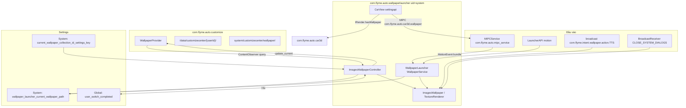

# com.flyme.auto.wallpaperlauncher — Hướng dẫn phân tích APK (主题美化服务 - Dịch vụ làm đẹp chủ đề)

Tài liệu này mô tả ứng dụng hệ thống **主题美化服务** / **AutoWallpaperLauncher** (`com.flyme.auto.wallpaperlauncher`) từ màn hình trung tâm Geely **IHU629G**: hình nền động (live wallpaper) cho launcher Flyme Auto, chuyển đổi hình nền bằng cử chỉ, tích hợp với **Customize Center**, **Car3D** và bus **MIPC**.

**Lưu ý quan trọng:** Đây **không phải** là ứng dụng "Chủ đề" (Themes) trên giao diện người dùng và **cũng không phải** `com.flyme.auto.customize` (kho lưu trữ hình nền). APK này là một **WallpaperService**, chuyên vẽ nền cho màn hình chính và đồng bộ hóa với `Settings.System` và `WallpaperProvider`.

---

## 0. Tổng quan ứng dụng

| Thông số | Giá trị |
|----------|----------|
| Gói ứng dụng (Package) | `com.flyme.auto.wallpaperlauncher` |
| Nhãn (Label) | **主题美化服务** (Dịch vụ chủ đề/trang trí) |
| versionCode | `26012721` |
| versionName | `flyme.beta.(AutoWallpaperLauncher)(null)(26012721)(ee2f100)` |
| minSdk / targetSdk | 28 / 33 |
| compileSdk | 33 (Android 13) |
| sharedUserId | `android.uid.system` |
| Application | Không được khai báo (mặc định) |
| Launcher Activity | **Không có** (chỉ có debug `MainActivity`) |
| WallpaperService | `com.flyme.auto.wallpaper.WallpaperLauncher` (`exported=true`) |
| DEX | Một file `classes.dex` duy nhất (~604 KB, **~385** lớp trong dex, **530** tệp Java trong JADX) |
| Kích thước APK | ~1.07 MB |

**Mục đích:**

1. **Live wallpaper (Hình nền động)** — Hiển thị bộ hình nền hiện tại trên màn hình chính với hiệu ứng vuốt chuyển cảnh (như băng chuyền/carousel).
2. **Đồng bộ hóa** — Đọc/ghi `wallpaper_launcher_current_wallpaper_path`, phản ứng khi bộ sưu tập thay đổi trong Customize Center.
3. **Đầu vào** — Nhận cử chỉ thông qua MIPC từ launcher (`com.flyme.auto.launcher`) và `LauncherAPI` của eCarX; lệnh giọng nói thông qua broadcast TTS. Xem thêm [flyme-launcher-apk.md](./flyme-launcher-apk.md).
4. **Car3D** — Các lớp `CarView` / `ISetting` / `IRender` được nhúng trong APK cho chế độ hình nền 3D (`com.flyme.auto.car3d`); khi hình nền Car3D hoạt động, nó sẽ ẩn `SurfaceView` của chính mình.
5. **Boot UX** — Đặt cờ hoàn tất việc chuyển đổi người dùng/launcher sau 6 giây kể từ khi surface được tạo.

**Cấu trúc ngăn xếp (theo dex/JADX):**

| Lớp (Layer) | Thành phần |
|------|-----------|
| Android | `WallpaperService`, `WallpaperColors`, `Settings.System` / `Global` / `Secure` |
| Flyme Customize | `content://com.flyme.auto.customize.provider.WallpaperProvider/*` |
| Flyme MIPC | `com.flyme.auto.mipc_service` → `com.flyme.auto.mipcser.MIPCService` |
| eCarX | `LauncherAPI` (motion - cử chỉ), `VrPluginAPI` (chứa các hàm callback giả) |
| Car3D | `com.flyme.auto.car3d.wallpaper` (broadcast + MIPC topic) |
| Rút xuất (Render) | Canvas + `lockHardwareCanvas` (chính) hoặc OpenGL ES 3 (`TextureRenderer`) |

**Những thành phần được nhúng trong APK ngoài logic kinh doanh chính (~530 tệp Java):**

| Gói trong dex | Số lớp (≈) | Mục đích |
|-------------|-------------|------------|
| `com.ecarx.*` | 281 | EAS Framework, Launcher API, VR plugin SDK, protobuf |
| `com.google.gson.*` | 58 | JSON (VR / remote proxy) |
| `com.flyme.auto.wallpaper.*` | 21 | Wallpaper service và bộ điều khiển |
| `com.flyme.auto.car3d.settingapi.*` | 6 | Car3D UI API (`CarView`, các giao diện AIDL) |
| `androidx.*` | 19 | Core, các hàm stub phục vụ kiểm thử |
| Kotlin runtime | ~80 | stdlib, coroutines helpers |

---

## 1. Nguồn gốc và Artifacts

| Thông số | Giá trị |
|----------|----------|
| Nền tảng (Nguồn bản dump) | IHU629G |
| APK gốc (Từ ADBAppControl) | `downloads/250060 IHU629G/主题美化服务 (com.flyme.auto.wallpaperlauncher) [v.flyme.beta.(AutoWallpaperLauncher)(null)(26012721)(ee2f100)].apk` |
| Bản sao cục bộ | `.tmp/flyme-wallpaperlauncher.apk` |
| APK đã giải nén | `.tmp/flyme-wallpaperlauncher-apk/` |
| JADX | `.tmp/flyme-wallpaperlauncher-jadx/` |

### Lấy APK từ thiết bị

```bash
adb shell pm path com.flyme.auto.wallpaperlauncher
adb pull /system/app/.../AutoWallpaperLauncher.apk .tmp/flyme-wallpaperlauncher.apk
```

### Giải nén và tìm kiếm

```powershell
Copy-Item -LiteralPath ".tmp\flyme-wallpaperlauncher.apk" -Destination ".tmp\flyme-wallpaperlauncher.zip"
Expand-Archive -LiteralPath .tmp\flyme-wallpaperlauncher.zip -DestinationPath .tmp\flyme-wallpaperlauncher-apk -Force

$aapt = (Get-ChildItem "$env:LOCALAPPDATA\Android\Sdk\build-tools" -Recurse -Filter "aapt.exe" | Select-Object -First 1).FullName
& $aapt dump badging .tmp\flyme-wallpaperlauncher.apk
& $aapt dump xmltree .tmp\flyme-wallpaperlauncher.apk AndroidManifest.xml
```

**JADX** — Các lớp quan trọng: `WallpaperLauncher`, `ImagesWallpaper`, `ImagesWallpaperController`, `ImagesWallpaperResolver`, `CarView`.

---

## 2. Kiến trúc



### 2.1 Các thành phần trong Manifest

| Thành phần | Lớp (Class) | exported | Mục đích |
|-----------|-------|----------|------------|
| Service | `WallpaperLauncher` | true | `android.service.wallpaper.WallpaperService`, `BIND_WALLPAPER`, `directBootAware` |
| Activity | `MainActivity` | true | Debug: Nút "启动服务" (Khởi động dịch vụ) — `setWallpaperComponent` |
| Activity | `InstrumentationActivityInvoker$*` | true | AndroidX Test (Thành phần build, không phải giao diện người dùng) |

**`<queries>`:**

| Đích | Mục đích |
|------|------------|
| `com.flyme.auto.customize` | Customize Center |
| provider `com.flyme.auto.customize.provider.WallpaperProvider` | ContentProvider của hình nền |
| `com.flyme.auto.car3d` | Hình nền 3D / CarView |

**Quyền hạn (Một số quyền chính):**

| Quyền hạn | Mục đích |
|------------|-------|
| `SET_WALLPAPER` / `SET_WALLPAPER_COMPONENT` | Cài đặt hình nền động |
| `WRITE_SETTINGS` / `WRITE_SECURE_SETTINGS` | Ghi `Settings`, các cờ boot/launcher |
| `INTERACT_ACROSS_USERS` | Truy cập đường dẫn đa người dùng `/data/customizecenter/{userId}/` |
| `com.flyme.auto.mipc` | Giao tiếp qua MIPC IPC |
| `DatabaseProvider._READ/WRITE_PERMISSION` | Đọc siêu dữ liệu (metadata) của Customize (tên cũ - legacy naming) |
| `REORDER_TASKS` | Tương tác với launcher |

---

## 3. Các chế độ Render (Kết xuất)

Công tắc chuyển đổi — **`Settings.System` key `test_opengl_engine`** (mặc định **1** = Canvas):

| `test_opengl_engine` | Engine kết xuất | Lớp |
|----------------------|--------|--------|
| `1` (mặc định) | Canvas + `SurfaceHolder.lockHardwareCanvas` | `ImagesWallpaper`, mặt nạ XOR, hiệu ứng fling 400 ms |
| ≠ `1` | OpenGL ES 3 | `TextureRenderer`, `WallpaperGLSurfaceView`, 3 texture (trước/hiện tại/sau) |

**Chế độ Canvas (Dùng thực tế trong production):**

- Tỷ lệ bitmap được co giãn theo chiều rộng màn hình; nếu chỉ có một ảnh — tỷ lệ sẽ "co giãn như dây chun" khi vuốt (`singleImageScaleX`).
- Chuyển đổi: Cuộn/fling theo trục X; ngưỡng chuyển đổi khoảng ~30% chiều rộng màn hình; tạo mặt nạ từ ba dải màu gradient (`onSurfaceChanged`).
- Sau khi đổi hình: `ImagesWallpaperController.i()` lưu đường dẫn vào provider / Settings.

**Chế độ OpenGL (Thử nghiệm / A/B testing):**

- Cảm ứng thông qua MIPC → `GLSurfaceView.onTouchEvent`; chuẩn hóa delta X với giá trị **1280**.
- Ngưỡng hoàn tất vuốt (swipe): ±0.6; thời gian hoạt ảnh 300 ms.

---

## 4. Nguồn cung cấp dữ liệu hình nền

### 4.1 `ImagesWallpaperResolver`

| Phương thức | Nguồn cung cấp | Mô tả |
|-------|----------|----------|
| `a()` | `system/customizecenter/wallpaper/` | Hình nền JPG hệ thống (`fetchSystemWallpaper`); dùng mặc định (fallback) `a.jpg` |
| `b(context)` | Provider + FS | **Tải ban đầu** danh sách khi controller khởi động |
| `c()` | — | Đường dẫn gốc: `system/customizecenter/wallpaper/` |
| `d()` | — | `/data/customizecenter/{myUserId}/` |
| `e(context)` | Provider | Bộ sưu tập **Gallery** (cập nhật gia tăng) |

**ContentProvider URIs** (`com.flyme.auto.customize`):

| URI | Mục đích |
|-----|------------|
| `content://com.flyme.auto.customize.provider.WallpaperProvider/query` | `QUERY_CONTENT_URI` — dùng cho observer + truy vấn dữ liệu |
| `content://com.flyme.auto.customize.provider.WallpaperProvider/update_current` | Ghi `wallpaper_launcher_current_wallpaper_path` |
| `content://com.flyme.auto.customize.provider.WallpaperProvider/apply_other_wallpaper` | Được khai báo, nhưng controller không gọi trực tiếp |

**Các đường dẫn trên phân vùng (chuỗi dex):**

| Đường dẫn | Loại |
|------|-----|
| `system/customizecenter/wallpaper/` | Hình nền hệ thống tiêu chuẩn |
| `system/customizecenter/wallpaper_ext` | Bộ hình nền mở rộng (`fetchCustomizeWallpaper`) |
| `/data/customizecenter/{userId}/` | Chủ đề do người dùng tùy chỉnh / tải xuống |

**Bộ sưu tập Lễ hội (Festival):** Nén dạng ZIP; bitmap được đọc qua `ZipFile.getInputStream` dựa trên tên tệp entry (`festival_wallpaper_name:` trong log).

**Bộ nhớ đệm (Cache):** Dùng singleton `WallpaperCacheManager` (`i.a`) — Lưu trữ bitmap theo cách tương tự `LruCache` với key là đường dẫn (path).

### 4.2 ID các bộ sưu tập (`current_wallpaper_collection_id_settings_key`)

| ID (int) | Hành vi trong mã nguồn |
|----------|------------------|
| `2147483644` | **Lễ hội (Festival)** — Đọc bitmap từ file ZIP (`ImagesWallpaperUtils.a()`) |
| `2147483645` | **Thư viện (Gallery)** — Khi đường dẫn thay đổi, danh sách sẽ được hợp nhất gia tăng |
| `2147483547` | **Thư viện (Gallery)** (Biến thể) |
| `2147483546` | **Thư viện (Gallery)** (Biến thể) |
| Các mã khác | Quét và tải lại toàn bộ (`refreshLocalData()`) khi ID bộ sưu tập thay đổi |

### 4.3 Các bộ chủ đề theo mùa (Lọc băng chuyền hình ảnh)

Nếu tệp hiện tại nằm trong khoảng từ `s01.jpg` … đến `s50.jpg`, controller sẽ **thu hẹp** danh sách vuốt thành một nhóm nhỏ (Logic nằm tại `ImagesWallpaperController.h()`):

| Tệp hiện tại | Nhóm băng chuyền |
|--------------|-----------------|
| `s01`–`s06` | Chỉ bao gồm s01–s06 |
| `s07`–`s14` | s07–s14 |
| `s15`–`s20` | s15–s20 |
| `s21`–`s26` | s21–s26 |
| `s27`–`s32` | s27–s32 |
| `s33`–`s38` | s33–s38 |
| `s39`–`s44` | s39–s44 |
| `s45`–`s50` | s45–s50 |

---

## 5. Các cài đặt (Settings) và hiệu ứng phụ (side-effects)

| Khóa (Key) | Không gian tên (Namespace) | Mục đích |
|-----|-----------|------------|
| `wallpaper_launcher_current_wallpaper_path` | `System` | Đường dẫn tuyệt đối của hình nền hiện tại; observer + sync index |
| `current_wallpaper_collection_id_settings_key` | `System` | ID của bộ sưu tập Customize; xác định loại ZIP/gallery/system |
| `test_opengl_engine` | `System` | `1` = Canvas (mặc định), các giá trị khác sử dụng OpenGL |
| `user_switch_completed` | `Global` | Chuyển thành `1` sau 6 giây kể từ khi gọi `onSurfaceCreated` |
| `key_launcher_preference_switch_done` | `Secure` | `1` — Báo hiệu hoàn tất quá trình khởi động launcher |
| `service.bootanim.exit_byower` | SystemProperties | `"1"` — Yêu cầu thoát nhanh hiệu ứng khởi động (boot animation) |

**Ghi lại hình nền hiện tại** (`ImagesWallpaperController.i()`):

1. Thực thi `ContentResolver.update(update_current, { wallpaper_launcher_current_wallpaper_path: path })`
2. Dự phòng (Fallback): Dùng `Settings.System.putString(...)` nếu xảy ra ngoại lệ (exception).

---

## 6. Đầu vào: cử chỉ, MIPC, giọng nói

### 6.1 MIPC (Luồng xử lý chính cho chế độ Canvas)

- Máy khách (Client): `f.d` (`MIPCImpl`), Dịch vụ (Service): `com.flyme.auto.mipc_service` / `com.flyme.auto.mipcser.MIPCService`.
- Mã nhận dạng `from_type = 9` (Biến `f246a` bên trong `MIPCImpl`).
- Hàm phản hồi (Callback): `WallpaperLauncher.Engine.a()` — Nhận một bundle với `action=1`, khóa (key) là `"event"` → Giải mã thành `MotionEvent`.
- Khi Canvas-engine bị ngắt kết nối (disconnect), nó sẽ tự động kết nối lại MIPC (`a()`).

### 6.2 eCarX LauncherAPI

- Gọi `LauncherAPI.get().unRegisterMotionEventListener` bên trong hàm `onDestroy`.
- Lớp `h.b.a` triển khai giao diện `IMotionEventListener` — Đóng vai trò proxy chuyển tiếp chuyển động (motion) vào hình nền (quá trình decompile phần này bị lỗi một phần).

### 6.3 Broadcast

| Hành động (Action) | Dữ liệu kèm (Extra) | Hiệu ứng |
|--------|-------|--------|
| `com.flyme.intent.wallpaper.action.TTS` | `command=next_wallpaper` | Chuyển sang "hình nền tiếp theo" với hiệu ứng hoạt hình |
| `com.flyme.intent.wallpaper.action.TTS` | `command=previous_wallpaper` | Chuyển về "hình nền trước đó" |
| `android.intent.action.CLOSE_SYSTEM_DIALOGS` | `reason=app_switch_event` | Ép buộc hoàn tất thao tác vuốt còn dang dở |

Mặc dù VR plugin (`h.c`, `VrPluginAPI`) đã được đăng ký, nhưng đối tượng `semanticResult` chỉ đơn giản là ghi log (logging) — **chức năng xử lý NLU (hiểu ngôn ngữ tự nhiên) chưa được thực hiện (unimplemented)** bên trong APK này.

---

## 7. Car3D API (Tích hợp sẵn SDK)

Gói `com.flyme.auto.car3d.settingapi` chứa các lớp công khai được đánh dấu `@Keep` nhằm tích hợp launcher với hệ thống **Car3D**:

| Lớp | Vai trò |
|-------|------|
| `CarView` | Một `FrameLayout` kết hợp `RenderHelper`; cung cấp phương thức `start()` / `startWithMirror()` |
| `ISetting` | Quản lý khung cảnh, chủ đề, thời tiết, `setWallpaperRender`, `getWallpaperPtr`, … |
| `IRender` | Cung cấp `hasWallpaper()`, `setWallpaper`, `changeScene`, điều khiển vòng đời surface |
| `FuncData` | Cấu trúc dữ liệu `(funcId, areaId, value)` dùng cho hàm `setFuncData` |

**Cơ chế liên kết với wallpaper service:**

- Bắn Broadcast `com.flyme.auto.car3d.wallpaper` + Tạo MIPC topic có cùng tên.
- Nếu hàm `IRender.hasWallpaper()` trả về true → Kích hoạt `textureView.setVisibility(GONE)` (Đảm bảo 3D không che khuất hình nền động - live wallpaper).

Phần phụ thuộc **`com.flyme.auto.car3d`** — Nằm ở một APK riêng biệt; trong manifest chỉ khai báo thẻ `<queries>`.

---

## 8. Debug / Cài đặt Wallpaper

Lớp `MainActivity` — Chỉ chứa một nút duy nhất "启动服务" (Khởi động dịch vụ):

```java
wallpaperManager.clear(FLAG_SYSTEM);
wallpaperManager.setWallpaperComponent(
    new ComponentName(context, WallpaperLauncher.class));
```

Khá tiện lợi trên các bản build eng/userdebug khi cần kích hoạt thủ công dịch vụ:

```bash
adb shell am start -n com.flyme.auto.wallpaperlauncher/.MainActivity
```

Để kiểm tra thành phần hình nền (wallpaper component) đang hoạt động:

```bash
adb shell cmd wallpaper get
```

---

## 9. Các lệnh ADB thực hành

```bash
# Lấy đường dẫn và bộ sưu tập hiện tại
adb shell settings get system wallpaper_launcher_current_wallpaper_path
adb shell settings get system current_wallpaper_collection_id_settings_key
adb shell settings get system test_opengl_engine

# Bắt buộc chuyển đổi Canvas / OpenGL
adb shell settings put system test_opengl_engine 1
adb shell settings put system test_opengl_engine 0

# Điều khiển chuyển hình nền bằng giọng nói (giả lập)
adb shell am broadcast -a com.flyme.intent.wallpaper.action.TTS \
  --es command next_wallpaper
adb shell am broadcast -a com.flyme.intent.wallpaper.action.TTS \
  --es command previous_wallpaper

# Xem logs
adb logcat -s WallpaperLauncher ImagesWallpaper MIPCImpl Car3D.CarView
```

---

## 10. Mối liên hệ với Geely EX2 Tools

Không có lệnh import trực tiếp nào từ EX2 Tools. Tuy nhiên, APK này rất hữu ích khi đóng vai trò cẩm nang tra cứu về:

- Các khóa (keys) trong `Settings.System` dành cho cấu hình hình nền trên Flyme Auto HU;
- URI chuẩn của Customize `WallpaperProvider`;
- Phân tích cơ chế hoạt động của live wallpaper khi có sự thay đổi về theme (chủ đề) / user (người dùng);
- Quy trình tích hợp giao tiếp giữa Car3D ↔ hình nền tĩnh (static wallpaper) thông qua `hasWallpaper`.

Để tìm hiểu về VHAL / hệ thống điều hòa (climate) / chế độ lái xe (driving mode), hãy xem các tệp [flyme-settings-apk.md](./flyme-settings-apk.md), [flyme-hvac-apk.md](./flyme-hvac-apk.md), [flyme-auto-service-apk.md](./flyme-auto-service-apk.md).

---

## 11. Các giới hạn khi phân tích

- Các phương thức `ImagesWallpaperResolver.b()` và `e()` — JADX không thể dịch ngược hoàn toàn phần thân (chứa 884 / 271 lệnh); phần logic được phục dựng lại dựa vào các lời gọi hàm (calls), chuỗi (strings) trong dex và các nhánh observer.
- Hàm `h.b.a.onMotionEvent` — Chỉ có thể decompile một phần (partial decompile).
- Các Test activities (`androidx.test.core.app.InstrumentationActivityInvoker$*`) được xuất (exported) kèm với cờ `MAIN` — Đây chỉ là các artifact rác sót lại của quá trình xây dựng dependency, không thuộc về UX tiêu chuẩn của màn hình HU.
